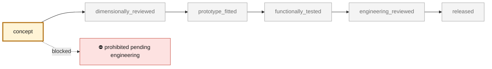
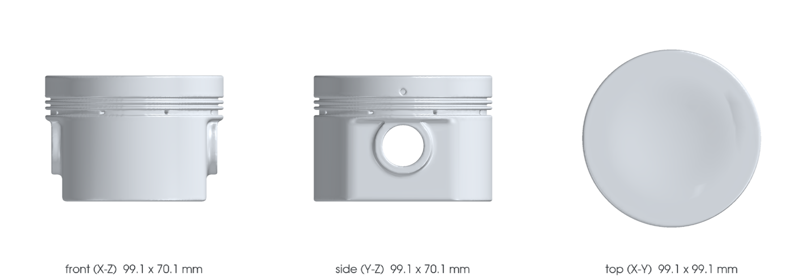

<!-- generated by scripts/render_part_pages.py - do not edit by hand -->

# M64/60 piston with cooling gallery, CP1 F0 concept

**`993-ENG-PISTON-CP1-GALLERY-F0-0001`** · Porsche 993 · 1995–1998

  

> [!CAUTION]
> **Not ready to print, and not a copy of the original part.** The model shown here is a
> concept block for studying the part in software:
> - validation status `concept`: nothing has been checked against a real part;
> - geometry `mixed`: its dimensions are partly sourced, partly assumed, not measured on the original part;
> - safety class `prohibited_pending_engineering`;
> - no part in this repository is released — read [SAFETY.md](../../SAFETY.md).

<table><tr>
<td width="50%" valign="top">
<b>Original part</b>  
The original part is documented — pictures, catalogue entries or published data — on these pages. They are copyrighted, so they are linked here, not copied:  
↗ <a href="https://porschefanatics.com/parts/c/engine-internals/">PorscheFanatics - additive piston precedent and 993 pistons</a> 
↗ <a href="https://newsroom.porsche.com/en/2020/technology/porsche-cooperation-mahle-trumpf-pistons-3d-printer-power-efficiency-911-gt2-rs-21462.html">Porsche Newsroom - laser-fused pistons</a> 
↗ <a href="https://www.elferclassic.de/technik/techdaten/993-turbo-95-98-techdat.php">elferclassic - German technical data of the 993 Turbo</a> 
↗ <a href="https://events.esd.org/wp-content/uploads/2018/07/3D-Printed-Piston-for-Heavy-Duty-Diesel-Engines.pdf">IAV / GVSETS 2018 - additive diesel piston</a> 
</td>
<td width="50%" valign="top" align="center">
<b>This repository's concept model</b>  
 
Concept CAD block, 99.1 × 99.1 × 70.1 mm — <b>not</b> the original part, not a print file, not evidence of fit.
</td>
</tr></table>

> [!CAUTION]
> **Prohibited pending engineering** — risk, or insufficient data. Never published as a released part.

## What it is

Independent concept of an Aheadd CP1 LPBF piston with a toroidal gallery under the crown and two temporary depowdering ports. Only the M64/60 bore/stroke/engine speed and the Porsche methodological precedent are published; the entire piston geometry remains an F0 hypothesis.

## What it does on the car

CAD, DfAM, plate mechanics, inertia, pin pressure, conduction and gallery hydraulics screening; no manufacturing, installation or engine start authorized

## At a glance

| | |
|---|---|
| Porsche part numbers | not recorded |
| variants | `993_Turbo`, `M64_60_research` |
| candidate material | Constellium Aheadd CP1, Velo3D Sapphire 50 µm route for screening only |
| candidate process | LPBF |
| safety class | `prohibited_pending_engineering` |
| validation status | `concept` |
| geometry | mixed, master build123d |

## Where it stands

*Validation ladder of `catalog/schemas/part.schema.json`; this record is at `concept`.*

## Views

*Orthographic views of the same concept CAD, with its bounding dimensions — not drawings of the original part.*

## What's in this folder

| folder | what it holds | files |
|---|---|---|
| `derived/` | CAD exports generated from the source (STEP for CAD tools, STL for meshing) | [`derived/piston_cp1_gallery_f0-picogk.json`](derived/piston_cp1_gallery_f0-picogk.json), [`derived/piston_cp1_gallery_f0-picogk.stl`](derived/piston_cp1_gallery_f0-picogk.stl), [`derived/piston_cp1_gallery_f0.step`](derived/piston_cp1_gallery_f0.step) |
| `evidence/` | screens, reports and manifests — **pinned by SHA-256, never edited by hand** | [`evidence/engineering-screen.json`](evidence/engineering-screen.json) |
| `media/` | concept-model views rendered from the CAD by `scripts/render_part_previews.py` — not pictures of the original | [`media/preview.json`](media/preview.json), [`media/preview.png`](media/preview.png), [`media/views.png`](media/views.png) |
| `source/` | parametric source — the editable master that generates the geometry | [`source/picogk.json`](source/picogk.json), [`source/piston.py`](source/piston.py) |

## Read more

- **Full description page**, with sources and evidence: [docs/pieces/993-eng-piston-cp1-gallery-f0-0001.md](../../docs/pieces/993-eng-piston-cp1-gallery-f0-0001.md)
- **Catalogue record** (source of truth): [`catalog/parts/993-eng-piston-cp1-gallery-f0-0001.json`](../../catalog/parts/993-eng-piston-cp1-gallery-f0-0001.json)
- **Design dossier**: [993_PISTON_CP1_COOLING_GALLERY_F0](../../docs/993/993_PISTON_CP1_COOLING_GALLERY_F0.md)
- **Digital twin record**: [`twin-993-m64-60-piston-gallery-f0.json`](../../catalog/twins/twin-993-m64-60-piston-gallery-f0.json) — see [twins/README.md](../../twins/README.md)
- **Safety rules**: [SAFETY.md](../../SAFETY.md)

---

*This page is generated from the catalogue record by `scripts/render_part_pages.py` and checked by `make check`. Edit the record, not this page.*
