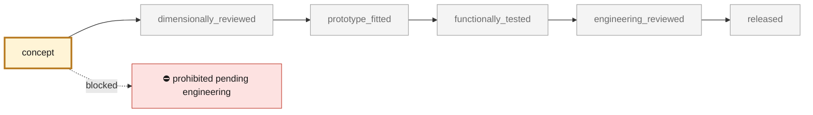

<!-- generated by scripts/render_part_pages.py - do not edit by hand -->

# Turbo oil return line, IN625 F0 concept

**`993-ENG-TURBO-OIL-RETURN-LINE-IN625-F0-0001`** · Porsche 993 · 1996–1997

  

> [!CAUTION]
> **Not ready to print, and not a copy of the original part.** The model shown here is a
> concept block for studying the part in software:
> - validation status `concept`: nothing has been checked against a real part;
> - geometry `estimated`: its dimensions are estimated design variables, not measured on the original part;
> - safety class `prohibited_pending_engineering`;
> - no part in this repository is released — read [SAFETY.md](../../SAFETY.md).

<table><tr>
<td width="50%" valign="top">
<b>Original part</b>  
The original part is documented — pictures, catalogue entries or published data — on these pages. They are copyrighted, so they are linked here, not copied:  
↗ <a href="https://porschefanatics.com/engine/993/">PorscheFanatics - candidate turbo oil return line</a> 
↗ <a href="https://patrickmotorsports.com/products/tur99310733853pms">Patrick Motorsports - 993 turbo oil return line set</a> 
↗ <a href="https://www.specialmetals.com/documents/technical-bulletins/inconel/inconel-alloy-625.pdf">Special Metals - INCONEL alloy 625</a> 
↗ <a href="https://porschefanatics.com/oem/993/202-16/">993 factory catalogue, plate 202-16 Turbocharger</a> 
</td>
<td width="50%" valign="top" align="center">
<b>This repository's concept model</b>  
 
Concept CAD block, 143.4 × 60.0 × 94.6 mm — <b>not</b> the original part, not a print file, not evidence of fit.
</td>
</tr></table>

> [!CAUTION]
> **Prohibited pending engineering** — risk, or insufficient data. Never published as a released part.

## What it is

Clean-sheet concept of a left line with an open internal passage and two integrated flanges. PorscheFanatics and Patrick Motorsports confirm the 993 Turbo functional need, but no dimension or material; the entire F0 route remains synthetic.

## What it does on the car

F0 screening of hollow CAD, hydraulics, pressure, bending, expansion, thermal and DfAM; no manufacturing, installation, oil circulation or engine start authorized

## At a glance

| | |
|---|---|
| Porsche part numbers | 993 107 125 53, 993 107 126 53, 993 107 338 53, 993 107 339 53 |
| variants | `993_Turbo` |
| candidate material | EOS NickelAlloy IN625 / UNS N06625 for comparison |
| candidate process | undecided |
| safety class | `prohibited_pending_engineering` |
| validation status | `concept` |
| geometry | estimated, master build123d |

## Where it stands

*Validation ladder of `catalog/schemas/part.schema.json`; this record is at `concept`.*

## Views

*Orthographic views of the same concept CAD, with its bounding dimensions — not drawings of the original part.*

## Screens and evidence images

*`evidence/lpbf-f0/993-eng-turbo-oil-return-line-in625-f0-0001-lpbf-geometry-screen.png` — a screening output, not a validation.*

## What's in this folder

| folder | what it holds | files |
|---|---|---|
| `derived/` | CAD exports generated from the source (STEP for CAD tools, STL for meshing) | [`derived/turbo_oil_return_line_in625_f0-picogk.json`](derived/turbo_oil_return_line_in625_f0-picogk.json), [`derived/turbo_oil_return_line_in625_f0-picogk.stl`](derived/turbo_oil_return_line_in625_f0-picogk.stl), [`derived/turbo_oil_return_line_in625_f0.step`](derived/turbo_oil_return_line_in625_f0.step), [`derived/turbo_oil_return_line_in625_f0.stl`](derived/turbo_oil_return_line_in625_f0.stl) |
| `evidence/` | screens, reports and manifests — **pinned by SHA-256, never edited by hand** | [`evidence/engineering-screen.json`](evidence/engineering-screen.json), [`evidence/lpbf-f0/993-eng-turbo-oil-return-line-in625-f0-0001-layer-metrics.csv`](evidence/lpbf-f0/993-eng-turbo-oil-return-line-in625-f0-0001-layer-metrics.csv), [`evidence/lpbf-f0/993-eng-turbo-oil-return-line-in625-f0-0001-lpbf-geometry-manifest.json`](evidence/lpbf-f0/993-eng-turbo-oil-return-line-in625-f0-0001-lpbf-geometry-manifest.json), [`evidence/lpbf-f0/993-eng-turbo-oil-return-line-in625-f0-0001-lpbf-geometry-report.json`](evidence/lpbf-f0/993-eng-turbo-oil-return-line-in625-f0-0001-lpbf-geometry-report.json), [`evidence/lpbf-f0/993-eng-turbo-oil-return-line-in625-f0-0001-lpbf-geometry-screen.png`](evidence/lpbf-f0/993-eng-turbo-oil-return-line-in625-f0-0001-lpbf-geometry-screen.png) |
| `media/` | concept-model views rendered from the CAD by `scripts/render_part_previews.py` — not pictures of the original | [`media/preview.json`](media/preview.json), [`media/preview.png`](media/preview.png), [`media/views.png`](media/views.png) |
| `source/` | parametric source — the editable master that generates the geometry | [`source/picogk.json`](source/picogk.json), [`source/turbo_oil_return_line.py`](source/turbo_oil_return_line.py) |

## Read more

- **Full description page**, with sources and evidence: [docs/pieces/993-eng-turbo-oil-return-line-in625-f0-0001.md](../../docs/pieces/993-eng-turbo-oil-return-line-in625-f0-0001.md)
- **Catalogue record** (source of truth): [`catalog/parts/993-eng-turbo-oil-return-line-in625-f0-0001.json`](../../catalog/parts/993-eng-turbo-oil-return-line-in625-f0-0001.json)
- **Design dossier**: [993_CIRCUIT_HUILE_TURBO_202-16](../../docs/993/993_CIRCUIT_HUILE_TURBO_202-16.md)
- **Design dossier**: [993_TURBO_OIL_RETURN_LINE_IN625_F0](../../docs/993/993_TURBO_OIL_RETURN_LINE_IN625_F0.md)
- **Safety rules**: [SAFETY.md](../../SAFETY.md)

---

*This page is generated from the catalogue record by `scripts/render_part_pages.py` and checked by `make check`. Edit the record, not this page.*
