<!-- generated by scripts/render_part_pages.py - do not edit by hand -->

# 993 oval exhaust tip, IN625 double-wall F0 concept

**`993-EXH-OVAL-TIP-IN625-F0-0001`** · Porsche 993 · 1994–1998

  

> [!CAUTION]
> **Not ready to print, and not a copy of the original part.** The model shown here is a
> concept block for studying the part in software:
> - validation status `concept`: nothing has been checked against a real part;
> - geometry `mixed`: its dimensions are partly sourced, partly assumed, not measured on the original part;
> - safety class `functional`;
> - no part in this repository is released — read [SAFETY.md](../../SAFETY.md).

<table><tr>
<td width="50%" valign="top">
<b>Original part</b>  
The original part is documented — pictures, catalogue entries or published data — on these pages. They are copyrighted, so they are linked here, not copied:  
↗ <a href="https://www.fvd.net/de-de/FVD11199300/endrohrsatz-edelstahl-poliert-oval-schraeg-993-120x85mm.html">FVD - 993 narrow-body oval stainless tips</a> 
↗ <a href="https://porschefanatics.com/materials/">PorscheFanatics - register of declared materials</a> 
↗ <a href="https://www.specialmetals.com/documents/technical-bulletins/inconel/inconel-alloy-625.pdf">Special Metals - INCONEL alloy 625</a> 
</td>
<td width="50%" valign="top" align="center">
<b>This repository's concept model</b>  
 
Concept CAD block, 120.0 × 85.0 × 120.0 mm — <b>not</b> the original part, not a print file, not evidence of fit.
</td>
</tr></table>

> [!NOTE]
> **Functional** — loaded part whose failure can immobilize or damage the vehicle. Published only after documented functional testing.

## What it is

Independent round-to-oval concept with a ventilated double wall and eight integrated attachments to screen LPBF manufacture in IN625. FVD publishes only a 120 x 85 mm outlet envelope for its FVD11199300 stainless tip; PorscheFanatics separately documents an IN625 precedent on 993 Turbo exhausts.

## What it does on the car

CAD, DfAM, flow, thermal, pressure and modal screening; no manufacturing for fitting and no vehicle installation authorized

## At a glance

| | |
|---|---|
| Porsche part numbers | not recorded |
| variants | `993_C2`, `993_C4`, `993_RS_narrow_body` |
| candidate material | EOS NickelAlloy IN625 / UNS N06625 for screening |
| candidate process | undecided |
| safety class | `functional` |
| validation status | `concept` |
| geometry | mixed, master build123d |

## Where it stands

```mermaid
flowchart LR
    L0["concept"]
    L1["dimensionally_reviewed"]
    L2["prototype_fitted"]
    L3["functionally_tested"]
    L4["engineering_reviewed"]
    L5["released"]
    L0 --> L1 --> L2 --> L3 --> L4 --> L5
    classDef here fill:#fff4d6,stroke:#b7791f,color:#1a1a1a,stroke-width:3px;
    classDef done fill:#e3f1e6,stroke:#2e7d32,color:#1a1a1a;
    classDef todo fill:#f4f4f4,stroke:#9e9e9e,color:#6b6b6b;
    classDef stop fill:#fde2e1,stroke:#c0392b,color:#1a1a1a;
    class L0 here
    class L1 todo
    class L2 todo
    class L3 todo
    class L4 todo
    class L5 todo
```

*Validation ladder of `catalog/schemas/part.schema.json`; this record is at `concept`.*

## Views

*Orthographic views of the same concept CAD, with its bounding dimensions — not drawings of the original part.*

## Screens and evidence images

*`evidence/lpbf-f0/993-exh-oval-tip-in625-f0-0001-lpbf-geometry-screen.png` — a screening output, not a validation.*

## What's in this folder

| folder | what it holds | files |
|---|---|---|
| `derived/` | CAD exports generated from the source (STEP for CAD tools, STL for meshing) | [`derived/oval_exhaust_tip_in625_f0.step`](derived/oval_exhaust_tip_in625_f0.step), [`derived/oval_exhaust_tip_in625_f0.stl`](derived/oval_exhaust_tip_in625_f0.stl) |
| `evidence/` | screens, reports and manifests — **pinned by SHA-256, never edited by hand** | [`evidence/engineering-screen.json`](evidence/engineering-screen.json), [`evidence/lpbf-f0/993-exh-oval-tip-in625-f0-0001-layer-metrics.csv`](evidence/lpbf-f0/993-exh-oval-tip-in625-f0-0001-layer-metrics.csv), [`evidence/lpbf-f0/993-exh-oval-tip-in625-f0-0001-lpbf-geometry-manifest.json`](evidence/lpbf-f0/993-exh-oval-tip-in625-f0-0001-lpbf-geometry-manifest.json), [`evidence/lpbf-f0/993-exh-oval-tip-in625-f0-0001-lpbf-geometry-report.json`](evidence/lpbf-f0/993-exh-oval-tip-in625-f0-0001-lpbf-geometry-report.json), [`evidence/lpbf-f0/993-exh-oval-tip-in625-f0-0001-lpbf-geometry-screen.png`](evidence/lpbf-f0/993-exh-oval-tip-in625-f0-0001-lpbf-geometry-screen.png), [`evidence/openfoam-flow-screen.json`](evidence/openfoam-flow-screen.json) |
| `media/` | concept-model views rendered from the CAD by `scripts/render_part_previews.py` — not pictures of the original | [`media/preview.json`](media/preview.json), [`media/preview.png`](media/preview.png), [`media/views.png`](media/views.png) |
| `source/` | parametric source — the editable master that generates the geometry | [`source/oval_exhaust_tip.py`](source/oval_exhaust_tip.py) |

## Read more

- **Full description page**, with sources and evidence: [docs/pieces/993-exh-oval-tip-in625-f0-0001.md](../../docs/pieces/993-exh-oval-tip-in625-f0-0001.md)
- **Catalogue record** (source of truth): [`catalog/parts/993-exh-oval-tip-in625-f0-0001.json`](../../catalog/parts/993-exh-oval-tip-in625-f0-0001.json)
- **Design dossier**: [993_EMBOUT_TITANE_F1](../../docs/993/993_EMBOUT_TITANE_F1.md)
- **Design dossier**: [993_OVAL_EXHAUST_TIP_IN625_F0](../../docs/993/993_OVAL_EXHAUST_TIP_IN625_F0.md)
- **Digital twin record**: [`twin-993-oval-exhaust-tip-in625-f0.json`](../../catalog/twins/twin-993-oval-exhaust-tip-in625-f0.json) — see [twins/README.md](../../twins/README.md)
- **Safety rules**: [SAFETY.md](../../SAFETY.md)

---

*This page is generated from the catalogue record by `scripts/render_part_pages.py` and checked by `make check`. Edit the record, not this page.*
