<!-- generated by scripts/render_part_pages.py - do not edit by hand -->

# Oval exhaust tip, F1 titanium variant

**`993-EXH-OVAL-TIP-TI-F1-0001`** · Porsche 993 · 1994–1998

  

> [!CAUTION]
> **Not ready to print, and not a copy of the original part.** The model shown here is a
> concept block for studying the part in software:
> - validation status `concept`: nothing has been checked against a real part;
> - geometry `mixed`: its dimensions are partly sourced, partly assumed, not measured on the original part;
> - safety class `functional`;
> - no part in this repository is released — read [SAFETY.md](../../SAFETY.md).

<table><tr>
<td width="50%" valign="top">
<b>Original part</b>  
The original part is documented — pictures, catalogue entries or published data — on these pages. They are copyrighted, so they are linked here, not copied:  
↗ <a href="https://www.fvd.net/de-de/FVD11199300/endrohrsatz-edelstahl-poliert-oval-schraeg-993-120x85mm.html">FVD - 993 narrow-body oval stainless tips</a> 
↗ <a href="https://porschefanatics.com/materials/">PorscheFanatics - register of declared materials</a> 
↗ <a href="https://www.specialmetals.com/documents/technical-bulletins/inconel/inconel-alloy-625.pdf">Special Metals - INCONEL alloy 625</a> 
</td>
<td width="50%" valign="top" align="center">
<b>This repository's concept model</b>  
 
Concept CAD block, 120.1 × 85.1 × 120.1 mm — <b>not</b> the original part, not a print file, not evidence of fit.
</td>
</tr></table>

> [!NOTE]
> **Functional** — loaded part whose failure can immobilize or damage the vehicle. Published only after documented functional testing.

## What it is

Same double-wall geometry as the IN625 F0 variant, screened in titanium. Selected by the repository titanium screening as the only part in the catalogue where both titanium and additive manufacturing win without running into the safety class. The alloy is deliberately not fixed in the identifier: Ti-6Al-4V and Ti-6242 are both screened, and a temperature that has never been measured separates them.

## What it does on the car

CAD, DfAM, flow, thermal, pressure and modal screening; no manufacturing for fitting and no vehicle installation authorized

## At a glance

| | |
|---|---|
| Porsche part numbers | not recorded |
| variants | `993_C2`, `993_C4`, `993_RS_narrow_body` |
| candidate material | Ti-6Al-4V if the actual temperature allows it |
| candidate process | LPBF |
| safety class | `functional` |
| validation status | `concept` |
| geometry | mixed, master build123d |

## Where it stands

```mermaid
flowchart LR
    L0["concept"]
    L1["dimensionally_reviewed"]
    L2["prototype_fitted"]
    L3["functionally_tested"]
    L4["engineering_reviewed"]
    L5["released"]
    L0 --> L1 --> L2 --> L3 --> L4 --> L5
    classDef here fill:#fff4d6,stroke:#b7791f,color:#1a1a1a,stroke-width:3px;
    classDef done fill:#e3f1e6,stroke:#2e7d32,color:#1a1a1a;
    classDef todo fill:#f4f4f4,stroke:#9e9e9e,color:#6b6b6b;
    classDef stop fill:#fde2e1,stroke:#c0392b,color:#1a1a1a;
    class L0 here
    class L1 todo
    class L2 todo
    class L3 todo
    class L4 todo
    class L5 todo
```

*Validation ladder of `catalog/schemas/part.schema.json`; this record is at `concept`.*

## Views

*Orthographic views of the same concept CAD, with its bounding dimensions — not drawings of the original part.*

## PicoGK voxel model

*Variant generated with the PicoGK voxel kernel in [`parts/picogk-993-batch-01`](../../parts/picogk-993-batch-01/README.md): published overall envelope, internal structure (double wall, lattice core or vanes) shown in the half section. Mounting interfaces are assumptions — not the original part, not a print file, not evidence of fit.*

## What's in this folder

| folder | what it holds | files |
|---|---|---|
| `derived/` | CAD exports generated from the source (STEP for CAD tools, STL for meshing) | [`derived/oval_exhaust_tip_ti_f1-picogk.json`](derived/oval_exhaust_tip_ti_f1-picogk.json), [`derived/oval_exhaust_tip_ti_f1-picogk.stl`](derived/oval_exhaust_tip_ti_f1-picogk.stl), [`derived/oval_exhaust_tip_ti_f1.step`](derived/oval_exhaust_tip_ti_f1.step), [`derived/oval_exhaust_tip_ti_f1.stl`](derived/oval_exhaust_tip_ti_f1.stl) |
| `evidence/` | screens, reports and manifests — **pinned by SHA-256, never edited by hand** | [`evidence/engineering-screen-ti6242.json`](evidence/engineering-screen-ti6242.json), [`evidence/engineering-screen-ti64.json`](evidence/engineering-screen-ti64.json) |
| `media/` | concept-model views rendered from the CAD by `scripts/render_part_previews.py` — not pictures of the original | [`media/picogk-batch-01.png`](media/picogk-batch-01.png), [`media/preview.json`](media/preview.json), [`media/preview.png`](media/preview.png), [`media/views.png`](media/views.png) |
| `source/` | parametric source — the editable master that generates the geometry | [`source/picogk.json`](source/picogk.json) |

## Read more

- **Full description page**, with sources and evidence: [docs/pieces/993-exh-oval-tip-ti-f1-0001.md](../../docs/pieces/993-exh-oval-tip-ti-f1-0001.md)
- **Catalogue record** (source of truth): [`catalog/parts/993-exh-oval-tip-ti-f1-0001.json`](../../catalog/parts/993-exh-oval-tip-ti-f1-0001.json)
- **Design dossier**: [993_EMBOUT_TITANE_F1](../../docs/993/993_EMBOUT_TITANE_F1.md)
- **Safety rules**: [SAFETY.md](../../SAFETY.md)

---

*This page is generated from the catalogue record by `scripts/render_part_pages.py` and checked by `make check`. Edit the record, not this page.*
