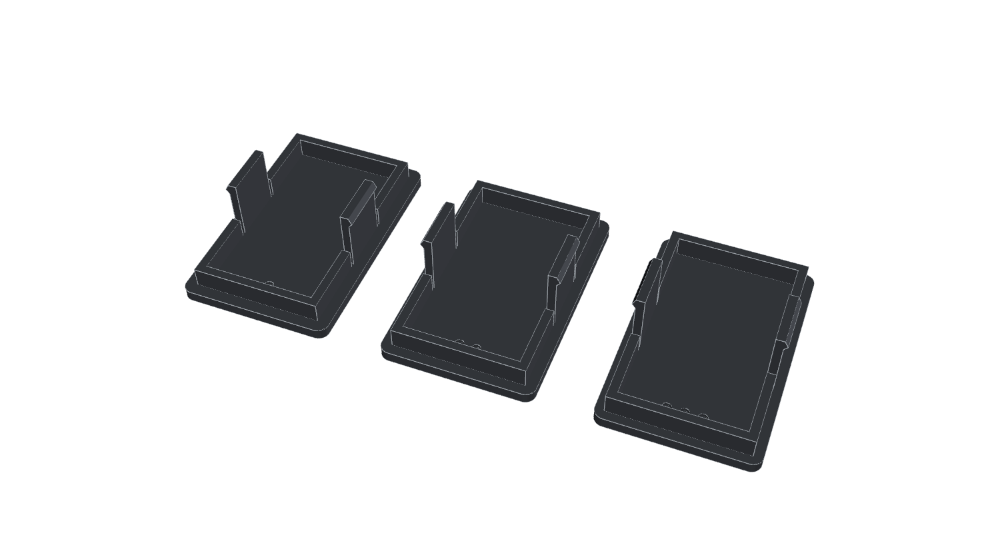
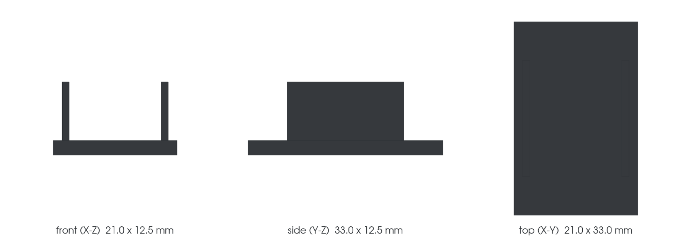

<!-- generated by scripts/render_part_pages.py - do not edit by hand -->

# Switch blank, dashboard

**`993-INT-SWITCH-BLANK-0001`** · Porsche 993 · 1994–1998

  

> [!TIP]
> **A fit-test kit is ready to print** — [`print/`](print/README.md): 3 sizes on one plate (18.6 × 30.6, 19.0 × 31.0, 19.4 × 31.4 mm), a PrusaSlicer project and instructions. It is a measurement instrument, not the finished part ([decision 0009](../../docs/decisions/0009-first-fit-test-print-switch-blank.md)).

> [!CAUTION]
> **The part itself is not validated, and not a copy of the original.** The model shown here is a
> concept block for studying the part in software:
> - validation status `concept`: nothing has been checked against a real part;
> - geometry `estimated`: its dimensions are estimated design variables, not measured on the original part;
> - safety class `non_critical`;
> - no part in this repository is released — read [SAFETY.md](../../SAFETY.md).

<table><tr>
<td width="50%" valign="top">
<b>Original part</b>  
The original part is documented — pictures, catalogue entries or published data — on these pages. They are copyrighted, so they are linked here, not copied:  
↗ <a href="https://www.porsche.com/australia/accessoriesandservice/classic/originalpartscatalogue/">Porsche Classic Genuine Parts Catalogue - 911 (993)</a> 
↗ <a href="https://www.9xxteile.com/en/pet/">9xxteile - Porsche parts diagrams (PET exploded views)</a> 
</td>
<td width="50%" valign="top" align="center">
<b>What you can print today</b>  
 
The fit-test kit: three sizes that bracket the declared opening. A measurement instrument — <b>not</b> the finished part, not a copy of the original.
</td>
</tr></table>

> [!NOTE]
> **Non-critical** — trim, or a part whose failure creates no immediate hazard. Published only after dimensional and fit validation.

## What it is

Blanking plug for an unequipped switch location in the dashboard. Trim part with flat faces and clips, measurable with calipers, retained as the pilot for the simple geometric category of phase 2.

## What it does on the car

Close an empty dashboard location, with no electrical or structural function

## At a glance

| | |
|---|---|
| Porsche part numbers | not recorded |
| variants | `to_confirm_on_vehicle` |
| candidate material | to_be_determined_after_fit_test |
| candidate process | FFF |
| safety class | `non_critical` |
| validation status | `concept` |
| geometry | estimated, master build123d |

## Where it stands

```mermaid
flowchart LR
    L0["concept"]
    L1["dimensionally_reviewed"]
    L2["prototype_fitted"]
    L3["functionally_tested"]
    L4["engineering_reviewed"]
    L5["released"]
    L0 --> L1 --> L2 --> L3 --> L4 --> L5
    classDef here fill:#fff4d6,stroke:#b7791f,color:#1a1a1a,stroke-width:3px;
    classDef done fill:#e3f1e6,stroke:#2e7d32,color:#1a1a1a;
    classDef todo fill:#f4f4f4,stroke:#9e9e9e,color:#6b6b6b;
    classDef stop fill:#fde2e1,stroke:#c0392b,color:#1a1a1a;
    class L0 here
    class L1 todo
    class L2 todo
    class L3 todo
    class L4 todo
    class L5 todo
```

*Validation ladder of `catalog/schemas/part.schema.json`; this record is at `concept`.*

## Views

*Orthographic views of the same concept CAD, with its bounding dimensions — not drawings of the original part.*

## Screens and evidence images

*`print/plate.png` — a screening output, not a validation.*

## What's in this folder

| folder | what it holds | files |
|---|---|---|
| `derived/` | CAD exports generated from the source (STEP for CAD tools, STL for meshing) | [`derived/switch_blank_concept_f0.step`](derived/switch_blank_concept_f0.step) |
| `evidence/` | screens, reports and manifests — **pinned by SHA-256, never edited by hand** | [`evidence/concept-f0.json`](evidence/concept-f0.json), [`evidence/measurement-plan.md`](evidence/measurement-plan.md) |
| `media/` | concept-model views rendered from the CAD by `scripts/render_part_previews.py` — not pictures of the original | [`media/preview.json`](media/preview.json), [`media/preview.png`](media/preview.png), [`media/views.png`](media/views.png) |
| `print/` | **ready-to-print fit-test kit** (decision 0009): 3MF project, STL, STEP and instructions | [`print/kit.json`](print/kit.json), [`print/plate.png`](print/plate.png), [`print/switch_blank_fit_1.stl`](print/switch_blank_fit_1.stl), [`print/switch_blank_fit_2.stl`](print/switch_blank_fit_2.stl), [`print/switch_blank_fit_3.stl`](print/switch_blank_fit_3.stl), [`print/switch_blank_fit_plate.3mf`](print/switch_blank_fit_plate.3mf), [`print/switch_blank_fit_plate.step`](print/switch_blank_fit_plate.step), [`print/switch_blank_fit_plate.stl`](print/switch_blank_fit_plate.stl) |
| `source/` | parametric source — the editable master that generates the geometry | [`source/fit_test_kit.py`](source/fit_test_kit.py), [`source/render_fit_plate.py`](source/render_fit_plate.py), [`source/switch_blank.py`](source/switch_blank.py) |

## Read more

- **Full description page**, with sources and evidence: [docs/pieces/993-int-switch-blank-0001.md](../../docs/pieces/993-int-switch-blank-0001.md)
- **Catalogue record** (source of truth): [`catalog/parts/993-int-switch-blank-0001.json`](../../catalog/parts/993-int-switch-blank-0001.json)
- **Digital twin record**: [`twin-993-cabin-dashboard-switch-0001.json`](../../catalog/twins/twin-993-cabin-dashboard-switch-0001.json) — see [twins/README.md](../../twins/README.md)
- **Safety rules**: [SAFETY.md](../../SAFETY.md)

---

*This page is generated from the catalogue record by `scripts/render_part_pages.py` and checked by `make check`. Edit the record, not this page.*
