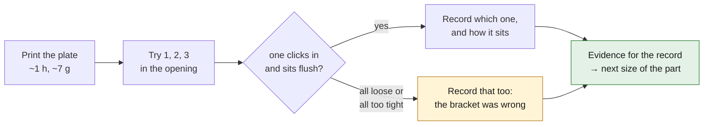

# Print it: switch blank fit-test kit

*The three blanks as they sit on the build plate: visible face down, clips up.*

This is the repository's first printable file, and it is deliberately a **fit
test**, not a finished part ([decision 0009](../../../docs/decisions/0009-first-fit-test-print-switch-blank.md)).
The real opening of the 993 dashboard has never been measured; the only
published figure is **about 19 × 31 mm** (a level-C forum value). So the kit
brackets it with three sizes, and whichever one fits tells the real size.

| blank | marks on the back | insert (fits in the opening) | vs. the declared opening | face |
|---|---|---|---|---|
| 1 | 1 dimple | 18.6 × 30.6 mm | −0.4 mm | 22 × 34 × 2 mm |
| 2 | 2 dimples | 19.0 × 31.0 mm | 0.0 mm | 22 × 34 × 2 mm |
| 3 | 3 dimples | 19.4 × 31.4 mm | +0.4 mm | 22 × 34 × 2 mm |

Everything except the declared opening is a hypothesis: face overlap, face
thickness, clip length (9 mm behind the face), clip thickness and barb.

## Files

| file | use |
|---|---|
| [`switch_blank_fit_plate.3mf`](switch_blank_fit_plate.3mf) | **open this** in PrusaSlicer (or any slicer that reads 3MF): the three blanks, placed, with the settings below |
| [`switch_blank_fit_plate.stl`](switch_blank_fit_plate.stl) | the same plate as one STL, for other slicers |
| `switch_blank_fit_1.stl`, [`_2`](switch_blank_fit_2.stl), [`_3`](switch_blank_fit_3.stl) | one blank each, to reprint only the size that fits |
| [`switch_blank_fit_plate.step`](switch_blank_fit_plate.step) | CAD, to modify |
| [`kit.json`](kit.json) | sizes and provenance, written by the generator |

Regenerate everything with `source/fit_test_kit.py` (build123d, cadsim image).

## Settings

Sliced with PrusaSlicer 2.x on a generic 0.4 mm nozzle: **59 min 45 s, 5.35 cm³
of filament** for the whole plate (≈ 7 g of PETG).

| setting | value | why |
|---|---|---|
| material | **ASA or PETG**, black | PLA softens at the temperatures a closed car's dashboard reaches |
| nozzle | 0.4 mm | the clips are 1.2 mm = 3 perimeters |
| layer height | 0.15 mm (first 0.2 mm) | smooth barb ramps |
| perimeters | 3 | solid clips |
| top / bottom layers | 5 / 4 | |
| infill | 30 % | |
| temperatures | PETG 240–245 °C, bed 80 °C (ASA: 250–260 °C, bed 100 °C, enclosure) | |
| supports | **none** | the barbs overhang by 0.5 mm at about 40° |
| orientation | **as placed**: visible face on the plate | the face takes the bed's finish (textured sheet = matte) |

## After printing

1. Snap each blank in from the cabin side, clips first. Don't force it: an
   over-tight blank can crack the surrounding trim.
2. Note which blank clicks in and sits flush, and whether it rattles (the
   depth behind the panel is unknown too, so a loose-but-flush fit is useful to
   know).
3. That result is the missing evidence: it goes into
   [`catalog/measurements/`](../../../catalog/measurements/) and moves the
   record off `concept`. Until then the page says what it says: not validated.

> [!NOTE]
> This is a **non-critical** trim part (SAFETY.md: failure creates no immediate
> hazard). The exception in decision 0009 covers this part only. It does not
> extend to any functional, safety-critical or metal part in the catalogue.
