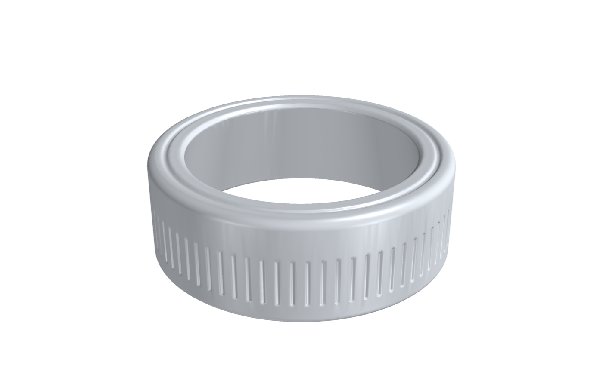
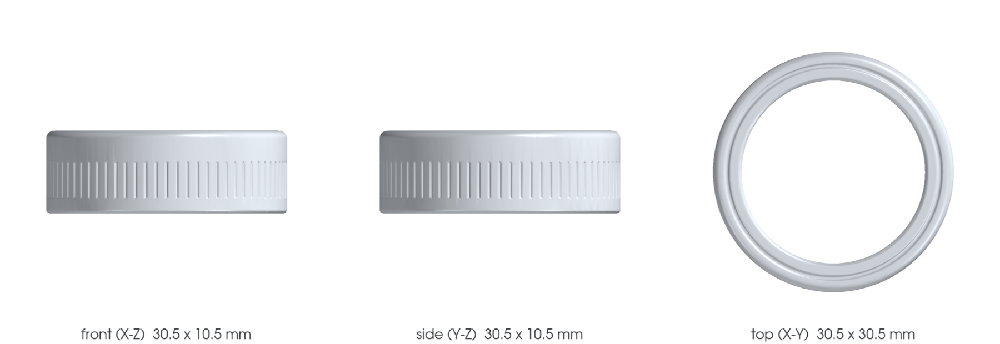

<!-- generated by scripts/render_part_pages.py - do not edit by hand -->

# Aluminum switch trim ring, F1 reconstruction

**`993-INT-SWITCH-TRIM-RING-F1-0001`** · Porsche 993 · 1994–1998

  

> [!TIP]
> **This part is ready to print** — [`print/`](print/README.md): the repository's own design, unchanged, sliced in 17m 12s (2.28 cm³), with a PrusaSlicer project and settings. Its fit on the car is not checked yet ([decision 0010](../../docs/decisions/0010-print-the-trim-ring-f1-in-polymer.md)).

> [!CAUTION]
> **Printable, but not validated, and not a copy of the original.** The model shown here is a
> design whose fit has not been checked against the car:
> - validation status `concept`: nothing has been checked against a real part;
> - geometry `estimated`: its dimensions are estimated design variables, not measured on the original part;
> - safety class `non_critical`;
> - no part in this repository is released — read [SAFETY.md](../../SAFETY.md).

<table><tr>
<td width="50%" valign="top">
<b>Original part</b>  
The original part is documented — pictures, catalogue entries or published data — on these pages. They are copyrighted, so they are linked here, not copied:  
↗ <a href="https://oldtimer-ersatzteile24.de/alu-zierring-decorring-fuer-porsche-911-964-993-armaturenbrett-eq850101">Oldtimer-Ersatzteile24 - Switch trim ring 911/964/993</a> 
</td>
<td width="50%" valign="top" align="center">
<b>This repository's design — what prints</b>  
 
The repository's own design, rendered from the file that prints. <b>Not</b> the original part; fit on the car not checked.
</td>
</tr></table>

> [!NOTE]
> **Non-critical** — trim, or a part whose failure creates no immediate hazard. Published only after dimensional and fit validation.

## What it is

Switch trim ring, F1 reconstruction. The pilot served to validate the CAD chain, the LPBF screening and the confrontation with a real route; the latter concluded that the part must be turned in a 6xxx grade and not sintered. It is neither an OEM geometry nor a part authorized for fitting.

## What it does on the car

Reconstruction and LPBF/CNC comparison pilot, with no vehicle fitting at this stage

## At a glance

| | |
|---|---|
| Porsche part numbers | not recorded |
| variants | `993_all_models_per_supplier_to_confirm` |
| candidate material | EN AW-6063 T6 retained for bright anodizing |
| candidate process | CNC |
| safety class | `non_critical` |
| validation status | `concept` |
| geometry | estimated, master build123d |

## Where it stands

```mermaid
flowchart LR
    L0["concept"]
    L1["dimensionally_reviewed"]
    L2["prototype_fitted"]
    L3["functionally_tested"]
    L4["engineering_reviewed"]
    L5["released"]
    L0 --> L1 --> L2 --> L3 --> L4 --> L5
    classDef here fill:#fff4d6,stroke:#b7791f,color:#1a1a1a,stroke-width:3px;
    classDef done fill:#e3f1e6,stroke:#2e7d32,color:#1a1a1a;
    classDef todo fill:#f4f4f4,stroke:#9e9e9e,color:#6b6b6b;
    classDef stop fill:#fde2e1,stroke:#c0392b,color:#1a1a1a;
    class L0 here
    class L1 todo
    class L2 todo
    class L3 todo
    class L4 todo
    class L5 todo
```

*Validation ladder of `catalog/schemas/part.schema.json`; this record is at `concept`.*

## Views

*Orthographic views of the same concept CAD, with its bounding dimensions — not drawings of the original part.*

## What's in this folder

| folder | what it holds | files |
|---|---|---|
| `derived/` | CAD exports generated from the source (STEP for CAD tools, STL for meshing) | [`derived/switch_trim_ring_f1-picogk.json`](derived/switch_trim_ring_f1-picogk.json), [`derived/switch_trim_ring_f1-picogk.stl`](derived/switch_trim_ring_f1-picogk.stl), [`derived/switch_trim_ring_f1.step`](derived/switch_trim_ring_f1.step), [`derived/switch_trim_ring_f1.stl`](derived/switch_trim_ring_f1.stl) |
| `evidence/` | screens, reports and manifests — **pinned by SHA-256, never edited by hand** | [`evidence/geometry-screen.json`](evidence/geometry-screen.json) |
| `media/` | concept-model views rendered from the CAD by `scripts/render_part_previews.py` — not pictures of the original | [`media/preview.json`](media/preview.json), [`media/preview.png`](media/preview.png), [`media/views.png`](media/views.png) |
| `print/` | **ready-to-print files**: 3MF project, STL and instructions | [`print/print.json`](print/print.json), [`print/switch_trim_ring_f1.3mf`](print/switch_trim_ring_f1.3mf), [`print/switch_trim_ring_f1_print.stl`](print/switch_trim_ring_f1_print.stl) |
| `source/` | parametric source — the editable master that generates the geometry | [`source/export_print.py`](source/export_print.py), [`source/picogk.json`](source/picogk.json), [`source/switch_trim_ring.py`](source/switch_trim_ring.py) |

## Read more

- **Full description page**, with sources and evidence: [docs/pieces/993-int-switch-trim-ring-f1-0001.md](../../docs/pieces/993-int-switch-trim-ring-f1-0001.md)
- **Catalogue record** (source of truth): [`catalog/parts/993-int-switch-trim-ring-f1-0001.json`](../../catalog/parts/993-int-switch-trim-ring-f1-0001.json)
- **Design dossier**: [993_SOURCING_CHINE_LPBF](../../docs/993/993_SOURCING_CHINE_LPBF.md)
- **Design dossier**: [993_SWITCH_TRIM_RING_F1](../../docs/993/993_SWITCH_TRIM_RING_F1.md)
- **Safety rules**: [SAFETY.md](../../SAFETY.md)

---

*This page is generated from the catalogue record by `scripts/render_part_pages.py` and checked by `make check`. Edit the record, not this page.*
