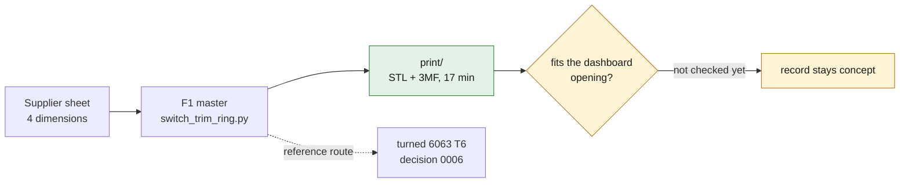

# Print it: switch trim ring, F1 design

*The repository's F1 design of the ring, rendered from its CAD master. Not a
photograph of the original, and not evidence that it fits.*

This is a part the repository designed, printed as designed: the F1 master
[`derived/switch_trim_ring_f1.step`](../derived/switch_trim_ring_f1.step) with
no change to its geometry ([decision 0010](../../../docs/decisions/0010-print-the-trim-ring-f1-in-polymer.md)).

| dimension | value | where it comes from |
|---|---|---|
| outer diameter | 30.5 mm | supplier sheet of the aluminum ring EQ850101 |
| depth | 10.5 mm | supplier sheet |
| front inner diameter | 23.0 mm | supplier sheet |
| rear inner diameter | 28.0 mm | supplier sheet |
| conical inner profile between them | linear | **hypothesis** of the F1 design |
| edges | sharp, no tolerance | **not decided** in the master |

## Files

| file | use |
|---|---|
| [`switch_trim_ring_f1.3mf`](switch_trim_ring_f1.3mf) | **open this** in PrusaSlicer: the ring, placed and set up |
| [`switch_trim_ring_f1_print.stl`](switch_trim_ring_f1_print.stl) | fine STL of the master for any slicer (3,528 triangles, watertight) |
| [`print.json`](print.json) | provenance: master file and its SHA-256, orientation, slicing result |

Regenerate the STL with `source/export_print.py` (cadsim image).

## Settings

Sliced with PrusaSlicer on a generic 0.4 mm nozzle: **17 min 12 s, 2.28 cm³**
(≈ 3 g of PETG).

| setting | value | why |
|---|---|---|
| material | **ASA or PETG** (silver or black); PLA only for a desk sample | PLA softens at the temperatures a closed car's dashboard reaches |
| orientation | **as placed**: front face (23 mm opening) on the plate | the bore widens upward, so every layer sits on the one below: no supports |
| layer height | 0.12 mm (first 0.2 mm) | smooth cone |
| perimeters | 4 | the rear wall is 1.25 mm |
| infill | 40 % | |
| elephant-foot compensation | 0.15 mm | keeps the visible front edge crisp |
| seam | rear | keeps the seam off the visible face |
| temperatures | PETG 240–245 °C, bed 80 °C (ASA: 250–260 °C, bed 100 °C, enclosure) | |

## What this print is, and is not

- It **is** the repository's own F1 design, and it prints: the file slices
  cleanly, with no supports.
- It is **not** the original ring: the original is aluminum, and the inner cone
  of this design is an assumption.
- It is **not** checked against the car: the dashboard opening and the
  clearance or interference it needs have never been measured. Whether it
  pushes in, sits loose or needs force is exactly what a first print tells you.

> [!NOTE]
> Non-critical trim part (SAFETY.md: failure creates no immediate hazard). The
> record stays at `concept` until a fit result is recorded.
