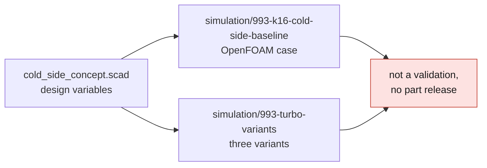

# K16 cold-side diffuser — research geometry

> [!CAUTION]
> **Not a part.** This folder has no catalogue record: it is an editable research
> geometry for the 993 K16 forced-induction study, not a reconstruction of a K16
> turbocharger. Nothing here may be made or fitted — read [SAFETY.md](../../SAFETY.md).

[`source/cold_side_concept.scad`](source/cold_side_concept.scad) is a parametric
OpenSCAD model of a stationary cold-side diffuser: an inlet, a conical diffuser
and two flanges, open to flow. It deliberately contains no rotor, blade, CHRA,
bearing, wastegate or hot-side surface, and its dimensions are design variables,
not measured K16 values.

| parameter | default |
|---|---|
| inlet diameter | 50 mm |
| outlet diameter | 68 mm |
| diffuser length | 90 mm |
| wall thickness | 4 mm |
| flange thickness | 8 mm |
| inlet / outlet flange diameter | 74 / 92 mm |

Open it in OpenSCAD to see the shape; no preview image is committed because the
compute images do not carry OpenSCAD.

**Where it is used:** [simulation/993-k16-cold-side-baseline](../../simulation/993-k16-cold-side-baseline/README.md)
· [simulation/993-turbo-variants](../../simulation/993-turbo-variants/README.md)
· the 993 turbocharger record [`993-turbocharger-k16-pair-0001`](../993-turbocharger-k16-pair-0001/README.md)
