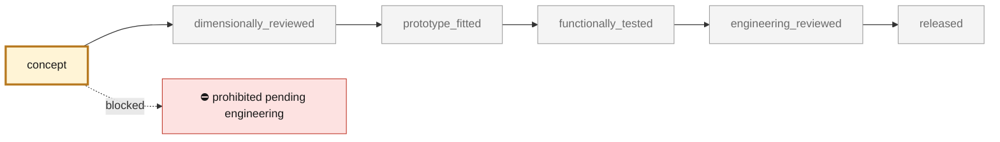
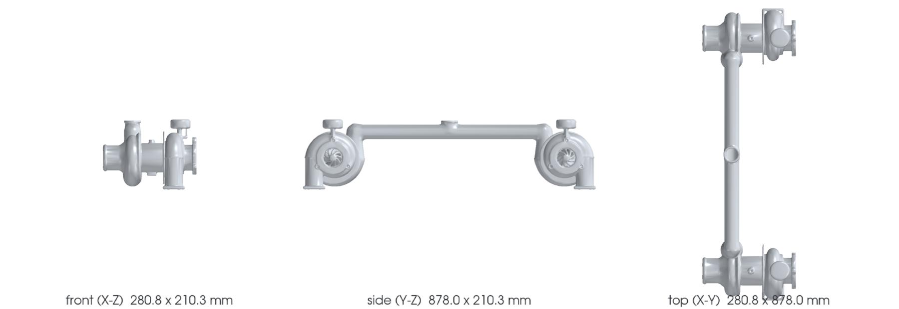

<!-- generated by scripts/render_part_pages.py - do not edit by hand -->

# Pair of K16 turbochargers of the 993 Turbo

**`993-TURBOCHARGER-K16-PAIR-0001`** · Porsche 993 · 1995–1998

  

> [!CAUTION]
> **Not ready to print, and not a copy of the original part.** The model shown here is a
> concept block for studying the part in software:
> - validation status `concept`: nothing has been checked against a real part;
> - geometry `estimated`: its dimensions are estimated design variables, not measured on the original part;
> - safety class `prohibited_pending_engineering`;
> - no part in this repository is released — read [SAFETY.md](../../SAFETY.md).

<table><tr>
<td width="50%" valign="top">
<b>Original part</b>  
The original part is documented — pictures, catalogue entries or published data — on these pages. They are copyrighted, so they are linked here, not copied:  
↗ <a href="https://newsroom.porsche.com/christophorus/fr/2020/394/turbo-engines.html">Porsche Christophorus - Technical data of the 911 Turbo (993)</a> 
↗ <a href="https://www.borgwarner.com/docs/default-source/iam/boosting-technologies/bw_turbo-performance-catalog.pdf">BorgWarner - Performance Turbocharger Catalog</a> 
↗ <a href="https://www.fvd.net/de/shop/turbolader-k16-rechts-993-serie-99312301452-993123014dx~p239094">FVD Brombacher - envelope and mass of the 993 K16s</a> 
↗ <a href="https://www.invasionautoproducts.com/94pocark16tu.html">Invasion Auto Products - internal catalog data of the right-hand K16</a> 
</td>
<td width="50%" valign="top" align="center">
<b>This repository's concept model</b>  
 
Concept CAD block, 280.0 × 890.0 × 210.0 mm — <b>not</b> the original part, not a print file, not evidence of fit.
</td>
</tr></table>

> [!CAUTION]
> **Prohibited pending engineering** — risk, or insufficient data. Never published as a released part.

## What it is

Research target of the digital twin: two K16 turbochargers mounted in parallel on the 993 Turbo. This record establishes the functional identity and the available public data; it constitutes neither a replacement geometry nor a manufacturing authorization.

## What it does on the car

Research, identification, simulation and dimensional reconstruction under engineering control; no engine or road use at this stage

## At a glance

| | |
|---|---|
| Porsche part numbers | 993 123 013 51, 993 123 013 52, 993 123 014 51, 993 123 014 52 |
| variants | `993_Turbo` |
| candidate material | undetermined |
| candidate process | undecided |
| safety class | `prohibited_pending_engineering` |
| validation status | `concept` |
| geometry | estimated, master build123d |

## Where it stands

*Validation ladder of `catalog/schemas/part.schema.json`; this record is at `concept`.*

## Views

*Orthographic views of the same concept CAD, with its bounding dimensions — not drawings of the original part.*

## What's in this folder

| folder | what it holds | files |
|---|---|---|
| `derived/` | CAD exports generated from the source (STEP for CAD tools, STL for meshing) | [`derived/k16_pair_concept_f0.step`](derived/k16_pair_concept_f0.step) |
| `evidence/` | screens, reports and manifests — **pinned by SHA-256, never edited by hand** | [`evidence/concept-f0.json`](evidence/concept-f0.json) |
| `media/` | concept-model views rendered from the CAD by `scripts/render_part_previews.py` — not pictures of the original | [`media/preview.json`](media/preview.json), [`media/preview.png`](media/preview.png), [`media/views.png`](media/views.png) |

## Read more

- **Full description page**, with sources and evidence: [docs/pieces/993-turbocharger-k16-pair-0001.md](../../docs/pieces/993-turbocharger-k16-pair-0001.md)
- **Catalogue record** (source of truth): [`catalog/parts/993-turbocharger-k16-pair-0001.json`](../../catalog/parts/993-turbocharger-k16-pair-0001.json)
- **Safety rules**: [SAFETY.md](../../SAFETY.md)

---

*This page is generated from the catalogue record by `scripts/render_part_pages.py` and checked by `make check`. Edit the record, not this page.*
