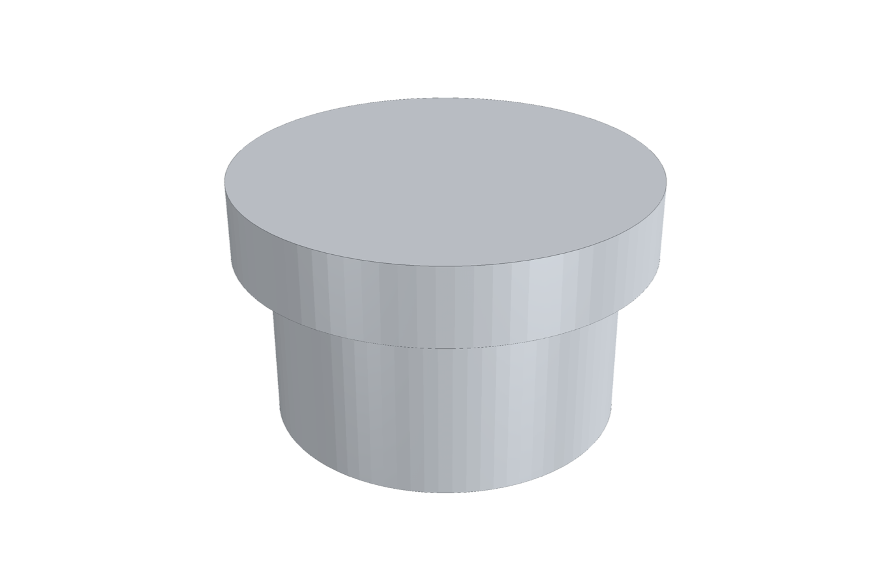
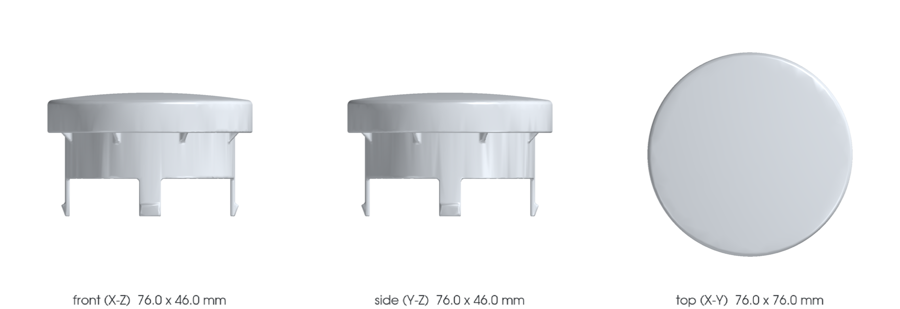
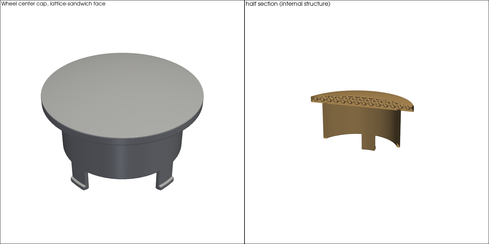
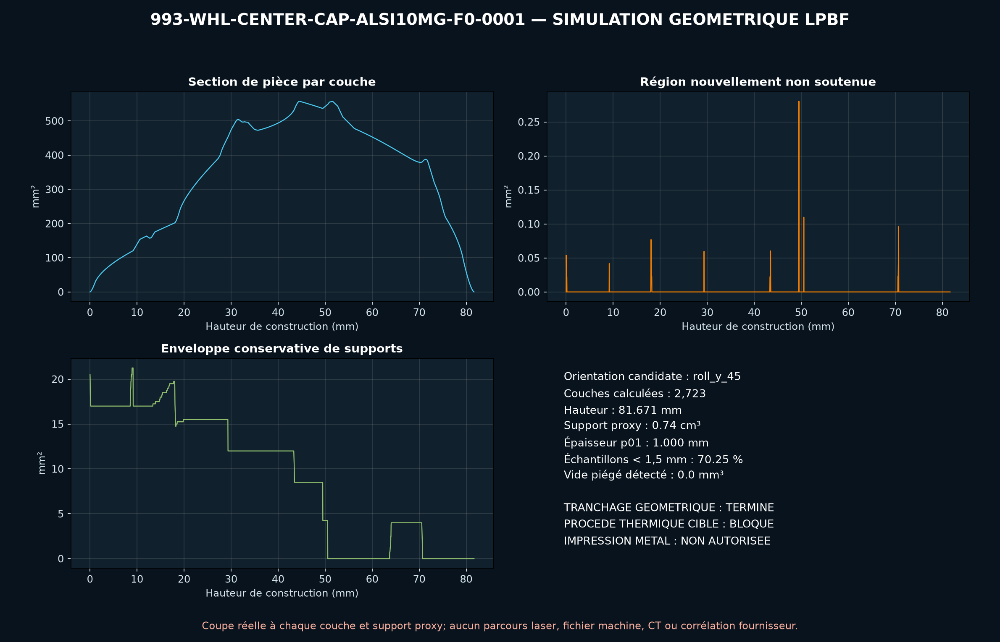

<!-- generated by scripts/render_part_pages.py - do not edit by hand -->

# 993 center cap, AlSi10Mg F0 concept without crest

**`993-WHL-CENTER-CAP-ALSI10MG-F0-0001`** · Porsche 993 · 1994–1998

  

> [!CAUTION]
> **Not ready to print, and not a copy of the original part.** The model shown here is a
> concept block for studying the part in software:
> - validation status `concept`: nothing has been checked against a real part;
> - geometry `mixed`: its dimensions are partly sourced, partly assumed, not measured on the original part;
> - safety class `functional`;
> - no part in this repository is released — read [SAFETY.md](../../SAFETY.md).

<table><tr>
<td width="50%" valign="top">
<b>Original part</b>  
The original part is documented — pictures, catalogue entries or published data — on these pages. They are copyrighted, so they are linked here, not copied:  
↗ <a href="https://porschefanatics.com/oem/discontinued/">PorscheFanatics - historical register of superseded part numbers</a> 
↗ <a href="https://partworks.de/1x-Radnabendeckel-ORIGINAL-fuer-PORSCHE-911-993-9933613030761M">partworks - original 993 center cap</a> 
</td>
<td width="50%" valign="top" align="center">
<b>This repository's concept model</b>  
 
Concept CAD block, 76.0 × 76.0 × 46.0 mm — <b>not</b> the original part, not a print file, not evidence of fit.
</td>
</tr></table>

> [!NOTE]
> **Functional** — loaded part whose failure can immobilize or damage the vehicle. Published only after documented functional testing.

## What it is

Independent concept of a metal center cap with four integrated tabs to screen a small LPBF series. PorscheFanatics confirms the identity and the historical PET status; partworks publishes three dimensions and states that the original is plastic.

## What it does on the car

CAD, clip-fit, centrifugal, thermal and DfAM screening; no road fitting authorized

## At a glance

| | |
|---|---|
| Porsche part numbers | 99336130307, 9933613030761M |
| variants | `993_wheel_fitment_to_confirm` |
| candidate material | AlSi10Mg for screening |
| candidate process | undecided |
| safety class | `functional` |
| validation status | `concept` |
| geometry | mixed, master build123d |

## Where it stands

```mermaid
flowchart LR
    L0["concept"]
    L1["dimensionally_reviewed"]
    L2["prototype_fitted"]
    L3["functionally_tested"]
    L4["engineering_reviewed"]
    L5["released"]
    L0 --> L1 --> L2 --> L3 --> L4 --> L5
    classDef here fill:#fff4d6,stroke:#b7791f,color:#1a1a1a,stroke-width:3px;
    classDef done fill:#e3f1e6,stroke:#2e7d32,color:#1a1a1a;
    classDef todo fill:#f4f4f4,stroke:#9e9e9e,color:#6b6b6b;
    classDef stop fill:#fde2e1,stroke:#c0392b,color:#1a1a1a;
    class L0 here
    class L1 todo
    class L2 todo
    class L3 todo
    class L4 todo
    class L5 todo
```

*Validation ladder of `catalog/schemas/part.schema.json`; this record is at `concept`.*

## Views

*Orthographic views of the same concept CAD, with its bounding dimensions — not drawings of the original part.*

## PicoGK voxel model

*Variant generated with the PicoGK voxel kernel in [`parts/picogk-993-batch-01`](../../parts/picogk-993-batch-01/README.md): published overall envelope, internal structure (double wall, lattice core or vanes) shown in the half section. Mounting interfaces are assumptions — not the original part, not a print file, not evidence of fit.*

## Screens and evidence images

*`evidence/lpbf-f0/993-whl-center-cap-alsi10mg-f0-0001-lpbf-geometry-screen.png` — a screening output, not a validation.*

## What's in this folder

| folder | what it holds | files |
|---|---|---|
| `derived/` | CAD exports generated from the source (STEP for CAD tools, STL for meshing) | [`derived/wheel_center_cap_alsi10mg_f0.step`](derived/wheel_center_cap_alsi10mg_f0.step), [`derived/wheel_center_cap_alsi10mg_f0.stl`](derived/wheel_center_cap_alsi10mg_f0.stl) |
| `evidence/` | screens, reports and manifests — **pinned by SHA-256, never edited by hand** | [`evidence/engineering-screen.json`](evidence/engineering-screen.json), [`evidence/lpbf-f0/993-whl-center-cap-alsi10mg-f0-0001-layer-metrics.csv`](evidence/lpbf-f0/993-whl-center-cap-alsi10mg-f0-0001-layer-metrics.csv), [`evidence/lpbf-f0/993-whl-center-cap-alsi10mg-f0-0001-lpbf-geometry-manifest.json`](evidence/lpbf-f0/993-whl-center-cap-alsi10mg-f0-0001-lpbf-geometry-manifest.json), [`evidence/lpbf-f0/993-whl-center-cap-alsi10mg-f0-0001-lpbf-geometry-report.json`](evidence/lpbf-f0/993-whl-center-cap-alsi10mg-f0-0001-lpbf-geometry-report.json), [`evidence/lpbf-f0/993-whl-center-cap-alsi10mg-f0-0001-lpbf-geometry-screen.png`](evidence/lpbf-f0/993-whl-center-cap-alsi10mg-f0-0001-lpbf-geometry-screen.png) |
| `media/` | concept-model views rendered from the CAD by `scripts/render_part_previews.py` — not pictures of the original | [`media/picogk-batch-01.png`](media/picogk-batch-01.png), [`media/preview.json`](media/preview.json), [`media/preview.png`](media/preview.png), [`media/views.png`](media/views.png) |
| `source/` | parametric source — the editable master that generates the geometry | [`source/wheel_center_cap.py`](source/wheel_center_cap.py) |

## Read more

- **Full description page**, with sources and evidence: [docs/pieces/993-whl-center-cap-alsi10mg-f0-0001.md](../../docs/pieces/993-whl-center-cap-alsi10mg-f0-0001.md)
- **Catalogue record** (source of truth): [`catalog/parts/993-whl-center-cap-alsi10mg-f0-0001.json`](../../catalog/parts/993-whl-center-cap-alsi10mg-f0-0001.json)
- **Design dossier**: [993_WHEEL_CENTER_CAP_ALSI10MG_F0](../../docs/993/993_WHEEL_CENTER_CAP_ALSI10MG_F0.md)
- **Safety rules**: [SAFETY.md](../../SAFETY.md)

---

*This page is generated from the catalogue record by `scripts/render_part_pages.py` and checked by `make check`. Edit the record, not this page.*
