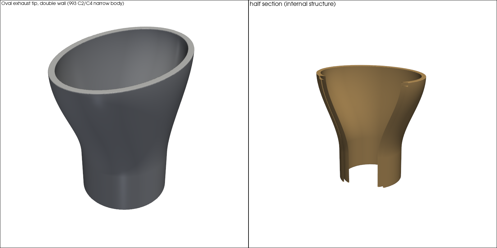
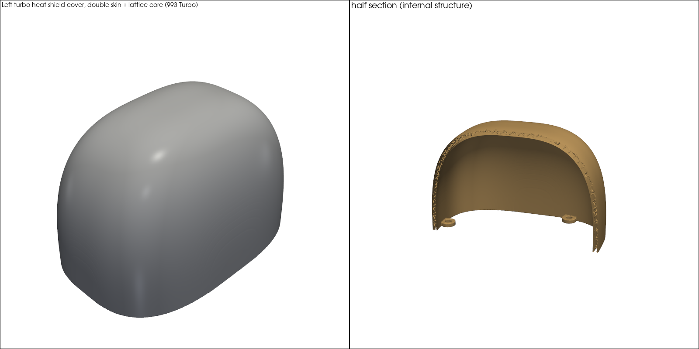
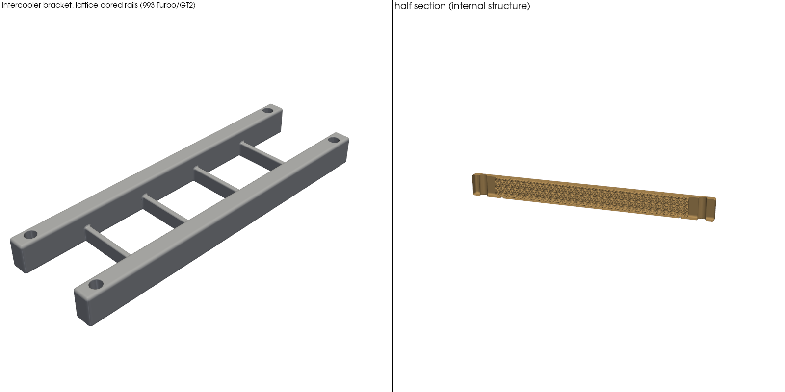
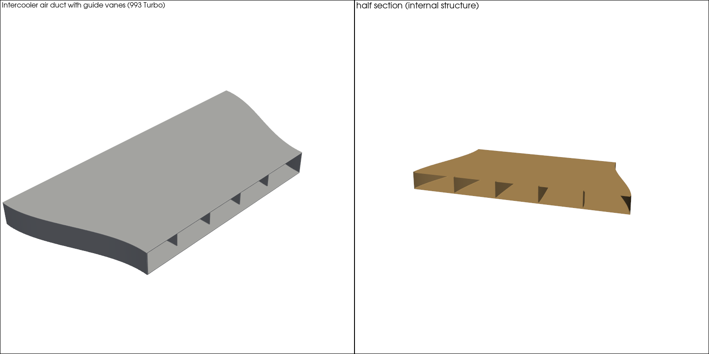
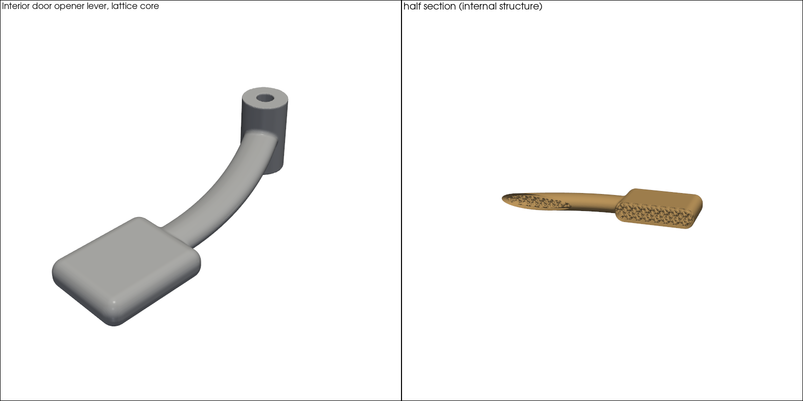
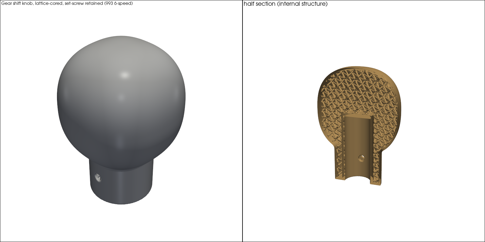
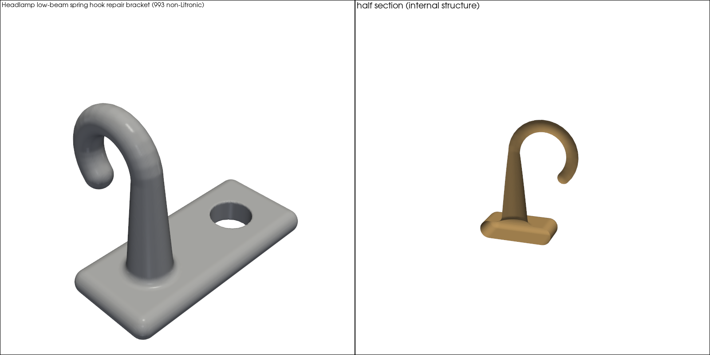
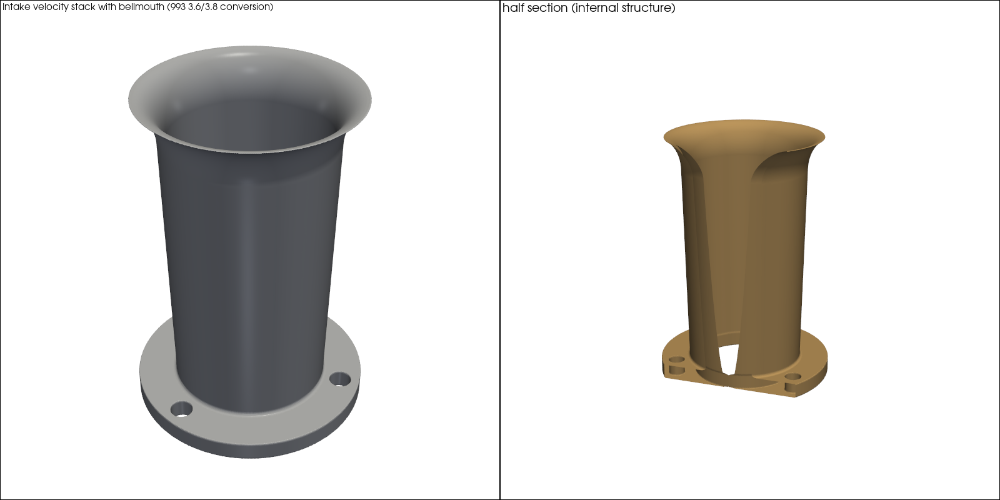
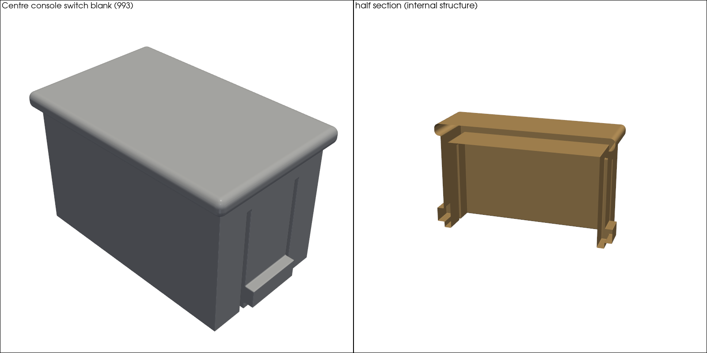

# PicoGK 993 batch 01 — ten parametric concept parts

> [!CAUTION]
> **F0 concept geometry only.** Every part here is *not fitted, not tested, not safe,
> not released and not a print file*. Overall envelopes come from published sources;
> **mounting interfaces (hole patterns, pivots, bores, clips) are assumptions**,
> listed per part under "open interfaces". Per `AGENTS.md`, none of these parts may be
> called functional until those interfaces are measured on a real car or part.

Ten Porsche 911 (993) parts generated with the PicoGK voxel kernel from one C#
project. Each part is a parameter file (`params/*.json`) plus a generator
function (`src/Parts.cs`). Every parameter carries its **basis**:

| basis | meaning |
|---|---|
| `published` | read on a cited manufacturer/retailer page (URL in `source`) |
| `community` | forum or owner measurement, cited |
| `assumption` | chosen for the concept — not evidence, blocks any fit claim |

## The parts

| # | Part | Porsche no. | Material candidate | PicoGK enhancement | Published / assumed | Mass est. |
|---|---|---|---|---|---|---|
| 01 | Oval exhaust tip, C2/C4 | — | Ti-6Al-4V LPBF | ventilated double wall + radial ribs, gap open at inlet (cooling + depowdering) | 2 / 10 | 286 g |
| 02 | Wheel center cap | 993 361 303 07 | AlSi10Mg LPBF | skin + open-cell lattice sandwich face, barbed clip tabs, drains | 3 / 11 | 58 g |
| 03 | Left turbo heat shield | 993 123 113 51 | IN625 LPBF | two skins + lattice insulating core, open at the rim | 3 / 10 | 763 g |
| 04 | Intercooler bracket | 993 110 110 50/52 | Ti-6Al-4V LPBF | lattice-cored rails, solid bolt pads, drains | 3 / 11 | 383 g |
| 05 | Intercooler air duct | 993 110 340 54 | PA12 MJF/SLS | wide-to-narrow transition with 4 internal guide vanes, one piece | 3 / 4 | 857 g |
| 06 | Door opener lever | 993 555 851/852 00 | AlSi10Mg LPBF | Bezier-swept arm + paddle, lattice core, solid pivot boss | 3 / 10 | 29 g |
| 07 | Gear shift knob, 6-speed | 993 424 075 0x | AlSi10Mg LPBF | lattice core tunes mass, solid bore sleeve, 2 set-screw holes | 3 / 11 | 59 g |
| 08 | Headlamp spring hook | kit 000 043 204 28 | 316L LPBF | tapered stem + J hook fused with fillets (no bend line) | 1 / 6 | 2.8 g |
| 09 | Intake velocity stack | — (PMO kit ref.) | AlSi10Mg LPBF | continuous taper + elliptical bellmouth + flange in one body | 3 / 8 | 111 g |
| 10 | Console switch blank | 993 613 523 00 | PA12 MJF/SLS | face, hollow body and 2 snap clips as one body | 0 + 2 community / 9 | 3 g |

Masses are mesh volume × material density, not weighed parts.

**Mass against the published originals, where a figure exists:**
- **Exhaust tip, 286 g:** lighter than the published 506 g retail tip.
- **Door lever, 29 g each:** lighter than the 90 g FVD solid-aluminium lever.
- **Heat shield, 763 g:** about 3.3 times the 230 g OEM cover. A 0.8 mm double skin in IN625 buys insulation, not weight.
- **Bracket, 383 g:** heavier than the 200 g FVD part, whose material is not published.

## Gallery

Each image: shaded model (left) and half section through the plane that cuts the most material (right). Renders of the generated STL — **not** pictures of the original parts.

### 01 · Oval exhaust tip — double wall, open ventilated gap



### 02 · Wheel center cap — lattice-sandwich face


### 03 · Left turbo heat shield — two skins + lattice core



### 04 · Intercooler bracket — lattice-cored rails



### 05 · Intercooler air duct — internal guide vanes



### 06 · Door opener lever — lattice core, solid pivot



### 07 · Gear shift knob — lattice core, bore sleeve, set screws



### 08 · Headlamp spring hook — tapered stem + J hook



### 09 · Intake velocity stack — taper + bellmouth + flange



### 10 · Console switch blank — face, body, snap clips



## Run

```powershell
$env:UpstreamRoot = "<path to pinned LEAP71 sources>"   # see containers/m64-leap71/sources.lock
dotnet build parts/picogk-993-batch-01/PicoGK993Batch.csproj -c Release -o <bin>
cd parts/picogk-993-batch-01
dotnet <bin>/PicoGK993Batch.dll params out                 # all parts
dotnet <bin>/PicoGK993Batch.dll params out PGK993-07-GEAR-SHIFT-KNOB   # one part
python qa/qa.py                                            # independent mesh QA + renders
```

- **Runtime:** each part takes 10–100 s on one machine.
- **Output:** `out/<id>.stl`, `out/<id>.report.json`, `out/qa-summary.json`, `media/<id>.png`.
- **STLs are not committed** (`.gitignore`); regenerate them with the commands above.
- **Run large parts one at a time.** Several processes in parallel crashed the native kernel twice (heat shield, bracket). Run alone, the same parts succeed.

## QA (`qa/qa.py`)

The QA step reads only the STL and the parameter file. It does not trust the generator's own report. For every part:

**Mesh cleanup**
- **Zero-area triangles:** removed. They are marching-cubes leftovers that create a few hundred non-manifold edges; volume is unchanged.
- **Sub-voxel shells:** shells smaller than two voxels are counted and dropped.

**Checks** (a part passes only if all hold)
- **Watertight.**
- **Exactly one solid body.**
- **Zero sealed voids.** A sealed cavity would trap powder in LPBF.
- **Published envelopes:** every published overall dimension is within 1.5 mm.

**Render:** a shaded view plus a half section through the plane that cuts the most material.

**Current result: 10 / 10 PASS.**

## What we learned building it (PicoGK 2.3.0 / runtime 26.2)

- **`Voxels.IntersectImplicit` leaves solid interiors untouched.** It only rewrites active (narrow-band) voxels of the sparse grid. Render the infill as its own field and use `BoolIntersect` instead (`Sdf.LatticeIn`).
- **`Voxels.CalculateProperties` does not subtract fully enclosed voids.** Use the mesh volume instead (`Program.MeshVolume`).
- **Gyroid infill clipped by a skin leaves sealed pockets** (530 on the heat shield) that no drain can reach. An open-cell BCC strut lattice keeps its void space connected, so a few drains empty it. That is why every core here is a strut lattice.
- **`Fillet()` after hollowing closes lattice voids.** Fillet the outer shape first, then hollow. The door lever came out 100 % solid until the order was changed.
- **Implicit rendering is slow.** Every voxel sample calls back from native code into C#. 0.25 mm voxels on the 120 mm tip took about 10 minutes and gave 5.3 M triangles. The batch uses 0.3–0.8 mm voxels, except the two small parts (0.1 and 0.08 mm).

## Information gathered (2026-10-07/08)

**Repository sources reused:**
- `catalog/parts/*` records for the tip, cap, heat shield, bracket, lever, hook, switch blank and intake. They cite FVD, partworks, PMO / Patrick Motorsports and Roadster-Fashion.
- `catalog/reference/993-declared-part-data.json` for the air duct envelope.

**New from web research:**
- **Center cap:** partworks values confirmed. FVD gives 76 / 60 mm for cap 996 361 303 09 and calls it a "press fit … two small holes" for removal. Its product block also says 1.9 cm height, which conflicts with the 46 mm and is flagged in the params.
- **Shift knob:** Design911 lists the OEM numbers. Rennline publishes aftermarket values: ⌀1.875 in, fits rods under 15.25 mm, two 10-24 set screws. The 993 lever top is rectangular (community).
- **Console switch blank:** opening 0.67 × 1.1 in and blank 0.637 × 1.077 in, measured on a 1997 car (Rennlist, community).
- **Headlamp hook:** Porsche repair kit 000 043 204 28 (bulletin 10/7/99, transcribed on Rennlist). Roadster-Fashion offers an M3 screw fixing. No dimension is published anywhere.
- **Door lever:** fixed with a pivot pin plus a plastic ball joint (Rennlist, community).
- **Blocked:** FVD, Design911, Pelican and Suncoast pages often returned HTTP 403 to automated fetches. The muffler outlet diameter, bracket hole pattern, heat-shield fixings and duct openings were **not found**.

## What to measure next (unblocks functional status)

| Part | Measure |
|---|---|
| 01 tip | muffler outlet OD, slip depth, clamp, tip angle on the car |
| 02 cap | wheel center bore and groove on 993 Cup/Turbo wheels; OEM retention |
| 03 heat shield | fixing points and screw size; shape around the turbo housing |
| 04 bracket | hole count, diameter and spacing; mating faces |
| 05 duct | inlet and outlet openings; mounting tabs and seal flange |
| 06 lever | pivot pin diameter and axis; ball-joint stud position |
| 07 knob | OEM lever-top section and insert depth |
| 08 hook | original stub, spring end, bracket (all) |
| 09 velocity stack | throttle body / plenum flange and bolt pattern |
| 10 switch blank | clip geometry and body depth |
