# Exploratory CFD case for the cold side

This folder is the first simulation harness of the digital twin. It studies a
parametric fixed diffuser, with no wheel, no shaft, no CHRA and no hot housing.
The editable geometry is
[`cold_side_concept.scad`](../../parts/993-turbocharger-k16-cold-side-prototype/source/cold_side_concept.scad).

The file `parameters.json` separates the design parameters from the K16 data
declared by suppliers. The K16 values serve as context and as a packaging check
only; they are not used to invent the internal aerodynamic profiles.

The OpenFOAM mesh is deliberately a rectangular duct of equivalent cross
section. It makes it possible to check the `blockMesh` → `simpleFoam` chain and
to compare diffuser variants. It is not a CAD representation of the K16, and the
inlet conditions are synthetic.

```mermaid
flowchart LR
  P["parameters.json<br/>design parameters"] --> G["generated case<br/>rectangular duct, equivalent section"]
  K["supplier-declared K16 data"] -. "context and packaging<br/>check only" .-> P
  G --> BM["blockMesh"] --> CM["checkMesh:<br/>Mesh OK"] --> SF["simpleFoam<br/>500 iterations, exit code 0"]
  SF --> R["chain smoke test"]:::open
  R --> N["not physical convergence,<br/>not a K16 validation,<br/>not a part release"]:::stop
  classDef stop fill:#fde2e1,stroke:#c0392b,color:#1a1a1a;
  classDef open fill:#fff4d6,stroke:#b7791f,color:#1a1a1a;
```



## Usage

From the repository root:

```bash
make turbo-cold-side
make turbo-cold-side-check
```

In the `3dprinting993-cadsim` image:

```bash
source /opt/openfoam13/etc/bashrc
cd /workspace/simulation/993-k16-cold-side-baseline
blockMesh
checkMesh
simpleFoam
```

The case was run in the local image `3dprinting993-cadsim:dev` on August 30,
2026: OpenFOAM generated the mesh, `checkMesh` concluded `Mesh OK` and the solver
completed the 500 iterations with a zero exit code. This result is a smoke test
of the chain; it is neither evidence of physical convergence nor a validation of
the K16.

Solver results must stay in a working directory ignored by Git. The case is not
a part validation, a manufacturing authorization or evidence of compatibility
with the vehicle.
