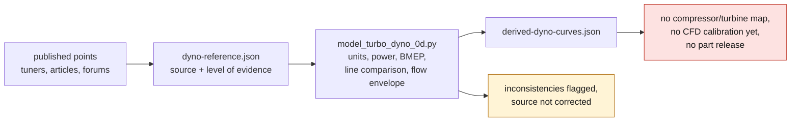

# Dyno references and 0D model

[`dyno-reference.json`](dyno-reference.json) gathers points published in tuner
pages, articles and forum reports. The dyno sheets and original images are not
copied into the repository; the values stay attached to their source and to
their level of evidence.

The useful data include, among others:

- the RUF Turbo R torque points reported on an engine dyno;
- the comparison announced on the same engine between K16 Stage 3 and K24RS;
- the Powerhaus K24 point at `5000 rpm`, `500 whp` and `525 lb-ft`, with about
  `1 bar` of reported boost;
- a chassis-dyno run of a 993 with rebuilt K16s, with `324 whp` at `6000 rpm`
  and `329 lb-ft` at `4600 rpm`;
- the Cargraphic K16/24 targets and the K26 bound from an AP Car Design project,
  which remain declared or contextual references.

The script [`model_turbo_dyno_0d.py`](../../scripts/model_turbo_dyno_0d.py):

1. keeps the publication units and converts them to Nm/kW;
2. computes the power derived from torque and the BMEP of the 3.6 l engine;
3. compares the power/torque lines when they share an engine speed;
4. adds a per-turbo flow envelope derived from the pressure, temperature, VE and
   dyno-split assumptions;
5. flags inconsistencies without silently correcting the source.



This output is a 0D normalizer and a set of comparison anchors. It is not a
compressor/turbine map, does not identify shaft speed and does not yet calibrate
the CFD. The missing dyno conditions must be obtained before any physical
regression.

## Usage

```bash
make turbo-dyno
make turbo-dyno-check
```

The generated result is
[`derived-dyno-curves.json`](derived-dyno-curves.json). An interpolated point
must not be extrapolated outside the published range, and no power target may be
used to release an engine part.
