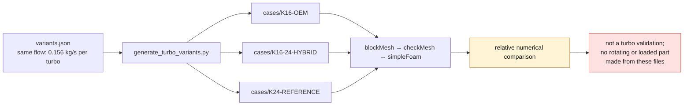

# Parametric variants of the cold side

This folder contains three exploratory variants of the same stationary cold
diffuser:

| Variant | Use | Geometry status |
| --- | --- | --- |
| `K16-OEM` | reference control | assumption keeping the first harness |
| `K16-24-HYBRID` | hybrid sensitivity | assumption around the 47.5 mm FVD inducer |
| `K24-REFERENCE` | high-flow sensitivity | assumption, no usable public K24 geometry |

The source of truth is [`variants.json`](variants.json). The tuner sources are
attached to the variants as declared references, but their power targets are not
injected into the solver. The mass flow is the same for all three cases
(`0.156 kg/s` per turbo) in order to isolate the effect of the synthetic cross
section; the inlet velocities are derived from density and cross section.

The folders under `cases/` are generated by
[`scripts/generate_turbo_variants.py`](../../scripts/generate_turbo_variants.py).
They contain the OpenFOAM fields and the matching `blockMeshDict`. The mesh
produced remains a rectangular duct of equivalent cross section: it contains no
wheel, volute, CHRA, wastegate, flange interface or measured surface of the
K16/K24.



## Usage

From the root:

```bash
make turbo-variants
make turbo-variants-check
```

In the `cadsim` container, for a given case:

```bash
source /opt/openfoam13/etc/bashrc
cd /workspace/simulation/993-turbo-variants/cases/K16-OEM
blockMesh
checkMesh
simpleFoam
```

The three cases are relative numerical comparisons, not a turbo validation. A
licensed CAD or scan, the compressor/turbine maps, the blade profiles, the
clearances, the temperatures, the rotor speed and the raw dyno data are still
missing. No rotating or loaded part may be manufactured from these files.
