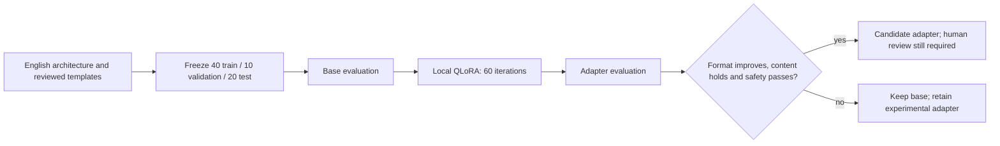

# Local M64 Qwen adapter pilot

This opt-in Mac workflow trains a small **workflow-assistance adapter** after
[the architecture documentation](../../docs/architecture/README.md). It is not
an engine solver, a materials expert or a validated PicoGK code generator.

Use Apple Silicon and Python 3.12. The 1.5B 4-bit checkpoint occupies about
0.87 GB; the original 7B candidate is deferred because the inspected Mac had
only about 5 GB free. Require at least 3 GiB free before download and preserve 2 GiB afterward. This pilot
uses no Vast instance, hosted inference, telemetry or model publication.

## Reproduce

From the repository root:

```sh
uv venv --python 3.12 work/m64-qwen/venv
uv pip sync --python work/m64-qwen/venv/bin/python training/m64-qwen/requirements.lock
python3 -m unittest discover -s tests -p 'test_m64_qwen.py' -v
work/m64-qwen/venv/bin/python training/m64-qwen/run.py --output work/m64-qwen/run-003
```

The output must not already exist. The runner downloads only the public pinned
model files, without implicit authentication, checks the weight hash, freezes
the dataset, evaluates the base model, trains QLoRA, and evaluates the adapter.
All inference after download is offline. Failure preserves `status.json` and
logs; success writes `comparison.json`. A completed run can keep the base model
if the adapter fails promotion. No generated code is executed.



## Data provenance and limitations

`dataset.py` authors synthetic examples from an explicit list of repository
sources. It never crawls other files. There are 40 training examples from eight
fixture families, 10 validation examples from two different families, and 20
frozen test examples from four other families. Test outputs are not used in
training or hyperparameter selection during this first run.

The tasks are routing PicoGK/OpenFOAM/CalculiX/OpenUSD work, converting synthetic
units, retaining unknown material data, checking rental prerequisites and
copying a supplied C# validation condition correctly. Templates and task rules
are intentionally shared across splits: family separation does **not** make
this a strong out-of-distribution benchmark. Some answers are explicit in the
prompt. It measures narrow instruction/JSON compliance, not learned engineering
knowledge, generated C# correctness or broad coding skill.

The authored examples inherit the repository's proprietary license; the owner
requested their local use. Public model weights retain Apache-2.0 provenance
in `model.json` and their upstream license. Neither datasets nor adapters are
uploaded to a model hub. Do not include raw scans, proprietary manuals, vendor
quotes, vehicle identifiers or secrets in later examples.

## Acceptance and outputs

Compare strict JSON output against expected keys, types and values. Also retain
individual responses, wall time, generated tokens, throughput and peak memory.
Record held-out loss/perplexity independently. Base and adapter use the same
context, greedy decoding, maximum output length and frozen test set.

Promotion requires strictly higher exact accuracy, no content regression after
removing optional Markdown fences, every material/rental case passing, finite
test loss no worse than the base, and mean
latency no more than twice the base. Otherwise the decision is `keep_base`.
These gates select a workflow candidate, never physical qualification.

The run records model/data/source hashes, configuration, package versions,
training output, adapter hashes, comparison and failure status. Weights, model
cache and adapters stay in ignored `work/`. See [results.md](results.md) for
actual execution; do not infer success from the existence of this README.

## Next evaluation increment

After this pilot, author independent coding problems with executable checks
for PicoGK, OpenFOAM decks and USD composition. Run generated code only in an
appropriately isolated environment. Compare 7B when disk space permits. Do not
relabel the present template benchmark as that broader evaluation.

## Use the measured model locally

```sh
work/m64-qwen/venv/bin/python training/m64-qwen/ask.py \
  --run work/m64-qwen/run-003 \
  --prompt 'For structural_analysis, return exactly tool and host.'
```

The helper rechecks current promotion rules and model/adapter hashes, supplies
fixed project context, and runs offline. It uses the base if the experimental
adapter fails the gates. It adds the actual Qwen chat end token to the stopping
set because the pinned community conversion's model config only declares the
end-of-text token. It exposes no shell, solver, rental or catalogue-writing tool.
Treat every answer as an untrusted proposal. Deterministic code must handle
unit conversion and approval gates; neither model is reliable enough for those.
