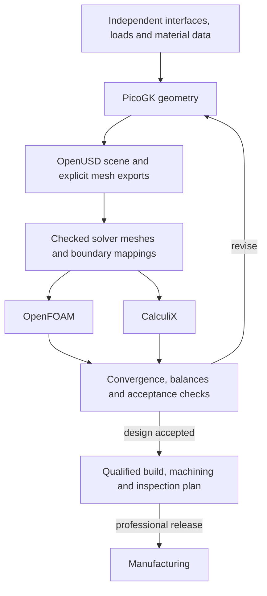

# Qwen engineering refinement

Latest measured outcome: [run 005](results-005.json) passes 264/266 development
validation cases and 148/150 filtered final cases, without a previously passing
case lost. It remains **experimental and not qualified**: PicoGK is 7/8 on
the final subset, below the unchanged 95% per-domain floor. No default adapter
is replaced and no physical part is qualified.

The [literature addendum](literature-addendum-20261002.md) records subsequent
full-text reading of the jet-engine paper and ICE review, their limits and
remaining access gaps. This research has not triggered another training run.

Owner-requested continuation toward high measured accuracy, 2 October 2026.
This builds on the [first four-domain pilot](../qwen-engineering-20261002/README.md)
without changing its frozen files, serving defaults or previously selected
experimental adapters.

The [runner](refine.py) uses private copies of the original four native graders.
It adds 512 paired PicoGK graphs with shuffled node identifiers/order, 288
three-object USD training scenes, 96 paired final variant selections, all
remaining old USD training rows, and 96 SI mechanical-calculation examples.
These are authored synthetic data. No thesis text or third-party dataset rows
are training targets. Twelve mechanical formulas add 24 validation and 24
fresh tests with independently generated parameters. Known formulas and shared
API recipes limit generalisation; no industrial qualification is claimed.

Continue pilot 001 for 600 iterations, batch 2, learning rate 0.00002, 16 LoRA
layers, rank 8, scale 20, masked prompts and 1,024-token limit. Sources/data
are frozen before scoring. Checkpoints 200/400/600 first face the eight original
graph tasks and the two USD regressions. Only a complete screen opens the full
126-case validation. Keep every passing selected-adapter case and require at
least 95% in each combined domain. Python uses complete variable coverage and
independent parameter perturbations, including dimensionless ratios. Fresh
model tests open only after eligibility. Default replacement is never automatic.

```sh
/Users/maxime/.codex/worktrees/m64-local-architecture-qwen/3dprinting993/work/m64-qwen/venv/bin/python \
  training/qwen-engineering-refinement/refine.py --output "$PWD/work/qwen-engineering-002"
python3 -m unittest discover -s tests -p 'test_qwen_engineering_refinement.py' -v
```

The user's workflow photographs extend the research scope to CalculiX INP,
conjugate heat transfer, manufacturing supports and depowdering. These topics
need separate complete-case native benchmarks before capability claims.
OpenUSD stores scene/asset metadata; solver meshes, boundary conditions,
materials and loads require explicit transformations and checks. Simulation
feedback returns to design. Printing additionally requires independently
approved manufacturing and inspection evidence.

The completed [002 results](results-002.json) reject all three checkpoints.
Step 600 reaches Python 24/32, OpenFOAM 8/8, OpenUSD 38/38 and PicoGK 46/48
with no selected-adapter validation regressions. Python misses the registered
95% floor, so the 56 fresh tests remain unopened and the default is unchanged.

The [verified photo curriculum](photo_course.py) adds 1,416 training records:
864 mechanical calculations, 48 USD mesh buffers, 480 engineering decisions
and 24 complete CalculiX axial-bar decks. It merges the prior 1,808 training
rows, giving 3,224 training records (3,177 unique prompts) and 266 validation
records. The 140 photo test records are deferred until selection; the prompt
audit below establishes overlap, so deferral does not make them unseen.
The prior 56 test cases stay unused until the final filtered evaluation.

The [photo runner](photo_run.py) continues checkpoint 002/600 for 1,200 iterations,
batch 2, learning rate 0.00002, 16 layers, inherited rank 8/scale 20, seed 42,
masked prompts and maximum 1,024 tokens. It freezes source/data/runtime hashes,
checks every authored new training reference and evaluates checkpoints
400/800/1200 against all six domains. Selection requires at least 95% in every
domain and preserves the union of passing parent and retained-adapter cases.
This union is a retention obligation, not a single-model baseline score.
Passing validation opens only the new 140-case test; default replacement is
never automatic. Source recipes are shared across sampled splits, so these
scores cannot establish general CAD mastery.

```sh
/Users/maxime/.codex/worktrees/m64-local-architecture-qwen/3dprinting993/work/m64-qwen/venv/bin/python \
  training/qwen-engineering-refinement/photo_run.py --output "$PWD/work/qwen-engineering-003"
python3 -m unittest discover -s tests -p 'test_qwen*py' -v
```

Corrected photo lessons use [primary-source records](research.json). PicoGK
constructors and boolean copies replace conceptual placeholder APIs. Converted
mesh buffers replace generic OBJ layer references. PET drawings and shaders
do not establish measured mounting interfaces or alloy qualification. Fin,
intake and shroud claims require controlled thermal/flow comparisons; neither
surface area nor titanium alone proves improvement. Printing requires process,
support-removal, powder-exit, heat-treatment, machining and inspection evidence.
Rigid-body scenes do not establish flexible crankshaft modes or fatigue.

The [fin paper](https://doi.org/10.19206/CE-195440) reports a single-cylinder
6063-T6 study, not Porsche material data. Its claimed 250 cm³ conflicts with
50 mm bore and 70 mm stroke, which imply about 137.445 cm³. The curriculum
teaches requesting clarification and checking supplied dimensions. It also
separates a temperature difference from a measured heat rate. No article text,
manual or third-party benchmark rows are training targets.

CalculiX 2.23 is already installed on Kali2. Generated decks pass an independent
restricted comparison before native execution, with no includes and a fixed
solver executable hash. The analytical witness checks displacement FL/(EA),
consistent N-mm-MPa units and complete constraints. This is an axial T3D2
benchmark, not complex contact, fatigue, crankshaft FEA or part qualification.
OpenFOAM scoring still covers bounded dictionary tasks; complete CHT cases,
coupled energy balances and measured engine calibration remain to be added.

[Native receipts](native-checks.json) record the full Linux check, two analytical
CalculiX fixtures and PicoGK voxel/mesh conversion and copy booleans. The
[prescribed CHT witness](native-cht.sh) copies the pinned ESI v2312 tutorial into
a fresh `/work`, increases its mesh to 12,000 cells and runs five serial steps.
All five region meshes pass the unchanged topology/geometry checks and write
temperature fields. The original 3,000-cell mesh failed three solid-region
quality checks despite solver completion, and was rejected. This is a runtime
reference authored by us, not a Qwen-generated complete CHT case; energy
balance, mesh convergence and experimental validation remain unverified.

[Photo run 003](results-003.json) completed 1,200 steps and 229,873 reported
tokens, peak memory 5.501 GB. Step 1200 reaches Python 80/80, OpenFOAM 8/8,
OpenUSD 44/46, PicoGK 46/48, engineering decisions 77/80 and native CalculiX
4/4. Every domain exceeds 95%, but two earlier USD passes regress; selection
rejects the candidate and the 140 photo test records remain unopened.

The [retention continuation](retain.py) uses the same 3,224 training
records with explicit replay: prior USD rows weight 3, CalculiX weight 4,
engineering decisions weight 2, other rows weight 1. That makes 4,448 training
instances, not additional distinct examples. Continue 003/1200 for 480 steps,
batch 2, learning rate 0.00001; evaluate checkpoints 240/480. Re-score all saved
parent validation answers before learning, requiring identical decisions and
response hashes. Preserve every parent pass and every earlier passing
obligation; use the same 95% domain floor. Validation/test record IDs are never replayed, but duplicate prompts
were discovered across partitions; see the audit below. The 140 photo test records open only after eligibility.

```sh
/Users/maxime/.codex/worktrees/m64-local-architecture-qwen/3dprinting993/work/m64-qwen/venv/bin/python \
  training/qwen-engineering-refinement/retain.py --output "$PWD/work/qwen-engineering-004"
```

The owner's architecture diagram is used with an explicit meshing and review
loop. OpenUSD carries the scene and exchange metadata; solver inputs also need
their own mesh, units, region/patch mappings, materials and boundary conditions.



Current model benchmarks cover individual operations and evidence decisions.
They do not yet demonstrate autonomous execution of this complete coupled
workflow, manufacturing distortion prediction or a calibrated Porsche twin.

[Continuation 004](results-004.json) is rejected: step 480 reaches USD 45/46
but engineering decisions fall to 70/80, losing seven parent passes as well as
one earlier USD case. Its 98,708 reported training tokens do not establish an
improvement; test predictions remain unopened.

The [explicit-selection continuation](select_variant.py) returns to 003/1200.
Existing USD training examples now end with the requested variant selection,
including both `small` and `large`. Previously many `large` targets relied on
the selection left by the last authoring context, whereas `small` required an
explicit final call. Each revised completion is checked natively against its
original, unchanged expected scene before training. Validation/test prompts,
answers and graders remain frozen. Sixfold replay applies only to these
training variants; CalculiX weight 4 and engineering weight 2 retain coverage.
Train 1,200 steps at learning rate 0.000005, batch 2; checkpoints 600/1200 face
the same 95% domain floor and all prior passing obligations. This is a scoped
hypothesis about completion ambiguity, to be accepted only on measured results.

```sh
/Users/maxime/.codex/worktrees/m64-local-architecture-qwen/3dprinting993/work/m64-qwen/venv/bin/python \
  training/qwen-engineering-refinement/select_variant.py --output "$PWD/work/qwen-engineering-005"
```

An additional [prompt audit](final_check.py) found a partitioning defect in the
photo course: 33 validation rows and 44 test rows repeat training prompts.
The 3,224 training records contain 3,177 unique prompts. Earlier references to
“distinct examples” count record IDs, and the original “fresh photo” label is
invalid. Those frozen receipts remain intact for traceability. Their scores
are development/retention evidence, not independent generalisation evidence.

Before final predictions, register all original test rows whose complete prompt
is absent from both training and validation, also removing duplicate test
prompts. This yields 150 cases: Python 72, OpenFOAM 8, PicoGK 8, OpenUSD 14,
engineering decisions 44 and CalculiX 4. Exclusion uses prompt identity alone,
never model outcomes. The full unchanged validation gate must still pass;
then compare parent 003/1200 and the selected 005 checkpoint on this registered
subset, with at least 95% per domain and no previously passing test lost.
The original recipes remain shared, so this is exact-prompt separation and
not a test of independent task families or general automotive competence.

```sh
python3 training/qwen-engineering-refinement/final_check.py register
/Users/maxime/.codex/worktrees/m64-local-architecture-qwen/3dprinting993/work/m64-qwen/venv/bin/python \
  training/qwen-engineering-refinement/final_check.py evaluate
```

Run 005's frozen manifest also reports `maximum_sequence_tokens: 2`, mistakenly
counting tokenizer dictionary keys. Its separate `sequence-length-check.json`
counts actual input IDs for every training instance: maximum 632, all below
1,024. This audit preserves the original manifest and records the correction.

The completed explicit-selection run reports 285,004 training tokens and
5.478 GB peak memory. Validation selects step 1200; step 600 is rejected for
three asset-import regressions. The raw legacy photo score is 139/140 but is
not independent evidence because that partition contains repeated prompts.

The final filtered comparison was registered at commit `345efa6` before final
predictions. Its prescribed references all pass, including native USD/PicoGK,
independent Python perturbations and four native CalculiX cases. Results:

| Domain | Parent 003/1200 | Candidate 005/1200 |
|---|---:|---:|
| Python mechanics | 72/72 | 72/72 |
| OpenFOAM dictionary contracts | 8/8 | 8/8 |
| OpenUSD scenes | 14/14 | 14/14 |
| PicoGK dependency graphs | 7/8 | 7/8 |
| Engineering evidence decisions | 41/44 | 43/44 |
| CalculiX axial bars | 4/4 | 4/4 |

There are no per-case regressions. The failing graph duplicates edge 0→3 and
omits required edge 1→3; the independent graph contract rejects it. The other
failure is conservative: geometry is rejected despite measured interfaces and
a verified load path when material remains unqualified. Structural calculation
and manufacturing are correctly blocked in that case. The aggregate 148/150
does not override the failed PicoGK domain floor.

Experimental weights are local at
`work/qwen-engineering-005/checkpoint-1200/`, SHA-256
`70142a4583f5c95a74b3a5dd6661d8243e85e7846dc7aba6e8b4ab3c6a3f29d4`.
Load alongside the original Qwen2.5-Coder-1.5B-Instruct 4-bit base; they are not
standalone weights. Preserve the ignored `work/qwen-engineering-*` directories
before archiving this checkout. The separate coding-008 experiment and serving defaults are
untouched.

Further training needs a new registered protocol and untouched task families.
The exposed 150 cases now serve only as regression evidence. Priorities are
node/edge binding without duplicated connections, paired geometry-versus-
material decisions, and complete generated solver cases with balance and mesh
convergence checks. Fixture identifiers alone must not create nominally fresh
engineering questions. The catalogue's independent attachment, load, material
and manufacturing gates remain mandatory regardless of model score.

Full `make check` passes on Kali2 native ext4 for source commit `345efa6`: 3,276
main tests including 144 optional skips, plus the pinned F37 Docker audit and
all remaining Make checks. This confirms software checks, not engine fitment,
physical safety or manufacturing approval.
