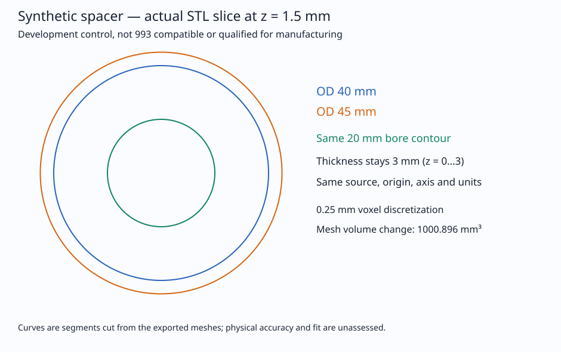

# Qwen research results: rejected candidates and bounded utility

**No fine-tuning gain is demonstrated. Candidate E is rejected; the base remains
a comparison control with known errors. No qualified Porsche part was produced.**
The scientific reserve remains closed. The separate Coder reservation is distinct.
This report publishes existing results; it authorizes no new model or native job.

## Keep the experiments separate

| Experiment | Model and evaluation | Result | Interpretation |
| --- | --- | --- | --- |
| Historical source-fidelity work | Qwen3-4B-Instruct-2507, original CPU/PEFT policy | Adapter 11/12 primary, 7/8 supplemental; base 12/12 primary, supplemental not run | No paired fine-tuning gain; citations and qualification refusals alone are insufficient |
| A / B | Qwen3, numerical recovery trials | Non-finite metrics / gradients | Rejected; cause not established |
| C | Qwen3, MPS recovery | Command-buffer error and stall | Quarantined; update impact unknown, no checkpoint reused |
| D | Qwen3, native MLX, fresh three-arm development | Base 14/20, historical 14/20, D 13/20 | Rejected; zero gains and one critical loss |
| E | Qwen3, fresh three-arm development under E policy | Initially 15/20 each; separate conservative audit 14/20 each | Rejected; zero paired gains or losses |
| Project utility | Qwen3 base, eight one-shot development tasks | 0/8 complete, 0/8 usable as-is | All hit their output ceiling; useful fragments and visible defects remain |
| Coder baseline | Qwen2.5-Coder-1.5B-Instruct-4bit, one synthetic spacer task | EOS passed; static source admission failed | One completed development output; no compilation or geometry execution |
| Human synthetic control | Deterministic PicoGK spacer, no model | Raw exports fail; explicitly derived copies pass recorded computational checks | Strict two-CPU bound failed; no vehicle or manufacturing qualification |

Historical fidelity results are in the already published
[Qwen3 fidelity report](../qwen-metal-additive-20261002/FIDELITY_QWEN3.md).
[PR #124](https://github.com/cluster2600/porscheparts/pull/124) records the separate
A–D work; [the frozen trial registry](prior-trials.json) preserves its statuses.
D and E have separately assigned graders, input bindings and runtime policies.
Do not infer improvement by subtracting their scores or transfer CPU/PEFT scores
to MLX. The primary/supplemental sources and concepts have already been exposed.
None of these development results is unseen-source generalization evidence.

## E: original blind notes and a distinct correction

E used the pinned `Qwen/Qwen3-4B-Instruct-2507`, revision
`cdbee75f17c01a7cc42f958dc650907174af0554`. The tied BF16 base and native FP32 LoRA
policy were the same for fresh base, converted historical adapter and final E.
The original historical adapter was the warm start with a new optimizer; no
rejected A/B/C/D checkpoint was reused. One epoch covered 36 rows, representing
18 bilingual objectives, and 18 updates. Only final step 18 was eligible.

Two independently assigned assistant graders assessed all 60 shuffled anonymous
answers against supplied source excerpts. Reviewer 1 accepted 15/20 in each arm;
reviewer 2 accepted 16/20. The conservative intersection is 15/20 (10/12 primary,
5/8 supplemental) in all three arms. Their endpoint-qualifier disagreement is
counted as failure. E has zero paired wins and zero losses against the fresh base;
17/20 response hashes are identical. It missed the registered development floor
of 16/20 and net gain of two, and retained unsupported scientific assertions.

The [two original notes](e/blind/reviewer-1.json),
[second notes](e/blind/reviewer-2.json), [unblinding map](e/blind/arm-map.json)
and [initial rejection](e/selection-receipt.json) are **byte-exact frozen copies**.
The original notes retain their language and disagreements; this English report
does not translate or rewrite those historical judgments.

The separate [post-grading admission supplement](e/post-grading-admission-supplement.json)
rejects the same additional critical development answer in all three arms:
prediction of material properties in terms of phase evolution was changed into
prediction of phase evolution. The refusal to certify fatigue cycles remains
correct. Consequently the conservative result is **14/20 per arm, one critical
scientific failure per arm**, with zero paired gains/losses. This adds to the
initial notes; it does not alter them, rerun the model or retrospectively choose
a checkpoint. The underlying claim-review bodies remain private; their hashes
are bound in the supplement.

Other failures include transferring a median-size condition between studies,
adding an unsupported dominant influence, promoting an observation to causation,
and attaching a general clamping statement to a specific stress effect. The raw
quantitative-axis counters 11/12/11 include eight `not_applicable/pass`
disagreements per arm. Explicit quantitative failures are 3/4/3; those raw
counters are not eleven or twelve independent scientific errors.

[Public E metadata](e/evidence.json) binds the frozen protocol
`040b75fb3e2618f0a015667c54d9e7a3a60ba792d40375f2472f6887597d8af8`, runner
`a27afa6459dac22d5e434969f565e7ba2ef905c061f984a961a25c188c8383a7`, final adapter
`abdb504fc51a561333a9426f3d56b443f8a56821a47bd060e3db14a0a59efcba`, admission,
training and supervisor receipts. Adapter bytes and training/source payloads are
withheld. Clean training recorded all 144 adapter arrays/optimizer states finite
and 398 frozen base arrays unchanged. Native MLX casts its LoRA delta before
addition; no functional PEFT parity is claimed.

E training took 90.82 seconds in the worker / 92.33 supervised, peak worker RSS
8,441,757,696 bytes. Development took 339.51 / 341.39 seconds, peak RSS
8,410,349,568 bytes. Exit was zero, no GPU error/resource stop observed, swap growth
zero, and no 192-token development ceiling hit. CPU peaks were 282.3% and 304.1%
under separately recorded transient-use authorization: two threads was a target,
not a strict cap. Runtime integrity does not establish scientific reliability.
The descriptive exact discordance p-value is 1 with zero discordances; correlated,
exposed development cases and fallible assistant grading cannot demonstrate
reliable general gain or human engineering validation.

## Eight project-utility tasks: incomplete within the registered envelope

The same Qwen3 base, without adapter, was tested once on eight development tasks
pinned to project revision `640d9f4dbc458fd4c7195a8b8cc84c80109a7af8`: source
ledgers, declared component masses, a measurement handoff, titanium planning,
an arithmetic interface, a mass discrepancy, a synthetic geometry specification
and an impeller evidence handoff. These fixtures remain exposed and training-ineligible.

All outputs reached ceilings `384/384/384/384/256/384/384/192` without EOS.
Both graders marked zero complete and zero usable as-is. Inputs were within
4,096 tokens; longer output budgets, shorter formatting and decomposition remain
untested. Three fragments also contain visible fidelity/specification defects:
valve/product mass scope conflation, an invented photo-per-datum requirement,
and inconsistent float/Decimal/unit interface promises. Truncation cannot excuse
those already visible defects, but this pass does not establish universal inability.

Correct fragments include declarations/conversions, source pairings, conservative
evidence gaps and toy parameters. Partial usefulness labels differ: grader 1
called four fragments salvageable after corrections, grader 2 six; U-D04/U-D07
are the disagreements. The original private notes remain frozen and their hashes,
row flags and distinct combined interpretation are in
[the public utility projection](utility/evidence.json). It is a metadata projection,
not a new blind grade. Ti-6Al-4V was supplied policy context; the checklist scope
was partial, and the arithmetic request was an interface specification.

The original worker completed cleanly in 117.25 seconds, sampled peak RSS
8,494,825,472 bytes, transient CPU 293.7%, zero swap growth. No generated code,
CAD or measurement was executed. Deterministic reference calculations and an
owner-prepared measurement packet are separate evidence, not model deliverables.
Human time was not measured, so wall time does not demonstrate productivity gain.

## Coder: complete output, failed static admission

The cached `mlx-community/Qwen2.5-Coder-1.5B-Instruct-4bit`, revision
`b3252a2f97102b1fb1571fec2c9b27219a8536be`, ran with no adapter on one development
spacer specification. A 392-token input produced 368 tokens including actual
EOS 151645, below its 2,048-token ceiling. Worker time was 5.02 seconds /
5.18 supervised. The raw bytes were preserved: no fence stripping, repair or retry.

Two static reviews reject Markdown, missing/extra imports, unsupported factory
calls, nullable arguments against the supplied float API, absent finite/equality
guards, tapered rounded beams and shared outer/cutter lattice operands. Signature,
unit/null/zero-negative guards and parameterized coordinates are useful partial
components. These are visible source-contract findings, not measured compiler or
mesh failures. [Coder evidence](coder/evidence.json) binds both original reviews,
raw-source fingerprint and completion receipt. Generated code was never compiled
or executed. This is separate from historical PR #117 and any prospective Coder
adaptation; no Coder training gain is reported.

## Human control: raw exports, derived cleanup and CPU breach

The [preserved human builder](control/sources/budget-reference.cs) and
[executed harness](control/sources/ControlHarness.cs) describe a **synthetic**
annular spacer: OD 40/45 mm, ID 20 mm, thickness 3 mm, Z axis, origin zero,
voxel 0.25 mm. Its preparation comment is retained even though the separately
recorded control was later executed. Eleven invalid-input cases and sampled
axial/circumferential bore/material checks passed in that recorded run.
This is an independently specified control, not Qwen output or Porsche dimensions.
No SDK, compiler or runtime binaries accompany these archived sources.

| Recorded mesh | OD 40 | OD 45 |
| --- | ---: | ---: |
| Raw triangles | 81,296 | 104,512 |
| Raw zero-area faces / non-finite normals | 80 / 76 | 80 / 76 |
| Raw edges without two faces / inconsistent directions | 44 / 40 | 44 / 40 |
| Explicitly derived triangles | 81,216 | 104,432 |
| Derived degenerate/edge-direction defects | 0 | 0 |
| Mesh volume, mm³ | 2,815.941737 | 3,816.837397 |
| Analytic volume, mm³ | 2,827.433388 | 3,828.816047 |
| Relative volume error | −0.406434% | −0.312855% |

**Raw exports failed the finite/manifold gate.** Separate derived copies removed
exactly the 80 observed zero-area faces and recomputed normals; remaining vertex
and attribute bytes, bounds and signed volumes were preserved. No remeshing,
smoothing, scaling or hole filling was used. Derived checks show one component,
edge incidence two with consistent directions and Euler zero. Genus one is
conditional on manifold prerequisites; vertex links and self-intersections were
not exhaustively proved. The separate [raw metadata correction](control/RAW_METADATA_CORRECTION.json)
marks the old raw `genus=-19` field invalid/null without rewriting its frozen audit.



The figure uses actual raw-STL midplane segments; recorded coordinate preservation
makes the derived segments the same. It does not certify the raw topology.
The 640-segment rounded bore contour is identical at z=1.5 mm; OD span changes
by approximately 5.000175 mm while Z remains 0–3 mm. One slice and finite samples
do not prove every continuous bore section or physical tolerance.

**The strict two-CPU resource ceiling was not satisfied.** The distinct
[resource exception](control/RESOURCE_EXCEPTION.json) records 0.412550838 CPU-s
over 0.045711291983 wall-s: **9.0251406185 core-equivalents**, with four native
sample intervals above two. Job-average usage below two does not prove a ceiling.
This sampled process-group ratio is not instruction-level instantaneous use;
short-lived/unsampled peaks and supervisor CPU have measurement limits. Native
elapsed time was 7.07 seconds, sampled aggregate RSS 238,452,736 bytes.
Original computational review remains frozen; its pass is not resource approval.
No PicoGK root cause, physical validity or manufacturing qualification was established.

## Publication scope and reproducibility

The existing [repository licence](../../LICENSE) applies: proprietary/all rights
reserved. Explicit publication permission covers this separate draft report and
selected authored evidence; it grants neither corpus redistribution nor blanket
reuse/training rights. The new Coder corpus's MIT label is a separate correction
pending its owner. Its data and LEAP71/course payloads are not included here.

[Origins](ORIGINS.json) and [closed payload manifest](MANIFEST.json) distinguish
byte-exact originals from newly sanitized metadata projections and bind private
receipts by hashes. Local/account paths, PIDs, credentials, private forum corpus,
reserved questions/golds/tests, scans, complete third-party PDFs/photos, SDKs,
weights and ambiguously licensed datasets remain excluded. The reserve-closed
state is reported by authorized receipts; publication does not inspect the reserve.

Run the offline standard-library check from repository root:

```sh
python3 training/qwen-results-20261003/check_publication.py
python3 -m unittest discover -s tests -p test_qwen_results_publication.py -v
python3 scripts/check_doc_links.py --strict
make check
```

The check recomputes manifest hashes, original blind consensus and the distinct
correction, paired wins/losses, analytic geometry consistency and CPU ratio.
It loads no model/tokenizer, compiles no generated code and reruns no native control.
Withheld source/data/weight/STL payloads prevent end-to-end training and geometry
reproduction from this public subset. Hash consistency is not semantic source
validation. No scientific expert, professional engineering, measurement, fit,
fatigue, fabrication or service approval follows from this report.
