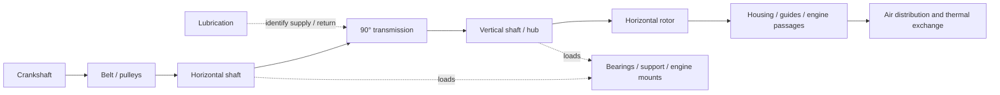

# Horizontal 935 system twin — executable foundation

This stage builds the system registry, OpenUSD graph, six calculation groups
and measurement comparison chain. Both scans have their own PicoGK preparation.
Functional geometry assembly and calibrated twin await independent dimensions
and evidence.

The [registry](system-definition.json) contains 14 candidate physical functions
and three boundaries/locations to identify. [17 interfaces](interface-contract.json)
connect them. It admits no dimensioned part into the active catalogue. A function
does not establish exact part count; bearings still require detailed enumeration.



Coupling and alternator remain in the registry with location/installation
unknown. The diagram identifies functions; it neither positions parts nor
infers internals from exterior scans.

## What programmes execute

[build_system_twin.py](source/build_system_twin.py) uses only Python standard
library. It reads a case, checks units, finite values, uncertainties and evidence
references, then produces report, HTML review and `system-logical.usda`.
Outputs stay private and are not overwritten.

The `hypothesis_screen` mode accepts exploratory `assumption` inputs with a
documented rejection test. The first
[27-case kinematic campaign](../../docs/research/935-horizontal-cooling/HYPOTHESES.md)
and [community questions](../../docs/research/935-horizontal-cooling/COMMUNITY_RESEARCH.md)
precede specimen qualification; assumptions never gain measured status.

| Model | Calculation when inputs are available | Limit |
|---|---|---|
| Speeds | `n_entree = n_moteur × r_courroie × (1 − glissement)`; `n_rotor = n_entree × r_engrenage` | Ratios are output/input speed ratios, not gear selection. |
| Rotor | `U = πDn/60`; blade passing `Z n/60` | Peripheral speed/frequency; no relative Mach, CFD field or noise prediction. |
| Inertia / imbalance | `E = Jω²/2`, `T_acc = Jα`, `F_balourd = U_balourd ω²`, `J_ramenee = J r_engrenage²` | Rotor inertia alone; other inertias/elastic responses remain to integrate. |
| Air network | Intersection of fan map with common quadratic losses and parallel branches | Confirm candidate topology; map at same speed/density, no extrapolation. |
| Steady transmission | Rotor power `QΔp/η`, input power, losses, torque and belt tension difference | Acceleration torque separate. Tension difference supplies neither pretension nor resultant radial force. Alternator excluded. |
| Thermal | Lumped solid capacities, single-pass air exchange, exponential response at fixed flow/load | No interzone conduction, radiation, oil/water network or qualified actual head temperature. |

Network requires **total-to-total pressure** and common stations for fan and
network maps. Resistance units are `Pa·s²/m⁶`; flow is actual volumetric at
declared density. Static maps require documented conversion. Each branch is an
explicitly identified cooled passage or leak. Constant coefficients do not
describe stall, recirculation or arbitrary topology.
[DOE/AMCA system approach](https://www.energy.gov/sites/prod/files/2014/05/f16/fan_sourcebook.pdf)
is general methodology, not 935 performance data.

Thermal model uses `H = ṁ cp (1 − exp(−UA/(ṁ cp)))`, then
`C dT/dt = P_source − H(T − T_air_entree)`. `solid_heat_load` is injected solid
power; actual air transfer is computed separately during the transient. Inlet
temperature belongs to the passage, not automatically ambient. Model and UA/C
parameters need comparison to real variant measurements. Imbalance supplies
excitation force; [response depends on shafts/bearings](https://evolution.skf.com/damping-in-a-rolling-bearing-arrangement/).

## Inputs and numerical status

[operating-case.template.json](operating-case.template.json) retains 19 unknown
parameters as `null` and unknown branches as an empty list. Physical data need
specimen identity, SI value, standard uncertainty, ID and SHA- 256 of measurement
or qualified result. Map uncertainties correspond to three columns per row.
Metadata checks verify neither content nor metrological authenticity. Predictions
remain conditional; uncertainty propagation is not implemented.

[synthetic-case.json](synthetic-case.json) is a two-branch arithmetic control.
Expected flow is `√5 − 1 m³/s` from independent equation
`50Q² + 100Q − 200 = 0`. Values are neither measurements nor 935 design proposals.
Synthetic evidence is rejected for physical cases. The 17 tests cover this
solution, conservation, ratio convention, thermal limits and invalid inputs.

The current physical case builds a logical system but all six calculation groups
lack values. The synthetic control executes all six. Results never change
manufacturing authorization or twin validation state.

## OpenUSD and geometry

USD has `Scope` and component relations; no Mesh, Xform, position, mass, material
or rigid body schema is added. This avoids giving unregistered scans a common
pose. `metersPerUnit = 1` defines future registry convention without scaling OBJ.
[OpenUSD Scope](https://openusd.org/release/api/class_usd_geom_scope.html)
organizes objects without its own transform.

Both generated stages opened with OpenUSD 25.11: 37 prims, 17 resolved relations
and native compliance passed. Format verification qualifies neither geometry nor
mechanical interfaces. CAD conversion, properties and SimReady preparation must
use measured sources/interfaces; they are not executed here.

## Acquisition, solvers and test comparison

[Measurement contract](measurement-contract.json) defines 15 channel families:
three shaft speeds, torques, total pressures, actual flow/distribution,
temperatures, vibration and lubrication. Each sensor needs frame, position,
calibration, sampling, synchronization and uncertainty. Technical owner must
define speed bounds and criteria. This document neither launches nor authorizes
physical testing.

[Solver dossier](solver-handoff.json) organizes geometry/manufacture, CFD,
structure, rotor dynamics, bearings/gears and lubrication inputs. Six domains
remain blocked on inputs; reduced model replaces no strength, life or fatigue
calculation. Volume-based mass/inertia needs closed geometry, qualified scale,
material and density, absent from an open scan.

[compare_holdout.py](source/compare_holdout.py) compares predictions to independent
CSV with same cases/units, frozen evidence and predefined tolerances. It rejects
calibration as validation, measurements already used as inputs and missing
predictions. Empty CSV stays `blocked_no_holdout`. Entered standard uncertainties
are recorded without statistical testing or automatic qualification. Even a
successful numerical comparison needs review of evidence, uncertainties, model
relevance and criteria to establish physical correlation.

## Reproducible execution

```sh
python3 twins/935-horizontal-cooling-system-f0/source/build_system_twin.py \
  --case twins/935-horizontal-cooling-system-f0/operating-case.template.json \
  --output work/NEW/reference
python3 twins/935-horizontal-cooling-system-f0/source/build_system_twin.py \
  --case twins/935-horizontal-cooling-system-f0/synthetic-case.json \
  --output work/NEW/synthetic
python3 twins/935-horizontal-cooling-system-f0/source/compare_holdout.py \
  --predictions work/NEW/reference/readiness-and-predictions.json \
  --observations twins/935-horizontal-cooling-system-f0/holdout-observations.template.csv \
  --output work/NEW/holdout
python3 -m unittest discover -s tests -p test_935_system_twin.py -v
```

Keep completed specimen cases and measurements private. Assign supplier replies
to dimensions/interfaces and retain contradictions/uncertainties. See
[structured questions](SUPPLIER_QUESTIONS.en.md). The 993 programme is separate;
its old geometry/calculations are not imported into this 935 twin.
