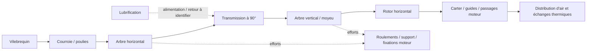

# Jumeau du système horizontal 935 — base exécutable

Cette étape construit le registre du système, son graphe OpenUSD, six groupes
de calcul et la chaîne de comparaison aux mesures. Les deux scans ont leur
propre préparation PicoGK. L'assemblage géométrique fonctionnel et le jumeau
calibré attendent les cotes et preuves indépendantes.

Le [registre](system-definition.json) contient 14 fonctions physiques candidates
et trois frontières/emplacements à identifier. Les
[17 interfaces](interface-contract.json) les relient. Le registre n'admet aucune
pièce dimensionnée dans le catalogue actif. Une fonction n'établit pas le
nombre exact de pièces : le groupe roulements, par exemple, reste à détailler.



L'accouplement et l'alternateur restent dans le registre, avec localisation et
montage à établir. Le schéma indique des fonctions ; il ne positionne pas les
pièces ni ne déduit les internes du scan extérieur.

## Ce que les programmes exécutent

[build_system_twin.py](source/build_system_twin.py) utilise uniquement la
bibliothèque standard Python. Il lit un cas, contrôle unités, valeurs finies,
incertitudes et références de preuves, puis produit un rapport, une revue HTML
et `system-logical.usda`. Les sorties sont privées et ne sont pas écrasées.

| Modèle | Calcul exécuté quand les entrées sont disponibles | Limite |
|---|---|---|
| Vitesses | `n_entree = n_moteur × r_courroie × (1 − glissement)` ; `n_rotor = n_entree × r_engrenage` | Les rapports sont des rapports de vitesse sortie/entrée, pas un choix de dentures. |
| Rotor | `U = πDn/60` ; fréquence de passage `Z n/60` | Vitesse périphérique et fréquence ; aucun Mach relatif, champ CFD ou bruit prédit. |
| Inertie / balourd | `E = Jω²/2`, `T_acc = Jα`, `F_balourd = U_balourd ω²`, `J_ramenee = J r_engrenage²` | Inertie rotor seule ; les autres inerties et réponses élastiques restent à intégrer. |
| Réseau d'air | Intersection carte ventilateur / pertes quadratiques communes et branches parallèles | Topologie candidate à confirmer ; carte au même régime et à la même densité, aucune extrapolation. |
| Transmission stationnaire | Puissance rotor `QΔp/η`, puissance d'entrée, pertes, couple et différence de tensions de courroie | Le couple d'accélération est séparé. La différence de tensions ne donne ni précontrainte ni effort radial résultant. Alternateur exclu de ce bilan. |
| Thermique | Capacités solides localisées, échange d'air à passage unique, réponse exponentielle à débit et charge fixes | Pas de conduction entre zones, rayonnement, réseau huile/eau ni température réelle de culasse qualifiée. |

Le réseau impose une convention **pression totale à totale** et des stations
communes aux cartes du ventilateur et du réseau. Les résistances sont en
`Pa·s²/m⁶`, les débits sont volumiques réels à la densité déclarée. Une carte
statique ne peut pas être utilisée sans conversion documentée. Chaque branche
est un passage refroidi ou une fuite explicitement identifiée. Des coefficients
constants ne décrivent pas le décrochage, les recirculations ou une topologie
arbitraire. L'[approche système DOE/AMCA](https://www.energy.gov/sites/prod/files/2014/05/f16/fan_sourcebook.pdf)
sert de référence méthodologique générale, pas de source de caractéristiques 935.

Le modèle thermique utilise `H = ṁ cp (1 − exp(−UA/(ṁ cp)))`, puis
`C dT/dt = P_source − H(T − T_air_entree)`. Le champ `solid_heat_load` est
la puissance injectée dans le solide ; le flux réellement transféré à l'air
est calculé séparément pendant le transitoire. La température d'entrée est
celle du passage considéré, pas automatiquement la température ambiante.
L'usage de ce modèle et ses paramètres UA/C doivent être confrontés aux mesures
de la variante réelle. Le balourd fournit une force d'excitation ; sa
[réponse dépend des arbres et appuis](https://evolution.skf.com/damping-in-a-rolling-bearing-arrangement/).

## Entrées et statut des nombres

[operating-case.template.json](operating-case.template.json) conserve les
19 paramètres inconnus à `null` et les branches inconnues dans une liste vide.
Les données physiques nécessitent identité du spécimen, valeur SI, incertitude
standard, identifiant et empreinte SHA-256 de la mesure ou du résultat qualifié.
Pour une carte, les incertitudes correspondent aux trois colonnes de chaque
ligne. Le programme contrôle ces métadonnées ; il ne vérifie pas le contenu ni
l'authenticité métrologique des preuves. Les prédictions restent conditionnelles.
La propagation des incertitudes n'est pas encore implémentée.

[synthetic-case.json](synthetic-case.json) décrit un témoin arithmétique à deux
branches. Son débit attendu est `√5 − 1 m³/s`, d'après l'équation indépendante
`50Q² + 100Q − 200 = 0`. Ses valeurs ne sont ni des mesures ni une proposition
de conception 935. Les preuves synthétiques sont refusées pour un cas physique.
Les 17 tests couvrent notamment cette solution, la conservation, la convention
des rapports, les limites thermiques et le rejet de données invalides.

Le cas physique actuel construit le système logique, mais ses six groupes de
calcul restent sans valeurs. Le témoin synthétique permet d'exécuter les six.
Les résultats ne modifient jamais l'autorisation de fabrication ou le statut
de validation du jumeau.

## OpenUSD et géométrie

Le fichier USD contient des `Scope` et des relations entre composants. Aucun
Mesh, Xform, emplacement, masse, matériau ou schéma de corps rigide n'est
ajouté. Cela évite d'attribuer une pose commune aux deux scans non enregistrés.
`metersPerUnit = 1` définit la convention future du registre ; il ne met pas
les OBJ à l'échelle. Un [Scope OpenUSD](https://openusd.org/release/api/class_usd_geom_scope.html)
organise les objets sans transformation propre.

Les deux stages produits ont été ouverts avec OpenUSD 25.11 : 37 prims,
17 relations résolues, conformité native réussie. Cette vérification du format
ne qualifie aucune géométrie ou interface mécanique. La conversion CAD,
l'assignation de propriétés et la préparation SimReady devront utiliser les
sources et interfaces mesurées. Elles ne sont pas exécutées ici.

## Acquisition, solveurs et comparaison aux essais

Le [contrat de mesure](measurement-contract.json) décrit 15 familles de canaux :
vitesses des trois arbres, couples, pressions totales, débit réel et répartition,
températures, vibration et lubrification. Pour chaque capteur, compléter repère,
position, calibration, cadence, synchronisation et incertitude. Les bornes de
régime et les critères d'essai restent à définir par le responsable technique.
Ce document ne lance ni n'autorise un essai physique.

Le [dossier solveurs](solver-handoff.json) organise les entrées nécessaires
pour géométrie/fabrication, CFD, structure, dynamique des rotors, roulements/
dentures et lubrification. Les six domaines restent bloqués sur leurs entrées.
Aucun calcul de tenue, durée de vie ou fatigue n'est remplacé par le modèle
réduit. La masse et le tenseur d'inertie issus d'un volume exigent géométrie
fermée, échelle, matériau et densité qualifiés ; le scan ouvert ne les fournit pas.

[compare_holdout.py](source/compare_holdout.py) compare les valeurs calculées
à un CSV indépendant et exige mêmes cas/unités, preuves figées et tolérances
préétablies. Il rejette les données de calibration comme validation, une mesure
déjà employée comme entrée et une prédiction manquante. Un CSV vide reste
`blocked_no_holdout`. Les incertitudes standard saisies sont consignées sans
test statistique ni qualification automatique. Une comparaison numérique
réussie attend encore revue des preuves, incertitudes, pertinence du modèle
et critères pour établir une corrélation physique.

## Exécution reproductible

```sh
python3 twins/935-horizontal-cooling-system-f0/source/build_system_twin.py \
  --case twins/935-horizontal-cooling-system-f0/operating-case.template.json \
  --output work/NEW/reference
python3 twins/935-horizontal-cooling-system-f0/source/build_system_twin.py \
  --case twins/935-horizontal-cooling-system-f0/synthetic-case.json \
  --output work/NEW/synthetic
python3 twins/935-horizontal-cooling-system-f0/source/compare_holdout.py \
  --predictions work/NEW/reference/readiness-and-predictions.json \
  --observations twins/935-horizontal-cooling-system-f0/holdout-observations.template.csv \
  --output work/NEW/holdout
python3 -m unittest discover -s tests -p test_935_system_twin.py -v
```

Pour les données du spécimen, conserver le cas rempli et les mesures en privé.
Les réponses fournisseur devront être attribuées à leurs cotes/interfaces, avec
les contradictions et incertitudes conservées. Voir les
[questions structurées](SUPPLIER_QUESTIONS.md). Le programme 993 reste distinct ;
ses anciennes géométries et calculs ne sont pas importés dans ce jumeau 935.
