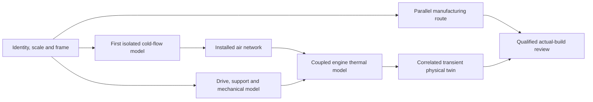

# Horizontal 935 cooling-system input matrix

Published planning and evidence package, October 3, 2026. The verified
[forty-language public synthesis](research/CONSOLIDATED_REPORT.md) is integrated
with this input contract. Bounded language passes are complete; engine-data
coverage remains partial. No additional public search or physics solver was
launched for this integration. No physical digital-twin validation is claimed.

[Repository home](../../README.md) · [Related 993 impeller program](../993-engine-cooling-fan-system-f0/README.md) · [Research coverage and intake](research/README.md)

The [CSV matrix](data/input-matrix.csv) is the compact spreadsheet view. The
[JSON matrix](data/input-matrix.json) contains all 50 parameter rows, six separate
variant templates, dependency IDs, evidence references and an empty admission
template. The [existing-evidence register](data/existing-evidence.json) distinguishes
verified local artifacts from physical claims about a particular 935.
The register uses public repository paths, immutable commit URLs and SHA-256
receipts; local paths and duplicate artifact snapshots are excluded. These are
previous project artifacts, separate from the newly received public synthesis.
The [research index](research/README.md) links the four unchanged public views,
[all 50 requirements to relevant ledger records](research/matrix-crosswalk.json),
[coverage](research/coverage.json) and [import provenance](research/import-manifest.json).

## First model versus complete coupling

A first **isolated cold-flow** model needs a dimensioned rotor and its nearby
shroud/clearances, a declared frame and signed fan speed, inlet air conditions,
an outlet-pressure/backpressure protocol, and numerical geometry/mesh QA. A
pressure sweep can generate an exploratory fan curve without modeling all
engine parts. Directly prescribing fan rpm also postpones the engine-to-fan
ratio; it prevents claiming that the result represents a particular engine rpm.
Unknown geometry can support a separately identified design hypothesis, but
cannot establish the physical scanned part or an installed 935 performance map.

An **installed cold-flow** model adds the actual intake/outlet arrangement,
obstructions, leakage, cylinder/head branch resistance and matched fan data.
A calibrated network or porous loss model may represent a downstream component;
its internal CAD is unnecessary when the admitted model resolves the intended
flow/pressure question. The model's substitution, conditions and uncertainty
must remain explicit. Nearby drive/support components still need an aerodynamic
envelope when they obstruct the fan air.

A **drive/mechanical** model adds the engine-to-fan relation, transmitted torque,
shaft/support/contact properties, actual material and lubrication/loss data.
Measured support stiffness and loss maps can replace detailed bearing or gear
internal geometry for some system questions. A fixed-bore structural screening
does not supply those measurements or an approved speed limit.

A first **coupled engine thermal** model may use measured head/cylinder heat-load
maps, equivalent thermal masses/conduction paths, calibrated fin/branch models
and oil/cooler maps at named operating points. It need not begin with combustion
chambers, pistons, valve motion and every engine part digitized. Resolving those
internals is needed only when predicting the missing heat sources or a question
that the reduced model cannot represent. Engine brake power alone supplies
neither component heat rejection nor fan shaft power. A transient physical twin
then adds duty cycles, initial temperatures, control states and synchronized
validation observations.

Manufacturing is a **parallel fidelity lane**. A qualified LPBF machine/material
route is not a prerequisite to studying the cold aerodynamics of an existing
impeller. It is indispensable before qualified process prediction or release
of a new metal build. Every result must retain its exact geometry/material/route
identity; an AM hypothesis cannot silently become the historical baseline.

| Level | Required representation | Added inputs | Legitimate result boundary |
|---|---|---|---|
| L0 | Named assembly, source/geometry inventory and frames | Identity, scale, rights, datums and source claims | Inspectable inventory; no airflow or physical fit claim |
| L1 | Isolated cold-flow fan | Rotor/shroud/gaps; signed fan speed; air inlet/outlet conditions; accepted mesh | Conditional fan flow/pressure/torque results; no installed cooling claim |
| L2 | Installed air network and drive/mechanics | Branch losses/flow split, engine ratio, drive/support/lubrication, material, torque/power | Installed operating-point and mechanical analysis within admitted conditions |
| L3 | Engine cooling coupling | Head/cylinder heat sources, solids/fins/contact or calibrated equivalents, oil, applicable turbo/intercooler/coolant circuits | Thermal predictions requiring physical correlation |
| L4 | Mission/state-correlated physical twin | Transient loads/environment, initial states, synchronized measurements and validity limits | Validated operating envelope only after independent correlation |
| M0–M3 | Manufacturing route through release | Exact alloy/machine/recipe/supports, calibration, postprocess/inspection and professional validation plan | Screening, qualified process prediction and actual-build release are separate gates |

## Variants are separate identities

These labels are **collection scopes**, not accepted engine specifications.
No numerical physical claim is currently admitted for any of the six scopes
in this package. Each historical scope can require further engine/assembly
revision records; K3, K4 and replicas are not single interchangeable assemblies.

| Variant ID | Scope | Current cooling/drive/geometry disposition |
|---|---|---|
| `factory_935_1976` | Factory 935 / 1976 | Exact engine revision, horizontal arrangement, drive and cooling circuits unresolved here |
| `factory_935_1977` | Factory 935 / 1977 | Separate claims and conditions; no automatic 1976 or 1978 inheritance |
| `factory_935_1978_moby_dick` | Factory 935 / 1978 / Moby Dick | Separate exact-variant sources needed; reported architecture retained in the ledger; no automatic matrix admission |
| `kremer_k3` | Kremer K3 | Engine/build revision and circuits must be evidenced independently |
| `kremer_k4` | Kremer K4 | Separate from K3 and factory specifications |
| `replica_declared_build` | Individually declared replica | Record actual engine, drive and cooling configuration plus intended reference; no assumption of factory equivalence |

**Do not transfer a 935/78 liquid-cooled-head claim to K3, K4 or replicas without
an explicit applicable source.** A coolant row remains conditional until its
own variant-specific architecture claim is admitted. An unknown coolant circuit
must not be marked absent. A separate 935 cylinder-head project or a 993 model
does not establish the horizontal fan's engine or compatible interfaces.

The commercial scan title establishes no engine revision, scale, complete
assembly or 935/993 equivalence. The raw scan and all restricted derivatives
remain private. Its two components/open boundaries need physical interpretation,
not automatic filling to satisfy a solver.

## Critical boundary inputs and conventions

| Matrix IDs | Input and units | Conditions or dependency that must be retained |
|---|---|---|
| I01–I04 | Variant/build identity; scale in m; frame and view convention | Determine whether “horizontal” describes the disk plane or shaft. Store the physical engine-to-fan transform; do not infer it from an asset's +Z metadata. |
| I05–I08 | Rotor, shroud, interfaces and clearances, m | Distinguish cold gap from minimum hot/rotating gap; retain uncertainty, runout, supports, growth and leakage. |
| A01–A02, D01–D02 | Engine/fan speeds, rpm and rad/s; ratio, dimensionless | Separate ratio magnitude from rotation sign. CW/CCW requires the observer position and view direction. Ratio can depend on slip/drive state. |
| D03–D04 | Fan torque, N·m; absorbed mechanical power, W; drive loads, N | Separate aerodynamic fan power from bearing/gear/seal losses and engine brake power; retain the on-rotor torque convention. |
| D06, D08 | Bearings/supports and lubrication | Fits/preload, stiffness/damping, speed/load/temperature; oil grade, viscosity, supply/return flow/pressure and heat when applicable. Supported N/A is different from unknown. |
| A03–A08 | Air inlet/outlet and branch losses, Pa, K, kg/s | Absolute versus gauge, total versus static, station/reference, fan-inlet versus ambient, outlet/backpressure, recirculation and branch resistance. |
| T03–T05 | Head/cylinder heat dissipation, W or W/m²; thermal geometry/properties | Per-component load maps at named speed/load; fin/contact/conduction path or calibrated equivalent; no heat estimate from horsepower alone. |
| T06 | Oil cooling, W, kg/s, Pa, K | Actual cooler and thermostat/bypass routing, oil/air heat balance; distinguish engine oil cooling from drive/bearing lubrication. |
| T07–T09 | Turbos, intercoolers and conditional coolant circuits | Actual locations/routing and states; distinguish charge air from fan cooling air and identify shared versus independent paths. |
| T02, T11–T12 | Ambient/inlet temperatures, operating points and duty cycle | Engine loading, environmental pressure/vehicle state, soak/start/stop, initial state and synchronized histories; transient data can be deferred for a steady first point. |
| M01–M06 | Manufacturing material/machine/process and validation | State/orientation/temperature-matched cards, calibrated supports/process, postprocessing, machining, balance/inspection and release plan. |

Store source rpm as given and convert for a solver using
`omega = 2*pi*n/60` in rad/s. Define `r = abs(n_fan)/abs(n_engine)` and retain
the direction chain independently; a constant ratio is admitted only over its
documented domain. In a declared scalar sign convention, shaft power is
`P = T * omega`; vector torque/power and action/reaction conventions must remain
consistent. No numerical speed, ratio, power or thermal load is assigned here.
Pressure rise is meaningful only with named stations and the static/total
definition. A volumetric flow rate requires its air state/density to compare
with a mass-flow result.

## What existing evidence actually supports

The register contains nine references to existing local artifacts, with exact
SHA-256 hashes. Where an artifact is already pinned by the engineering manifest,
its digest is verified against that manifest. This verifies the artifact's
integrity; it does not validate applicability to a 935.

| Evidence | Verified/admitted scope | Remaining restriction |
|---|---|---|
| S_SCAN | Prior immutable scan identity/topology audit | Scale, exact specimen/variant and derivative rights unknown; no dimensionally qualified reference |
| S_CONTRACT, S_POLICY, S_PLAN | Parameter definitions, source-admission policy and validation dependencies | Requirements only; no supplied horizontal 935 values |
| S_CFD | Completed native mesh diagnosis and rejected E-R1 recovery | A different hypothetical model; no accepted horizontal 935 mesh or new flow result |
| S_MODAL | Native rotating-mode receipts | Assumed Organic E supports/material; no 935 mode tracking, fatigue life or safe speed |
| S_MATERIAL | Traceable imported material/process research and open requirements | No selected qualified 935 route or calibrated process prediction |
| S_USD | Generic composition/units and linked-result serialization checks | Does not establish physical frame, SimReady qualification or a correlated digital twin |
| S_LEGACY_INDEX | Complete prior corpus/index retained | Source records are not accepted numeric engine claims; applicability must be reviewed individually |

The current mesh block remains independent of the public research: the E-R1
hex experiment resolves the initial four finite-volume failures, but is rejected
for concave cells, topology contacts and source-representation error. Finding
engine data would not by itself make that mesh admissible.

## Complete-bundle admission and next inputs

The four public synthesis files are preserved byte for byte with an import
manifest; original per-lane reports and source caches remain private. Their
535 source/access records and 418 claim observations include exclusions and
gaps. The ledger contains 143 parameter/gap entries, including 66 explicit
nulls; all automatic admission and physical-validation flags remain false.
For any future engineering admission, retain source locators, original/canonical
units, conversion, exact variant and engine/assembly revision, conditions,
uncertainty, conflicts and accepted scope.
Repetition of the same publisher or a photograph does not independently confirm
a quantity. Keep unsupported values null, and conflicts separate rather than
averaged. Reuse claims across variants only after an explicit applicability
review; create a new build alias for each replica/hybrid configuration.

The first physical-model intake is the selected variant/specimen, export units
and independent dimensions, permitted derivative scope, fan/engine frame and
rotation view, dimensioned rotor/shroud/gaps, prescribed or measured fan speed,
and actual inlet/outlet conditions. Engine-to-fan ratio and installed resistance
are then needed to interpret engine-linked operating points. The coupled model
adds the evidenced cooling architecture and heat/flow/temperature maps; it does
not require digitizing every engine component before an initial calculation.

All accepted-value and accepted-claim fields are intentionally empty. Numerical
or graphical results, manufacturing and hardware-operation gates remain closed.

## Reproducible static checks

Run `python3 twins/935-horizontal-cooling-system/source/check_input_matrix.py`
from the repository root, then `make check`. The checker verifies CSV/JSON
agreement, unique IDs, acyclic dependencies, variant separation, legacy
parameter references, immutable public evidence pointers and empty physical-
claim fields, four-view digests, source/claim references, bounded language
coverage, null gaps and navigation-only crosswalks. Unit tests cover admission,
provenance, publication privacy and digest failures. These checks
launch no physics solver and establish no physical 935 parameter value.
