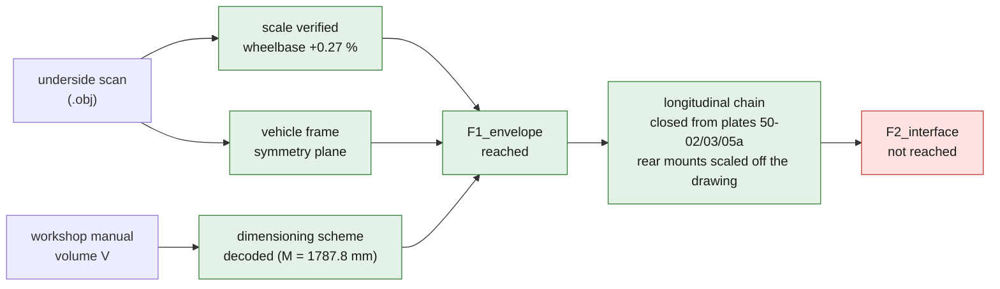
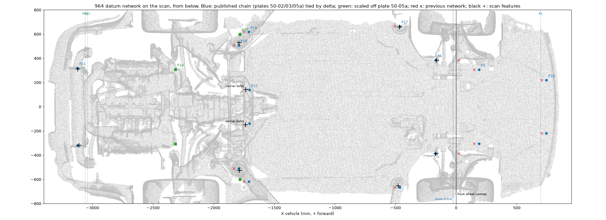
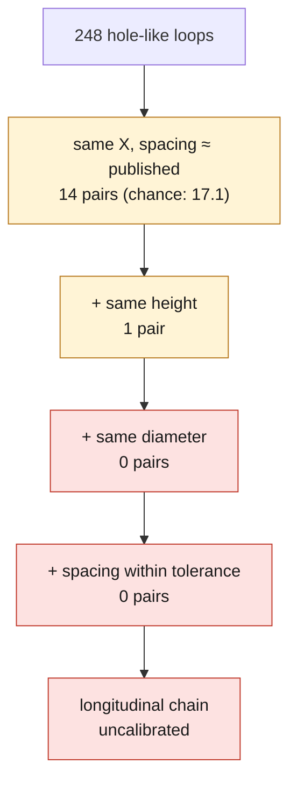

# Digital twin of the Porsche 911 (964) chassis

Level reached: **`F1_envelope`** (ADR 0003). An envelope at scale and a
documented frame. Neither `F2_interface` nor any releasable part geometry.

## Inputs

| Input | Nature | Role |
|---|---|---|
| `964widebodyunderside2poin13.obj` | underside scan, 2,400,031 vertices, 4,684,929 triangles, 210 MB | envelope and frame |
| 964 workshop manual, volume V "Body" | plates 50-02, 50-03, 50-05, 50-05a, 50-013 | control dimensions and material |

The scan is not committed to the repository: `raw-scans/` is ignored by git and
its provenance is not documented. Nor is the manual, following the precedent of
`SRC-PORSCHE-WORKSHOP-MANUAL-993`. Only the values are carried over.

## What is established

**The scale of the scan is verified.** The four tires were isolated as connected
components, then fitted with a robust circle in the YZ plane, which gives the
axle centers. The measured wheelbase is **2278.1 mm** against **2272 mm** from
the factory, i.e. **+0.27 %**. The mesh is therefore in millimeters at 1:1
scale.

This result was put to the test. The wheel components are covered over 360
degrees, not over a partial arc, and when the radius is forced to values from
560 to 680 mm in diameter, the derived wheelbase stays between **2270.4 and
2278.9 mm**. The scale check therefore does not depend on the tire radius
estimate, which is itself unstable from one tire to the next.

**The vehicle frame is established.** The symmetry plane was fitted on 250,000
underbody points by mirroring and nearest neighbor, with a loss trimmed at 85 %
to absorb the asymmetric coverage of the scan. It yields a **yaw of
-2.236 deg**, a **roll of -0.451 deg** and a center axis at **X_scan +112.0 mm**.

This result checks itself: the wheels do not enter the fit, yet after
correction their left/right offset drops from **66.7 to 12.7 mm** at the front
and from **51.1 to 5.3 mm** at the rear.

*The scan after symmetry correction, in the vehicle frame (X = 0 front axle,
Z = 0 ground). It shows the frame and the wide body; it does not locate any
datum point.*

**The manual's dimensioning scheme is decoded.** Dimensions A to I are
left-right spacings, K to S diagonals or longitudinals. Diagonal M can be
recomputed from three independent published dimensions:

    M = hypot(R, E/2 + F/2) = hypot(1245, 665 + 618) = 1787.8 mm

against **1788 +/- 3 mm** in the manual, i.e. a **0.2 mm deviation**. M therefore
links left point 17 to right point 18. This check is purely documentary and
does not depend on the scan.

## The frame is now machine-usable

The twin record described the scan -> vehicle transformation in prose only. It
now carries the corresponding **4x4 homogeneous matrix**, in
`coordinate_system.vehicle_transform`, composed by `source/vehicle_transform.py`
from `frame_params.npy`: lateral recentering, yaw cancellation, roll
cancellation, then axis permutation and move to the origin.

It is verified, not just reread. Its rotation part is orthonormal to within
2.5e-18 for a determinant of 1.000000000, and applied to **200,000 vertices drawn
at random from the scan** it reproduces `verts_vehicle.npy` to within
**1.3e-4 mm** at most. The check is not cosmetic: the chain combines a
translation, two rotations and an axis permutation, where a sign convention or a
composition order is easily wrong.

The original prose is kept in `vehicle_transform_note`.

## The longitudinal chain, closed from plate 50-05a

Read on 2026-10-08 from the local copy of volume V. Plate 50-05a, "Dimensions
for assembly - from Model 91 onward", dimensions its plan view from a
transverse **0 line drawn through the front strut mounts P4**:

| point | position | published |
|---|---|---|
| P1, front bumper absorber tube | 722 +/- 2 mm ahead of the 0 line | 50-05a |
| P3, front axle side-member mount | 215 mm ahead | 50-05a, no tolerance printed |
| P5, outer front cross-member mount | 143 +/- 2 mm behind | 50-05a |
| rear end, P16 | 3756.5 +/- 4 mm behind P1 | 50-05a |

Plate 50-02 also draws **dimension P as longitudinal**, a fore-aft arrow from
the P20 line to the P5 line. `datum_solve.py` read it as a crossed diagonal,
which put P5 230 mm too far forward.

With P longitudinal and the three stations, the chain reaches P17 twice,
independently (`source/datum_chain_50_05a.py`):

| path | P17 behind the 0 line |
|---|---|
| P5, then P (to P20), then diagonal K | 441.1 mm |
| P3, then diagonal L | 439.2 mm |

The two published paths agree within **1.9 mm**, against a 3.6 mm spread from
the tolerances. R and S then carry P18 and P19. Every point of the front and
centre network is placed from published dimensions only:

| point | role | d behind the 0 line | +/- 95 % |
|---|---|---:|---:|
| P20 | front control hole | -770.0 | 2.7 |
| P1 | front absorber plane | -722.0 | 1.9 |
| P3 | front side-member mount | -215.0 | 1.9 |
| P5 | front cross-member mount | 143.0 | 1.9 |
| P17 | front jacking point | 440.2 | 3.5 |
| P18 | rear jacking point | 1685.2 | 4.2 |
| P12 | transmission carrier take-up hole | 1678.5 | 8.6 |
| P19 | rear platform point | 1768.2 | 4.2 |
| P16 | rear absorber plane | 3034.5 | 4.7 |
| P21 | inner engine mount | 3098.2 | 7.4 |

P12 and P21 come from the rear diagonals; see "The rear of the chain" below.

**Tied to the scan.** `source/scan_tie_50_05a.py` measures features the scan
resolves: the P5 bosses, found at |Y| = 385.2 and 386.9 mm against 385
published; the P17 jacking receptacles; the P19 pads. Each gives the position
of the 0 line in the vehicle frame. Six features agree on **delta = -25.5 mm**,
spread 7.2 mm, +/- 7.6 mm with the wheel-centre fit. The 0 line lies behind
the front wheel centres, as a line through the strut tops does with the
4 deg 25 min caster of volume IV. The plates do not name the 0 line; this is
the reading the scan supports.

*Blue: the published chain placed with delta. Green: rear mounts scaled off
plate 50-05a. Red crosses: the previous network, anchored at P17 = -506 mm
with P5 read through a diagonal. Black crosses: features measured on the scan.
The P17 and P19 features sit 6 to 21 mm from the published |Y|: they are the
receptacle and pad structures, not the drilled holes, which the scan does not
resolve.*

## The rear of the chain

P12 and P21 hang on the crossed diagonals O (P18 to P21) and N (P12 to P21).
Plate 50-03 prints each twice: O = 1696 +/- 3 (1653 +/- 3), N = 1492 +/- 3
(1482 +/- 3), with the note "the dimensions in brackets are measured
vertically". Two readings are possible, and the evidence picks one:

| reading | P12 | P21 via O | P21 via N | verdict |
|---|---:|---:|---:|---|
| bracketed values as plan distances | 1637.1 | 3046.3 | 3083 | P12 38 mm off both drawings; O and N split by 37 mm |
| unbracketed values as direct distances | 1678.5 | 3098.2 | 3094 | within 3-6 mm of both drawings; O and N agree |

*Distances behind the 0 line, mm. "P21 via N" starts from P12 as drawn.*

**The drawings.** Plate 50-05a's plan view is to scale: fitted on the eight
markers whose positions are published, it gives 1:17.8 with a residual sd of
4.3 mm (`source/plate_50_05a_scale.py`). It draws P12 at 1675.9 mm; plate
50-02, scaled on R, at 1672.1 mm. Two Porsche drawings agree within 4 mm.

**The scan.** At P21's published spacing (|Y| 320), the scan shows a U-shaped
engine-mount cradle on each side, fitted at |Y| 312 and 316 mm. Its centre
lies 3091 mm behind the 0 line: 7 mm from the unbracketed P21, 45 mm from the
bracketed one. The bosses first taken for P12 are the removable transmission
carrier's own bolts, 30 mm behind the body take-up hole.

The chain therefore reads O and N unbracketed, as direct distances between
holes at slightly different heights; the unknown height differences (up to
150 mm) are carried in the uncertainty. Why the plate brackets these values
is not explained; the reading rests on the checks, not on the note.

**Rear mounts without a dimension**, scaled off plate 50-05a (+/- 8.6 mm):

| point | role | d behind the 0 line |
|---|---|---:|
| P13 | outer cross tube, rear axle | 1758.6 |
| P14 | rear spring-strut mount | 2290.0 |
| P15 | engine bearing mount | 3017.1 |

**What it changes for the monocoque.** Every suspension and power-unit mount
of the contract now has a longitudinal position: P3, P5, P12 and P21 from
published dimensions, P13, P14 and P15 from the scaled drawing. The governing
span P5 to P12 is **1535.6 mm**, both ends published. It read 1724.3 mm with P
taken as a diagonal and the bracketed N.

## What is not established

**Tolerance.** The drawing-scaled mounts carry +/- 8.6 mm and the tie to the
scan's wheel frame +/- 7.6 mm: enough to lay out a structure, not to cut a
tool, which needs +/- 1 mm. The twin stays at `F1_envelope`: `F2_interface`
also needs the fastener seats and mounting faces.

**The 0 line** is read as the strut-mount line drawn on the plates; no
published definition was found.

**The scan is a wide body.** Rear track measured around 1459 mm against 1374 mm
from the factory; front track 1388 mm against 1380 mm, so close to original. The
widened fenders and sills are not production 964 geometry. Only the floor pan
and the central structure serve as reference.

**The ground plane is the weakest datum.** Derived from the contact of the four
tires, it shows a scatter of 55 mm. Every Z dimension carries that uncertainty.

## What volume IV adds

Volume IV "Chassis" covers the running gear, not the body shell, but it carries
two dimensions that directly concern the twin's frame, because they are taken
**from the ground up to a body-shell point**:

| dimension | Carrera 2/4 | RS | definition |
|---|---|---|---|
| front height | **165 +/- 10 mm** | 125 +/- 5 | from the wheel-ground contact to the outer bolt "Crossmember to body" |
| rear height | **270 +/- 5 mm** | 235 +/- 5 | from the wheel-ground contact to the outer arm mount, body side |

The front point is **P5 of volume V**, "Mount - outer cross member FA", with a
transverse spacing of 770 +/- 2 mm. Volume IV therefore gives it a Z dimension
tied to the ground plane, where volume V only gave a spacing. It is the first
vertical datum dimension in the dossier.

It is not used yet. Doing so requires locating that mount on the mesh, and
knowing at what ride height the scanned vehicle sits: these values hold at DIN
70020 curb weight, suspension loaded, and the scan is a wide body, probably
modified. A measured deviation would indicate lowering, not a frame error.

Useful geometry otherwise: rear camber -40' +/- 10' and toe +10' per wheel. The
wheel plane is therefore not parallel to the vehicle YZ plane, which explains
part of the scatter of the circle fits on the tires.

## Material

Plate 50-013 names the six panels in **high-strength steel (HS)**: front wheel
housing, inner side rail, front floor cross member, seat base, rear axle cross
member, cross member with engine mount. Plate 50-014 adds that welding does not
cost strength, but that a heavily deformed panel is not straightened, it is
replaced.

Volume V **publishes neither grade nor thickness**. The model therefore carries
a working thickness of 1.0 mm declared `ASSUMED`, and the mass of 36.8 kg holds
only for the modeled solids: it is not a 964 body-shell mass.

## Reproduce

    source twins/964-chassis/source/env.sh
    pymesh source/symmetry.py      # fits the symmetry plane
    pymesh source/align.py         # moves into the vehicle frame
    pymesh source/wheels.py        # wheelbase and diameters
    pymesh source/datum_solve.py   # historical chain (P read as a diagonal)
    python3 source/datum_chain_50_05a.py   # published longitudinal chain
    python3 source/plate_50_05a_scale.py   # scaled drawing: P13-P15, rear check
    TWIN_SCAN=... TWIN_TRANSFORM=... pymesh source/scan_tie_50_05a.py   # ties it to the scan
    pymesh source/control.py       # significance control of the fit
    pycad  source/floor_assembly.py  # steel model -> STEP

## Searching for point 17 on the scan: negative result

Point 17 was searched for the way it should be: a jacking hole is a boundary
loop in the mesh. The 118,411 boundary edges of the scan give 1,521 loops, of
which 248 look like a hole (8 points or more, diameter 10 to 80 mm, circularity
below 0.25).

A pair of datums must satisfy four criteria at once: same longitudinal station,
same height, same diameter, and a spacing equal to the published dimension.
Successive filtering gives:

| cumulative criterion | pairs |
|---|---|
| same X within 25 mm, spacing within 4 mm of a published dimension | 14 |
| + same height, dZ < 20 mm | 1 |
| + same diameter, within 8 mm | 0 |
| + spacing within 1 mm, published tolerance | **0** |

The first 14 matches are worthless: random draws predict **17.1**. There are
therefore fewer matches than chance produces.

No pair with a spacing near 1330 mm holds: all are either at unrelated
longitudinal stations, up to 3478 mm apart, or at different heights. The least
bad, spacing 1324.7 mm at dX = -23 mm, misses the dimension by 5.3 mm against a
tolerance of +/- 1 mm, and sits ahead of the front axle, where the front jack
point cannot be.

The boundary loops of the scan are occlusion holes, not drilled holes. The scan
does not resolve the jacking holes, and the wide body probably hides the
original sills. **The longitudinal chain remains uncalibrated.**

## Next useful data

The longitudinal chain is closed from volume V (plates 50-02, 50-03, 50-05a,
read on 2026-10-08). What would tighten it:

- **A published dimension for P13, P14 and P15**, today scaled off the
  drawing at +/- 8.6 mm.
- **The meaning of the bracketed values** of plate 50-03, today chosen by the
  checks.
- **The 0 line's definition.**
- **Mounting faces and fastener seats**, for `F2_interface`.

`SRC-RENNLIST-993-BODY-DIMENSIONS-PDF` reports a table of points in
millimetres, not obtained. The full state of the leads is in
`docs/research/964-combler-le-gap-de-donnees.md`.

## Composite lead

A material study was run on the existing torsion test, without changing either
its geometry or its loading, to answer the question of a ZESAD-type carbon
monocoque. At equal torsional stiffness, monolithic quasi-isotropic carbon saves
only 18 % of areal mass and aramid loses 30 %: this box section works in
membrane shear, so the criterion is `G/rho` and not `E/rho`, and a sandwich core
changes nothing. The leverage of a monocoque is architectural, not material, and
cannot be demonstrated on a floor pan alone.

See `docs/research/964-chassis-carbone-kevlar.md`. This lead produces no
releasable geometry: a self-supporting structure carries occupant restraint and
stays `prohibited_pending_engineering`.

## What the body shell adds to the floor pan

The shell model was extended from the floor pan alone to a closed cell — wheel
arches, B-pillars, roof rails, roof, windshield frame. It was the only lead in
the dossier that depended on no external data: it only needs more `ASSUMED`
sections.

Two results come out of it, both relative and therefore usable despite the
assumed sections.

**The ranking of members does not follow their mass.** From the bare floor pan
to the closed cell, torsional stiffness is multiplied by 3.7 for a mass
multiplied by 2.3. But the roof, 10.5 kg, adds only +1%; the windshield frame,
1.1 kg, adds the largest increment of the whole ladder. The per-kilogram yield
ratio between the two is **two orders of magnitude**, and it holds at three mesh
densities while the absolute stiffness drifts by 11 %. What counts in the upper
body shell is not material, it is **closing the ring**: B-pillars and roof rails
added alone, with nothing to close at the front, bring exactly zero for 7.5 kg.

> [!WARNING]
> **Withdrawn for quadratic shells.** The windshield-frame ranking above was
> computed with linear S3 elements. In quadratic S6 shells the best return per
> kilogram is the **center tunnel** — see [fea/README.md](fea/README.md) and the
> withdrawn-claims table of the [README](../../README.md#what-the-repository-withdrew-from-its-own-results).

**A cross member of the model carried nothing.** A connectivity check added to
the builder showed that the rear cross member, placed at x = -1703 by the datum
chain, fell behind the edge of the modeled floor pan: it counted for 5.7 % of
the mass and for nothing in stiffness. The stiffness values already published
were right — removing this cross member gives back exactly the published
2442 N.m/deg — but the masses, hence the specific stiffnesses, were understated.
Details and consequences in `fea/README.md`.

None of these figures is a 964 stiffness, and the fact that the model ignores
bonded glazing, doors and panel openings works precisely in the direction that
flatters the closed ring.
