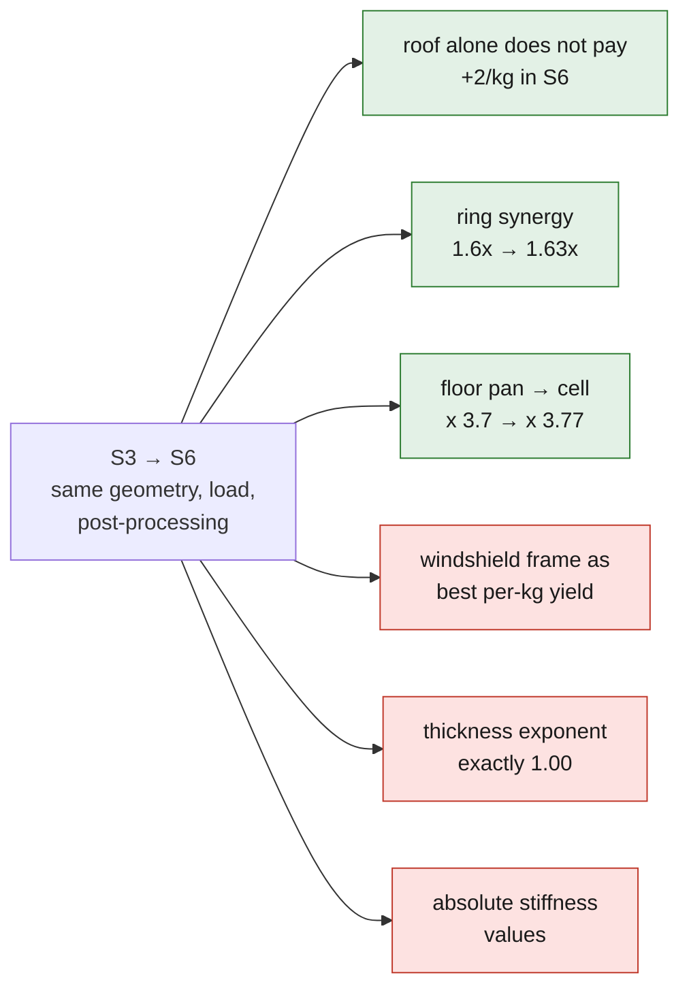

# Numerical strength test — 964 floor pan in torsion

Chain: gmsh 4.15.2 (shell mesh) -> CalculiX 2.21 (S3 elements).
Steel E = 210,000 MPa, nu = 0.3. Units mm, N, MPa.

Load case: rear clamped, torque of 1290 N.m applied at the front side-rail tips
(1000 N upward on the left, 1000 N downward on the right, lever arm 1290 mm).

*What the computation contains, from the bare floor pan to the full cell, in
linear S3 shells. It is not a 964, and neither stiffness is a 964 stiffness.*

## Sheet thickness

Data supplied by the project owner: **0.8 mm announced by Porsche, 1.0 mm
measured**. Both values are kept, not averaged.

| thickness | rotation | torsional stiffness | vM max |
|---|---|---|---|
| 0.8 mm (announced) | 0.5283 deg | **2442 N.m/deg** | 86.1 MPa |
| 1.0 mm (measured)  | 0.4222 deg | **3056 N.m/deg** | 68.8 MPa |

Stiffness ratio 1.251 for a thickness ratio of 1.250. **Stiffness follows
thickness linearly, not cubically.** The structure works in membrane shear, like
a closed box section, and not in plate bending. The gap between 0.8 and 1.0 is
therefore worth 25 % of stiffness and 25 % of stress: it is not a modeling
detail.

The 0.2 mm gap needs an explanation before it is used. The 964 body shell is
hot-dip galvanized; zinc, primer, paint and cavity wax add to the sheet. A
caliper measurement on a panel in place measures the stack, not the steel.
**For the computation, it is the steel thickness that carries load**, so 0.8 mm
until the measurement is redone on stripped sheet or with an ultrasonic gauge.
Taking 1.0 mm would overestimate stiffness by 25 %.

## Where it works

Values recomputed after removing the inert cross member described below. A node
is classified by its position: side rail if |y| >= 600, cross member if it is
under the floor pan or within the footprint of a cross member, floor pan
otherwise.

| zone | mean stress | p95 | max |
|---|---|---|---|
| side rail (closed box section) | 25.5 MPa | 62.3 | 86.1 |
| cross member | 19.6 MPa | 30.0 | 45.7 |
| floor pan | 10.6 MPa | 26.5 | 34.1 |

**The side rail carries the torsion.** The 1 % most loaded nodes are 100 % in
the side rail, and remain so after excluding 300 mm ahead of the clamp: the
result is not a boundary-condition artifact. About 22 % of the raw peak was one,
though — 86.1 MPa drops to 66.8 MPa once the clamp zone is set aside. The side
rail/floor pan ratio is 2.41.

This result converges with the manual: plate 50-013 designates the *inner side
member* as a high-strength steel panel. Porsche put HS steel where the
computation places the load path.

*The load path on the bare floor pan, 0.8 mm steel. It shows where the stress
goes; the absolute stress values are not robust (see below).*

*An earlier stress plot, kept as evidence. The unloaded group of nodes at
x ≈ -1703 is the rear cross member that was later found to carry nothing (see
"A cross member that carried nothing"); the plot predates its removal.*

## What these figures are not

**2442 N.m/deg is not the stiffness of a 964.** This model contains only the
floor pan, two side rails and two cross members: no front bulkhead, no rear
bulkhead, no tunnel, no wheel arches, no roof, no B-pillars, no windshield frame,
which carry most of the torsion of a complete body shell. The following sections
add them one by one — and show that together they are worth a factor of 3.7 —
but none of these variants is a 964 stiffness either.

In addition, the side-rail section 90 x 120 mm and the cross-member section
80 x 70 mm remain `ASSUMED`: volume V does not publish them. The longitudinal
position of the cross members depends on the datum chain, itself uncalibrated
(see the twin's README).

Robust, because they do not depend on these unknowns:
- the linear scaling law in thickness, which is a mechanics result;
- the fact that the side rail, not the floor pan, carries the torsion;
- the ranking of body-shell members by their torsion contribution, verified at
  three mesh densities.

Not robust: all absolute values of stiffness and stress. The model is not
mesh-converged either — stiffness still drops by 4 % at the last refinement
tried, S3 elements converging from above.

## Replay

    source ../source/env.sh
    pycad build_shell.py 0.8 1.0 && pycad run_fea.py 0.8 t08
    pycad build_shell.py 1.0 1.0 && pycad run_fea.py 1.0 t10

## Shear or bending? The answer was wrong

This README claimed, and the composite study with it, that "the structure works
in membrane shear, like a closed box section". **That is false for the model on
which the claim was made.**

It rested on two observations, neither of which demonstrates it. Stiffness
follows thickness linearly: that rules out **plate** bending, but not the bending
of a **thin-walled beam**, whose second moment of area also varies linearly with
thickness. And the iso-stiffness prediction for a material change landed at
6.9 %: but all the materials compared were isotropic, where `G` is proportional
to `E`, so that this control cannot, by construction, tell one from the other.

`dominance_study.py` settles it by varying `E` and `G` **separately**, with a
fictitious orthotropic material in which the two are decoupled. Non-physical,
and on purpose: it is a measuring instrument, not a material.

| architecture | double E | double G | actual mechanism |
|---|---|---|---|
| floor pan, side rails, cross members | **+93.8 %** | +2.1 % | bending, nearly pure |
| closed cell | +37.7 % | **+56.9 %** | shear-dominated, but mixed |

In torsion, the two side rails of the bare floor pan bend in opposite
directions: they are two cantilevers. Shear only appears once the rings are
closed, and it never becomes exclusive.

This is the discovery of the rings seen from the other end: **closing a ring does
not just add stiffness, it changes the mechanism that carries it.**

What remains true: the linear scaling law in thickness, the fact that the side
rail carries the load, and all the ratios measured between architectures. What
falls: the `G/rho` interpretation as the material criterion for the floor pan.
For the floor pan alone the criterion is `E/rho`. The ranking carbon > aramid is
not affected, carbon dominating on both.

    pycad dominance_study.py f
    pycad dominance_study.py fbtaprw

*The mechanism changes along the architecture ladder, from near-pure bending on
the floor pan toward shear on the closed cell. It shows a sensitivity, not a 964
stiffness.*

## Real laminates: multilayer composite shells

`run_fea_laminate.py` solves a real stack — `*SHELL SECTION, COMPOSITE`, one ply
per layer, one `*ORIENTATION` per angle and per panel family.

Three CalculiX constraints had to be lifted, and they are not in the usual
documentation:

- `COMPOSITE` accepts **only S6 or S8R quadratic shells**. Hence the optional
  mesh order of `build_body.py`;
- the 4th field of a layer is an **orientation name**, not an angle. A 45-degree
  ply is materialized by an `*ORIENTATION` rotated 45 degrees about the panel
  normal;
- `OUTPUT=2D` is ignored: the `.frd` carries the expanded 3D model and not the
  original nodes. The measurement nodes are therefore taken back **by their
  geometry**, which depends on no numbering correspondence.

The chain is validated on an analytical case before being used: uniaxial tension
on a unidirectional ply, which must return E1 at 0 degrees and E2 at 90.

| angle | computed E_x | expected E_x |
|---|---|---|
| 0 | 130,516 | 135,000 |
| 90 | 9,909 | 10,000 |
| 45 | 13,080 | 13,200 |

Result, eight plies of 0.4 mm, same mass, same boundary conditions:

| stack | floor pan alone | closed cell |
|---|---|---|
| quasi-isotropic | 1586 | 6311 |
| +/-45 | 696 (0.44x) | **6849 (1.09x)** |
| 0/90 | **1910 (1.20x)** | 4043 (0.64x) |

**The ranking reverses with the architecture**, exactly as the `E`/`G`
sensitivity predicts. There is therefore no universally good stack for this body
shell, and quasi-isotropic is a defensible compromise, not the wrong setting. A
first analysis announced x 1.75 for +/-45: that was an analytical prediction
valid for pure shear, wrongly carried over to a structure that does not work
that way.

    pycad build_body.py 0.8 fbtaprw 1.0 2 && pycad run_fea_laminate.py PM45 cell_PM45

## Composite variant

`run_fea.py` now accepts two optional arguments, `E` and `nu`, which default to
those of steel: the two-argument calls above are unchanged. `laminate.py`
computes the quasi-isotropic properties of a carbon, aramid or hybrid laminate
from the ply constants, and `composite_study.py` replays the torsion test at
equal stiffness for each.

Short result: at iso-stiffness, monolithic carbon saves only **18 %** of areal
mass and aramid **loses 30 %**, because this box section works in membrane shear
and the criterion is `G/rho`, not `E/rho`. The full analysis and its caveats are
in `docs/research/964-chassis-carbone-kevlar.md`.

    pycad build_shell.py 0.8 1.0 && pycad composite_study.py

## Architecture versus material

`build_body.py` extends the shell model to the members that **close** the box —
front bulkhead, rear bulkhead, center tunnel — and `architecture_study.py`
replays the test on three architectures and two materials at equal mass. Case
`f`, floor pan alone, gives back the mesh and the value of `build_shell.py`.

At equal mass, closing the body shell is worth **x 1.51** in specific stiffness,
moving to carbon **x 1.25**, and the two multiply (1.86 measured for 1.89
expected): the levers are separable and do not substitute for each other. The
center tunnel alone adds +71 %, more than the two bulkheads. Sections and
bulkhead heights are `ASSUMED`; only the ratios are usable.

    pycad architecture_study.py

## A cross member that carried nothing

A connectivity check added to `build_body.py` showed that the model had **two
components**, not one. The rear cross member of the datum network, `trans` at
x = -1703, falls behind the rear edge of the modeled floor pan, x = -1500: it
was attached to nothing. It therefore always counted in area and in mass —
0.264 m2 and 1.66 kg, i.e. **5.7 % of the model's mass** — without carrying the
slightest load.

The check is clean: at original geometry, removing this cross member gives
**exactly 2442 N.m/deg**, the published value to the digit. The stiffnesses
already published were therefore right; it is the **masses, and hence all the
specific stiffnesses K/m**, that were understated accordingly.

It was not attached but **removed**, because it sits behind the clamped section
of the test: even connected, it could carry nothing. The consequence on the
published figures is limited to the architecture study, whose ratios go from
x 1.61 to **x 1.51** for closing the box and from x 1.98 to **x 1.86** for the
two levers. The conclusion does not move.

The CAD model `source/floor_assembly.py` is not affected: it produces an
assembly of distinct solids, where a cross member placed on an uncalibrated
datum point is a documented state, not a defect.

Two guard rails are in place so that this does not happen again silently:
`build_body.py` fails if the mesh is not connected, and `run_fea.py` reads the
model bounds **from the mesh** instead of copying them from the build script,
where they could diverge.

## A third guard rail, on working files

`run_fea.py` now deletes the tag's outputs — `.frd`, `.dat`, `.sta`, `.cvg`,
`.12d` — **before** calling the solver. This is not housekeeping.

Two wrong results were produced during this campaign by working files left in
place: a post-processing step returned the previous run's solution after a
solver failure, and a `.12d` working file from an earlier mesh gave
2445 N.m/deg and 70.0 MPa instead of 2442 and 69.6 on an identical mesh. The
deviations are small, which is precisely the problem: they do not show. A more
visible case was also met, a stress p99 of 265.8 MPa instead of 69.6.

None of these three incidents left a trace in an error output.

The post-processing itself was made to **fail closed** for the same reason: it
averaged the displacements over only the nodes it found in the `.frd`, silently
ignoring the missing ones. It now checks that the result file covers the whole
mesh and that all the loaded nodes are in it, and stops otherwise.

**What reproducibility is worth after these corrections.** Five consecutive runs
of `body_study.py` return values identical to the digit, and `ring_study.py` is
likewise stable. An isolated variation of 0.9 % was nevertheless observed on one
case after correction, not reproduced since. A resolution floor of about **one
percent** is therefore retained: an increment smaller than that is not a
measurement. That is exactly the case of the B-pillar row below, and it concerns
no other row of the table.

## From the floor pan to the closed cell

`body_study.py` extends the architecture ladder up to a complete cell. It is the
only lead in the dossier that depends on no external data: it only needs more
`ASSUMED` sections.

Steel 0.8 mm, same torsion test, same loading. The torque is now applied and the
rotation measured on the **side-rail section alone**: without this bound, the
set of loaded nodes grew with the architecture and two cases were no longer
compared under the same loading.

| architecture | mass | K (N.m/deg) | K/m | dK | dK per added kg |
|---|---|---|---|---|---|
| floor pan, side rails, cross members | 27.7 kg | 2442 | 88 | — | — |
| + front bulkhead and rear bulkhead | 35.2 kg | 3147 | 89 | +705 | +94 |
| + center tunnel | 40.2 kg | 5371 | 134 | +2224 | +444 |
| + wheel arches | 45.0 kg | 6866 | 153 | +1495 | +315 |
| + B-pillars and roof rails | 52.4 kg | 6859 | 131 | **0** (-7) | **0** |
| + roof | 63.0 kg | 6925 | 110 | +66 | +6 |
| + windshield frame | 64.1 kg | 9093 | 142 | +2167 | **+1961** |

From the bare floor pan to the closed cell: **K x 3.7 for mass x 2.3**.

    pycad body_study.py

*The closed cell of the last row, rendered from a mesh and result snapshot. It
shows the modeled geometry and its stress field; it is not a 964 and its values
are not a 964 stiffness.*

## What this ranking says, and what it does not say

Two rows stand out and do not read like the others.

**The B-pillars and roof rails bring nothing** — the raw increment is
-7 N.m/deg at this density, +3 and +11 at the other two. A negative increment
being mechanically impossible, these three values only say that the
contribution is **zero at the resolution of the computation**, which is of the
order of one percent, about 70 N.m/deg here. It is not a model defect: alone,
these members form a frame **open at the front**, a cantilever clamped on the
rear bulkhead. They add 7.5 kg and no closed load path.

**The windshield frame brings the largest increment of the ladder for 1.1 kg**,
the best per-kilogram yield of the whole dossier. It is also the only member that
closes a ring: front bulkhead, A-pillars, upper cross member, roof rails,
B-pillars, rear pillar.

That sentence is false, and the section "Element order" below says why: in
quadratic shells, the best per-kilogram yield is that of the center tunnel, not
that of the windshield frame. What remains true in the paragraph is the rest:
the ring closes, and the roof alone does not pay.

This reading is a topological hypothesis, so it can be refuted. `ring_study.py`
adds the roof and the windshield frame **separately** to the same open cage, at
three mesh densities:

| density | cage | + roof | + windshield | roof /kg | windshield /kg | ratio |
|---|---|---|---|---|---|---|
| 1.0 | 6859 | 6925 | 8180 | +6 | +1195 | 191x |
| 0.7 | 6333 | 6382 | 7220 | +5 | +803 | 172x |
| 0.5 | 6086 | 6123 | 6823 | +3 | +667 | 191x |

The ratio stays at **two orders of magnitude** at all three densities, while the
absolute stiffness drifts by 11 %: it is a topology result, not a discretization
one. And the two members together return **1.6 times** the sum of their separate
contributions — the roof only works once the ring is closed.

    pycad ring_study.py

**What it is not.** None of these figures is a 964 stiffness, and 9093 N.m/deg
even less than the others: the pillar, roof-rail and B-pillar sections are all
`ASSUMED`, the roof height too, and the model has no bonded glazing, no doors,
no openings in the panels — and it is precisely a glazed opening that makes a
real body-shell ring less closed than this one. The model is not mesh-converged
either: the absolute stiffness still drops by 4 % at the last refinement. What is
usable is the **ranking** and the ratios, not the values.

## Element order changes the conclusions, not just the values

Everything above is computed in **linear S3** triangles. The composite
laminates, however, were computed in **quadratic S6**, because CalculiX requires
it for `*SHELL SECTION, COMPOSITE`. The two halves of the dossier were therefore
not comparable, and nobody had checked.

`run_fea.py` now reads the order from the mesh and writes S6 elements when the
mesh is quadratic. The same geometry, the same loading and the same
post-processing can at last be run in both orders.

| architecture | mass | S3 | S6 | deviation |
|---|---|---|---|---|
| floor pan, side rails, cross members | 27.7 kg | 2442 | **1436** | -41 % |
| + front bulkhead and rear bulkhead | 35.2 kg | 3147 | 1550 | -51 % |
| + center tunnel | 40.2 kg | 5371 | 3857 | -28 % |
| + wheel arches | 45.0 kg | 6866 | 5227 | -24 % |
| + B-pillars and roof rails | 52.4 kg | 6859 | 5240 | -24 % |
| + roof | 63.0 kg | 6925 | 5264 | -24 % |
| + windshield frame | 64.1 kg | 9093 | 5415 | -40 % |

S3 elements are too stiff, and **unevenly so**. Where bending dominates — the
bare floor pan — they overestimate by 70 %. Where shear dominates, the gap
narrows. It is not a mesh-density defect: refining in S3 brings K down from 2442
to 1750 without converging, whereas S6 returns 1436 from the coarsest density.
**It is the element order, not the mesh size.**

*The architecture ladder in both element orders. It shows that linear triangles
overestimate stiffness, and unevenly; neither series is a 964 stiffness.*

A caveat on the comparison itself. `dominance_study.py` writes its own input deck
and post-processes the model **expanded in 3D** by CalculiX, whereas
`run_fea.py` requests `OUTPUT=2D` and measures on the mid-surface. The two
therefore do not take quite the same nodes: on the closed cell in S6,
5733 N.m/deg on one side and 5415 on the other, i.e. 5.5 %. The **ratios** are
not affected, each study comparing its own cases with each other, and this is
verifiable: `run_fea.py` in S6 returns +93.5 % and +2.3 % where
`dominance_study.py` returns +93.8 % and +2.1 %. The S6 values in the table above
are all taken with `run_fea.py`, hence on the same basis as the S3 values.

### What this destroys

`dominance_study.py` was already in S6, and that is what made the problem
visible: on the bare floor pan it measures +2.1 % when doubling G, where the same
model in S3 measures +36.6 %. Checked with `run_fea.py`, which does return
+2.3 % in S6 and +93.5 % when doubling E. **S3 elements attribute to shear a
share of stiffness that belongs to bending**, precisely on the open
architectures.

What falls, then, in addition to the sentence corrected above: the
**per-kilogram yield of the windshield frame**. In S6, the cumulative ladder
gives +151 N.m/deg for 1.11 kg, i.e. +136 per kg, against +2307 for 5.01 kg at
the center tunnel, i.e. **+460 per kg**. The best per-kilogram yield of the
dossier is that of the tunnel, in both orders as far as the absolute is
concerned, and in S6 also per kilogram.

### An exactness that belonged to the element

The dossier has held from the start that "stiffness follows thickness linearly,
not cubically", and the figure was clean: ratio 1.251 for a thickness ratio of
1.250. In S6, the same measurement over five thicknesses from 0.6 to 2.0 mm
gives an exponent of **1.10**, on the bare floor pan as on the closed cell.

| thickness | bare floor pan S3 | bare floor pan S6 | cell S3 | cell S6 |
|---|---|---|---|---|
| 0.6 mm | 1830 | 1049 | 6813 | 3969 |
| 0.8 mm | 2442 | 1436 | 9093 | 5415 |
| 1.0 mm | 3056 | 1829 | 11378 | 6904 |
| 1.5 mm | 4596 | 2846 | 16831 | 10822 |
| 2.0 mm | 6151 | 3915 | 22923 | 14987 |
| **exponent** | **1.01** | **1.10** | **1.01** | **1.11** |

The mechanical conclusion does not move: 1.10 is very far from 3, the structure
does not work in plate bending. What falls is the **exactness** — linear elements
returned an exponent of 1.00 because they represent panel bending poorly, not
because the structure would be exactly linear. The t^3 term exists, it is simply
small.

Practical consequence on the only measurement in the dossier that comes from the
owner: the gap between 0.8 mm announced and 1.0 mm measured is worth **27 %** of
stiffness in S6, not 25 %.

### What this leaves standing

The three topology conclusions hold, and one of them to the digit.

| result | S3 | S6 |
|---|---|---|
| roof alone added to the open cage | +66 (+6/kg) | +24 (**+2/kg**) |
| windshield frame alone added to the same cage | +1321 (+1190/kg) | +83 (**+75/kg**) |
| ratio of per-kilogram yields | 191x | **33x** |
| both together / sum of the two alone | 1.6x | **1.63x** |

The roof alone does not pay, the windshield frame pays much more, and the two
together are worth more than their sum because the roof only works once the ring
is closed. The synergy of 1.6 is found again to the third decimal in an element
order where everything else moved by 25 to 50 %: it is indeed a topology result.

The overall ratio from bare floor pan to closed cell also holds: x 3.7 in S3,
**x 3.77 in S6**.

*Green: topology results that survive the change of element order. Red: what
does not.*

### What to retain for what follows

No absolute value in the dossier was usable, and that was already written. What
is new is that a **ranking** — that of per-kilogram yields — was not usable
either. The ratios that survive the change of order are those about topology;
those about the bending / shear split do not survive.

    pycad build_body.py 0.8 f 1.0 2 && pycad run_fea.py 0.8 s6

## A fourth guard rail, and a solver fallback

Two defects found while auditing the design-of-experiments corpus, both of the
same kind as the previous ones: they produced a result instead of an error.

**SPOOLES fails on certain geometries, and its message did not come out.**
Eleven cases of the corpus were lost "without a message", which had been read as
the signature of a near-singular system. It is the signature of something else:
the direct solver dies in its graph partitioning with `fatal error in
GPart_makeYCmap / bad input`, a message it writes to `stderr` — which
`run_fea.py` did not display. It is deterministic, insensitive to the number of
threads, and the CalculiX iterative solver passes on these same cases.
`run_fea.py` therefore switches to it as a fallback, never using it by default.
Controls: the reference case still returns 2442 N.m/deg, and where SPOOLES
succeeds the two solvers agree to within 0.04 %.

**Two campaigns launched in parallel shared `mesh.npz`.** They would have
contaminated each other silently, and one measurement of this session actually
was, before the reason was understood: a case replay was reading the mesh of
another campaign in progress. `build_body.py` and `run_fea.py` now accept a
working directory through the `FEA_WORK` variable, and `doe_corpus.py` creates
one per campaign. Without an override, nothing changes.

**The solver is sometimes wrong, and wrong silently.** Out of 65 corpus cases
replayed identically, 63 return the stored figure to the decimal and two do not:
one by 2.4 %, the other by a factor of 9. The stored displacement field is
perfectly consistent with the stored stiffness in both cases, because both come
from the same failed solve: **no internal check can see them**. Only repetition
finds them. `corpus_repair.py` replays the corpus case by case and replaces a
value only if two independent computations agree against it.

**Where these errors are says more than how many there are.** The S6 corpus was
replayed in full: 2,992 cases confirmed to the digit, **8 replaced**, none
ambiguous. All eight are in the **first 360 cases** — those computed while other
tests were running on the same machine. The 2,640 following cases, computed by a
campaign that had the machine to itself, are all confirmed.

The correlation is not a demonstration; it rests on a single episode. But the
practical conclusion needs no more: **a campaign does not share the machine**,
and a campaign that did is verified by replay before being used. It is the third
time in this dossier that a wrong computation comes from a shared resource —
after the working files left in place and the `mesh.npz` common to two
campaigns.
