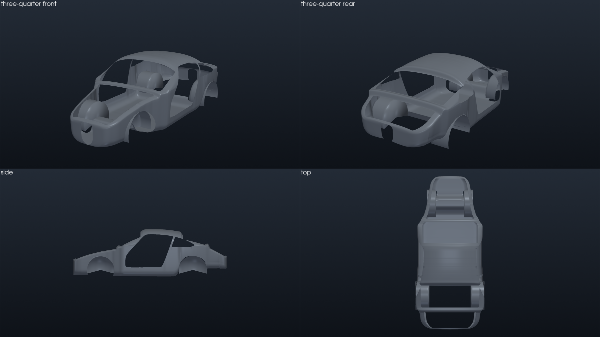
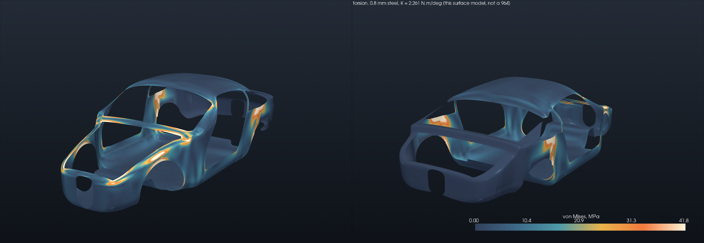
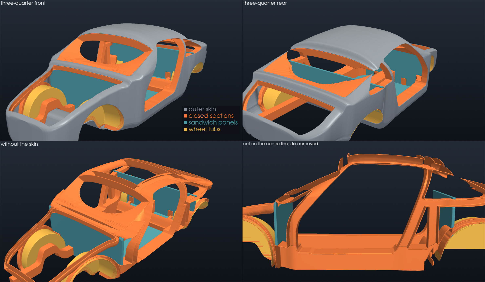
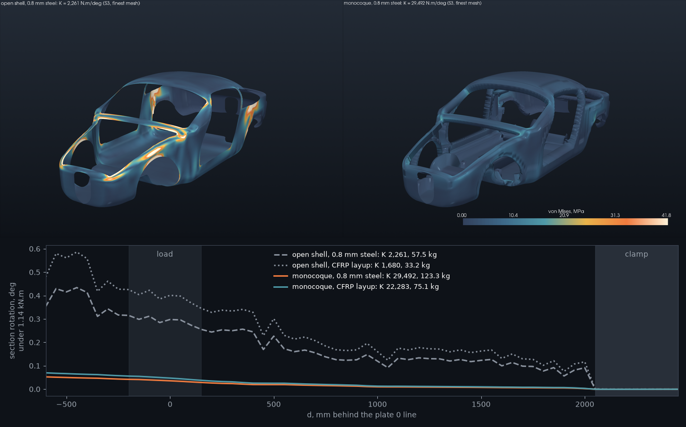

# 964 monocoque shell, from plate 50-05a

A 911-shaped body shell for the
[carbon monocoque programme](../../../docs/MONOCOQUE_964_993_PROGRAMME.md).
Until now the programme's only whole-body model was the box cell of
[`../fea/`](../fea/): good at relative questions, nothing like a 911. This
shell takes its outline from Porsche's own drawing.

*Four views of `derived/monocoque-shell.ply`. Outline from the workshop
manual; sections, thickness and openings modelled. Not a part, not a ZESAD
geometry, nothing to manufacture.*

## Where the shape comes from

Plate 50-05a of volume V ("Dimensions for assembly - from Model 91 onward")
draws the body-in-white from the side and from above, to scale, with the front
wings, doors and lids off: the outline of a monocoque. Both views were
calibrated on the markers whose fore-aft positions are published
([datum chain](../README.md#the-longitudinal-chain-closed-from-plate-50-05a)),
1.1253 and 1.1287 mm per pixel at 400 dpi, and traced
(`source/trace_plate_50_05a.py`):

| traced | used for |
|---|---|
| side view, upper profile | front lid, windscreen, roof, rear deck |
| side view, lower profile | front apron, floor, rear structure |
| plan view, half width | body width along the car |
| door aperture, quarter window, rear wheel house | openings |

The plate is not in the repository. Its trace, one point every 13.5 mm, is
`data/profiles-50-05a.json`; heights are anchored on the published 964 height
of 1310 mm.

## What is modelled, not traced

`source/build_shell.py` builds one closed section every 11 mm and stitches
them:

- a rounded lower body with a barrel side, more swollen over the rear
  quarters, up to an **880 mm beltline** (the quarter-window bottom on the
  plate);
- above it a superellipse greenhouse to the roof, which gives the 911
  tumblehome; where the profile drops under the belt, a crowned lid;
- openings cut along continuous fields, so their edges stay smooth: doors and
  quarter windows from the plate, windscreen and rear window between the
  pillars, front-lid and engine-lid openings, open engine bay underside, both
  wheel arches;
- a front bulkhead under the scuttle, a rear bulkhead behind the seats, four
  cylindrical wheel houses.

Section shapes, beltline, glass and lid extents, wheel-house radii and
bulkhead heights are **modelling hypotheses**. No sheet thickness,
reinforcement or sill box section is drawn.

## A first whole-body calculation

`source/torsion.py` runs the box model's torsion load case on the structural
shell (shell and bulkheads, without the wheel houses, which are not connected
node to node): rear suspension area clamped, ±1000 N at the front wheel-house
tops, linear S3 shells, uniform 0.8 mm steel.

**K = 2,261 N·m/deg.** It is the stiffness of this surface model under this
load, not of a 964 body shell: the door and window apertures are open, there
is no glass, no boxed sill, no wheel house in the load path, and the mesh is
not converged. What holds is where the load goes: around the windscreen
frame, into the A-pillars and the corners of the door apertures, and across
the C-pillars, with the floor and the roof lightly loaded. The hot spots
around the front wheel-house tops are local: that is where the load is applied. That is the open
shell a monocoque has to close.

## The monocoque inside it, in PicoGK

[`picogk/`](picogk/README.md) builds a ZESAD-type carbon monocoque in voxels
inside this shell, with the pinned PicoGK kernel. It has an outer skin, a
closed section around every aperture, boxed sills, a tunnel and rails,
sandwich floor and bulkheads, and wheel tubs. That closes the rings this open
shell leaves open. It is a design envelope, not a part.

## Torsion of the monocoque architecture

`source/torsion_monocoque.py` puts the PicoGK members on the open shell's
own mesh, as shells, and reruns its load case. The two answers therefore
differ by the architecture alone. Each closed section is built from three
parts:

- **outer wall:** a band of skin;
- **inner wall:** a copy of the band, offset inward by the section depth;
- **sides:** a wall along every free edge of the band, including a flange
  on the aperture edge.

Sizes come from the PicoGK report. There are four cases, solved at three
shell densities (210, 300 and 420 sections):

| case | mass | K, 210 / 300 / 420 sections |
|---|---|---|
| open shell, 0.8 mm steel | 57 kg | 5,425 / 3,468 / 2,261 N·m/deg |
| open shell, CFRP | 33 kg | 4,075 / 2,535 / 1,680 |
| **monocoque, 0.8 mm steel** | 123 kg | **33,246 / 31,501 / 29,492** |
| **monocoque, CFRP** | 75 kg | **23,192 / 24,564 / 22,283** |

*Top: von Mises stress on one colour scale, same steel, same load. Bottom:
rotation of each cross-section along the car under the 1.14 kN·m torque.*

What holds, and what does not:

- **The monocoque's K is stable.** It drops about 6% at each refinement
  (S3 converges from above). The open shell's K is not stable: it keeps
  falling, and is 966 N·m/deg with every triangle split in four. With its
  apertures open, it is close to a mechanism. **The ratio between the two
  (×5.7 to ×13 depending on the mesh and material) is therefore not a result.** What
  remains is that the closed architecture is more than five times stiffer
  than the open shell (×5.7 at worst), at any density tried.
- **The load path changes.** On the open shell, the stress collects at the
  windscreen frame, the A-pillars and the door corners. On the monocoque it
  spreads at a low level, and the twist builds up evenly from the clamp to
  the front instead of in steps at each aperture.
- **Carbon versus steel**, same architecture: 0.70 to 0.78 of the stiffness
  for 0.61 of the mass. That is ×1.15 to ×1.28 in specific stiffness, the
  ×1.25 found earlier on the box cell
  ([`../fea/`](../fea/README.md)). The architecture remains the lever, not
  the material.

Limits that come on top of the shell's own:

- Doors, glass, joints and inserts are absent, and every member size is
  assumed. K is a value of this model, not of a car.
- The offset folds at the tightest curvatures. There the depth is cut back
  locally: 709 of 15,493 section vertices, to 0.63 of nominal on average.
- The sills are 140 mm deep, not 210. The rear rails and wheel tubs are
  left out.
- The sandwich panels count by their faces only, which is on the soft side.
- Two other convergence checks were tried and rejected: S6 elements (the
  slivers of the aperture clip collapse the open shell to 63 N·m/deg), and
  splitting every triangle of the monocoque in four (more than 12 GB for
  the direct solver).

## Reproduce

In the `cadsim` image, with shapely from the print-simulation library folder:

    python3 source/trace_plate_50_05a.py page9-009.png   # only with the local plate
    python3 source/build_shell.py      # derived/monocoque-shell.ply and -structural.npz
    python3 source/torsion.py          # derived/torsion-snapshot.npz
    python3 source/torsion_monocoque.py   # derived/torsion-monocoque.json, after ../picogk/
    python3 source/figures.py          # evidence/*.png
    python3 ../fea/hero.py             # the home-page banner

## Limits

- The outline is Porsche's to the plate's drawing accuracy (about ±4 mm on
  the calibration markers); everything between outlines is modelled.
- The plate shows a 964 from model year 1991; the 993 shares the floor and
  the datum points, not the outer panels.
- No thickness, material or layup is proposed here. The shell carries the
  programme's `prohibited_pending_engineering` status: it is a design
  envelope, not a part.
