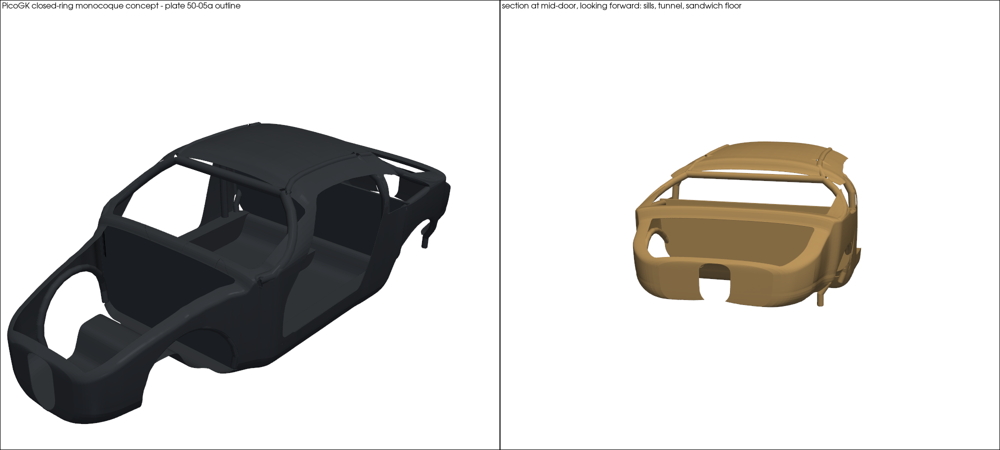
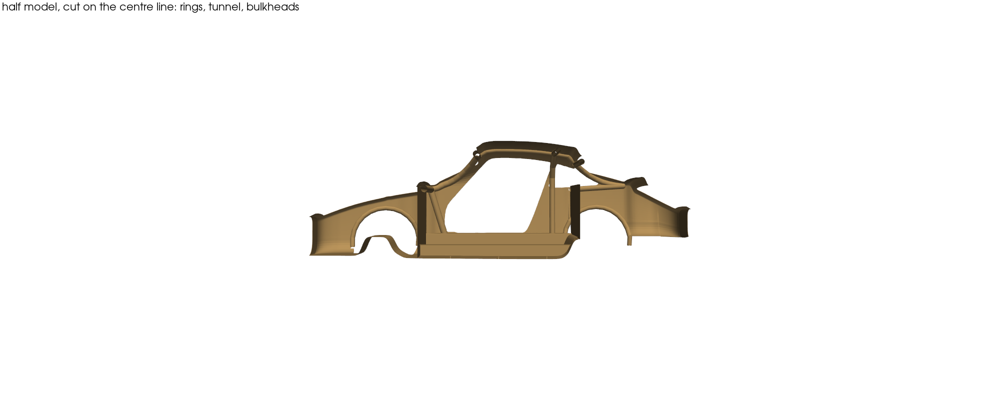

# 964/993 carbon monocoque — PicoGK closed-ring concept (F0)

> [!CAUTION]
> **Study geometry, not a part.** The monocoque is
> `prohibited_pending_engineering` ([SAFETY.md](../../../../SAFETY.md)); the
> [roadmap](../../../../ROADMAP.md#composite-monocoque-study-only) opens it as a
> study only. Nothing here is a ZESAD geometry, a layup, a mould or anything to
> manufacture. Sections, wall thicknesses and member positions are
> assumptions; crashworthiness is not addressed.

A first whole-body **structural concept** of a carbon monocoque on the 964
outline traced from plate 50-05a, built with the PicoGK voxel kernel. It
applies the programme's own conclusion
([architecture](../../../../docs/MONOCOQUE_964_993_ARCHITECTURE.md)): *a
monocoque is not a carbon body shell, it is a body shell whose rings are
closed by construction*. The elements follow the order of return measured by
`../../fea/ring_study.py` and `body_study.py`.

## What is modelled

| element | how | basis |
|---|---|---|
| outer skin | the plate 50-05a shell **with its openings** (`../derived/monocoque-shell-structural.npz`), thickened with `Voxels.voxMeshShell` | outline from Porsche's drawing; surfaces between outlines from `build_shell.py` |
| windscreen frame + A-pillars (front ring) | hollow tubes along the windscreen edge, closed by cowl and header cross members | ring with the highest return; tube Ø70 × 3 mm assumed |
| central tunnel | hollow box 180 × 120 × 3 mm, open-ended, between the bulkheads | the FEA tunnel case's hypothetical section (+71 %); not a 964 tunnel |
| wheel-arch rings | hollow tubes around the modelled wheel houses | arches extend the side rail at the ends |
| front and rear bulkheads | 20 mm sandwich (1.5 mm CFRP faces, foam or honeycomb core), drawn solid | stations and heights from `build_shell.py` |
| B-hoop, boxed sills | hollow tube over the door's rear edge and the roof; 140 mm boxed sills under the door aperture (sill top from the plate) | only worth anything once the rings close |
| roof rails | thin hollow tubes connecting the rings | the roof itself is near zero return |
| floor | 20 mm sandwich between the bulkheads, following the bottom line, drawn solid | — |

Every value sits in [`params/monocoque-f0.json`](params/monocoque-f0.json)
with its basis: `main_model` (taken from `build_shell.py`, itself a modelling
hypothesis) or `assumption`. Member paths are computed on the modelled surface
by [`prepare.py`](prepare.py), which reuses `build_shell.py` so the study sits
exactly on the traced outline.

**Why PicoGK.** Every closed section and panel is fused into one voxel body:
no joints to model, and connectivity can be checked.
Tubes sit tangent to the skin, so each closed section is bonded to it; their
bores are cut after assembly, through every panel they cross; sills and tunnel
are vented to the outside by 9 drain holes (Ø12 mm). Nothing is sealed: a
sealed void hides from inspection and traps water or resin.

Sandwich panels are **drawn solid**: a prepreg monocoque core is foam or
honeycomb, which fills its region; faces and core enter the mass estimate
separately. A first version drew an open-cell lattice core; clipped to 20 mm
panels it left sealed pockets and some 200,000 detached crumbs, and an open
lattice is an additive-manufacturing concept, not this process.

## Result (F0)

| element | mass estimate, kg |
|---|---|
| skin, 2 mm CFRP, 9.16 m² | 28.4 |
| floor, sandwich (follows the bottom line) | 13.0 |
| bulkheads, sandwich | 11.3 |
| boxed sills | 10.2 |
| front ring | 4.8 |
| tunnel | 4.5 |
| rear ring | 3.0 |
| wheel-arch rings | 2.8 |
| B-hoop | 2.5 |
| roof rails | 1.3 |
| **total** | **81.7** |

Thin-wall analytic masses (area × thickness, length × section; CFRP
1.55 g/cm³, core 0.08 g/cm³), joints double-counted, **without** doors, lids,
glass, bonding, inserts, hard points or crash structure. It is a structural
skeleton's order of magnitude, not a product mass: ZESAD publishes none to
compare with, and no 964 body-in-white mass is recorded in the repository.

- **C4 tube clearance:** a Ø90 mm cylinder along the tunnel axis does not touch
  the tunnel walls (0 mm³). The real C4 tube diameter is not published
  (`SRC-PORSCHE-964-993-ALL-WHEEL-DRIVE-HISTORY`): this only shows the
  hypothetical section leaves room.
- **Fusion (`qa.py`, independent of the generator):** the STL is **one body
  with no sealed void**; its main surface has 0 open and 0 non-manifold edges
  over 36 M edges. About 200,000 zero-volume meshing micro-shells (0.03 cm³ in
  all) are reported in `output/monocoque-f0.qa.json`, not hidden. Getting there
  took four corrections the QA forced, each a real design point: tubes moved
  from 45 mm inside the skin to tangent with it (two front arch rings had been
  floating), bores cut after assembly (rear arch bores were sealed by the
  rear bulkhead), drain holes in the closed sections, and solid sandwich panels
  instead of a clipped lattice core.

## What it does not do

- No interface from [`monocoque-interface.json`](../../derived/monocoque-interface.json)
  is carried yet: suspension, engine and gearbox mounts, door hinges, seat and
  belt anchorages, glass bonding flanges.
- Stiffness, on a shell-and-beam model of these members with the open
  shell's load case (`../source/torsion_rings.py`): K 9,559 N·m/deg in the
  assumed CFRP layup (61 kg, finest of three meshes, still converging), 2.8
  to 3.9 times the same model without its tubes, and 1.4 to 1.9 times less
  per kilogram than the skin-formed boxes of `../picogk/`. See
  [two architectures, one load case](../README.md#two-architectures-one-load-case).
- No layup: the 2 mm skin and 3 mm walls are placeholders, not plies.
- No crash, strength, buckling, fatigue or delamination assessment.

## Reproduce

    python prepare.py params/monocoque-f0.json        # input/ (body volume, skin, member paths)
    dotnet build Monocoque.csproj -c Release -o <bin>  # UpstreamRoot = pinned LEAP 71 sources
    dotnet <bin>/Monocoque964.dll params/monocoque-f0.json input output
    python qa.py                                       # output/monocoque-f0.qa.json, ../evidence/picogk-*.png

About 2.5 minutes for the geometry at 2 mm voxels (19 M triangles, ~1 GB STL,
not committed); the QA takes about 10 minutes and ~16 GB of RAM at that size.
