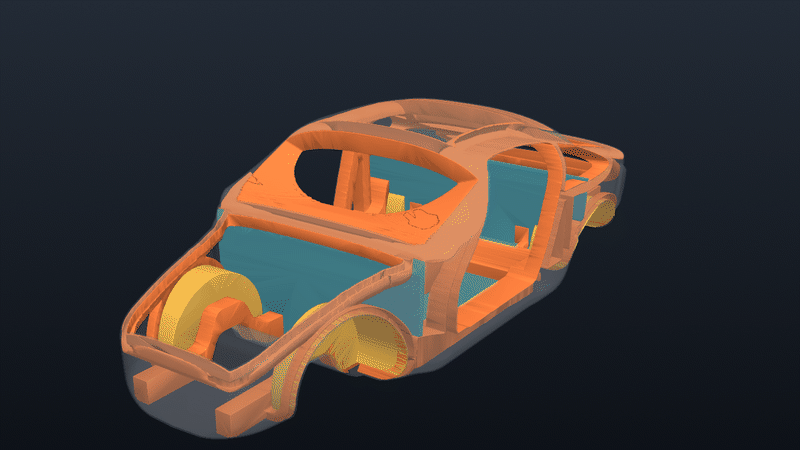
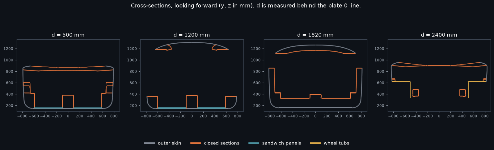

# A ZESAD-type carbon monocoque in PicoGK

**Not a part. Nothing here is ready to build.** This is a design envelope for the
[carbon monocoque programme](../../../../docs/MONOCOQUE_964_993_PROGRAMME.md):
an architecture study, generated in voxels by the pinned PicoGK kernel, inside
the 911 shell traced from plate 50-05a ([`../`](../README.md)). It carries the
programme's `prohibited_pending_engineering` status. It is not a ZESAD
geometry: ZESAD publishes none. "ZESAD-type" means the same kind of product,
a carbon monocoque that replaces a 964/993 body-in-white.

*Grey: outer skin. Orange: closed sections. Blue: sandwich panels. Yellow:
wheel tubs. 3 mm voxels; every size is a modelling hypothesis.*

## What it answers

The open shell of [`../`](../README.md) showed where torsion goes in a 911
body: around the windscreen frame, into the A-pillars and the corners of the
door apertures. The box-cell study of [`../../fea/`](../../fea/) showed that a
monocoque wins by closing its sections and its rings, not by being carbon.
This model applies both results to the real outline. **Every aperture is
framed by a closed section**, and the sills, tunnel and rails are closed
boxes:

| member | how it is made in voxels | hypothesis |
|---|---|---|
| outer skin | envelope minus its 6 mm inward offset, apertures cut | geometric 6 mm; laminate assumed 2.0 mm |
| aperture rings (door, windscreen, quarter and rear windows) | aperture dilated by its ring width, minus the aperture, within 100 mm of the outer surface, then hollowed | ring width 70 to 90 mm, depth 100 mm |
| lid and wheel-arch rings | same, 60 mm deep | ring width 50 mm |
| sills | body side over d 360 to 1990, 210 mm wide, 270 mm above the floor | closed box |
| tunnel | 200 mm wide, 240 mm high, front to rear bulkhead | closed box; **not 964 geometry** (the 964 floor is flat, see the scan): the architecture study's "tunnel" case, its largest single gain |
| front and rear rails | 100 x 130 and 100 x 120 mm boxes, following the floor | closed box |
| B-pillar ring | a full cross-section ring, 90 mm long, behind the door | closed box |
| floor, front and rear bulkheads | 25 mm sandwich panels at d 380 and d 1975 | 2 x 1.2 mm CFRP on honeycomb |
| wheel tubs | cylinder sectors around the axles from the datum chain | R 340 front, 350 rear |

Everything that forms a ring (rims, sills, tunnel, rails, B-ring) is united
first and hollowed once, so where two rings meet they become **one closed
section**, as in a moulded tub, not two sections glued together.

*Four cuts, looking forward. At d = 1200, the door: sill boxes, tunnel and
roof rails closed, sandwich floor. At d = 1820, the B-ring closes the whole
section.*

## First numbers, and what they are worth

From `../derived/zesad-monocoque.report.json`:

| group | voxel volume | mid-surface area | assumed layup | mass |
|---|---|---|---|---|
| outer skin | 50.5 dm³ | 8.4 m² | 2.0 mm CFRP | 26 kg |
| closed sections | 80.8 dm³ | 13.5 m² | 2.5 mm CFRP | 52 kg |
| sandwich panels | 63.2 dm³ | 2.5 m² | 2 x 1.2 mm CFRP, 22.6 mm honeycomb | 12 kg |
| wheel tubs | 10.3 dm³ | 1.7 m² | 1.5 mm CFRP | 4 kg |
| **total** | | | | **about 95 kg** |

The area is the voxel volume divided by the geometric thickness. The mass is
that area times an **assumed** areal mass. There are no joints, inserts,
adhesive, glass, doors or lids. It is an order of magnitude for comparing
architectures, not a mass for this car.

**Torsion.** On a shell model of the same members, K is about 29,500 N·m/deg
in steel and 22,300 in the assumed CFRP layup (75 kg without tubs or rear
rails). That is stable within 7% across three mesh densities. The open
shell, on the same mesh, is not converged and is more than five times softer.
The tube architecture of [`../picogk-rings/`](../picogk-rings/README.md) is
1.4 to 1.9 times less stiff per kilogram.
See [the torsion section](../README.md#torsion-of-the-monocoque-architecture).

## Reproduce

The PicoGK runtime is the one pinned in
[`containers/m64-leap71/`](../../../../containers/m64-leap71/), built
natively for Linux:

    docker build -f containers/m64-leap71/Dockerfile.native \
        -t porscheparts-picogk-native:dev containers/m64-leap71

Then, from this folder:

    python3 prep_envelope.py   # cadsim image: work/envelope.stl, fields, stations
    sh run.sh 3                # PicoGK, 3 mm voxels: about 18 min, 4.4 GB peak
    python3 figures.py         # cadsim image: ../derived and ../evidence

`work/` is not versioned. It holds the 170 MB aperture grid and about 14
million triangles of STL. `run.sh` caps the container at 10 GB. A 6 mm run
takes under three minutes and is enough to check a change.

| file | role |
|---|---|
| `prep_envelope.py` | closes the 420 sections into a watertight envelope; samples each aperture field of `build_shell.opening_fields()` every 10 mm |
| `src/Body.cs` | stations, trilinear aperture fields |
| `src/Program.cs` | the members, the boolean sequence, the report |
| `figures.py` | light mesh (`../derived/zesad-monocoque.vtp`), mass estimate, images |

## Limits

- The outline is Porsche's, traced from the plate. Section shapes and every
  member size are hypotheses (see `hypotheses` in the report).
- The walls are 6 mm because two 3 mm voxels is the thinnest wall that stays
  closed. The laminate is thinner, and the masses use the assumed laminate,
  not the voxels.
- The sandwich panels are drawn solid; their core is in the mass estimate
  only.
- No suspension, engine or seat-belt pickup is modelled. Those points need
  the ±1 mm datum tolerance that the programme does not have yet.
- Wheel-house radii and centre heights are the shell's hypotheses, not
  measured travel envelopes.
