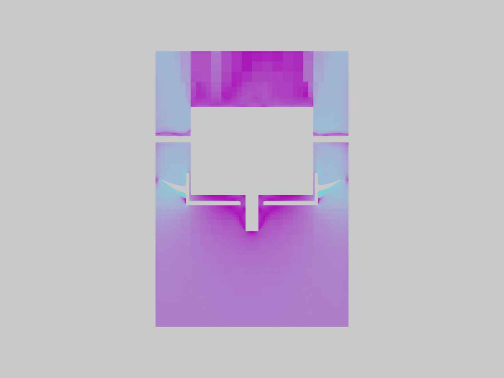
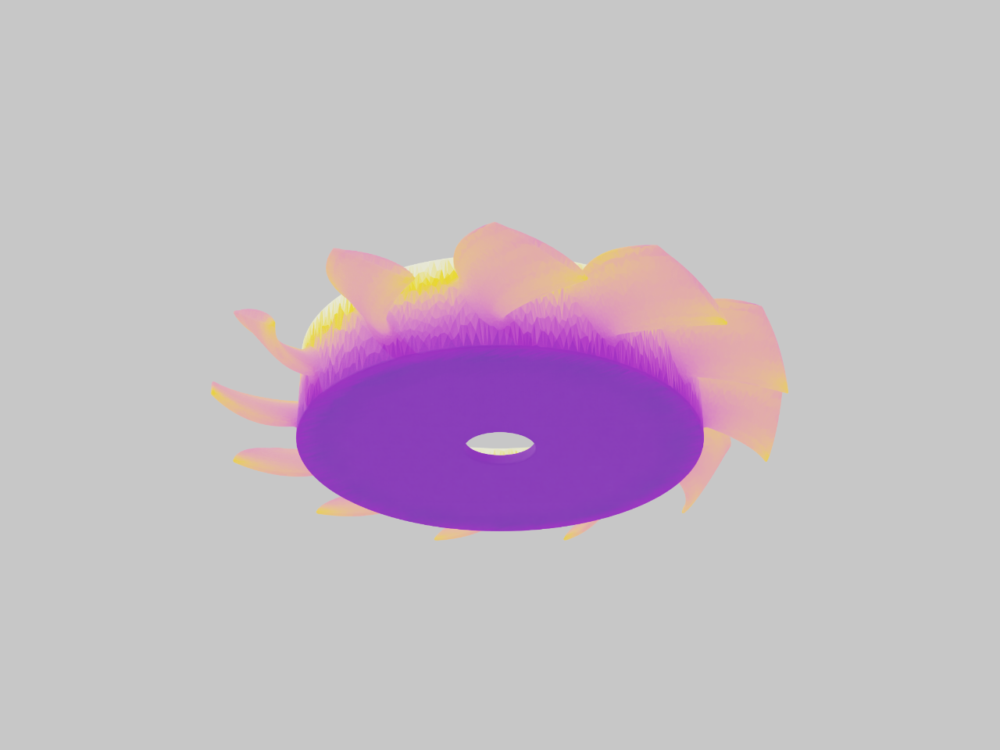
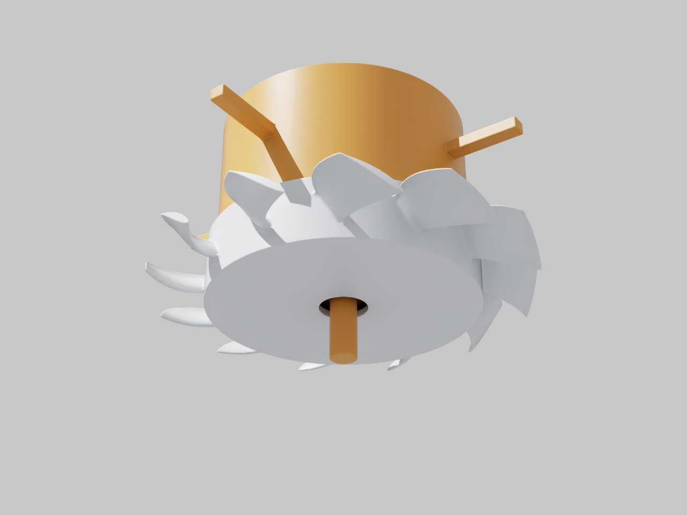
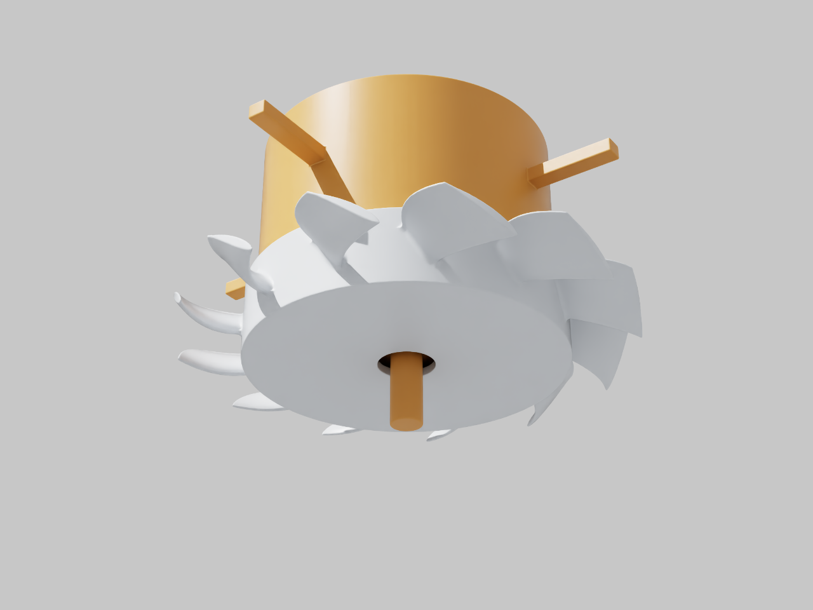

# Démonstrateur de calcul — géométrie du ventilateur rejetée
> **Correction du 28 septembre 2026 : ce modèle ne constitue pas une représentation
> fidèle du ventilateur 964/993.** La revue des quatre références photographiques
> fournies par l’utilisateur invalide son emploi comme base de conception ou
> d’optimisation du ventilateur réel. Les images et calculs ci-dessous sont
> conservés pour tracer ce qui a été exécuté sur cette géométrie simplifiée.
> Les contrôles des solveurs ne valident pas la géométrie. Une [reconstruction partielle distincte](REFERENCE_REBUILD.md) est désormais
> disponible ; elle ne reprend aucun des anciens résultats de débit.

## Écarts à corriger avant de poursuivre les calculs

| Élément | Modèle publié | Ce que montrent les références et correction requise |
|---|---|---|
| Moyeu du rotor | Fond annulaire plat, plein, percé d’un seul alésage | Moyeu embouti/en cuvette, ouvertures de ventilation, bossage et interface de poulie à distinguer |
| Pales | Profils paramétriques choisis sans reconstruction du rotor de référence | Reconstituer d’abord le nombre, la corde, le vrillage, la courbure et le raccordement de la variante identifiée |
| Carter fixe | Absent du rendu de l’assemblage ; les quatre bras ne terminent sur aucun carter | Carter annulaire avec entrée, supports/aubes fixes et logement d’alternateur distincts du rotor |
| Alternateur | Cylindre plein de substitution avec arbre fusionné aux pièces fixes | Corps ventilé, fixations et arbre séparés ; ne pas attribuer les cotes AS-PL au PMB 240 A |
| Montage axial | Poulies, entretoises, roulement et cône arrière non modélisés | Reconstituer l’empilage et ses portées avant d’affirmer l’intégration |

Le volume cylindrique plein ferme aussi des passages d’air : les anciens
résultats CFD ne permettent donc pas de conclure au refroidissement de
l’alternateur réel. Le calcul d’impression porte également sur une pièce
qui ne reproduit pas encore le rotor attendu.

### Lecture des quatre références

1. **Photo 1, éclaté Design911** : renseigne la séparation des composants et
   leur ordre de montage ; ce n’est pas un plan coté.
2. **Photo 2, assemblage Classic Retrofit** : référence utile pour la morphologie
   carter/alternateur/rotor. Son titre indique **175 A** ; notre cible reste
   le **240 A** demandé, dont les cotes ne doivent pas être déduites de cette image.
3. **Photo 3, fiche A0534S** : le titre visible mentionne **997** et le tableau
   **150 A**. Cette fiche ne constitue pas une source de cotes du PMB 240 A
   ni une identification du montage 993. [Fiche AS-PL](https://as-pl.com/en/p/A0534S).
4. **Photo 4, rotor seul** : montre les ouvertures, nervures et raccordements
   absents du modèle ; son identification exacte reste à établir avant de
   copier un nombre de pales ou des proportions.

La [notice Classic Retrofit 993](https://classic-retrofit.com/forum/index.php?/topic/2521-993-alternator-install/)
confirme l’importance de l’entretoise compensant le roulement en retrait,
des entretoises d’ajustement et du cône arrière répartissant les efforts.
La [fiche 240 A](https://www.classicretrofit.com/en-us/products/porsche-964-993-240a-high-output-alternator)
recommande une courroie multigorge avec tendeur. Ces composants doivent faire
partie de la définition de référence, pas seulement de la liste des limites.
Les photographies reçues ne sont pas republiées : elles servent de références
visuelles, sans licence de redistribution établie.

### Critère de reprise

Construire un assemblage de référence identifiable, avec vues de face,
arrière, coupe et éclaté, pièces fixes/mobiles séparées et chaque cote
rattachée à sa source ou explicitement laissée inconnue. Comparer ces vues
aux références avant de modifier les pales. Les essais de débit et
l’optimisation ne pourront qualifier le ventilateur réel qu’après cette
correction de la géométrie et la définition du circuit d’air.

---

## Archive du démonstrateur initial

[Télécharger le démonstrateur USDZ rejeté comme référence géométrique](results/omniverse/fan-twin.usdz) · [Résultats numériques](results/omniverse/)

Publication de recherche : géométrie et calculs exploratoires, sans autorisation de fabrication.
Les chemins `work/` ci-dessous désignent les archives locales de calcul, non publiées.

## Périmètre

Le jumeau assemble la géométrie PicoGK actuelle, son obstacle d'alternateur
historique, la coupe CFD OpenFOAM et le champ thermique d'impression ZRapid.
Il ne dispose pas de capteurs physiques. L'alternateur visé est le PMB /
Classic Retrofit 240 A, mais sa géométrie précise n'est pas disponible :
le substitut AS-PL de 160 mm est explicitement identifié dans la scène.
Le cône arrière, les entretoises et la poulie restent des interfaces sans
maillage inventé. Les dimensions du PMB restent à mesurer avant de valider son intégration.

## Livrable OpenUSD

La scène est dans `work/fan-aerodynamics/omniverse-twin/` :

- `fan-twin.usda` : assemblage, métadonnées et variantes ;
- `components.usdc` : surfaces et champs numériques, référencés localement ;
- `viewer.usda` : couche de visualisation, caméra et éclairage ;
- `viewer-flow.usda`, `viewer-print_thermal.usda`, `viewer-newton_coastdown.usda` : couches de capture reproductibles ;
- `fan-twin.usdz` : paquet autonome avec scène, données, caméra et éclairage ;
- `build-report.json` et `validation.json` : provenance et contrôles ;
- `newton/` : paramètres, historique de rotation et contrôle analytique.

Ouvrir `viewer.usda` dans une application Omniverse compatible OpenUSD.
Sélectionner `/World`, puis sa variante `studyView` :

| Vue | Données présentées |
|---|---|
| `assembly` | Rotor et obstacle stationnaire historique, en mètres |
| `flow` | Coupe y = 1 mm, vitesse 0–60 m/s, itération MRF 1200, 3 000 tr/min |
| `print_thermal` | Maximum thermique homogénéisé LPBF, échelle 30–47 °C |
| `newton_coastdown` | Rotation d'un rotor isolé ralentissant sous traînée |

Les températures d'impression ne sont pas des températures moteur. Leur
projection prend la cellule solide la plus proche du centre de chaque face,
avec remise en place du repère du plateau et suppression des 6 mm de
surélévation. Le rapport conserve les distances de projection. Le champ CFD
reste stationnaire et exploratoire : il n'est pas animé comme un écoulement
transitoire. Aucun débit installé ni gain convergé n'est revendiqué.

## Utilisation des bibliothèques de la photo

| Brique | Rôle et état |
|---|---|
| OpenUSD | Assemblage portable, unités, champs et animation ; contrôles exécutés |
| Newton 1.6.0 | Solveur Featherstone, un axe de rotation idéal ; exécuté sur CPU |
| Warp 1.17.0 | Noyau de couple aérodynamique et calcul Newton ; exécuté sur CPU |
| PhysicsNeMo | Audits de surfaces et intégration de pression de la campagne précédente ; la CFD est résolue par OpenFOAM |
| PhysX / ovphysx 0.4.13 | Rotation libre puis ralentissement avec traînée ; exécutés sur CPU dans le conteneur Linux local |
| Omniverse RTX / ovrtx 0.3.0 | Rendus GPU exécutés sur RTX PRO 6000 ; captures conservées |
| NuRec | Reconstruction visuelle du véritable assemblage ; bloquée par l'absence de prises de vue du composant |

Ces bibliothèques n'ont pas le même rôle. Newton et PhysX ne remplacent pas
une simulation de fatigue des pales ; NuRec ne produit pas un plan mécanique
tolérancé à partir d'une photographie de la page NVIDIA.

La documentation [NuRec mono caméra](https://docs.nvidia.com/nurec/robotics/neural_reconstruction_mono.html)
décrit une chaîne COLMAP puis 3DGUT : vues nettes et recouvrantes du même
assemblage, à plusieurs hauteurs, exposition et mise au point stables.
Pour ce projet, il faudra aussi des références dimensionnelles indépendantes
pour contrôler l'échelle. La reconstruction visuelle restera distincte de
la géométrie PicoGK utilisée pour les calculs. Aucun entraînement NuRec du
ventilateur n'a été exécuté et aucune image d'écran n'est utilisée comme
preuve de sa géométrie.

## Calcul Newton / Warp exécuté

Le maillage fermé du rotor, converti de mm en m, donne la masse et le tenseur
d'inertie pour une masse volumique supposée de 2 670 kg/m³. Le rotor est
articulé à un support idéal selon z. On supprime l'entraînement et on applique
`couple = -k × omega × abs(omega)`, avec k déduit du seul point CFD exploratoire
à 3 000 tr/min. C'est une hypothèse de traînée quadratique, pas une nouvelle
courbe CFD. Le couple et l'inertie du PMB, la courroie, les roulements et les
vibrations élastiques ne sont pas inclus.

La durée calculée est 0,1 s ; le pas principal est 0,1 ms, comparé à 0,2 ms.
La vitesse est contrôlée contre `omega(t) = omega0 / (1 + k omega0 t / Izz)`.
L'erreur relative maximale vaut environ 7,86 × 10⁻⁷. Ce contrôle démontre
la cohérence numérique du cas simplifié, pas la validité physique de sa loi
de traînée. L'animation USD couvre 0–100 timecodes à 1 000 timecodes/s ;
réduire la vitesse de lecture pour inspecter la rotation sans alias temporel.

## Vérification PhysX exécutée

Un deuxième cas retire aussi la traînée : conservation de la vitesse sur un
palier idéal, sans collision. Le tenseur d'inertie complet est diagonalisé
et ses axes principaux sont transmis à PhysX. Après 200 pas de 10 µs,
l'angle attendu est 0,628318531 rad et l'angle observé 0,628351450 rad,
soit 0,00189° d'écart. Le déplacement parasite reste inférieur à 10⁻⁵ m.
Le résultat est dans `physx-summary.json` et la scène dans `physx-spin.usda`.
Ce premier test ne valide pas le palier réel.

Un second test impose ensuite la même condition initiale de 3 000 tr/min
et la même traînée quadratique que Newton, pendant 1 000 pas de 0,1 ms.
PhysX donne **2 932,191 tr/min**, contre **2 930,977 tr/min** pour Newton :
écart de **1,214 tr/min**. L'erreur relative maximale de PhysX contre la
solution analytique est **0,0405 %**, sous le critère de 0,1 %.
La vitesse est réinitialisée explicitement entre les deux essais : la
projection du palier pendant l'essai libre produit une petite dérive
(314,18924 rad/s au lieu de 314,15927 rad/s). Les journaux conservent les
diagnostics initiaux et la relance corrigée. Le format de torseur utilisé
par ovphysx 0.4.13 est à neuf composantes : force, couple, point d'application.
Cette comparaison porte uniquement sur la dynamique rigide du rotor isolé.

Le conteneur local exécuté est
`sha256:79e76882a8f493012eb4cc9ab061bce0ca2d075cd505d6e33a5200e7e1e9b126`,
Linux amd64 sous émulation sur le Mac arm64. Le premier essai a révélé
le paramètre de temps absolu requis par cette version ; la relance corrigée
a terminé normalement. Le runtime OVRTX 0.3.0 de cette image utilise son API
de scène autonome, antérieure à l'attachement OVStage des versions récentes.

## Reproduction locale

Ces commandes réutilisent les archives `work/` de la campagne (maillages,
VTK et champs thermiques), conservées localement et non incluses dans cette
publication. Le paquet USDZ est autonome pour consulter le jumeau.

```sh
PY=work/fan-aerodynamics/physicsnemo-venv/bin/python
SRC=twins/993-engine-cooling-fan-system-f0/source
OPENBLAS_NUM_THREADS=1 "$PY" "$SRC/run_fan_newton.py" \
  --output work/fan-aerodynamics/omniverse-reproduction/newton
OPENBLAS_NUM_THREADS=1 "$PY" "$SRC/build_fan_digital_twin.py" \
  --output work/fan-aerodynamics/omniverse-reproduction
```

Le venv de travail contient `usd-core==26.8` et `newton==1.6.0`, ajoutés aux
dépendances de la campagne. Les maîtres géométriques et résultats précédents
ne sont pas modifiés. Le constructeur refuse d'écraser une scène existante.
Les contrôles vérifient les quatre vues, les indices des maillages, les valeurs
finies, le diamètre métrique du rotor et l'animation limitée à sa variante.

Pour le contrôle PhysX, après la construction locale :

```sh
"$PY" "$SRC/run_fan_physx.py" work/fan-aerodynamics/omniverse-reproduction --prepare-only
docker run --rm --platform linux/amd64 \
  --entrypoint /opt/ovphysx-runtime/bin/python \
  -v "$PWD/work/fan-aerodynamics/omniverse-reproduction:/job" \
  -v "$PWD/$SRC/run_fan_physx.py:/run_fan_physx.py:ro" \
  ghcr.io/cluster2600/3dprinting993-simready-workflow@sha256:79e76882a8f493012eb4cc9ab061bce0ca2d075cd505d6e33a5200e7e1e9b126 \
  /run_fan_physx.py /job
```

Le rendu nécessite le runtime OVRTX 0.3.0 de l'image NVIDIA et un GPU RTX.
`source/render_fan_ovrtx.py viewer.usda assembly.png` charge le wrapper,
effectue 48 pas de rendu et rejette une image uniforme. Les rendus GPU ont été exécutés avec le pilote 570.211.01 ; les captures
finales utilisent une focale de 35 mm pour inclure le substitut d'alternateur.

## Exécution distante

La location Vast 53186186 utilise une RTX PRO 6000 WS 96 Go, 24 cœurs effectifs,
190 818 Mo de RAM et 500 Go de stockage. L'offre annonce 1,55852 USD/h,
plus 0,00390625 USD/Go de transfert dans chaque sens. Ce tarif n'est pas une
facture finale. L'image SimReady est épinglée au digest
`sha256:5a69a6805a275ef708e264600cb933663159a2846b069eafe0459c28e5f69699`.
Le démarrage utilise le wrapper OpenBao existant, sans nouvelle extraction
de secret. Les journaux et confirmations de suppression sont conservés avec les
résultats locaux.

La première location a été supprimée automatiquement après un refus SSH ;
son absence a été vérifiée. Une seconde tentative, instance 53187079 au
Vietnam, utilise la même image sur RTX PRO 6000 WS, pour 1,36556 USD/h
annoncés avec le stockage. Elle est suivie séparément dans
`vast-launch-retry.log` ; son accès SSH et les rendus ont été vérifiés.
Après récupération des résultats, elle a été supprimée :
`vast-destroy.json` confirme `destroyed: true` et `verified_absent: true`.
L'inventaire final `vast-final-inventory.json` ne contient aucune des deux
instances de cette étude. Une autre location, créée par un autre travail,
a été laissée intacte.


Le second hôte a confirmé l'accès SSH et la RTX PRO 6000 Blackwell avec le
pilote 570.211.01. Le premier lancement OVRTX a échoué avec
`ERROR_INCOMPATIBLE_DRIVER`. Le diagnostic `strace` de `vulkaninfo` a identifié
l'absence de `libEGL.so.1` ; l'installation de `libegl1` dans le conteneur
éphémère a permis à `vulkaninfo --summary` de reconnaître le GPU.
L'image épinglée et les Dockerfiles du dépôt n'ont pas été modifiés.
Pour reproduire sur cette image, installer `libegl1` avant le rendu ;
`vulkan-tools` et `strace` ont servi uniquement au diagnostic.


## Captures du rendu RTX

Images brutes de la sortie `LdrColor` OVRTX, 1 280 × 960 pixels, après
48 pas de rendu. Ce sont des captures du moteur sans interface graphique,
pas des illustrations génératives. La couleur or identifie le substitut
historique d'alternateur ; elle ne représente pas son matériau réel.
Le gris clair du rotor est aussi une convention de visualisation.

### Assemblage


### Coupe CFD



Échelle de vitesse : violet sombre = 0 m/s, jaune = 60 m/s (palette viridis). La capture de face masque les solides et supprime l'éclairage sur le champ
pour rendre la palette lisible ; cette image ne prouve pas un débit installé.
La variante interactive `flow` conserve la superposition des solides.

### Impression LPBF



Échelle : noir-violet = 30 °C, jaune clair = 47 °C (palette inferno). Champ thermique de volume moyenné,
sans résolution du bain de fusion ni prédiction validée de déformation.

### Rotation Newton





Le rotor tourne ; le substitut d'alternateur reste fixe. L'animation provient
du calcul Newton, avec vitesse initiale de 3 000 tr/min et traînée quadratique.
L'arbre visible appartient au substitut stationnaire : il ne constitue pas
un modèle de transmission du PMB.


Pour reproduire les captures, depuis le dossier de sortie copié sur l'hôte RTX :

```sh
/opt/ovrtx-runtime/bin/python render_fan_ovrtx.py viewer.usda assembly.png
/opt/ovrtx-runtime/bin/python render_fan_ovrtx.py viewer-flow.usda flow.png
/opt/ovrtx-runtime/bin/python render_fan_ovrtx.py viewer-print_thermal.usda print_thermal.png
/opt/ovrtx-runtime/bin/python render_fan_ovrtx.py viewer-newton_coastdown.usda rotation-0ms.png --time-code 0
/opt/ovrtx-runtime/bin/python render_fan_ovrtx.py viewer-newton_coastdown.usda rotation-17ms.png --time-code 17
```

Les couches de capture sont écrites par `build_fan_digital_twin.py` et
contrôlées par les validateurs OpenUSD. Les résultats structurés et empreintes
sont dans [omniverse-twin-results.json](omniverse-twin-results.json).
Les contrôles ciblés de cette extension ont été exécutés ; le résultat de `make check` est indiqué dans la pull request.
Cette publication ne constitue pas une validation de fabrication.


Le contrôle visuel a aussi rejeté une capture CFD noire : la caméra regardait
la face arrière du plan, dont l'émission n'était pas rendue par ce runtime.
La caméra finale est du côté y positif, face aux normales de la coupe.
Le script vérifie désormais aussi la présence de pixels colorés pour rejeter
ce défaut. Les archives intermédiaires restent des diagnostics ; seules les
images liées ci-dessus sont les captures retenues.


Bilan des captures : cinq PNG retenus, tous à 1 280 × 960 pixels ;
57 168 pixels changent de plus de 10 niveaux entre les positions 0 et 17 ms.
Les contrôles de pixels détectent une sortie vide ou sans couleur, et une
inspection visuelle vérifie le cadrage. Ils ne valident pas la physique.
Les palettes sont soumises au traitement colorimétrique RTX : pour relever
une valeur, utiliser les champs numériques USD, pas la couleur d'un pixel.
