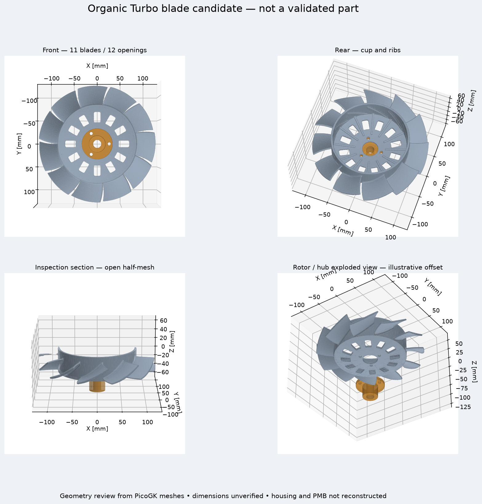
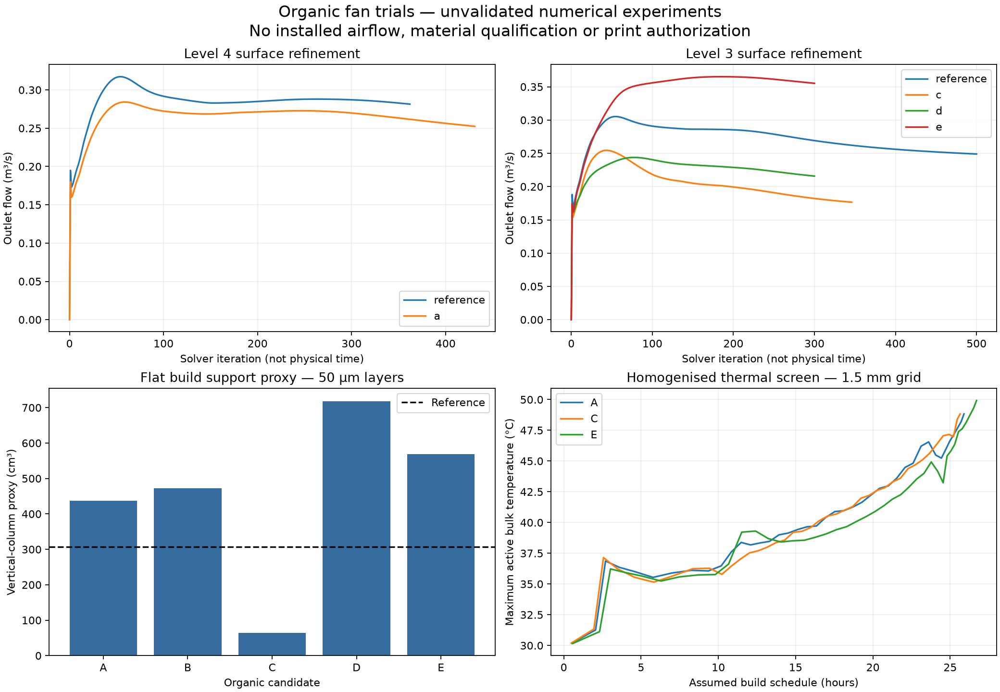
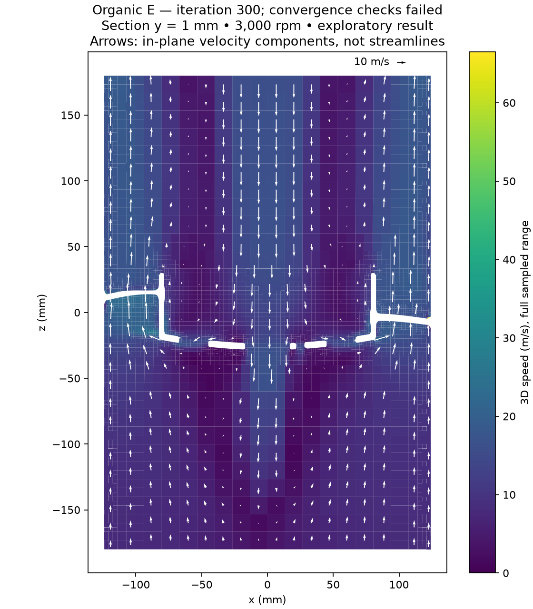

# Organic blade development — numerical trials

**Design candidates, not released parts.** This study uses the reconstructed
993 Turbo rotor and retains the separate bearing hub. PMB 240 A, housing and
shaft interfaces still need measurements. No physical material test, actual
print, fitted assembly or engine run is claimed.

## Shape changes

PicoGK now generates a swept stacking line, spanwise twist, curved camber line,
rounded chord ends and a smooth root transition into the cup. Eleven blades,
twelve cup openings and the nominal 245 mm envelope are retained. Numerical
checks keep the mesh closed and connected and verify that the openings remain
clear. These checks do not establish OEM dimensions.

| Candidate | Root / tip pitch | Tip sweep | Camber height | Root / tip chord | Nominal blade thickness |
|---|---:|---:|---:|---:|---:|
| Reference | 48° / 48° | 0 mm | 2 mm | 57 / 70 mm | 3.6 mm |
| Organic A | 52° / 38° | 8 mm | 3.5 mm | 57 / 62 mm | 4.4 mm |
| Organic B | 56° / 32° | 14 mm | 5 mm | 57 / 62 mm | 4.4 mm |
| Organic C | 60° / 50° | 8 mm | 3.5 mm | 57 / 70 mm | 4.4 mm |
| Organic D | 36° / 26° | 8 mm | 3.5 mm | 57 / 70 mm | 4.4 mm |
| Organic E | 36° / 26° | 8 mm | −3.5 mm | 57 / 70 mm | 4.4 mm |

The organic variants use a 3 mm implicit root blend. These are experimental
design parameters, not measurements or an aerodynamic optimum. Candidate C
restores tip chord and increases pitch after the first A flow trial showed no
initial advantage. D reduces incidence with an approximately constant geometric axial lead (root/tip velocity triangles), after the high-pitch C trial underperformed. This is a design hypothesis, not a measured optimum. B is retained as a documented alternative; its larger
predicted deflection and support demand did not justify prioritising its CFD.
E changes only the camber sign relative to D, testing whether curvature better
supports the assumed pumping direction. Its performance must be evaluated
against D and the reference; an organic appearance is not evidence of gain.



[OpenUSD review model](results/organic/e/review/reference.usdz). This stage has
no fluid fields or verified PMB geometry. It passed OpenUSD validators; no
Omniverse RTX session, Newton/PhysX fluid calculation or GPU render is claimed.

## Aerodynamic experiment

The comparison uses a **hypothetical 248 mm circular duct**, an isolated rotor,
3,000 rpm speed, k–omega SST and steady MRF in OpenFOAM Foundation 14. The inlet
has zero gauge total pressure; the outlet has zero gauge static pressure. The
stationary duct and fan walls have no-slip conditions. The separate bearing hub and auxiliary impeller are omitted from these fluid cases as well. There is no measured
engine resistance curve or PMB internal geometry. The study therefore cannot
predict installed cooling performance.

Negative rotation about +Z pumps toward +Z for the reconstructed positive blade
pitch. An initial positive-rotation A run produced reverse flow and was stopped
and retained locally as a setup diagnostic. The corrected comparisons start
from zero velocity; this direction remains an experiment convention until the
vehicle drive is verified.

A and reference use surface refinement level 4. C, D, E and a separate reference
run use level 3. Compare only matching discretisations and boundary conditions.
First-order advection and missing wall layers limit accuracy. Standard and
extended mesh reports are retained separately; standard acceptance must not
hide concave-cell findings in the extended check.

The flow acceptance diagnostic compares two consecutive 100-iteration windows:
less than 0.1% mass imbalance and mean-flow/torque drift, and less than 0.2%
peak-to-peak flow/torque variation. A normal solver exit alone is insufficient.
A converged result is still exploratory until grid, wall, turbulence and bench
validation are complete. More flow at higher shaft power is not automatically
better efficiency.

The initial study ceiling was 500 iterations per case. C was screened out at
iteration 346 after its flow kept falling below the same-grid reference.
The fine A/reference pilots were subsequently stopped after more than 300
iterations because extended mesh checks failed and their flow/torque windows
remained unsettled. D/E use a bounded 300-iteration camber comparison. These
stops are engineering screening decisions, not convergence. More iterations
cannot resolve the missing assembly or demonstrate mesh independence.
PhysicsNeMo 2.2.2 runs actual surface audits and independently integrates an
exported OpenFOAM pressure field. No trained surrogate or PINN is used; CFD is
solved by OpenFOAM, not inferred by an untrained neural network.

### Completed flow diagnostics

The following are the **last 100 solver-iteration averages**, not accepted
fan specifications. Every case exits normally, passes the standard mesh check,
but fails the extended mesh check and the combined convergence criteria.
Different stop iterations must not be mistaken for matched steady states.

| Case | Surface level | Last iteration | Outlet flow | Shaft-to-fluid power |
|---|---:|---:|---:|---:|
| Reference | 4 | 362 | 0.2858 m³/s | 234.9 W |
| A | 4 | 431 | 0.2590 m³/s | 193.1 W |
| Reference | 3 | 500 | 0.2522 m³/s | 220.7 W |
| C | 3 | 346 | 0.1831 m³/s | 202.7 W |
| D | 3 | 300 | 0.2226 m³/s | 110.0 W |
| E | 3 | 300 | 0.3609 m³/s | 158.0 W |

E is retained as the next **hypothesis to investigate**, not an optimised
design or a manufacturing freeze. Reversing camber relative to D raises flow
and power in this experiment. E's last-window mass imbalance reaches 0.375%,
flow spread is 2.69%, mean-flow drift is 0.444% and mean-torque drift is 2.13%:
all exceed the respective acceptance limits. The apparent gain cannot be
advertised as a validated improvement. Reference results also vary with grid
and iteration; a pressure–flow curve and an installed operating point are absent.



Before another quantitative ranking, rebuild the fluid domain from measured
housing/PMB geometry, resolve tip/root/wall regions, investigate extended mesh
failures, use higher-order advection and demonstrate mesh/time/turbulence
sensitivity against a measured reference curve. First-order isolated-rotor
pilots do not replace that work.



This plane shows central reverse flow in the incomplete model. It cannot
describe cooling around the omitted alternator. Arrows are sampled in-plane
velocity, not particle trajectories. The [E pressure audit](results/organic/flow/e-coarse/pressure-audit.json)
reproduces OpenFOAM's pressure force and moment to relative errors below
8 × 10⁻⁶. The [C audit](results/organic/flow/c-coarse/pressure-audit.json)
also passes. This verifies field extraction/integration, not the flow model.

## Material and mechanical screening

Candidate material remains **LPBF AlSi10Mg**. The linear elastic model assumes
E = 70 GPa, Poisson ratio 0.33 and density 2,670 kg/m³. It applies centrifugal
loading at a hypothetical 10,000 rpm and fixes all translations on nodes within
r < 17.35 mm of the nominal 34 mm bore. This is a deliberately simplified
support, not a measured bearing, bolt preload or contact model. Aerodynamic
loads, thermal gradients, fatigue, plasticity, resonance and defects are absent.

| Model | Quadratic tetrahedra | Maximum displacement | Global maximum von Mises |
|---|---:|---:|---:|
| Reference, 50k surface | 86,640 | 0.243 mm | 248 MPa |
| A, 20k surface | 38,427 | 0.170 mm | 350 MPa |
| A, 40k surface | 73,069 | 0.172 mm | 157 MPa |
| A, 80k surface | 155,547 | 0.173 mm | 2,171 MPa |
| B, 20k surface | 38,030 | 0.300 mm | 429 MPa |
| C, 50k surface | 91,934 | 0.206 mm | 392 MPa |
| D, 50k surface | 91,764 | 0.170 mm | 415 MPa |
| E, 50k surface | 92,848 | 0.174 mm | 279 MPa |

A's displacement changes little with refinement, but its global peak does not
converge and moves to the idealised bore restraint. Its blade-region peak also
changes (165, 157, 298 MPa). **The structural strength test is not passed.**
Neither deleting the peak nor substituting a stronger material would establish
validity. The contact/load transfer and stress convergence need resolution
before using any stress value as a design allowable. The very high local
linear-elastic result cannot be interpreted as a physical post-yield stress.

The [EOS AlSi10Mg material sheet](https://www.eos.info/metal-solutions/metal-materials/data-sheets/mds-eos-aluminium-alsi10mg)
supports the alloy as a candidate and describes process-dependent heat
treatment. It does not qualify the ZRapid process or this rotor. Do not transfer
EOS properties to an unqualified supplier build. The
[ZRapid research recipe](https://www.sciencedirect.com/science/article/pii/S2352492826011013)
was used on small specimens in a hot-rolling study. Its processing parameters
are useful for an experiment; the study's rolled-specimen strength is not
applicable to an unrolled fan.

Physical material qualification remains to be done on the actual powder,
machine and post-processing route: tensile specimens in relevant orientations
at service temperature, fatigue with representative surface/root condition,
porosity/defect inspection, heat-treatment validation and dimensional stability.
Acceptance limits must come from the reviewed load spectrum and defect
sensitivity, not from generic datasheet averages.

## Printing tests

All five candidates have complete layer slicing and orientation screening on
the published ZRapid iSLM420DN envelope. Each run has source/analysis hashes,
50 µm layers, a support-column estimate, sampled thickness and a 1 mm
powder-escape screen. The support estimate is not a supplier-designed support
structure, actual powder consumption or a price. Sampled thickness near edges
and fillets is sensitive to tessellation and local curvature; small returned
values require local inspection, not automatic acceptance or rejection.

| Model | Estimated rotor mass at assumed density | Flat support-column proxy | Layers at 50 µm |
|---|---:|---:|---:|
| Reference | 758.1 g | 306.6 cm³ | 1,163 |
| A | 786.5 g | 436.8 cm³ | 1,163 |
| B | 786.7 g | 473.1 cm³ | 1,163 |
| C | 805.6 g | 64.5 cm³ | 1,163 |
| D | 806.0 g | 718.4 cm³ | 1,163 |
| E | 805.8 g | 569.0 cm³ | 1,163 |

C's steeper blades reduce the support proxy in the flat orientation by about
79% relative to the reference, at about 6% higher calculated rotor mass. This
is a manufacturing-screen trade-off, not a supplier-approved support plan.

Organic A, C and E also have separate **40 µm thermal experiments** using the published
500 W, 1,300 mm/s, 0.10 mm hatch, 0.08 mm spot and 30 °C plate recipe. Only one
laser is modelled. Layer heat is averaged into a homogenised solid/support
model with constant thermal properties, assumed absorption and recoat times.
It does not resolve a moving melt pool, latent heat, residual stress, distortion
or recoater collision. The EOS heat-treatment schedule is not silently applied
to this ZRapid build.

At 2 mm and 1.5 mm thermal grids, predicted peak **bulk** temperatures are
321.878 K and 321.979 K, with geometry volume errors −0.256% and +0.401% and
energy residuals below 2 × 10⁻¹². The assumed one-laser schedules are about
25.91 and 25.89 hours. These are model outputs, not machine quotes or measured
cycle times; low bulk temperature does not mean the powder never melts.

C gives 321.767 K / 321.972 K on the two grids and estimated schedules of
25.63 / 25.64 hours. Support columns in this thermal model differ from the
overhang proxy in the table above; neither is an approved support design.
These experiments do not qualify untested variants by similarity.

E gives 322.831 K / 323.069 K at 2 / 1.5 mm, with volume errors −0.061% /
+0.447%, step energy residuals below 3 × 10⁻¹² and a 26.71-hour assumed
schedule. All three thermal trials include 1,604 physical layers with the
assumed 6 mm standoff. No machine code is generated or sent to a printer.

Numerical CAD centre-of-mass and inertia reports are retained for each shape.
They are useful for model checks but cannot replace physical dynamic balancing
after printing, heat treatment and machining.

## Reproduction

The source configuration files are in `source/picogk-reference/`. Build its
.NET 9 project against PicoGK 2.3.0 and run `Reference.dll <config> <new-output>`.
A second generation of A produced byte-identical rotor, hub and generation
files. Invalid twist, thickness and root blend are rejected before output.

With the repository's scientific Python environment:

```sh
python twins/993-engine-cooling-fan-system-f0/source/build_reference_review.py \
  --source GEOMETRY --output NEW_REVIEW --rotor-faces 50000
python twins/993-engine-cooling-fan-system-f0/source/run_reference_print_screen.py \
  GEOMETRY NEW_PRINT_SCREEN
python twins/993-engine-cooling-fan-system-f0/source/prepare_reference_cfd.py \
  GEOMETRY NEW_CFD --level 4
```

In the existing CAE container with OpenFOAM 14, run
`source/run_reference_cfd.sh NEW_CFD/case`, then
`source/summarize_fan_cfd.py NEW_CFD/case` in Python. The prepared cases are
isolated-rotor experiments; no fictional alternator is inserted. The runner
refuses to overwrite an existing run. CFD and print outputs carry hashes.
For D/E use `--level 3 --iterations 300`; the coarse reference uses 500.
The archived case dictionaries and termination reasons take precedence for
reproducing the actual shortened pilots.

For structure, reduce the raw STL with Trimesh, reject any open/disconnected
mesh or volume error ≥0.5%, and export `rotor-mm-analysis.stl` to a new case.
Run `build_reference_structure.py` with Gmsh, `OMP_NUM_THREADS=2 ccx rotor`, then
`summarize_reference_structure.py CASE`. Record each reduction hash and solver
log. The failed 20k/40k reference reductions and failed 40k C reduction were
rejected rather than patched silently; passing surfaces were used instead.
D's 80k review reduction was also rejected; the checked 50k reduction passes.
The first D structural solve exceeded a 1,500 MiB container cap (exit 137).
Its identical input completed with a 3,500 MiB cap after the fine CFD cases
finished. E also completed within that cap. The initial resource failure is
retained separately from the successful numerical solves.

For thermal reproduction, use `simulate_zrapid_print.py slice` then `thermal`
with `zrapid-print-process.json`. Its compatibility input names are
`organic-fan-mm.stl`, `analysis-mm.stl` and `surface-reduction.json`; the first
two are byte-identical copies of the candidate's raw and print-analysis meshes, and the
JSON binds their SHA-256 hashes. Run `self-test` first to check the analytic
implicit step, energy conservation, voxel occupancy and machine limits.

The [artifact manifest](results/organic/manifest.json) binds archived reports,
layer metrics, solver histories, compressed logs and views by SHA-256. Pressure
patches and sampled planes are preserved as compressed VTK. Full-volume CFD
fields and large structural input/result files remain in the local experiment
directories. Structural summaries retain input/output hashes; CFD summaries
retain input hashes and the exported pressure samples have their own hashes. The source,
parameters, case dictionaries and solver versions allow a rerun. Decompress
the VTK and force files before calling `audit_fan_pressure_physicsnemo.py` or
`plot_fan_velocity.py`; `plot_organic_study.py` rebuilds the overview from the
archived histories. All runs used local CPU resources; no Vast rental or
physical printer job was started.
Case dictionaries are archived losslessly in each case's `inputs.zip`.
The portable 40 µm slicing reports omit only the local machine path and retain
the original document hash; regenerate slicing before rerunning thermal cases.

Software verification: `make check` passed, including 3,190 core tests with
150 dependency/environment skips and the repository's additional checks.
All five focused organic-study checks passed in the scientific environment.
Mesh closure, numerical convergence, software checks and physical qualification
are distinct results throughout this report.

## Release decision

**Hold.** Organic geometry and numerical experiments are available. Improved
installed airflow, mechanical integrity, physical printability and material
qualification are not established. The [print-release dossier](PRINT_RELEASE.md)
remains applicable: measured interfaces, realistic loads/contact, converged
validated calculations, qualified supplier process and professional approval
are required before a functional metal print is authorised.
