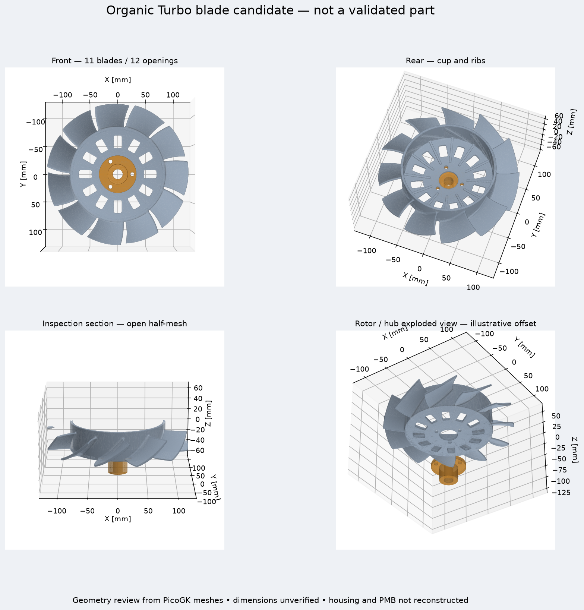

# Local Qwen / PicoGK / OpenFOAM / CalculiX / OpenUSD run

The existing fine-tuned Mac model and Kali2 engineering worker were used directly,
without a browser or a new cloud instance. This is an engineering investigation,
not a released fan or evidence of increased installed airflow.

## Model and geometry

The selected adapter is `coding-003/checkpoint-600` on
`mlx-community/Qwen2.5-Coder-1.5B-Instruct-4bit`, revision
`b3252a2f97102b1fb1571fec2c9b27219a8536be`, using MLX-LM 0.31.3.
Both prompts, raw responses and the adapter hash are retained in the results.
The first unconstrained proposal returned ranges rather than candidate objects
and was rejected. A controlled second prompt encoded a human-defined 42-degree
pitch experiment. Its literal `root = ` prefix was removed before strict JSON
validation. No model-generated Python or shell code was executed.

`accept_qwen_fan_candidate.py` rejects duplicate keys, non-finite values,
booleans, out-of-bounds values, extra parameters and multi-factor changes.
The existing E geometry generator produced 961,796 rotor triangles and 68,556
hub triangles. Diameter, blade count, thickness and hub interfaces were held
constant. These interfaces remain unmeasured hypotheses; the PMB 240A alternator
is not reconstructed by this run.

The 80,000-face USD simplification failed watertightness and was retained as a
rejected attempt. The 120,000-face rotor export passed the existing geometry and
OpenUSD validators, with no USD validator findings. The scene is a geometry
review, not an Omniverse physics run. All twelve ventilation centres are open.

## Structural calculation actually completed

CalculiX 2.17 completed in 43.1 seconds on Kali2. The quadratic mesh contains
92,630 tetrahedra and 172,123 nodes; all checked integration-point Jacobians are
positive. The hypothetical bore restrains 1,049 nodes. This is a centrifugal
screen at an assumed 10,000 rpm, E = 70 GPa, Poisson ratio = 0.33 and density
2,670 kg/m³. It does not qualify an alloy, printing process or operating speed.

| Quantity | Computed value |
|---|---:|
| Maximum von Mises stress, including bore peak | 266.501 MPa |
| 99th percentile element stress | 66.763 MPa |
| Maximum stress outside 82.5 mm radius | 146.237 MPa |
| Maximum displacement | 0.171706 mm |
| Maximum radial extension | 0.074907 mm |

The surface used for the structural mesh is a validated 50,000-face reduction;
its volume is checked, but no surface-distance or mesh-independence study has
been completed for this candidate. Pressure, temperature, fatigue, resonance,
bearing contact and manufacturing defects are absent. No strength pass/fail or
manufacturing authorization follows from these values.

## Flow-mesh recovery

OpenFOAM v2312 imported the previous 355,404-cell tetrahedral control mesh and
ran `checkMesh -allGeometry -allTopology`. It failed five checks: high aspect
ratio, skewness, determinant, interpolation weight and face volume ratio.
There are 28,705 low-determinant cells and 55 highly skew faces. The maximum
non-orthogonality is 89.9475 degrees. A separate `polyDualMesh 60 -overwrite`
experiment worsened the mesh and failed ten checks; it is rejected.

A third, bounded cfMesh attempt uses the same control surfaces with 12 mm far
cells, 2 mm boundary cells and 0.8 mm rotor refinement over a 3 mm band.
It produced 2,893,212 cells and failed six extended checks. The rotor patch
is no longer closed, and its negative-X extent differs from the source by
1.177 mm against a nominal radial gap of 1.5 mm. This mesh is rejected for
both cell quality and geometric fidelity. No flow solver was launched.
The final receipt is retained with the raw logs. No airflow value is inferred
from mesh generation, structural results or the shape image.

## Reproduction and next acceptance criteria

Use the existing MLX environment for `source/propose_qwen_fan_candidate.py
MODEL ADAPTER NEW_RECEIPT --controlled`, then validate its output with
`source/accept_qwen_fan_candidate.py RECEIPT
source/picogk-reference/organic-e.json NEW_PARAMETERS`.
Run the existing PicoGK `Reference.dll` with the parameters and a new output
directory, followed by `build_reference_review.py --rotor-faces 120000`.

For structure, reduce and audit the generated rotor, then run the existing
`build_reference_structure.py`, `ccx rotor` and
`summarize_reference_structure.py`. The raw archive preserves the actual input
deck, result fields, mesh-generation log and assumptions.

For cfMesh, `prepare_fan_cfmesh.py SURFACE_DIRECTORY NEW_CASE` reuses the four
surfaces from the earlier conforming-mesh attempt. Run `cartesianMesh` followed
by both standard and extended `checkMesh` in the v2312 environment. Never run
flow through a rejected mesh. The engineering worker image used here has ID
`sha256:1dc508c2bfab4d9911707fbfd9cacdf43faf84956a1502805194e3e70e18ae68`.

Before ranking blade shapes, obtain accepted meshes for control and candidates,
audit surface fidelity and clearance, then compare converged flow, pressure and
shaft power at matched operating conditions. Installed engine cooling additionally
needs the measured alternator, supports, shroud and engine resistance. A prettier
or more open rotor is not evidence of improved cooling.

## Repository checks

The focused fan suite ran 23 tests, with four skips. The full Python suite
ran 3,260 tests, with 152 skips, and passed; subsequent 10-test and 7-test
checks passed. `make check` then failed at the existing Docker LPBF audit
because the Mac Docker daemon is unavailable. This is not a full green
repository validation. No merge or manufacturing release is requested.

## Raw artifacts

[Download the archived candidate and rejected flow meshes](https://github.com/cluster2600/porscheparts/releases/tag/fan-qwen-chain-2026-10-02).
`release-assets.json` records archive sizes and SHA-256 digests;
`artifact-hashes.json` identifies the candidate STL, OpenUSD and CalculiX files.
The cfMesh preparation script reproduced its submitted STL and dictionary
byte-for-byte. No Vast instance was created; the final API inventory was empty.
All temporary engineering containers exited.

## Public log privacy projections

Owner-authorized public copies of `log.make-check.gz` and `log.usd.gz` replace
only personal host paths with logical private artifact aliases. The
[projection manifest](results/qwen-chain-20261002/privacy-projection.json) records
original and projected SHA-256 identities separately. Original payloads remain
preserved privately. Three lines in the repository-check log and two traceback
lines in the USD log contain path substitutions; every other decoded byte is
unchanged. Test outcomes, skips, errors, geometry, solver results and all earlier
scores retain their original meaning. These copies are sanitized projections,
not byte-exact original logs or newly executed calculations.
