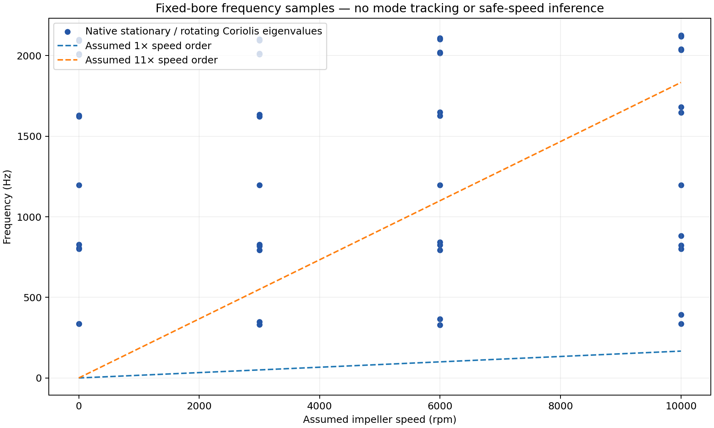
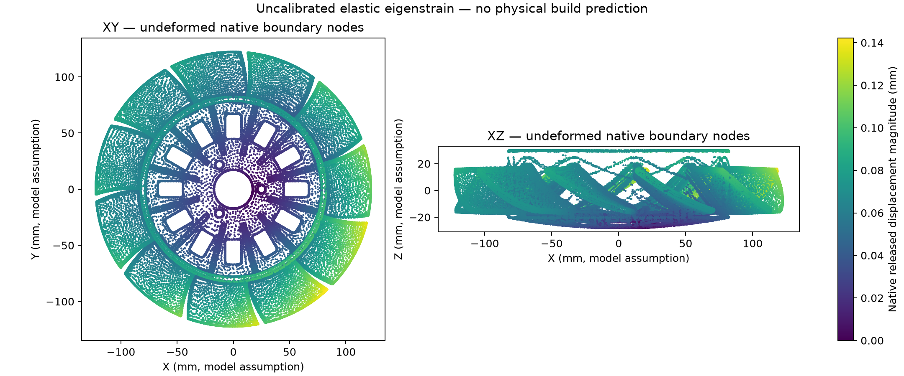
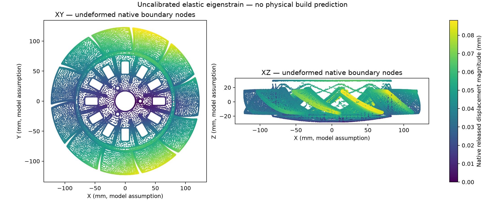

# Impeller engineering iteration: native results and open gates

[Program home](../README.md) · [Criteria declared before runs](ENGINEERING_ITERATION_20261003.md) · [Reproduction](ENGINEERING_REPRODUCE_20261003.md) · [Material/process admission](research/materials-20261003/ADMISSION.md) · [Receipts](../results/engineering-iteration-20261003/)

This iteration contains new, completed calculations on **original parametric
Organic E**, not on the purchased scan. It does not establish a manufacturing
candidate that passes all engineering gates. Geometry/fit, installed airflow,
structural independence, fatigue and the target LPBF process remain open.
The historical studies and their hashes remain unchanged.

## Native calculation results

Four rotating-mode cases completed in CalculiX 2.17 on existing Linux amd64
CPU resources. The 172,493-node / 92,848-C3D10 mesh, fully fixed hypothetical
bore and assumed isotropic E = 70 GPa, nu = 0.33, density = 2670 kg/m³ are
inherited inputs. For nonzero speeds, a nonlinear centrifugal preload precedes
the prestressed eigenproblem and Coriolis calculation. Each case reports all
twelve requested eigenvalues; native logs contain normal solver completion.

| Assumed rpm | First two stationary/prestressed frequencies (Hz) | First two Coriolis output frequencies (Hz) | Solver time (s) |
|---:|---:|---:|---:|
| 0 | 336.7662 / 337.2051 | Not requested | 57.68 |
| 3,000 | 339.2249 / 339.6599 | 330.7995 / 348.3110 | 330.26 |
| 6,000 | 346.5072 / 346.9310 | 329.6620 / 364.6584 | 352.93 |
| 10,000 | 363.2472 / 363.6471 | 335.4877 / 393.7365 | 319.57 |

[All values and hashes](../results/engineering-iteration-20261003/modal/rotating-modes.json)
retain the real and imaginary output components. The imaginary components are
reported as solver output, not inferred damping or an instability assessment.
Modes are not tracked between speeds; bearings, belt contact and damping are
absent. The following plot contains sampled eigenvalues and assumed 1× and
11× excitation orders, **not a validated Campbell diagram or safe speed**.

## Manufacturing mechanics: uncalibrated sensitivity

These are elastic imposed-strain calculations with support release, not a
layer-by-layer thermal/plastic LPBF solve. The prescribed strain is
`-A*(0.5+0.5*s²)*(I-0.7*n*nT)`, where `s` is normalized build height and `n`
the assumed build direction. Lowest surface nodes in a 5 mm raster are fixed
as a rigid-column support bound; a recorded 3-2-1 gauge removes rigid motion
after release. Gauge coordinates affect displacement magnitude and are not
installed interfaces. Machine, material route and calibration are unconfirmed.

| Case | Attached max displacement (mm) | Attached max von Mises (MPa) | Released max displacement (mm) | Released max von Mises (MPa) |
|---|---:|---:|---:|---:|
| Flat, A = 0 | 0 | 0 | 0 | 0 |
| Flat, A = 0.001 | 0.073028 | 3,725.542 | 0.142254 | 49.978 |
| Edge, A = 0.001 | 0.132328 | 17,888.216 | 0.088136 | 5.121 |
| Flat, A = 0.0005 | Half-amplitude control | Half-amplitude control | Half-amplitude control | Half-amplitude control |

The enormous attached support peaks are retained. They demonstrate that this
point-restraint elastic model is **not physically admissible as a support-
stress/build prediction**; no peak is discarded or used to qualify a build.
The released fields quantify response to an assumed strain, not predicted
part distortion. They cannot select an orientation or machining allowance
without calibrated support/process evidence and mesh convergence.

The independent single-tetrahedron benchmark prescribes uniform isotropic
strain −0.001, then releases its supports. Its analytical solution is
`U = -0.001*x`, stress zero. Native CalculiX gives maximum displacement error
1.27 × 10⁻¹⁶ mm and released stress-component magnitude 2.26 × 10⁻¹³ MPa,
passing the declared 10⁻⁸ mm and 10⁻⁷ MPa limits. The full-piece zero case is
exactly zero. Comparing every displacement component and all 371,392
integration-point stress tensors against twice the half-amplitude result gives
maximum relative error 3.87 × 10⁻⁶, below the 10⁻⁴ numerical test limit.
These checks establish implementation consistency, **not process calibration**.

The figures use actual native boundary-node locations and displacement
magnitudes. Their geometry coordinates are undeformed; their colors are solver
fields. They contain no invented render or inferred measurement.

## Geometry and CFD mesh audit

The local original E input has SHA-256
`465aa58f3f3cd003d89ba94f77936e8620c761f2ce7252ea141702504d5233a5`
and volume 301,810.315 mm³. It is **not byte-identical to the older published
generation's reported volume**. Its new intake record preserves this identity.
The retained 50,000-face analysis input has SHA-256
`21829cdb7061945579784c2d030599589e98570119d1b431ac3040d8425a4b23`.
Both are closed, oriented, connected and have positive face areas. Independent
OpenFOAM 13 reports eighteen self-intersection location records on the original
949,756-face mesh and none on the analysis surface. Location records are not
counts of distinct physical defects. Manifoldness alone did not qualify E.

The archived 355,404-cell tetrahedral fluid mesh fails **five extended checks**:
98 high-aspect cells, 55 highly skew faces, 11,885 small determinants, 3,302
small interpolation weights and 191 small face-volume ratios. No flow solver
was launched on it.

Strict regularization keeps the 0.1 mm declared deviation bound: maximum
bidirectional sampled distance is 0.0642 mm, relative volume error
1.97 × 10⁻⁵, unchanged topology, and independent intersection count zero.
The new native 458,098-tetrahedron mesh nevertheless fails the same five
extended gates. A separate early Mac HXT attempt was stopped after more than
ten minutes without progress; its log is retained and it has no accepted mesh.

**Organic E-R1** is a separately declared geometry hypothesis with a 0.25 mm
sampled design envelope, not acceptance of E under the earlier 0.1 mm rule.
Its maximum bidirectional sampled deviation is 0.1972 mm and volume difference
0.0801%; topology is unchanged and no intersection is reported. Its assumed
radial duct clearance remains approximately 1.5 mm. No physical tolerance is
inferred, and E's mechanics results are not transferred to this revision.

The installed native Gmsh build lacks the Netgen optimizer. A completed
Delaunay/Relocate3D E-R1 mesh improves aspect ratio to 155.7 and maximum
non-orthogonality to 84.59°, but fails **four extended checks**: one skew face,
3,376 small determinants, 104 small interpolation weights and three small
volume ratios. A polyhedral dual conversion, with its stale primal cell-zone
annotation separately corrected, fails eight geometry checks, including
negative face decomposition and non-orthogonality above 90°. It is rejected.
All failed runs are preserved. No acceptance threshold is weakened.

An internal-only centroid subdivision of 1,735 multi-boundary tetrahedra
preserves all original boundary triangles and node coordinates. Its 1,303,348
cells have positive Gmsh signed quality, but independently fail four extended
OpenFOAM gates: one skew face, 1,864 small determinants, 502 small interpolation
weights and twenty small volume ratios. Improved individual metrics do not
establish acceptance. The subsequent targeted localization diagnostic is kept
separate from these rejected topology/geometry transformations.

The required flow, torque, pressure and power convergence criteria therefore
remain unevaluated in this iteration. The earlier 8-million-cell CFD cases
remain rejected for convergence; this iteration establishes no airflow gain.
An accepted new volume mesh, matched baseline/candidate studies, wall-layer
and turbulence sensitivity, mesh independence and physical bench correlation
are still needed before aerodynamic ranking.

The [targeted diagnosis and independent recovery](MESH_DIAGNOSIS_20261003.md)
locate native bad-cell/face IDs and separate stencil rank problems from boundary
shape conditioning. The resumed hex pilot finished in 1,053 seconds and resolves
the initial four quality failures, but fails extended concavity (82,294 cells)
and source retention (two nonmanifold edges; 0.378 mm sampled error). Native
diagnostic sets, exact logs and coordinate receipts are retained. No flow runs.

## OpenUSD and NVIDIA workflow

The two new assets contain the **actual C3D10 analysis boundary**: 99,970 native
boundary-node IDs and 200,000 linear subtriangles of the quadratic faces.
Released displacement vectors remain attached to their solver node IDs.
Coordinates are meters, +Z, deformed at scale one; visual material binding
uses the native displacement color field, not an invented alloy property.
Quadratic face geometry is approximated by its midside-node subtriangles.

The [composed study layer](engineering-iteration.usda) links the exact cases,
assumptions and result receipts. OpenUSD 0.26.8 generic validators report zero
findings for both field assets; maximum coordinate storage error is about
5.25 × 10⁻⁶ mm. This is numerical serialization precision, not physical fit.

The NVIDIA CAD-to-SimReady check-only preflight was actually attempted. It is
blocked because `omni.asset_validator` and the pinned `simready-validate`
runtime are unavailable in the current environment. No installation, Content
Agents property assignment or RTX render was performed. Neither asset is
claimed SimReady; a physical digital twin and operating limits remain
unvalidated. The scene is a traceable carrier for calculated sensitivities.

## Remaining completion gates

Numerical failures do not become positive manufacturing evidence. There is
still no qualified hardware candidate, safe rpm or fatigue life. Independently
measured functional geometry, actual operating loads/temperature, process-
matched material cards and calibrated printing/support data are required.
The purchased scan still lacks established units, target identity/equivalence
and derivative publication rights; it remains private and unused here.
The [criteria and requested evidence](ENGINEERING_ITERATION_20261003.md) define
the next inputs. Metal manufacture, installation, guarded spin tests and
release remain unauthorized pending the engineering review/validation plan.

Native modal and full-piece manufacturing fields/eigensolver states are also
preserved in a verified private local backup. Public summaries retain their
SHA-256 identities, normal-exit logs, exact original-model input snapshots and
reproduction scripts. Raw scan files, third-party PDFs, credentials, host
addresses and signed transfer URLs are excluded from the publication.
