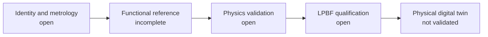

# Cooling impeller validation plan

[Program](../README.md) · [Execution status](EXECUTION_20261003.md)

The five stages below follow their dependencies. Passing a software check does
not complete physical validation. Each result must identify geometry, digest,
variant, units, runtime and conditions.

| Stage | Work and verifiable output | Actual dependency / status |
|---|---|---|
| 1. Identify and measure | Provenance/rights, Carrera/Turbo/935 reference, units/independent calibration, complete scan and frame | Blocked for the physical part: scan information and metrology missing |
| 2. Build the reference | Editable source geometry, separate impeller/hub; measured datums, seats, bores, holes, tolerances, fan housing clearance and drive stack | Exploratory parametric model available; functional reference incomplete |
| 3. Calculate | Faithful, accepted meshes before CFD; centrifugal/contact/thermal analysis, rotating modes, flow/pressure/torque curves under matched conditions, balances and sensitivities | Exploratory static/modal results; isolated CFD #105 rejected for convergence |
| 4. Prepare LPBF | Qualified material/machine/batch/parameters, orientations/supports/machining/treatment, coupons, distortion/residual stresses/recoater and inspection | Geometric/thermal scenario available; calibration and physical data missing |
| 5. Compose the twin | OpenUSD units/axes/time/materials, identified parameters/native fields, visible validation states, then comparison with measurements | Review asset checked; physical twin not validated |

## Geometry and load path

Measure impeller/hub/bearing datums, seats and faces, hole positions and
diameters, cone/spacer/pulley stack and runout. Resolve documented differences
concerning hub 96410605131. Identify the drive kit for the alternator variant
to be selected (175 A / 240 A and other documented arrangements), engine/
impeller/alternator ratios, rotation sign and operating/overspeed envelope.
No shafts are assumed to share a speed ratio. Trace centrifugal loads, drive
torque, belt loads, supports and thermal expansion.

## Mechanical and dynamic analysis

The existing screenings assume isotropic material E = 70 GPa, nu = 0.33,
rho = 2,670 kg/m³ and a fixed bore. Qualify orientation- and temperature-dependent
properties for the selected LPBF/heat-treated/machined state. Compare meshes
and realistic supports/contact; distinguish singular peaks from blade-root
stress. Add centrifugal prestress, gyroscopic effects, belt and bearing
stiffness for rotating modal and Campbell analysis. An unprestressed natural
frequency establishes neither a validated forbidden-speed band nor a fatigue
margin. Define cycles, defects, surface, corrosion, fretting, balancing and
guarded tests with the responsible engineer.

## CFD

Retain standard and extended checks and the surface audit. Whole-domain MRF
applies only to the isolated axisymmetric duct in #105; adding a stationary
alternator requires an appropriate rotating interface. Steady MRF resolves
neither transient interactions, noise, vibration nor fatigue. Record the
OpenFOAM family/version: the examined final outputs are **Foundation 14**, not
OpenCFD v2312.

Keep #105 criteria unchanged: two complete 100-iteration windows, mass balance
< 0.1%, flow/torque drift < 0.1%, relative amplitude < 0.2%, maximum initial
residuals U <= 1e-4 and p/k/omega <= 1e-3. Both cases fail these criteria.
Mesh independence, wall resolution/y+, turbulence, inlet/outlet conditions,
measured impeller performance curve and engine-system resistance are still
needed. The [NASA framework](https://www.grc.nasa.gov/www/wind/valid/tutorial/verassess.html)
separates iterative convergence, conservation and spatial/temporal convergence.

The two cases with more than eight million cells are not continued here.
Another task deleted the historical worker during the authorized backup.
Final logs from both cases are retained; all 32 final control partitions are
saved and verified locally. Full candidate fields are absent from that
interrupted transfer. Check the other task's archives before recalculation;
see [field recovery status](EXECUTION_20261003.md#final-field-backup).
No new rental is authorized. Kali has about 15 GiB per host, without evidence
that this is sufficient for these cases. A smaller traceable pilot with checked
fidelity could support numerical recovery; it would not supply missing interfaces.

## Additive manufacturing

Reuse the [ZRapid / AlSi10Mg card](../zrapid-print-process.json) as a **research
scenario**: iSLM420DN, one assumed active laser, impeller axis along build-plate
Z, 40 µm layers, homogenized supports and constant material properties.
Averaged-energy analysis does not resolve melt pool, phase change, plasticity,
residual stress, plate release or recoater collision. It cannot predict final
accuracy or validate production time/cost. Absorption, spatial and temporal
sensitivities remain useful only for this screening.
[NIST](https://www.nist.gov/programs-projects/metrology-am-model-validation)
describes the need for measured data to validate AM models.

The supplier plan must define removable orientations/supports, powder drainage,
machining allowances and datums, justified heat treatment/HIP, dimensional/
CT/FPI inspection, fatigue and final balance. The [manufacturing gate](../PRINT_RELEASE.md)
remains open. No physical manufacturing, order or supplier contact is performed.

## OpenUSD and Omniverse

The review asset uses meters, +Z and seconds; no historical CFD field is
attached to the reference. Check model extents after composition with the
mm-to-m factor and reopen the export. Do not invent missing components.
Presentation shaders do not qualify the alloy.
[OpenUSD units](https://openusd.org/release/api/group___usd_geom_linear_units__group.html):
without a declaration, length defaults to 0.01 m per unit. For future rotation
fields, USDPhysics angular velocity is degrees/s, a solver may use rad/s, and
speed is rpm: convert explicitly and check sign/axis.

[Kit-CAE](https://docs.omniverse.nvidia.com/guide-kit-cae/latest/kit-cae-v2.html)
and its [OpenUSD plugins](https://github.com/NVIDIA-Omniverse/cae-openusd-plugins)
can compose scientific results; readers support only a subset of formats.
Retain native solver outputs, cell/point associations, field units and run
metadata. No new RTX rendering or Content Agents deployment starts without
an authorized GPU resource.
