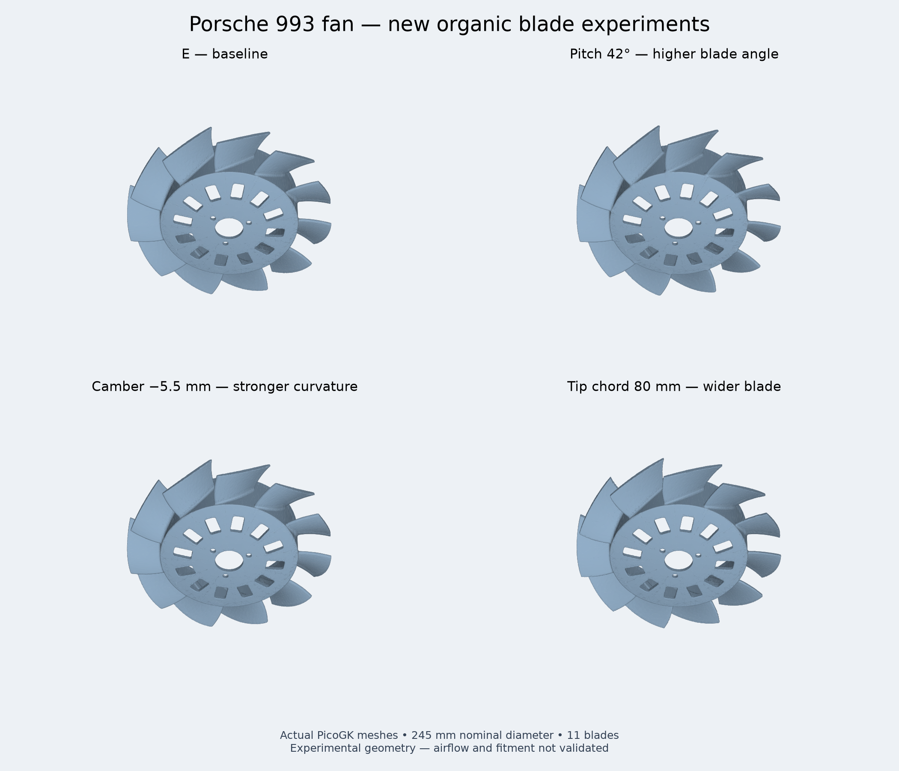

# Airflow experiment checkpoint — 2026-09-29

**STOPPED at the user's request. Research archive only; manufacturing HOLD.**

[Raw outputs and checksums](https://github.com/cluster2600/porscheparts/releases/tag/fan-airflow-sweep-2026-09-29) · [Scientific review](../../AIRFLOW_RESEARCH_2026.md) · [Earlier study archive](https://github.com/cluster2600/porscheparts/releases/tag/fan-organic-study-2026-09-28)

## What actually ran

- Sixteen PicoGK blade candidates around E, holding nominal diameter 245 mm, 11 blades and the mounting assumptions. Dimensions remain design assumptions, not verified PMB fitment.
- The first `twist4` native generation failed with a memory corruption error after writing its rotor. A serial retry completed; both outputs and logs are retained.
- Fifteen candidates passed the one-body, watertight geometric gate and NVIDIA Warp GPU ray screening (92,160 axial rays each). `camber15` was rejected because it contains two disconnected bodies. Ray blockage is not airflow.
- The E mesh audit ran on CUDA using PhysicsNeMo 2.2.2. No neural surrogate was trained.
- The stricter OpenFOAM 14 E fluid mesh still failed extended verification: 11,331 concave cells. The updated runner stopped before the flow solver. No accepted new CFD result, pressure–flow curve or demonstrated airflow gain exists.
- An alternative Gmsh tetrahedral fluid-mesh experiment was interrupted on the stop request. Its partial inputs and log are retained. It produced no accepted flow simulation.
- The comparison image is rendered from generated meshes, decimated only for display.

## Materials and printing

The requested comparison of **AlSi10Mg, Ti-6Al-4V, 316L, PA6-CF and PEEK-CF was not executed** in this campaign. No new material FEA, slicing, thermal printing simulation, multi-material mass comparison or fineness validation is claimed. The geometric screen records only an estimated AlSi10Mg mass using an assumed density of 2670 kg/m³. Carbon refers here to carbon-fibre-filled polymer, not pure carbon.

Research leads retained for later work, with no transfer of process qualification:

- [EOS Ti64 material data](https://www.eos.info/var/assets/05-datasheet-images/Assets_MDS_Metal/EOS_Titanium_Ti64/Material_DataSheet_EOS_Titanium_Ti64_EOSM290_EOSM300-4_EOSM400_EOSM400-4_en.pdf)
- [EOS 316L material data](https://www.eos.info/var/assets/05-datasheet-images/Assets_MDS_Metal/EOS_StainlessSteel_316l/material_datasheet_eos_stainlesssteel_316l_en_web.pdf?v=3)
- [EOS AlSi10Mg material data](https://www.eos.info/var/assets/05-datasheet-images/Assets_MDS_Metal/EOS_Aluminium_AlSi10Mg/Material_Datasheet_EOS_Aluminium_AlSi10Mg_EN.pdf?v=5)
- [Bambu PA6-CF manufacturer information](https://uk.store.bambulab.com/products/pa6-cf?skr=yes)
- [INTAMSYS FUNMAT PRO 410 manufacturer information](https://www.intamsys.com/funmat-pro-410-3d-printer)

## Reproducibility and archival scope

The Git commit contains the sweep source, runner fixes, focused tests, scientific review, input configurations, GPU screen reports, stop receipt and experiment recipes. Recipes preserve the actual job paths and GPU selection; they are historical records, not a portable one-command production workflow. The interrupted tetrahedral recipe is experimental and unvalidated.

Release assets retain generated STL files, generation records/logs, failed and retried geometry, CFD dictionaries/mesh/audits/logs, partial tetrahedral inputs and the comparison image. SHA-256 manifests identify files and packages. Third-party installed runtimes, Python environments, native libraries, caches and core dumps are excluded.

Runtime: PicoGK native 26.2 with .NET 9; Warp 1.17.0; PhysicsNeMo 2.2.2; PyTorch 2.13.0+cu130; OpenFOAM Foundation 14 (14-7b05503f98a8). GPU jobs used physical GPU 3, an NVIDIA RTX PRO 6000 Blackwell Server Edition, exposed as `cuda:0`.

Validation before stopping: five organic-fan tests and three sweep tests passed. `make check` exited 0; its log is retained. These software checks do not qualify the rotor for manufacture or engine operation. The shared GPU instance was left running for unrelated workloads; this study's active meshing process was terminated.
