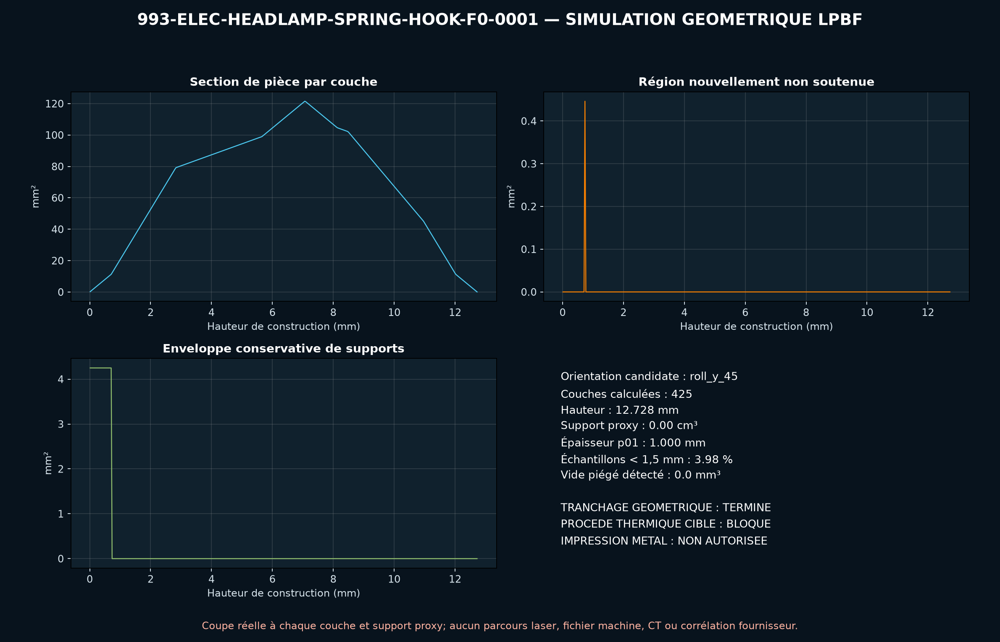

# Criblage géométrique LPBF du crochet de phare F0

Le STEP exact a été maillé puis sectionné sur toute sa hauteur avec une couche
de `30 µm`. Parmi six orientations rigides, `roll_y_45` minimise la surface
projetée descendante dans ce criblage. La construction compte `425` couches,
un seul nouvel îlot, une couche avec région non soutenue et un proxy
conservatif de supports de `3,06 mm³`.

Le maillage est étanche et monocomposant. L'épaisseur locale minimale détectée
sur 4 000 sondes vaut `1,000 mm`; aucun volume de poudre piégé n'est détecté à
la résolution voxel de `0,25 mm`.

Ces résultats ne remplacent ni EOSPRINT, ni les supports fournisseur, ni un
calcul de distorsion, ni le contrôle du recoater. L'impression reste interdite.

