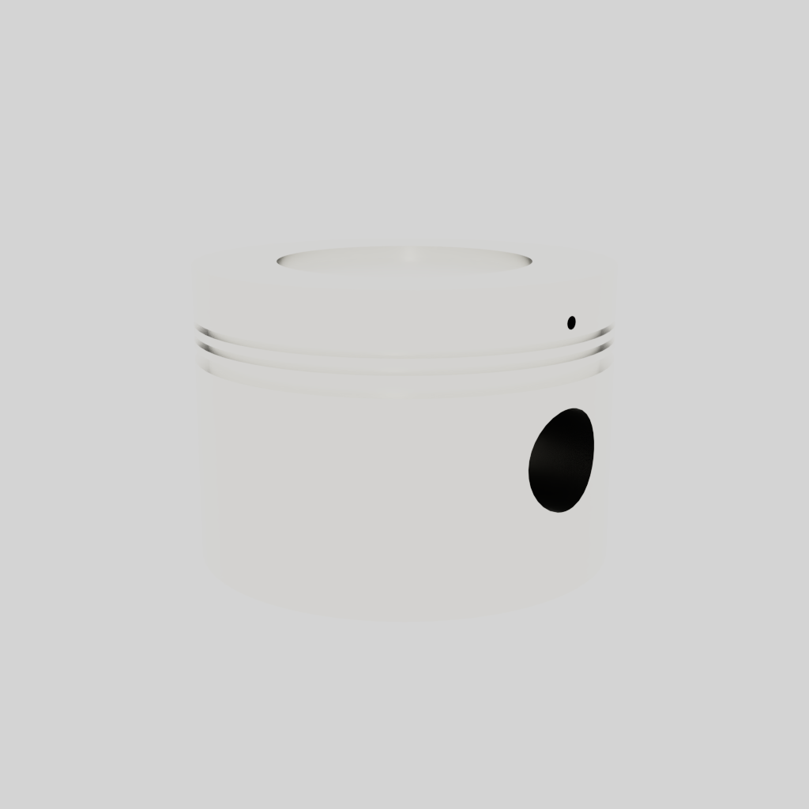

# Validation Omniverse SimReady F0 du piston

Le STEP synthétique du piston a été converti et contrôlé sur un worker GPU
`linux/amd64`. Le USD final passe NVIDIA Asset Validator, les catégories
Geometry et Physics, puis le profil `Prop-Robotics-Neutral 1.0.0`. OVRTX a
produit une image 1024 × 1024 et une rotation de quatre vues avec variation de
pixels vérifiée.

Le Physics Agent avait proposé des coefficients de frottement, une restitution
et une scène de gravité sans source. Ces propriétés ont été rejetées. Le USD
final ne conserve que la masse CAO, la densité CP1 publiée, un rigid body et un
collider `convexHull` pour manipuler la pièce comme accessoire d'inspection
isolé. Le matériau argenté est uniquement visuel.

Ce passage vert valide la structure de l'asset Omniverse, pas la géométrie d'un
piston Porsche, son assemblage moteur, sa tenue thermomécanique ou son
imprimabilité. Les résultats agrégés et les empreintes sont dans
[`simready-validation-summary.json`](simready-validation-summary.json). Le USD
enrichi et les sorties brutes des agents restent hors Git afin de ne pas publier
des prédictions non approuvées comme données d'ingénierie.

