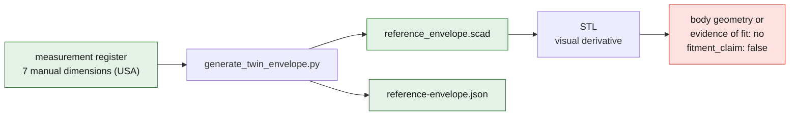

# 993 reference 3D envelope

This directory holds the twin's first 3D object: a parametric bounding and
reference-mark cage for the USA profile of the 993. It is built from seven
dimensions declared in the Porsche manual, not from a scan or a part.

The cage does not represent the body. It contains no curvature, no sourced
overhang, no wheel, no interface and no interior volume. The axles are centered
along the length only to visualize the wheelbase; that position is a graphical
assumption and not a Porsche dimension.

## Source and generation

The editable model is
[`source/reference_envelope.scad`](source/reference_envelope.scad). The manifest
and the mapping to the manual pages are in
[`reference-envelope.json`](reference-envelope.json).

Regenerate both files from the measurement register:

```bash
python3 scripts/generate_twin_envelope.py
```

If OpenSCAD is installed, produce a visualization mesh:

```bash
mkdir -p twins/993-reference-envelope/derived
openscad -o twins/993-reference-envelope/derived/reference_envelope.stl \
  twins/993-reference-envelope/source/reference_envelope.scad
```

The STL is a visual derivative. It is neither body geometry nor evidence of fit.
The manifest therefore keeps `accuracy_mm: null` and `fitment_claim: false`.



## Logical next steps

1. Add the ROW profile once its values and their reference page have been
   recorded in machine form.
2. Acquire body-shell geometry under license, or organize a scan campaign with
   scale, reference marks, uncertainty and reuse rights.
3. Progressively replace the cage with identified surfaces and subassemblies,
   linking each interface to a measurement or a source.
4. Tie the three interior drivers to physical measurements before integrating
   them as fitted geometry.
