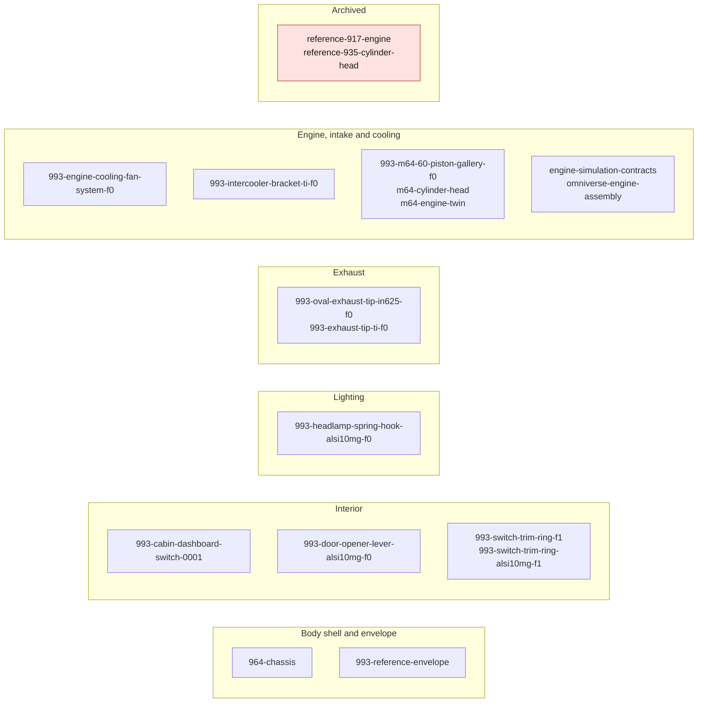

# Digital twins

Each directory below holds the code, contracts and evidence of one digital twin
or one twin workstream. Records live in `catalog/twins/*.json` where one exists;
files under any `evidence/` directory are pinned by SHA-256 digest and never
edited. No twin here releases a part: each page and record states its own
fidelity level and limits. The method, the fidelity levels and the overall state
are in [docs/DIGITAL_TWIN.md](../docs/DIGITAL_TWIN.md).

## Directories

| directory | what it is | source of the line |
|---|---|---|
| [`964-chassis/`](964-chassis/README.md) | 964 floor pan and body-shell frame, steel; `F1_envelope`, with the torsion shell FEA under [`fea/`](964-chassis/fea/README.md) | README, `TWIN-964-CHASSIS-FLOOR-0001` |
| [`993-cabin-dashboard-switch-0001/`](993-cabin-dashboard-switch-0001/) | functional zone of the dashboard switch cover; `F0_reference` | `TWIN-993-CABIN-DASH-SWITCH-0001` |
| [`993-door-opener-lever-alsi10mg-f0/`](993-door-opener-lever-alsi10mg-f0/) | 993 interior door opener lever in AlSi10Mg; `F1_envelope` | `TWIN-993-DOOR-OPENER-LEVER-ALSI10MG-F0` |
| [`993-engine-cooling-fan-system-f0/`](993-engine-cooling-fan-system-f0/) | 993 engine cooling fan housing and impeller subassembly; `F1_envelope` | `TWIN-993-ENGINE-COOLING-FAN-SYSTEM-F0` |
| [`993-exhaust-tip-ti-f0/`](993-exhaust-tip-ti-f0/) | evidence for the titanium F1 variant of the oval exhaust tip (Ti-6Al-4V and Ti-6242 routes, LPBF screen) | part record `993-EXH-OVAL-TIP-TI-F1-0001` |
| [`993-headlamp-spring-hook-alsi10mg-f0/`](993-headlamp-spring-hook-alsi10mg-f0/) | 993 headlamp spring repair hook in AlSi10Mg; `F1_envelope` | `TWIN-993-HEADLAMP-SPRING-HOOK-ALSI10MG-F0` |
| [`993-intercooler-bracket-ti-f0/`](993-intercooler-bracket-ti-f0/) | 993 Turbo/GT2 intercooler bracket in titanium; `F1_envelope` | `TWIN-993-INTERCOOLER-BRACKET-TI-F0` |
| [`993-m64-60-piston-gallery-f0/`](993-m64-60-piston-gallery-f0/) | M64/60 CP1 piston with closed oil gallery; `F1_envelope` | `TWIN-993-M64-60-PISTON-GALLERY-F0` |
| [`993-oval-exhaust-tip-in625-f0/`](993-oval-exhaust-tip-in625-f0/) | 993 oval exhaust tip in IN625; `F1_envelope` | `TWIN-993-OVAL-EXHAUST-TIP-IN625-F0` |
| [`993-reference-envelope/`](993-reference-envelope/README.md) | parametric bounding cage of the 993 USA profile from seven manual dimensions; not the body | README |
| [`993-switch-trim-ring-alsi10mg-f1/`](993-switch-trim-ring-alsi10mg-f1/) | LPBF F1 geometry screen of the switch trim ring; print release blocked | part record `993-INT-SWITCH-TRIM-RING-F1-0001` |
| [`993-switch-trim-ring-f1/`](993-switch-trim-ring-f1/) | switch trim ring F1 reconstruction: LPBF screen, supplier and turning routes; the route concluded it must be turned, not sintered | part record `993-INT-SWITCH-TRIM-RING-F1-0001` |
| [`engine-simulation-contracts/`](engine-simulation-contracts/README.md) | F1 register of engine components, interfaces, candidate materials and load cases; every simulation case blocked | README |
| [`m64-cylinder-head/`](m64-cylinder-head/README.md) | M64 cylinder head work: code, records and receipts; no validated cylinder head | README |
| [`m64-engine-twin/`](m64-engine-twin/) | GPU session manifest of 2026-09-15 for the agent-driven M64 engine twin; manufacturing not authorized | `session-20260915.json`, [deploy page](../deploy/vast/engine-twin/README.md) |
| [`omniverse-engine-assembly/`](omniverse-engine-assembly/README.md) | F0 OpenUSD scenes composing the 917 scan and the 935 valvetrain rig; not a single-engine assembly | README |
| [`reference-917-engine/`](reference-917-engine/README.md) | **archived** — Porsche 917 engine reference twin, iterations F1 to F50 | README, [ARCHIVE.md](../ARCHIVE.md) |
| [`reference-935-cylinder-head/`](reference-935-cylinder-head/README.md) | **archived** — Wolfe Classics 935 cylinder-head scan, reference morphology | README, [ARCHIVE.md](../ARCHIVE.md) |

The catalog also holds `TWIN-993-WHEEL-HUB-INTERFACES-0001` (Fuchs wheel and hub
nominal interfaces), which has no directory under `twins/`.

## Map by vehicle zone

Groupings follow the `scope.zone` of each record and what each README says it
covers.

