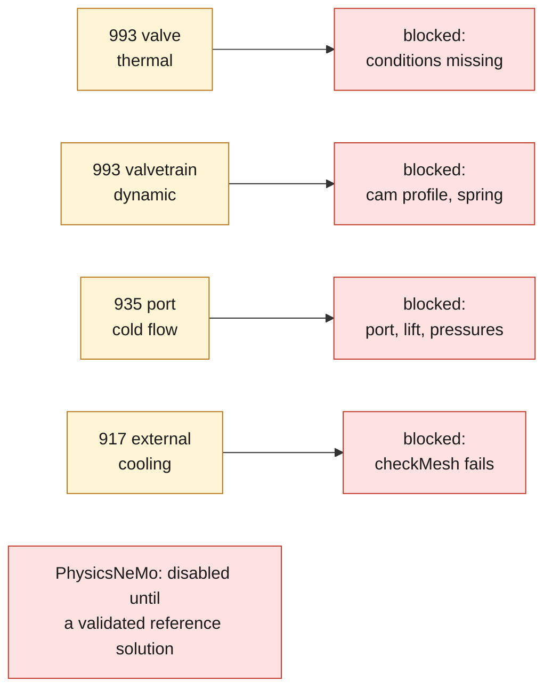

# F1 engine segmentation and simulation contracts

This directory turns the reference geometries into a verifiable register of
components, interfaces, candidate materials and load cases. It contains no scan,
no derived mesh and no USD. Those artifacts stay under `raw-scans/` and `work/`,
outside Git, as instructed by the owner.

## State reached

The geometric refinement of the 917 engine assigns each face to at most one
opening neighborhood. On the local mesh of 599,999 triangles, 118,938 triangles
are distributed among twelve neighborhoods and 481,061 remain in the
unclassified body, i.e. zero overlap by construction. These regions are visible
neighborhoods, not yet manufacturable cylinders.

For the 935 cylinder head, the connectivity split keeps nine external components
of more than 250 triangles. The labels `stud_or_long_fastener` and
`small_external_hardware` are only low-confidence candidates, to be confirmed
visually.

## Reproducible run

```bash
make engine-contracts
make engine-contracts-check
```

The computation uses the immutable image:
`ghcr.io/cluster2600/3dprinting993-mesh-cfd@sha256:a1db60cbf61bbcca52c171e50cab01ed0b6ec860b227e7c5fc50f7b809659b4f`.

## Candidate materials

EOS LPBF Ti-6Al-4V is retained only as a candidate for an intake valve. The
TIMET thermal data are those of a wrought product and serve as a provisional
reference, never as an LPBF equivalent. Aged INCONEL 751 bar is retained as the
candidate reference for the exhaust. None of these data sets is automatically
assigned to the 917 or 935 scans, whose alloys remain unknown.

Primary sources: [EOS Ti64 Grade 5](https://store.eos.info/de/products/eos-titanium-ti64-grade-5),
[TIMETAL 6-4](https://www.timet.com/documents/datasheets/alpha-and-beta-alloys/timetal-6-4.pdf) and
[INCONEL alloy 751](https://www.specialmetals.com/documents/technical-bulletins/inconel/inconel-alloy-751.pdf).

## Readiness matrix

| Case | Geometry | Material | Conditions | State |
|---|---|---|---|---|
| 993 valve, thermal | incomplete proxy | candidate | missing | blocked |
| 993 valvetrain, dynamic | incomplete proxy | candidate | cam profile and spring missing | blocked |
| 935 port, cold flow | two local domains | cylinder head unknown | port, lift and pressures missing | blocked |
| 917 external cooling | mesh failing `checkMesh` | components unknown | flow rate and heat load missing | blocked |



PhysicsNeMo stays disabled. It can only serve as a surrogate model after a
validated reference solution, a mesh-independence study and validation on a
held-out set. USD/Omniverse properties will be assigned only after semantic,
metric and material validation of the components.

## Engine component proxies

`make engine-components` generates locally five STEP masters and their
`display-only` STLs: 993 Turbo piston, PAUTER connecting rod, layout camshaft,
left K16 and right K16. The parameters and their evidence level are in
`engine-components-f1.json`: a declared value and a shape assumption are never
merged into a supposedly measured dimension.

- piston: 100 mm diameter = nominal engine bore, not piston diameter;
- connecting rod: center distance, bores, widths and mass declared; outer contour hypothetical;
- camshaft: layout topology only, profile and timing not measured;
- K16: supplier envelope and masses, catalog wheel diameters on the right-hand side; housings and aerodynamic surfaces hypothetical.
