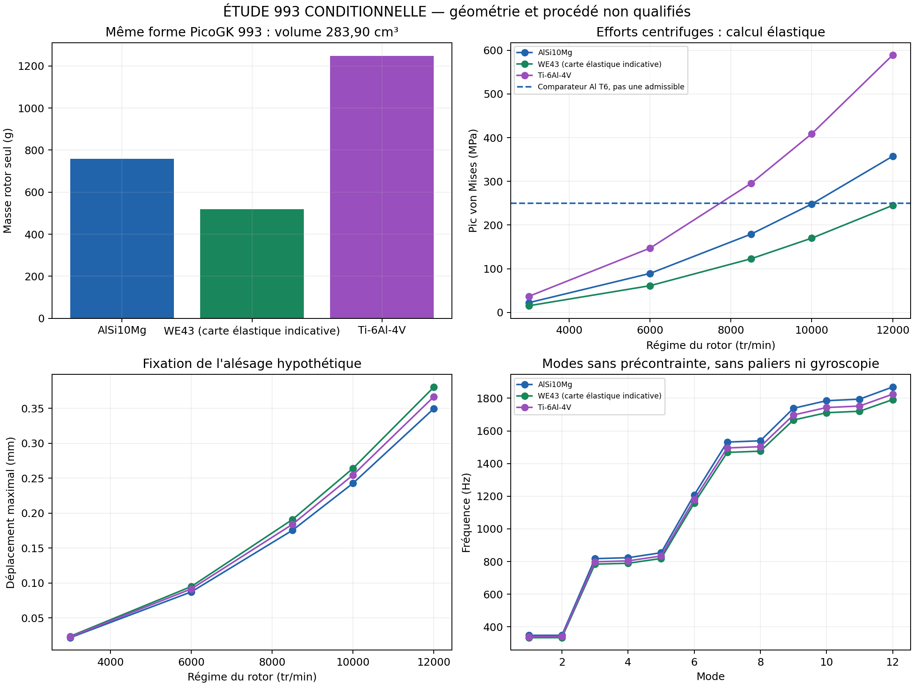

# Rapport comparatif des alliages — ventilateurs 993 et système 935

Étude exécutée le **3 octobre 2026**. Trois calculs centrifuges indépendants
comparent aluminium, magnésium et titane sur le rotor paramétrique PicoGK 993.
Le scan 935 a fait l'objet d'expériences de reconstruction volumique ; leurs
résultats sont rejetés pour les calculs de masse et de résistance.

Les deux programmes restent distincts : 993 à rotor vertical, 935 à rotor
horizontal. Les valeurs ci-dessous concernent le **rotor 993 de référence
visuelle**, dont les dimensions et interfaces ne sont pas mesurées sur la
pièce. Elles ne décrivent ni le rotor 935, ni la masse d'un système complet.

## Résultats à géométrie identique

Volume du rotor fermé : **283,897 cm³**, sans moyeu séparé, inserts, revêtement,
visserie, alternateur, carter ou transmission. La variation de masse et
d'inertie entre matières est calculable ; leur valeur absolue dépend de cette
géométrie hypothétique.

| Matière candidate | Masse rotor | Écart à Al | Inertie polaire | Pic von Mises à 10 000 tr/min | Déplacement maximal à 10 000 tr/min |
|---|---:|---:|---:|---:|---:|
| AlSi10Mg | 758,0 g | référence | 0,005381 kg·m² | 248,21 MPa | 0,2429 mm |
| WE43 magnésium, carte élastique indicative | 519,5 g | −31,5 % | 0,003688 kg·m² | 170,12 MPa | 0,2642 mm |
| Ti-6Al-4V | 1 249,1 g | +64,8 % | 0,008867 kg·m² | 409,03 MPa | 0,2547 mm |

Changer la matière seule n'améliore pas la forme des pales ou le débit d'air.
Le magnésium réduit masse, inertie et contraintes centrifuges, mais sa plus
faible rigidité augmente ici le déplacement d'environ **8,8 %**. Le titane
augmente le déplacement d'environ **4,9 %** et les efforts centrifuges à
géométrie commune. Pour obtenir un rotor titane plus léger, il faut réduire
son volume de plus de **39,3 %** avant même d'égaler la masse aluminium, puis
revérifier racines de pales, modes, jeux, fabrication et fatigue.

## Régimes étudiés et résistance

Les régimes sont ceux du **rotor**, pas ceux du vilebrequin. Ils constituent
des scénarios d'étude ; aucune plage de service ou de surrégime admissible
n'est déterminée. Chaque matière est résolue à 10 000 tr/min. Les autres
points utilisent la dépendance exacte en régime au carré du modèle élastique
linéaire, à géométrie et conditions aux limites fixes.

| Régime rotor | Pic AlSi10Mg | Pic WE43 | Pic Ti64 |
|---|---:|---:|---:|
| 3 000 tr/min | 22,34 MPa | 15,31 MPa | 36,81 MPa |
| 6 000 tr/min | 89,36 MPa | 61,24 MPa | 147,25 MPa |
| 8 500 tr/min | 179,33 MPa | 122,91 MPa | 295,53 MPa |
| 10 000 tr/min | 248,21 MPa | 170,12 MPa | 409,03 MPa |
| 12 000 tr/min | 357,42 MPa | 244,97 MPa | 589,01 MPa |

Le comparateur de limite d'élasticité aluminium est **250 MPa** sur
éprouvettes EOS M290/30 µm avec T6 ; pour le titane, **1 000 MPa** sur
éprouvettes EOS M290/60 µm traitées 800 °C/2 h sous argon. Les rapports
comparateur/pic à 10 000 tr/min sont environ **1,01** et **2,44**. Ce ne sont
pas des coefficients de sécurité validés. Le cas aluminium à 12 000 tr/min
dépasse son comparateur : le résultat élastique ne prédit alors pas la
déformation réelle ou la rupture. [EOS aluminium](https://www.eos.info/metal-solutions/data-sheets/all-processes-and-materials?id=eos-aluminium-alsi10mg),
[EOS titane](https://www.eos.info/metal-solutions/data-sheets/all-processes-and-materials?id=eos-titanium-ti64).

La limite de traction du WE43 **imprimé selon notre futur procédé** reste
inconnue. Les résultats publiés en compression ou flexion ne peuvent pas
servir de limite de traction du rotor. La recherche expérimentale disponible
montre également une dépendance des défauts et propriétés à la géométrie et
au lot d'impression. [Julmi et al., étude LPBF WE43](https://pmc.ncbi.nlm.nih.gov/articles/PMC7918529/).

## Vibrations, énergie et provenance numérique

Un calcul modal sans précontrainte produit douze modes sur la même référence
aluminium. Les deux autres séries modales sont obtenues par similitude
élastique exacte : fréquence proportionnelle à √(E/ρ), puisque géométrie,
appuis et coefficient de Poisson sont communs. Le [résultat JSON](results/comparison.json)
identifie les calculs réellement résolus et les extrapolations.

| Carte | Premier mode sans précontrainte | Méthode |
|---|---:|---|
| AlSi10Mg | 348,26 Hz | Calcul modal CalculiX exécuté |
| WE43 | 333,89 Hz | Similitude élastique à partir du cas aluminium |
| Ti64 | 340,08 Hz | Similitude élastique à partir du cas aluminium |

Le [tableau CSV](results/rpm-sweep.csv) inclut masse, inertie, énergie cinétique,
vitesse périphérique, fréquence de rotation et passage des onze pales pour
quinze cas matière/régime. Les modes calculés n'intègrent ni précontrainte
centrifuge, gyroscopie, appuis souples, amortissement ou contact : ils ne
constituent pas un diagramme de Campbell. Le débit installé et la durée de
vie en fatigue restent indéterminés.



[Graphiques PDF](results/comparison.pdf).

Les trois calculs statiques CalculiX **2.23**, réexécutés sur **Kali2 Linux
natif x86_64 / ext4** avec utilisateur non-root, couvrent chacun **86 640
tétraèdres quadratiques et 164 869 nœuds**. Tous les éléments et déplacements
sont contrôlés dans les sorties. Les calculs magnésium et titane vérifient
indépendamment la similitude attendue en densité et module. Le maillage
provient du [deck modal archivé](../993-engine-cooling-fan-system-f0/results/program-20261003/modal/modal.inp.gz),
relié à la surface PicoGK d'origine par son
[audit de réduction](../993-engine-cooling-fan-system-f0/results/organic/structure/reference-structure-50k/surface-audit.json).
La masse utilise la revue fermée de 80 000 triangles ; la surface du maillage
structurel possède 50 000 triangles. Les deux dérivent de la même surface
d'origine, avec erreurs volumiques de réduction inférieures à 0,02 %.
Cette vérification géométrique n'établit pas la convergence des pics de
contrainte ; l'indépendance au maillage reste à démontrer.

Les cartes et les résultats sont des approximations isotropes à 20 °C.
E vaut 70 GPa pour l'aluminium, 44,1 GPa pour le magnésium, 110 GPa pour le
titane ; ν = 0,33 commun est une hypothèse pour isoler les effets de densité
et rigidité. E aluminium est une hypothèse d'étude. La carte magnésium
emprunte densité et module au WE43C corroyé, sans les déclarer mesurés sur
une pièce LPBF. [Luxfer Elektron 43](https://www.luxfermeltechnologies.com/elektron-43/).
Voir les [cartes matière et leur portée](materials.json).

Le blocage de l'alésage est hérité du modèle hypothétique ; il doit être
remplacé par le contact arbre/moyeu et les appuis mesurés. Les contraintes
aérodynamiques, thermiques, résiduelles, les défauts d'impression, l'anisotropie,
la fatigue et l'équilibrage ne sont pas calculés dans cette comparaison.

## Résultat de la reconstruction 935

PicoGK **26.2.0** a exécuté deux voxelisations du scan préparé, aux résolutions
conditionnelles de **0,65 et 0,40 unité source**, avec l'hypothèse explicite
1 unité = 1 mm. Les résultats sont fragmentés et leur volume varie d'un
facteur d'environ **9,7**. Une inversion globale de l'orientation des faces
ne corrige pas le résultat. Le témoin fermé 993 est correctement voxelisé,
avec écart de volume inférieur à 1 %. L'échec est donc spécifique à la
reconstruction de ce scan ouvert, pas un calcul de poids de la 935.

Le rotor 935 préparé conserve **58 contours de bord**, dont un s'étend sur
plus de cent unités source. Refermer arbitrairement ces contours pourrait
modifier des pales, le moyeu et les passages d'air. L'échelle, la réparation
des surfaces et le raccordement de la face arrière doivent être établis avant
de retenir un volume. L'entraînement extérieur ne révèle pas ses arbres,
denture, jeux, roulements ou cavités internes.

Le [modèle système 935](../935-horizontal-cooling-system-f0/README.md) garde
ses dix-sept interfaces, les composants et domaines de calcul propres.
Leur assemblage mécanique et les charges transmises ne sont pas établis par
les deux maillages extérieurs. La masse totale, la résistance de la 935,
ses vitesses critiques et son débit utile restent **non calculés**.
Les questions de mesure et d'identification sont déjà préparées pour Wolfe.

## Fichiers et suite de conception

Les [sources exécutables](source/compare_alloys.py) conservent les données
historiques et créent de nouveaux cas. Le [générateur du rapport](source/build_comparison_report.py)
produit JSON, CSV, graphiques et trois fichiers OpenUSD portant géométrie,
carte matière, masse, inertie et résultats. Les fichiers USD et les sorties
natives intégrales sont conservés dans le dossier privé du calcul ; les
résumés et graphiques de la référence paramétrique sont publiés ici.

Pour reproduire la référence, utiliser Python avec numpy, trimesh, matplotlib
et usd-core, puis CalculiX 2.23. Depuis la racine du dépôt, dans un nouveau
dossier ignoré :

```sh
python3 twins/fan-alloy-comparison-f0/source/extract_reference_geometry.py \
  twins/993-engine-cooling-fan-system-f0/results/reference/reference.usdz \
  work/fan-alloy-rerun
python3 twins/fan-alloy-comparison-f0/source/compare_alloys.py \
  twins/993-engine-cooling-fan-system-f0/results/program-20261003/modal/modal.inp.gz \
  twins/fan-alloy-comparison-f0/materials.json \
  work/fan-alloy-rerun/993-cases
```

Exécuter `ccx -i rotor > log.rotor` dans chacun des trois dossiers matière,
puis `ccx -i modal > log.modal` dans le dossier aluminium. Les essais privés
935 et le témoin fermé utilisent le
[programme ScanScreen](../935-horizontal-cooling-system-f0/source/picogk-scan-screen/Program.cs),
compilé contre PicoGK 26.2.0 avec son runtime natif. Chaque appel reçoit
OBJ préparé, SHA-256 attendu, échelle supposée, résolution et nouveau dossier.
Le générateur exige les reçus et contrôle l'intégrité des sorties avant de
publier les résultats ; les scans privés ne sont pas fournis par le dépôt.

La prochaine itération géométrique doit modifier racines et sections de pales
avec objectifs communs de masse, jeu, résistance et performances aérodynamiques.
Le magnésium est intéressant pour la masse ; le titane demande une réduction
de volume ; l'aluminium fournit le premier comparateur industriel. Aucun
alliage n'est retenu définitivement. Le dossier d'impression inclura
orientation, supports, traitements, reprises d'usinage, inspection, fatigue,
protection et isolation galvanique, conformément au
[dossier fabrication additive](../../docs/research/935-horizontal-cooling/ADDITIVE_MATERIALS.md).

Ces fichiers sont des **jumeaux d'étude non calibrés**. Ils ne démontrent ni
montage sur moteur, essais physiques, plage de régime admissible ou autorisation
de fabrication.
