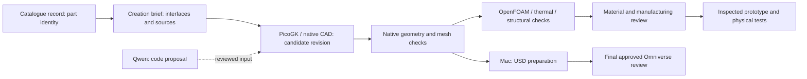
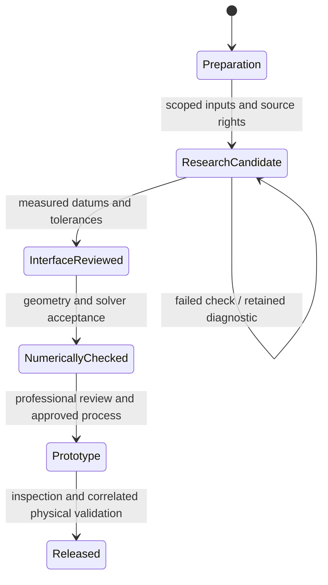

# Part 01 — M64 cylinder-head creation

Active catalogue record: [993-ENG-CYLINDER-HEAD-4V-F0-0001](../../catalog/parts/993-eng-cylinder-head-4v-f0-0001.json).
The [creation sequence](../m64-engine-system/creation-sequence.json) keeps the
cylinder head first, followed by the existing valve, cover, intake, exhaust,
intercooler and fan records. A queued part is not an approved design.

## Design brief and retained work

Continue the [existing finned four-valve target](README.md): two intake and two
exhaust valves per cylinder, with twin ignition as an unresolved packaging
requirement. Preserve the native body and interface history. Do not substitute
the old synthetic G7 block, a generic oval envelope or a catalogue photograph.
The [interface contract](interface-contract.json) remains the dimensional
authority and explicitly distinguishes stock, benchmark and unselected values.

Existing geometry includes a private 13-solid body/valve/seat/guide assembly and
later spring-pocket/support studies. Those are prior experiments, not a newly
qualified head. Use their exact recorded revisions and gates before any edit.
The 935 proxy scan does not establish the dimensions of an exact M64/60 donor.
Physical access to that donor remains unconfirmed. No private scan, STEP, BRep,
photograph or coordinate-bearing derivative is added to the public project page.

## Catalogue research — checked 1 October 2026

[PorscheFanatics' 993 engine specification](https://porschefanatics.com/engine/993/)
provides assembly context and links to its
[Swindon head-kit record](https://porschefanatics.com/parts/swindon-24v-head-kit-m64/).
Its 4.0-litre build specification is distinct from this project's 3.6-litre
historical baseline and does not silently change our bore, stroke or loads.

The [manufacturer's primary page](https://swindonpowertrain.com/products/24-valve-porsche-911-m64-cylinder-head-kit/)
publishes the following useful comparison values:

| Published Swindon benchmark | Value | Use here |
|---|---:|---|
| Intake valve diameter / lift | 40 / 11.5 mm | Comparison only |
| Exhaust valve diameter / lift | 33 / 9.6 mm | Comparison only |
| Bore range | 95–102.7 mm | Supplier compatibility claim |
| Nominal compression ratio | 11.5:1–12:1 | Not a selected turbo requirement |

These values describe Swindon's product; they are neither measurements nor
manufacturing dimensions for our head. The published valve-train capability
does not establish our safe speed, power, durability or boost pressure.
No supplier text or geometry enters the training dataset: this continuation
uses newly authored synthetic graph instructions only.

## First executable work package

| Step | Input / existing implementation | Output and acceptance |
|---|---|---|
| 1. Freeze identity | Catalogue record, interface contract, exact private body/assembly hashes | Explicit variant and input manifest; no substitute geometry |
| 2. Close dimensional gaps | Exact donor metrology: head/barrel register, stud centres, sealing plane, port mouths, cam carrier and oil interfaces | Measured datums, uncertainty and coverage; internal passages need CT or another justified method |
| 3. Review the retained CAD | [Native integration producer](source/wholebody/build_extended_valve_assembly_v2.py) and [body BOP audit](source/wholebody/audit_native_bop.py) | Native readback, component identity, protected interfaces and new-revision checks |
| 4. Add bounded new geometry | [PicoGK source](source/picogk/README.md), [cooling fields](source/picogk-cooling/README.md), documented feature hypothesis | Compile and native checks, local deviation/wall/connectivity audit; never a global unreviewed replacement |
| 5. Prepare solver domains | [Gas-domain work](source/flowbench-intake/README-gas-domain.md), named inlet/outlet/walls and solid regions | Connected, quality-accepted meshes before OpenFOAM/thermal/structural results |
| 6. Qualify manufacturing | Selected alloy/process, machining stock, powder evacuation, hot-property and fatigue data | Reviewed process plan, coupons, inspection and correlated tests before release |

The current task completes the identity/research preparation. Steps requiring
new measurements remain open; none is marked passed merely because software ran.
Existing native geometry work can continue as a separate, explicitly uncalibrated
research candidate while those inputs are acquired.

## Architecture and part lifecycle

This applies the [project's tailored TOGAF/ArchiMate/UML practice](../../docs/architecture/README.md).
The requirement is traceable creation of one catalogue part. The catalogue owns
identity; the engineering twin owns geometry and numerical evidence; the project
page reports reviewed milestones; the model produces proposals only.

Mac training and USD tools are available. The planned Kali geometry/solver roles
remain as documented; current SSH endpoints are still needed to dispatch jobs.
Vast is reserved for the final separately approved Omniverse work.

## AI acceptance

The [completed coding experiment](../../training/m64-qwen/coding-results.md)
passes only 1/16 fresh PicoGK graphs. The
[focused continuation](../../training/m64-qwen/focused-results.md) reaches 40/40
PicoGK validation passes but loses USD passes and is not promoted. Its new final
test set remains unopened. Do not feed unconstrained generated
code directly into the native head, a solver or a printer.
