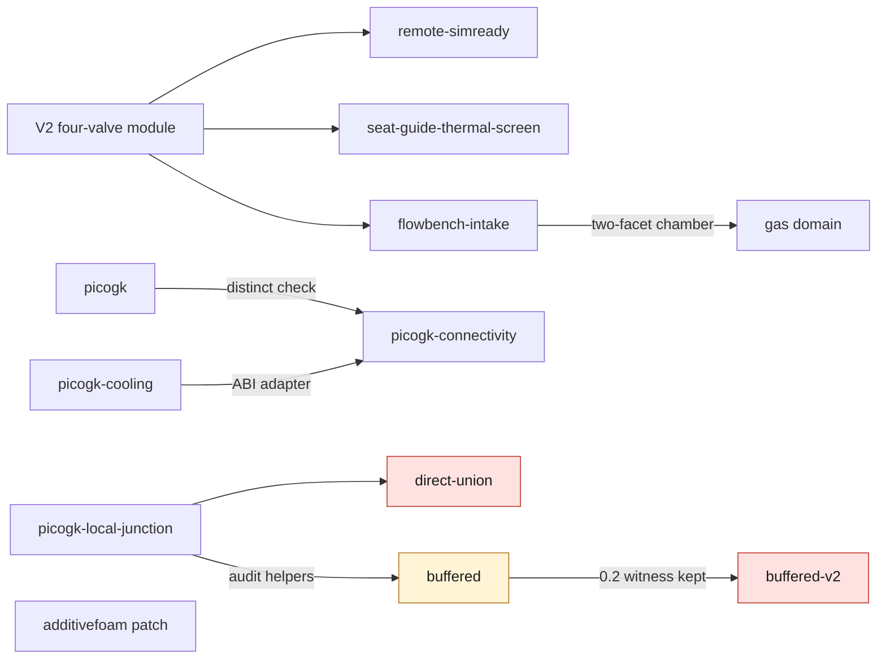

# M64 cylinder head twin

This directory holds the code, records and receipts of the M64 cylinder head
work. This page is only an index of its README pages. Each page states its own
limits; none of them establishes a validated cylinder head, an engine
simulation or a manufacturing authorization.

Files under [`evidence/`](evidence/) are pinned by SHA-256 digest and are never
edited. The B-Reps, STEPs, scans and detailed coordinates stay private; only
code, tests and aggregates with digests are published.

Latest support experiment: [G14 targeted stiffening](../../docs/reports/M64_G14_TARGETED_SUPPORTS_20260926.md).
The cold isolated central support reaches 0.03838 mm at 1.5 mm mesh size;
the latest outer intake-web trial reaches 0.03763 mm on the 2 mm coarse mesh.
Both pass numerical cross-checks,
but 1.5→1 mm convergence and the overall 0.040 mm gate remain open.
The [G7 cooling study](../../docs/reports/M64_G7_LOCAL_SUPPORTS_COOLING_20260925.md)
is unchanged. Journal clearance, heat rejection and AM gates remain open or
failed. This is not a manufacturing release.
The [G6 baseline](../../docs/reports/M64_G6_CARRIER_THERMAL_AM_20260925.md) is retained unchanged.

Current native CAD views: isolated outer support and a cut through its intake
web, **not the complete cylinder head**. Export provenance and checks are in
the [G14 report](../../docs/reports/M64_G14_TARGETED_SUPPORTS_20260926.md#actual-cad-views--isolated-supports-only).

| Actual support | Cut at x = −30 mm |
|---|---|
|  |  |

## Sub-pages

| page | one line |
|---|---|
| [remote-simready](remote-simready/README.md) | Omniverse/SimReady conversion and inspection of the 4V V2 sub-assembly on Vast; last attempt closed after a Material Agent failure |
| [seat-guide-thermal-screen](seat-guide-thermal-screen/README.md) | Analytical seat/body and guide/body interference screen; no manufacturing interference fit can be retained yet |
| [source/flowbench-intake](source/flowbench-intake/README.md) | 6 mm intake and two-facet candidate chamber: a private CAD modification, not a flow-bench domain |
| [source/flowbench-intake, gas domain](source/flowbench-intake/README-gas-domain.md) | Cold flow-bench gas domain: pass 05 BRep-valid, `bop_no_faults` false, one diagnostic meshing attempt only |
| [source/additivefoam](source/additivefoam/README.md) | One-line Marangoni `assignable()` patch for OpenFOAM 14, with input/output digests; not a cylinder head qualification |
| [source/picogk](source/picogk/README.md) | PicoGK voxel round trips of the existing body at 0.6 / 0.3 / 0.15 mm and their resumable audit |
| [source/picogk-cooling](source/picogk-cooling/README.md) | Four named geometric fields (body, complement, core, skin) and the one-byte ABI adapter; not a cooling domain |
| [source/picogk-connectivity](source/picogk-connectivity/README.md) | Sampled void connectivity from the boundary; no isolated component on the step-1.2 grid only |
| [source/picogk-local-junction](source/picogk-local-junction/README.md) | Local morphological closing witness; stopped at the witness on raw-mesh defects |
| [source/picogk-local-junction-direct-union](source/picogk-local-junction-direct-union/README.md) | Direct-union variant; rejected (field changes outside the ROI, raw-mesh screen) |
| [source/picogk-local-junction-buffered](source/picogk-local-junction-buffered/README.md) | Inner-mask variant at step 0.2; `declared_exploratory_screen_pass` for the normalized chain only |
| [source/picogk-local-junction-buffered-v2](source/picogk-local-junction-buffered-v2/README.md) | Step 0.1 with a fixed world mask; comparison rejected |

## How the pages relate

Only the links that the pages themselves state are drawn.

