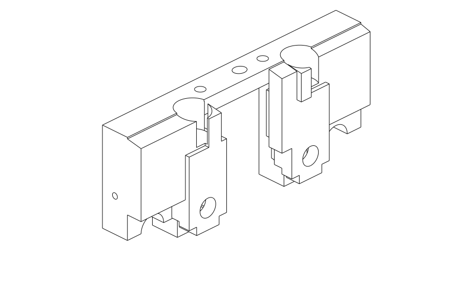
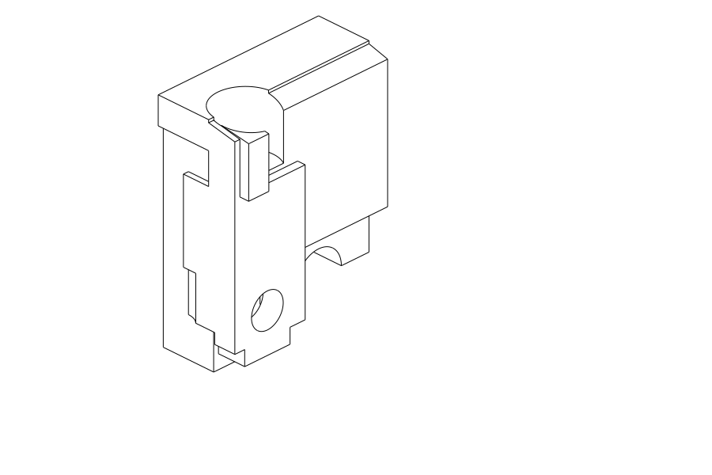
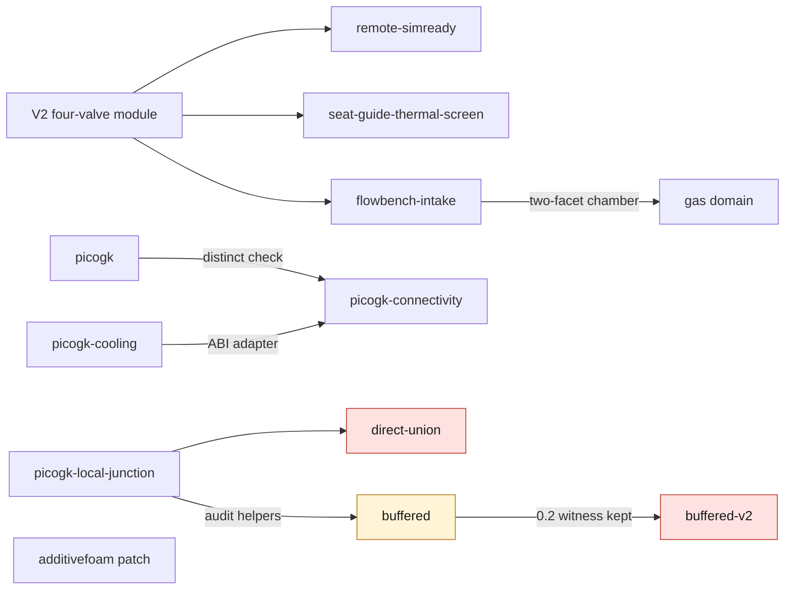

# M64 cylinder head twin

## Product target — complete finned four-valve head

The user's reference, reaffirmed on 27 September 2026, is the individual,
finned FVD 993 GT2 Evo 3.8 L twin-ignition head shown in their screenshots
(reference **99310401188BF**). The requested product is a **four-valve M64
head: two intake and two exhaust valves**, not an isolated distribution support.

Preserve the reference exterior and engine interfaces unless a documented
thermal, mechanical or mass benefit justifies a change. Do not introduce an
oval replacement envelope. The scan remains the geometry reference; these
photographs are not dimensional measurements. Retaining twin ignition is a
packaging/combustion requirement to evaluate, not proof that four valves and
two plugs already fit. The engine target remains the requested 700 hp turbo
study, not a demonstrated output.

The full assembly must include the chamber, ports, fins, seats, guides,
valves, springs, actuation and lubrication. Internal oil cooling is a candidate
to evaluate for heat rejection, pressure loss and manufacturability, not an
already qualified solution. The reference photographs remain private because
no republication licence is recorded.

**The G14 pictures below show only distribution supports. They are not a
render or a completed version of this full cylinder-head target.**

Current priority: [complete-head integration](../../docs/reports/M64_COMPLETE_HEAD_INTEGRATION_20260927.md).
The retained scan-derived four-pocket body and V2 valve module are distinct
from the synthetic G7 head and its distribution: their included valve angles
are 16° and 56.9294°. Those assemblies cannot be combined by repositioning.
The next work uses explicitly identified whole-body inputs; there is no
fallback to the G7 block or an oval substitute.
The retained source for these whole-body iterations is the exhaust-equipped V5, not
the earlier intake-only body. Its
[geometry checkpoint](../../docs/reports/M64_GEOMETRY_CHECKPOINT_20260908.md)
already records five passed BOP modes, attributed serialization differences
and unresolved mesh/assembly/physical gates. These earlier passes must not
be reported as new work or as fabrication approval.

New on September 27: a native **13-solid integration checkpoint** combines
that V5 body with the exact four valves, four seats and four guides. Its
save/readback and component identities were checked, and full/cutaway views
were rendered. This is not yet the complete head: actuation, springs, plugs
and oil circuits remain to be integrated. See the
[actual outputs and their fingerprints](../../docs/reports/M64_COMPLETE_HEAD_INTEGRATION_20260927.md#new-native-assembly-and-actual-views).
Geometry and rendered derivatives remain private under the scan source policy;
the producer, tests and evidence summary are published.

The [next spring-packaging audit](../../docs/reports/M64_COMPLETE_HEAD_INTEGRATION_20260927.md#spring-packaging--actual-whole-body-interference-check)
finds that 67–95% of the nominal spring envelopes overlap the existing body.
Low spring-pocket cuts would break into the ports. A higher layout clears
the port-distance screen but requires longer stems and unresolved exhaust
spring-seat support. It is not a fitted spring kit or manufacturing approval.
A [new body-only prototype](../../docs/reports/M64_COMPLETE_HEAD_INTEGRATION_20260927.md#actual-body-pocket-prototype-built)
now has those four higher pockets: one native valid solid after readback and
no intersection with the four nominal spring envelopes. The master remains
unchanged. At that checkpoint, longer valves and the full actuator assembly
were not modeled; the previous V5 BOP result did not validate that newly cut body.

Latest whole-body advance: [two local exhaust spring-seat pads](../../docs/reports/M64_WHOLEBODY_SUPPORT_GPU_20260927.md)
complete all four nominal washer footprints on the saved body. They add about
135.07 scan units³ and change the local fin contour for this functional reason,
without changing the overall bounding box. Native BRep validity is not a hot
strength or cooling qualification. The same report records the bounded Vast
whole-body BOP, mesh and PhysicsNeMo diagnostics and the PorscheFanatics page.
The next saved 13-solid assembly now includes four +23-unit valve-stem
extensions and eight clear body-intersection checks at closed/full-lift
positions. The padded body passes its own new BOP audit, but all three volume
meshes and the strict PhysicsNeMo area comparison remain rejected. Actuation,
continuous motion, hot strength, cooling and print qualification remain open.

September 28 [precision and local remeshing continuation](../../docs/reports/M64_MESH_PRECISION_RECOVERY_20260928.md):
the cross-product area method passes a new 80/120-digit CPU audit on the current
surface. A 155-face MeshAdapt trial reduces inadequate tetrahedra from 1,314 to
160 against a same-Mac control. Geometry is unchanged, the volume-mesh gate
still fails, and the previous GPU refusal is not rewritten as a pass.

The [actual PhysicsNeMo / PicoGK continuation](../../docs/reports/M64_NEMO_PICOGK_CONTINUATION_20260928.md)
then reduces 160 to **145** inadequate tetrahedra using PhysicsNeMo automatic
differentiation with every boundary vertex fixed. Native PicoGK roundtrips are
generated separately and independently screened; none replaces the BRep or
qualifies the head for printing. Both tools ran locally, with no new Vast rental.

The [CAD-constrained continuation](../../docs/reports/M64_CAD_CONSTRAINED_MESH_20260928.md)
then tests three surface/volume strategies and a protected coplanar-partition
candidate. The best new count is 128 deficient tetrahedra, but its minimum
quality is worse: no new mesh is adopted. A separate 4,917-face BRep candidate
passes exact native readback and its own BOP audit, but fails numerical integral qualification and
does not replace the reference body or valve assembly.

The [2026 mesh-tool and volume-control investigation](../../docs/reports/M64_MESH_VOLUME_TOOLCHAIN_20260928.md)
then localizes the quadrature discrepancy to five B-spline patches. An independent,
knot-split flux integration brings the reconciled relative spread to 1.55e-11.
Native Netgen and conforming DelMesher trials are rejected. fTetWild produces
1,157,489 tetrahedra with no element below minSICN 0.1, but two disconnected
regions remain: it is not yet an accepted head mesh or a manufacturing release.
The subsequent 17.2-million-triangle PicoGK audit also rejects the global
roundtrip: six surface components and directional sampled maxima 0.112/0.069,
above the 0.040 provisional-unit screen. The tighter fTetWild repeat times out
without a final mesh. No rejected output replaces the native head.

The [junction and AM continuation](../../docs/reports/M64_JUNCTION_AM_SCREEN_20260928.md)
locates the rejected island at a native knife-edge and produces an actual CAD
section. Spatial refinement reduces poor tetrahedra to 122 without modifying
the body, but still fails the quality gate. The subsequent fTetWild trial has
1,121,049 tetrahedra, one connected region and no element below minSICN 0.1.
Its independent audit still finds 14 coincident vertex records; native-CAD
deviation and junction topology remain unqualified. Full-height geometric slicing is
completed at two layer increments, including 3,426 layers for the finer run.
Sparse thickness and two-resolution powder-connectivity screens retain their
alerts; neither is a thermal/distortion simulation or permission to print.

The [physics and AM continuation](../../docs/reports/M64_PHYSICS_AM_CONTINUATION_20260928.md)
then demonstrates why the 14 coincident pairs cannot safely be welded. It
compares 24 original/extended valve material-and-bore cases, without selecting
a hot-qualified valve. Two real AdditiveFOAM reference-track thermal runs
complete through heating and cooling; their peak temperatures differ by
0.553%. This is an IN625 software reference, **not an aluminium-head printing
simulation**, and it does not clear the prior head geometry/material gates.

## Evidence and current work

This directory holds the code, records and receipts of the M64 cylinder head
work. This page is only an index of its README pages. Each page states its own
limits; none of them establishes a validated cylinder head, an engine
simulation or a manufacturing authorization.

Files under [`evidence/`](evidence/) are pinned by SHA-256 digest and are never
edited. The B-Reps, STEPs, scans and detailed coordinates stay private; only
code, tests and aggregates with digests are published.

Latest support experiment: [G14 targeted stiffening](../../docs/reports/M64_G14_TARGETED_SUPPORTS_20260926.md).
The cold isolated central support reaches 0.03838 mm at 1.5 mm mesh size;
the latest outer intake-web trial reaches 0.03763 mm on the 2 mm coarse mesh.
Both pass numerical cross-checks,
but 1.5→1 mm convergence and the overall 0.040 mm gate remain open.
The [G7 cooling study](../../docs/reports/M64_G7_LOCAL_SUPPORTS_COOLING_20260925.md)
is unchanged. Journal clearance, heat rejection and AM gates remain open or
failed. This is not a manufacturing release.
The [G6 baseline](../../docs/reports/M64_G6_CARRIER_THERMAL_AM_20260925.md) is retained unchanged.

Current native CAD views: isolated outer support and a cut through its intake
web, **not the complete cylinder head**. Export provenance and checks are in
the [G14 report](../../docs/reports/M64_G14_TARGETED_SUPPORTS_20260926.md#actual-cad-views--isolated-supports-only).

| Actual support | Cut at x = −30 mm |
|---|---|
|  |  |

## Sub-pages

| page | one line |
|---|---|
| [remote-simready](remote-simready/README.md) | Omniverse/SimReady conversion and inspection of the 4V V2 sub-assembly on Vast; last attempt closed after a Material Agent failure |
| [seat-guide-thermal-screen](seat-guide-thermal-screen/README.md) | Analytical seat/body and guide/body interference screen; no manufacturing interference fit can be retained yet |
| [source/flowbench-intake](source/flowbench-intake/README.md) | 6 mm intake and two-facet candidate chamber: a private CAD modification, not a flow-bench domain |
| [source/flowbench-intake, gas domain](source/flowbench-intake/README-gas-domain.md) | Cold flow-bench gas domain: pass 05 BRep-valid, `bop_no_faults` false, one diagnostic meshing attempt only |
| [source/additivefoam](source/additivefoam/README.md) | One-line Marangoni `assignable()` patch for OpenFOAM 14, with input/output digests; not a cylinder head qualification |
| [source/picogk](source/picogk/README.md) | PicoGK voxel round trips of the existing body at 0.6 / 0.3 / 0.15 mm and their resumable audit |
| [source/picogk-cooling](source/picogk-cooling/README.md) | Four named geometric fields (body, complement, core, skin) and the one-byte ABI adapter; not a cooling domain |
| [source/picogk-connectivity](source/picogk-connectivity/README.md) | Sampled void connectivity from the boundary; no isolated component on the step-1.2 grid only |
| [source/picogk-local-junction](source/picogk-local-junction/README.md) | Local morphological closing witness; stopped at the witness on raw-mesh defects |
| [source/picogk-local-junction-direct-union](source/picogk-local-junction-direct-union/README.md) | Direct-union variant; rejected (field changes outside the ROI, raw-mesh screen) |
| [source/picogk-local-junction-buffered](source/picogk-local-junction-buffered/README.md) | Inner-mask variant at step 0.2; `declared_exploratory_screen_pass` for the normalized chain only |
| [source/picogk-local-junction-buffered-v2](source/picogk-local-junction-buffered-v2/README.md) | Step 0.1 with a fixed world mask; comparison rejected |

## How the pages relate

Only the links that the pages themselves state are drawn.

