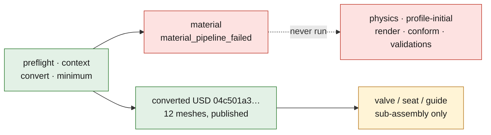

# M64 run in Omniverse: separate, traceable steps

This directory prepares the **conversion and inspection of the 4V V2
sub-assembly**, not an engine simulation or a manufacturing authorization. The
[STEP and its geometric checks](../../../docs/reports/M64_FOUR_VALVE_DISTRIBUTION_MODULE_20260907.md)
do not yet contain the cylinder head body, the piston, the springs or the
camshafts. No private scan is transferred by this bundle.


*The V2 sub-assembly this bundle converts, as local CAD views (labels in
French). It shows the 12 solids and their sections; it is not an Omniverse
execution, and it proves no contact, thermal, strength or engine behavior.*

## State verified on September 7, 2026

- Dependencies and the real NVIDIA `conversion,validation` preflight: `ready`
  on Kali CPU; [receipt](../../../tests/manual/m64_simready_pinned_runtime_cpu_receipt.json).
- Twelve NVIDIA references: loading of their CLIs confirmed. This does not mean
  that their operations or the GPU services were executed.
- The derived image is published publicly and associated with the `porscheparts`
  repository:
  `ghcr.io/cluster2600/3dprinting993-simready-m64-runtime@sha256:a07ee46d5dbfe73193cfd0d3829c0dc3e69aed95ab82841a89c18828cea85f44`.
  The [separate qualification](https://github.com/cluster2600/porscheparts/actions/runs/34123205685)
  finished successfully at 13:01 UTC: `linux/amd64`, layer limits, anonymous
  download and the M64 smoke pass. The first build workflow was stopped during
  its cache export, after publication; it is not cited as a successful CI. The
  SSH test in this qualification checks the concurrent initialization of
  `sshd`, **not client authentication**, nor key injection by Vast. The
  [qualification receipt](../evidence/runtime-image-qualification-20260907.json)
  keeps that distinction and the build and check commits.
- The approved wrapper was installed with the M64 code pinned at
  `f841e5e572103acda304e62a3a7fe7dc3c0dce128defa301d2c5373fcd76c805`.
  Its local check and its OpenBao authentication pass; the Vast inventory was
  empty at the prior check. The source code now fixes the qualified M64 digest
  in `M64_SIMREADY_IMAGE`, separate from the historical F42b digest
  `SIMREADY_IMAGE`. The first installation separating these profiles carried
  SHA256 `84c90cdc5bcaa04d43594305feb9648ddde317b4dbccd1898c5f92b0c6775ee8`;
  the current version is given below.
- The [real isolated SSH test on the full M64 image](../evidence/ssh-auth-m64-image-20260907.json)
  passes on Kali at 13:24 UTC: client/server connection, delayed injection of a
  synthetic key, refusal of a wrong identity, of dangerous permissions and of a
  wrong host key. The image identity and the isolation were inspected outside
  the container; the test container was deleted.
  **This does not prove Vast's real initialization order.**
- `make check` passes on the local batch after regenerating the F46 preparation
  digest. That regeneration changes no simulation result.
- The final attempt has now produced real evidence of GPU services and of
  NVIDIA conversion, described below; no complete SimReady validation or
  engine simulation is established.
- The [first remote M64 attempt](../evidence/vast-m64-proxy-attempt-20260907.json)
  loaded the image and reached the provider state `running`, but its SSH relay
  failed to open the remote port. No compute bundle was transferred. The
  instance was deleted explicitly and its absence verified independently; the
  launcher's later reconciliation failure is kept separately. The guard
  honestly reports a verified absence **without collection**, not a recovery of
  nonexistent results. The contracted cost was 1.36556 USD/h; no final invoice
  is linked yet.
- The [second remote M64 attempt](../evidence/vast-m64-direct-attempt-20260907.json),
  instance `50165737`, was closed after local rejection of the direct-access
  metadata, before any SSH authentication, transfer or work phase. The
  automatic cleanup confirmed five absence observations, then an empty
  independent inventory. The rejected mappings were not kept: their precise
  cause remains **unknown**. Multiple bindings or ports not yet allocated are
  hypotheses, not facts established for this attempt.

Vast's [SSH documentation](https://docs.vast.ai/guides/instances/connect/ssh)
distinguishes direct access from proxy. A direct access point was advertised for
the first attempt, but its wrapper kept the proxy when it was published. The M64
fix now prefers the exact direct pair published by the provider, with a valid
global unicast IP and port; a malformed mapping is refused, not silently
replaced by the proxy. The historical profile is unchanged. The same choice
applies to preflight, transfer and collection. Multiple Docker bindings are
examined per IPv4/IPv6 family, and must then lead to a single distinct port;
identical normalized duplicates are admitted. A missing `HostIp` is admitted only
for a single binding after deduplication. A published `22/tcp` field that is
`null` or empty waits for the already-fixed delay, without connection or proxy
fallback. Errors produce a redacted `OPENBAO_VASTAI_M64_ENDPOINT_DIAGNOSTIC`
diagnostic with types, count, normalized ports, families and index provenance,
never the provider's raw dictionary. The launch receipt identifies the endpoint
actually verified after `READY`, without claiming to verify the host key through
an independent channel.

The source and installed wrapper now carry SHA256
`da8023143fe7f6867d55839a6d0e1cfd2cb8845e85f4ad43761188c50261b6f9`.
Its 175 wrapper/transport tests, the 31 F42b tests (one skipped) and `make check`
pass. The OpenBao and key-pair checks also pass; no instance was still active
at the check preceding this reinstallation. This does not replace real
authentication on a new instance.

The [last remote attempt](../evidence/vast-m64-gpu-attempt-20260907.json),
instance `50167152`, is **closed after a Material Agent failure**, with deletion
confirmed and an empty independent inventory. The SSH transfer and the NVIDIA
phases `preflight`, `context`, `convert`, `minimum` succeeded. The preflight
reports OVRTX initialized on GPU and a successful PNG render smoke. This real
evidence stays distinct from the **launcher's complete `READY` contract, not
confirmed**; no success of that contract is inferred from the phases.



The [converted USD](../evidence/omniverse-static-v2-20260907/converted-assembly.usd)
`04c501a3…` has been retrieved and added to the public dossier: 12 meshes and 12
prototypes, Z-up, `metersPerUnit=0.001`, a box of 82.285663 × 88 × 85.888367 mm
according to the NVIDIA minimum check. This concerns the valves/seats/guides
sub-assembly, not a complete cylinder head or a validated engine.

The local counter-audit walks the instances, their composed transforms and the
6,656 points: the 12 named components remain distinct, with a maximum per-part
box deviation of `1.803422e-6 mm` from the source STEP. The first checker
rejected a valid internal USD reference; this separate counter-audit does not
modify the asset. Its digests are in the attempt receipt. Matching boxes prove
neither valve/seat contact, nor engine interfaces, nor strength.

Material Agent failed with `material_pipeline_failed`, precise step `unknown`,
with no material USD produced. Its report announces **60 previews for 12
prims**, then the dataset preparation; **none of these images was brought back
or inspected**. These ephemeral previews were not retrieved before the instance
was deleted and are not certified deliverables. No Physics, conformance,
profile validation or final render phase followed.

The operator collection retrieved **29 private files, 266,299 bytes**, all
re-verified by size and SHA256; the receipt carries `d2811fec…`. It remains
partial: eight output roots correspond to phases that never ran. The guard keeps
`absence_verified=true` but `collection_verified=false` with
`unexpected_absence_collection_unverified`; its finding is not rewritten to
credit it with the operator collection. The supervisor confirms the launcher and
guard exits with code **1**, and `caffeinate` with code 130; no process or
instance from this attempt remains active. After the external deletion, the
launcher reports an unverified rollback and invalid SSH metadata: this error is
kept, distinct from the deletion and empty-inventory receipts. The guard's stop
marker was created too late to change its finding. The raw logs remain private;
only the independent converted USD is published separately.

The conservative allocation was **4 USD and 30 minutes**, on September 7, 2026
from 14:23:45 UTC to 14:53:45 UTC, with a recovery reserve. The previous reserved
allocations were 16 USD, i.e. the cumulative cap of 20 USD; **these reservations
are not a final invoice**. No new relaunch is authorized by this closing note.

Remaining limits of the selector, observed on local fixtures only:

- Family agreement of a `HostIp` proves neither its public reachability nor the
  listener state: a loopback bind of the same family is still accepted as
  metadata. The address actually contacted remains the validated public IP, and
  authentication remains mandatory.
- If the `22/tcp` field is not published at all, the contract still allows the
  proxy; this case is distinct from a published `null` or empty field, which
  waits.
- A pathologically large numeric JSON port can raise `OverflowError` before the
  redacted diagnostic. The launcher still catches that exception for its
  cleanup; it authorizes no connection. This case was not observed in the real
  attempts and does not justify inventing its cause.

The historical runtime did not match the versions required by the installed
NVIDIA skill. The derived layer keeps the existing services and adds separate
environments:

| Role | Isolated path |
|---|---|
| Validation Python, NVIDIA lock versions | `/opt/m64-simready-validate` |
| Foundation specifications at commit `a1e9dd6…` | `/opt/m64-simready-foundation` |
| Converter guide at commit `208fe2c…` | `/opt/m64-usd-convert-cad-guide` |
| Native NVIDIA converter 0.2.0, unchanged | `/opt/usd-convert-cad/bin/python` |

The preflight also revealed the absence of `PyYAML` and a bogus converter
checkout directory. The fixes are explicitly tested; the skill lock is not
modified to make an old environment pass.

## Prepare without renting

`prepare_bundle.py prepare` takes a STEP, its context and the two prompts, as
well as the complete directory of the installed skill. It creates a new private
`m64-…` directory, copies the references without Python caches and computes
their SHA256. It opens no connection. The presence of the skill's STL fixtures
does not make those fixtures a source of the cylinder head model.

The context must identify the exact SHA256 of the STEP and keep
`manufacturing_authorized=false`. The phase code **and every file of the
skill** are covered by `code-manifest.json`. Its digest must then be pinned in
the approved wrapper, after review and tests.

`prepare_bundle.py bind` binds this bundle to the identifier actually returned
by a rental, its label, the verified GHCR digest, the budget start, an absolute
deadline and the remaining allocation. It does not rent. The work duration is
bounded at two hours; the user cap remains **20 USD with no top-up**. Also
reserve for the image import, the collection and the deletion: the manifest's
transfer calculation covers only the work bundle, not the image download or a
global Vast invoice. For this first attempt, reserve at most **8 USD**, of which
up to 5 USD of compute and 2.25 USD of import (45 GB at 0.05 USD/GB), then the
recovery. If the API does not provide the creation time, `created_epoch` is
captured **before** the rental call: it is a conservative operator bound, not a
creation date declared by Vast. Image loading and initialization therefore
consume the delay, without pushing it back.

## Approved transport

After verifying the CI, the `linux/amd64` digest, the SSH keys, the inventory
and the real cost:

```text
openbao-vastai launch-m64-heavy OFFER --attempt-label LABEL_UNIQUE
openbao-vastai m64-transfer INSTANCE /chemin/prive/m64-job/job-manifest.json
openbao-vastai m64-phase INSTANCE /chemin/prive/m64-job/job-manifest.json preflight
openbao-vastai m64-collect INSTANCE /chemin/prive/m64-job/job-manifest.json /nouveau/dossier/prive
```

Replace the descriptive values with verified ones, never with an old instance
identifier. Bind the manifest and arm the guard as soon as the launch returns
the verified identity, before the transfer. The historical
`launch-simready-heavy` route does not select the M64 image. The singleton lock
remains shared by both profiles to prevent a second rental. No manual SSH call
or direct access to secrets is needed. The wrapper does not accept an arbitrary
remote command.

Execution order: `preflight`, `context`, `convert`, `minimum`, `material`,
`physics`, `profile-initial`, `render`, `conform`, `asset-validation`,
`geometry-validation`, `physics-validation`, `profile-validation`.
Each call runs a single NVIDIA reference and produces a receipt bound to the
manifest. This time the complete preflight requires the Content Agents and OVRTX
GPU services to be ready, unlike the CPU-only preparatory attempt.

Conformance starts from the first profile report, never from an early
declaration of success. Grasping or articulation requirements may be unsuited
to this module: report them, do not invent grasp points or kinematics to satisfy
the robotics profile.

The `render` phase is a **complementary pre-conformance inspection** of the USD
produced by Physics Agent. It requires its successful receipt and intact
dependencies, as well as the `profile-initial` report, even a failed one. It
produces `results/render/inspection.png` via OVRTX before `conform`, so that an
image exists even if FET005/GSP.001 then blocks robotic grasping.
`results/render/inspection.json` records the digests of the source, the manifest
and the first profile report, as well as the warnings. This file describes the
scope of the inspection; only the NVIDIA report and the common receipt establish
whether the render succeeded.

This image **is not the final render of a conformant USD** and does not replace
any validation. The profile findings remain unchanged; a conformance block
remains blocking for the steps that require its success. If a later conformance
produces another USD, its final render must be a distinct step, reviewed and
authorized by the code manifest, without reusing this image as evidence of the
new state.

## Failures and collection

- Do not blindly relaunch a phase in its existing directory.
- A zero exit code is not enough: check the structured report.
- Also check the digests of the STEP, the context, the reports, the preflight
  environment and **every USD dependency**.
- USD references stay unflattened; external, missing and symbolic-link
  dependencies, and unsupported USDZ, are refused.
- A failed validation stays failed; the following diagnostic validations may
  continue. An asset-creation failure is not an authorization to move to the
  next authoring step.
- Collect reports and logs even on failure. Collection remains permitted after
  the deadline; the files are private and their SHA256 verified.
- Arm the [deadline guard](../../../deploy/vast/simready/m64-deadline-guard.py)
  after the verified creation. It launches no phase. At the deadline it attempts
  the collection, then the targeted deletion, and verifies the instance's
  absence. Plan the cost reserve for this recovery; no local guard can guarantee
  that billing stops if the Vast API is unavailable.

The inspection image of this chain comes from the OVRTX service on the USD that
Physics Agent actually produced, not on a hypothetical final conformant USD.
The module's local CAD images are useful but do not constitute an Omniverse
execution. Visual material colors provide neither a selected alloy nor a
hot-strength curve. CFD/CHT, fatigue, hot interference and LPBF require their
own geometries, data, solvers and evidence.
