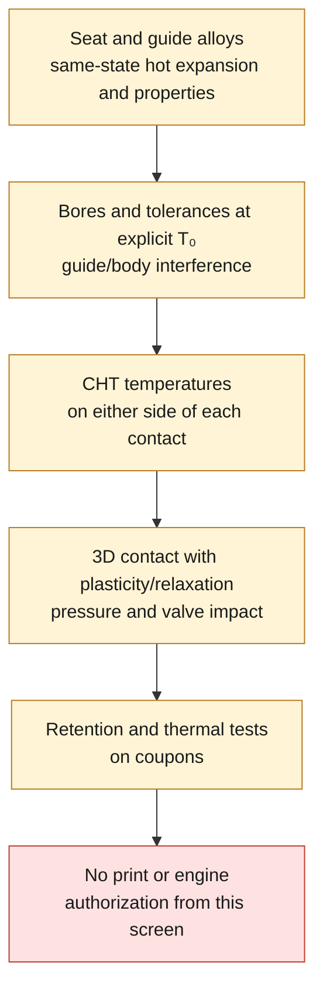

# Seat/body and guide/body interference fits — M64 4V V2 thermal screen

**Result: no manufacturing interference fit can be retained yet.** The
calculations show enough sensitivity to differential expansion to lose the
interference under some assumptions. They demonstrate neither the real loss of
a seat nor its retention in the engine. No material is selected.

The [reproducible report](report.json) contains 48 sensitivity rows at the
documented temperature extremes, three cases of different insert/body
temperatures and 12 normalized ring cases. **No CAD was modified.**


*The V2 module whose seat and guide profiles supply the diameters below (labels
in French). It shows cold CAD geometry only; the receiving body is absent, and
the image proves no fit, retention or thermal behavior.*

## Real data and assumptions

The diameters come from the profiles of the [independent V2 module](../source/build_four_valve_distribution.py)
and are in **design mm**, not in scan units. The closed STEP is bound by SHA-256
`fac380b277add2e3d265d7fa8265baeb0ce460b9f69075730d14ece555e76a76`.

| Part, two per 4V cylinder head | Outer Ø | Cold diametral interference reference |
|---|---:|---:|
| Intake seat | 43 mm | 0.060–0.100 mm, generic MAHLE reference |
| Exhaust seat | 36 mm | 0.050–0.090 mm, generic MAHLE reference |
| Intake / exhaust guide | 11 mm | **Unknown** |

PDF page 30 / printed page 28 of [MAHLE, Valve Train Components](https://www.mahle-aftermarket.com/media/homepage/facelift/media-center/product-catalogs/mahle_valve_train_components_catalog_2025_screen_v002.pdf)
was reread visually: the ranges concern the outer diameter of the seat and its
bore in an aluminum cylinder head. MAHLE warns of the risk of distortion and of
cracking between seats if the interference is excessive. These are not M64 4V
turbo or LPBF specifications. Assembly is described at room temperature, with
no exact temperature value. **The CAD stem/guide diametral clearances of
0.030/0.040 mm are not guide/body interference fits.**

The [already-sourced CP1 coefficients](../cp1-hot-points-supplement-20260907.json)
are only mean coefficients over intervals. The treatment states, orientation and
uncertainties associated with the coefficients are not specified. Two
documentary sets are kept separate:

- Constellium Formnext 2021: 25.19 × 10⁻⁶/K over 20–200 °C.
- EOS: 19, 21 and 22 × 10⁻⁶/K over 25–100, 25–200 and 25–300 °C.

No interpolation, extrapolation or merging is done. Each case assumes that its
cold dimensions are referenced to its own T₀ (20 or 25 °C), without transforming
the same part between these references. Neither CP1 nor its recent record
becomes a qualified material through this screen.

**Sensitivity assumptions, not material properties:** mean insert coefficient
equal to 10, 15 or 20 × 10⁻⁶/K. This grid is not a physical bound on steels or
bronzes. The chosen temperatures come neither from a CHT simulation nor from an
engine measurement.

## Free-diameter calculation

At the same reference T₀, define `I₀ = D_insert,0 − D_logement,0`
(`logement` = bore). A positive value denotes a **diametral** interference. With
the engineering free thermal strains `εi` and `εh`:

```text
I(Ti, Th) = D_insert,0 (1 + εi) − (D_insert,0 − I₀) (1 + εh)
         = I₀ (1 + εh) + D_insert,0 (εi − εh)
I₀,contact_nul = D_insert,0 (εh − εi) / (1 + εh)
```

For a coefficient **averaged over the exact interval**, `ε = α_moyen (T − T₀)`.
This is not the integration of an instantaneous coefficient `α(T)`. `Ti` and
`Th` are independent. `I < 0` means a free clearance in this model; `I = 0` gives
zero contact pressure in the ideal ring, **not an acceptable retention margin**.
Tolerances propagate to the corners of the independent intervals: the function
is multi-affine. This calculation uses floating point, not interval arithmetic
with directed rounding.

Example at **Ti = Th = 200 °C**, hypothetical insert at 15 × 10⁻⁶/K:

| Body reference used separately | Seat Ø43, I₀ = 0.060–0.100 | Seat Ø36, I₀ = 0.050–0.090 |
|---|---:|---:|
| Formnext, T₀ = 20 °C | **−0.01860 to +0.02158 mm** | **−0.01580 to +0.02438 mm** |
| EOS, T₀ = 25 °C | +0.01507 to +0.05522 mm | +0.01238 to +0.05253 mm |

The differences in result do not justify choosing the most favorable
documentary set. They justify obtaining the expansions of the **same
material/process/treatment pair** before sizing the interference.

In the Formnext case with the hypothetical insert above, the zero-contact
threshold is **0.07851 mm** for the intake seat, **0.06573 mm** for the exhaust
seat and **0.02009 mm** for a Ø11 guide. These values are **not recommended
interference fits**. With the body at 200 °C and the insert at 150/200/250 °C,
the intake-seat threshold becomes 0.11062 / 0.07851 / 0.04641 mm respectively:
both contact temperatures are needed, not a single temperature assigned to the
whole cylinder head.

## Lamé: a normalized local test, not a strength calculation of the cylinder head

The calculation uses two concentric isotropic elastic rings, of radii
`a < b < c`, nominal interface `b`, **free** outer edge `c`, frictionless
contact, small displacements and **zero axial stress**. The radial equilibrium
and Hooke relations are checked against the
[MIT notes, sections 2 and 4](https://ocw.mit.edu/courses/22-312-engineering-of-nuclear-reactors-fall-2015/eb49bc4f3e701be60ca651c5a109312f_MIT22_312F15_note_L4.pdf).
The compliance below is derived for `σz = 0`; it does not copy the plane-strain
solution of section 4.

```text
Ki = (b² + a²)/(b² − a²) − νi
Kh = (c² + b²)/(c² − b²) + νh
p  = max(0, I) / [2b (Ki/Ei + Kh/Eh)]
```

The independent test reconstructs `σr = A − B/r²`, `σθ = A + B/r²`, then the
displacements by Hooke, and checks `2(u_corps − u_insert) = I`
(`corps` = body): the radial/diametral factor is thus checked. The report gives
only `p/Eh` and normalized stresses. The real `E(T)`, `ν(T)` and outer bore
radii are missing; **cylinder head pressure and stress in MPa remain null in the
report, in the sense of "not calculated", not zero**.

For a ring based only on the minimum inner Ø of the intake seat,
`a/b = 35.6/43`, and the material-free assumptions `Ei/Eh = 3`, `νi = νh = 0.3`:

| Hypothetical c/b | Gain `(p/Eh)/(I/D)` |
|---|---:|
| 1.1 | 0.07994 |
| 1.5 | 0.21806 |
| 2.0 | 0.27378 |

Conical seats and their short length are not uniform rings. For the guides,
this model does not yet predict the reduction of the inner diameter after
pressing in, nor its effect on the stem/guide clearance.

## Two valves versus four: the essential limit of the 2 mm bridge

V2 comprises four seats and four guides. The minimum gap of **2 mm between
outer envelopes of the seats** is checked on the cold CAD. The receiving body
does not yet exist in this module: this is therefore not proof of a final 2 mm
material ligament. The future bridge between inclined bores undergoes the
interactions of several shrink fits and the thermal gradients.
**It is not axisymmetric; this bridge is not replaced by `c = b + 1 mm`.**

For the 2V reference, the MAHLE valve head diameters provide neither the outer
Ø of the seats nor the bores. No 4V/2V superiority in strength or heat
dissipation is calculated with these data. A coupled 3D contact model of each
architecture, under comparable loads, will be needed.

## Next decision and reproduction

What is needed now: the seat and guide references/alloys, the hot expansions and
mechanical properties of the same manufacturing state, the bores/tolerances at
an explicit T₀, the guide/body interference, then the CHT temperatures on either
side. Only then: 3D contact with plasticity/relaxation, retention under pressure
and valve impact, and retention/thermal tests on coupons. Simply increasing the
interference can worsen cracking of the bridge. **No print or engine
authorization.**



From the repository root, without OCP, GPU, Kali or any paid service:

```sh
python3 twins/m64-cylinder-head/seat-guide-thermal-screen/screen.py
python3 -m unittest discover -s tests -p test_m64_seat_guide_thermal_screen.py -v
```

**11 tests run and passed**: free-diameter definition, separate temperature,
contact threshold, bounds, Hooke/Lamé, analytical limits, unilateral contact,
input rejections and SHA-256 links. These are checks of the analytical
calculation and its sources, not a physical validation of the product.
