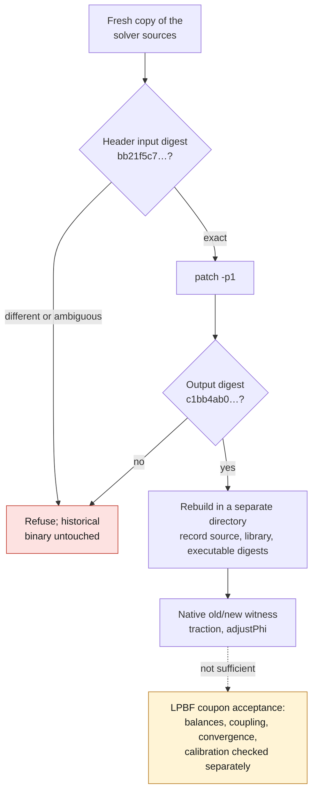

# Marangoni contract fix for OpenFOAM 14

This patch only adds `assignable() const { return false; }` to the ORNL
Marangoni boundary condition. It allows `constrainHbyA` to preserve the normal
condition while the pressure predictor is built. It modifies neither
`evaluate`, nor `snGrad`, nor the pressure equations, nor the material
properties. It is not a cylinder head qualification.

The upstream file, under **GPL-3.0-or-later**, is
[`marangoniFvPatchVectorField.H`](https://github.com/ORNL/AdditiveFOAM/blob/9c05c5eb54db03faa342b14b0806efe740de8c44/applications/solvers/additiveFoam/derivedFvPatchFields/marangoni/marangoniFvPatchVectorField.H).
The patch is distributed under the same license. The tested context is
OpenFOAM 14, commit `7b05503f98a85be88af930df48623b4d152bfc35`.
The diff has no context lines: the exact input digest below is therefore a
precondition, and the output digest must be verified.

SHA-256 digests of the header:

- Required input: `bb21f5c705425c6903945f9ca95055d6ca4083d8b9d58e1b15e2a1c75deb022a`.
- Tested output: `c1bb4ab01a24a907aefda0995d7df650d4dc46c23f61f9d1130bd7d6a601a33c`.

On a **fresh copy of the solver sources**, from the directory that contains
`derivedFvPatchFields/`, verify the input hash before applying the patch with
`patch -p1`. Refuse any digest difference or ambiguous context; do not replace a
historical binary in place. Then rebuild the solver in a separate output
directory and record the digests of the sources, libraries and executable.

The [native old/new witness](../../../../docs/reports/M64_F58_PREDICTOR_CONTRACT_20260908.md)
checks the conservation of the traction and the native `adjustPhi` step.
Success of this witness is not enough to accept an LPBF coupon: its balances,
its coupling, its convergence and its physical calibration remain separate
checks.

*The [corrected F58 coupon](../../../../docs/reports/M64_F58_CORRECTED_COUPON_20260908.md)
run that used this patch (labels in French): 4,382 complete steps, stopped at
the 900 s ceiling, an incomplete trial. It shows that the numerical 3,300 K
ceiling persists; it does not isolate the patch's effect and is not a simulated
or manufacturable cylinder head.*
