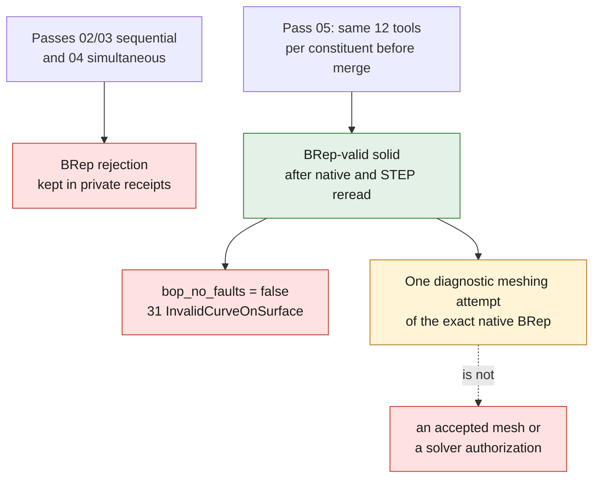

# Gas domain of the 6 mm intake pilot

`build_gas_domain.py` assembles only a **cold flow-bench candidate**: the native
06 intake negative, the already-built two-facet chamber, the real interiors of
the V2 seats, intake valves lifted by 6 mm, exhausts closed, guides, and a
Ø100 × 100 bench receiver. These two dimensions and the equivalence
1 scan unit = 1 mm remain explicit assumptions, not certified M64 dimensions.
The receiver is neither a piston nor a compression measurement.

The intake stem-guide clearances are represented over their real length in the
module, from 20 to 55. Only their two upper annular faces can receive the
`fixture_stem_seals` role: these are idealized bench seals authorized for this
pilot, not designed or qualified mechanical seals. The lower faces of these
annuli are internal connections, never walls or artificial outlets.

## Observed state

The sequential passes 02/03 and the simultaneous subtraction 04 ended with a
BRep rejection, kept in their private receipts. The merged volume before
subtraction is connected and BRep-valid; this **does not authorize meshing it**
as gas, since it still contains the volumes of the moving parts and guides.
The separate diagnostic of 28 constituent/seat intersections, run before any
merge, returns 0 solids and volume 0 for each pair. The very small intersection
solids observed after the merge are therefore not proof of a prior material
penetration. The independent native audit locates a micro-shell sharing three
faces with the main shell, with the single defect
`InvalidImbricationOfShells`. No shell was deleted by hand.

Pass 05 applies the **same 12 tools** to each constituent before the merge,
according to `(union Ai) minus B = union(Ai minus B)`. It actually finished in
45.81 s with a BRep-valid solid, also valid after native and STEP rereading,
with no change of dimension or tolerance. Its volume of 995,964.587 units³
includes the ports and the bench receiver: it is not the volume of the
combustion chamber. The public receipt is
[gas-domain-construction-20260908.json](../../evidence/gas-domain-construction-20260908.json).

The native `BOPAlgo_GeomAbs_C0` warning, also encountered on the local throat of
intake 2, was located independently on B-spline edge 97, between faces 36
(`walls_seat`) and 37 (`walls_port`). Its three internal knots have a zero
numerical position jump, but **real tangent breaks** (about 0.62°, 6.96° and
16.76°). This is neither a gap nor simply an angle between two faces. The
geometry and tolerances are not modified.

The independent review authorizes **one diagnostic meshing attempt** of the
exact native BRep, on condition that these knots are kept and that the boundary
conformity, the topology and the quality of the resulting elements are checked.
`bop_no_faults` remains **false**; this bounded exception is not a
"fault-free BOP", nor an accepted mesh, nor a solver authorization. The STEP
additionally has 31 `InvalidCurveOnSurface` warnings: **STEP not qualified for
meshing**, despite its BRep validity. The digest of the independent report and
the exact conditions of this attempt are bound in the public receipt. The
detailed, sanitized independent evidence is kept in
[native-gas-domain-independent-diagnostics-20260908.json](../../evidence/native-gas-domain-independent-diagnostics-20260908.json).



The v2 classification enrichment keeps the geometry digests and the original
reports. The four planar faces fully covered by a real seat and the chamber
negative tool are assigned to `walls_seat`, with the two pairings and the
ownership rule recorded. The constructor negative does not constitute a second
material. The 88 faces are thus classified, with no unknown or ambiguous face,
with one inlet, one outlet and two annular bench seals. The unsatisfied BOP and
local-throat checks were not changed by this classification operation.

The passage check must be **local to each seat**: a single valid volume, a
positive section on the chamber side and on the throat side, excluding the
common trunk and the other seat. Mere global connectedness is not enough. The
persisted boundaries are then matched to the native faces of their sources, by
type, support and surface overlap; any missing or ambiguous role rejects the
candidate. A BOP check is distinct from a BRep check.

The cylinder head master is not modified by this batch, the ports are not yet
subtracted from the body, and no CFD calculation, flow rate, Cd, thermal test,
engine qualification or manufacturing authorization is established here. The
BReps/STEPs, coordinates and detailed reports remain private; only the code, the
tests and aggregates with digests are publishable.

Tests without a CAD kernel:

```sh
python3 -m unittest discover -s tests -p test_m64_flowbench_gas_domain.py -v
```

The `--diagnose-pieces` option performs only the constituent/seat intersections,
without merging and without producing a gas domain. Success of this command does
not constitute success of the complete builder.
