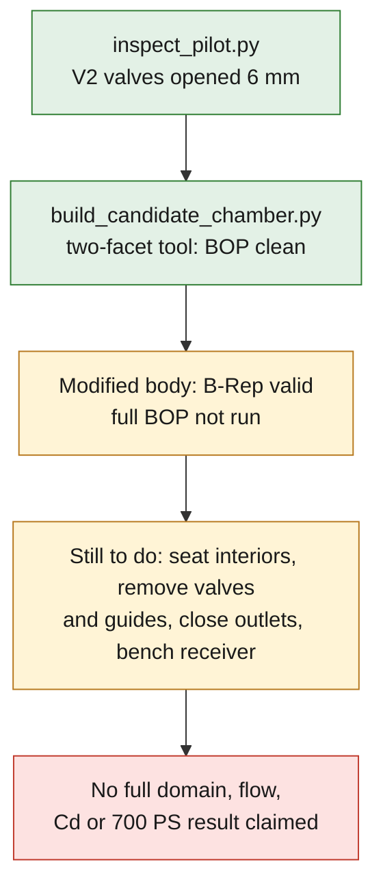

# 6 mm intake and two-facet candidate chamber

This batch delivers a **real private CAD modification**, not yet a flow-bench
domain or a validated cylinder head. The four-bore master `92640fd2…` remains
intact. The scripts and the [aggregate receipt](../../evidence/intake-chamber-candidate-20260908.json) are
publishable; the B-Reps, STEPs, sections and scan coordinates remain private.

## Native result of September 8, 2026

`inspect_pilot.py` reread the exact parts: the valves actually imported from the
V2 module are opened by 6 mm along their inclined axes, then the module
registration is applied once only. The seats and guides stay fixed. The two
throat/port check collars (radius 17.8; length 0.01) are fully covered to the
reported integration precision. This local check does not prove that an
assembly is sealed.

The raw intake negative still includes about 735.415 units³ of each open valve
and 797.705 units³ of each guide: these solids must be subtracted from the
future gas domain. The six checked intake components have zero volumetric
intersection with the four-bore master. The original floor is flat and its
center solid: no M64 chamber was defined there. The share of flat surface
observed under the check disk is **not** a sealing ratio.

`build_candidate_chamber.py` builds a two-facet cutting tool, each facet passing
through the real lower lip of the corresponding seats (local axial position
0.5). Their inclination comes from the existing axes; their intersection sets
the depth, without introducing an arbitrary target volume. The positive part
between this roof and the floor is bounded by the Ø100 working cylinder, a
**non-certified design assumption**. The central spark plug axis is reserved in
the prototype contract, but no pocket, thread or fictitious insulator has been
added. The roof edge is not blended and the spark plug is not chosen.

| Distinct quantity | Result in scan units³ |
|---|---:|
| Volume of the two-facet cutting tool | 27,001.825308 |
| Material actually removed from the master (`common`) | 9,578.631048 |
| Gas volume of the assembled chamber, valves closed | Not calculated |

These volumes give **no compression ratio**: neither piston, deck height nor
TDC clearance is defined. The scale remains an assumption of 1 scan unit per
1 mm, not a certified measurement.

## Checks actually run

- Chamber tool: one connected solid, valid B-Rep, and BOP analysis run with no
  fault, error or warning.
- Modified body: one solid; valid B-Rep before export and after STEP rereading.
  **The full BOP analysis of the body was not run.** B-Rep validity must not be
  relabeled as a passed BOP.
- The eight real inserts (four seats and four guides) each have zero volumetric
  intersection with the tool: no geometric amputation.
- Tool volume outside the Ø100 cylinder: zero. Area of the initial floor lying
  outside that cylinder that is lost: zero. This preserves the tested geometric
  surface, without identifying or qualifying a Porsche gasket seating face.
- Maximum bounding-box deviation: `2.22e-14` unit; volumetric partition defect:
  `−1.60e-6` unit³ for a declared threshold of `1e-3`.

The STEP export of the **removed-material volume alone** shows a volume
difference of `+0.011580338` unit³ on rereading (about `1.209e-6` relative).
This deviation remains to be explained; it is not hidden by a threshold chosen
after the fact. The candidate body STEP shows, for its part, a deviation of
`−1.39e-7` unit³. The validity and solid-count checks of the exports therefore
do not constitute a metrological qualification of their volume.

The large outer diameters of the seats slightly exceed the Ø100 disk in
projection. This is not automatically a collision: part of the insert can be
carried beyond the bore. The support, the cylinder/cylinder head seating and the
corresponding thermal path will nevertheless have to be checked, without
treating the working disk as a free mechanical zone.



## Execution and sections

The existing amd64 CPU image, OCCT/OCP 7.9.3.1, was used without rental,
installation or simulation. Each container is limited to two CPUs, 4 GiB,
128 processes and 300 seconds, with no network. The process outputs were
observed separately from the geometric JSON; the containers were deleted and
their absence verified.

| Step | Program duration | Observed SSH/Docker exit |
|---|---:|---:|
| Source inspection | 11.29 s | 0 |
| Extraction of the original sections | 9.63 s | 0 |
| Two-facet prototype and checks | 14.78 s | 0 |
| Extraction of the prototype sections | 12.30 s | 0 |
| Native tessellation of the 13 solids for the 3D view | 4.04 s | 0 |

`render_sections.py` extracts, through OCCT, the intersections of the **native
solids**, then produces the section images. The dotted blue is explicitly the
raw intake negative overlaid: the ports are not cut into this body prototype.
The central section shows the new recess under the seats. The two images and
their private sources are identified by SHA in the receipt. They contain no
invented CFD or thermal field.

`render_underside.py` adds an underside view and a central section as an inset.
The final private render uses the real VTK/PyVista depth buffer, without
geometry smoothing, with the body's 113,910 triangles and the module's twelve
components. The Matplotlib 3D drafts are superseded: their approximate depth
sorting wrongly hid valves. The final gray is illustrative, not an alloy
selection. No private PNG is added to the repository automatically.

Targeted tests:

```sh
python3 -m unittest discover -s tests -p test_m64_flowbench_intake_inspection.py -v
python3 -m unittest discover -s tests -p test_m64_flowbench_candidate_roof.py -v
```

The six tests pass. The three roof tests check the incidence of the planes on
the lips, the continuity of their edge and the rejection of a zero inclination;
they are not engine tests.

The next stage must still assemble the seat interiors, remove the valves and
guides from the gas, explicitly close the parasitic outlets and the exhausts,
then build the bench receiver and the boundary groups. The BOP-rejected
`ported-candidate06` was not used as the body for this step. No complete domain,
flow rate, discharge coefficient or 700 PS result is claimed.
