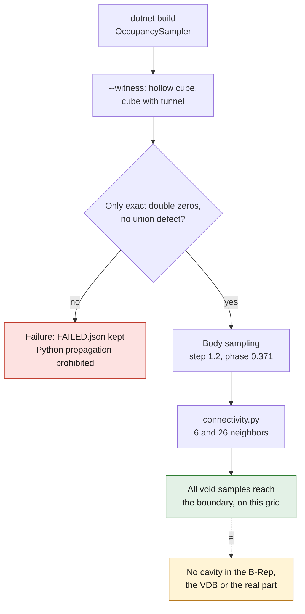

# Sampled connectivity of PicoGK voids

This module **reads** the existing VDB, without modifying the body, creating a
port, smoothing or reprocessing its surfaces. It distinguishes the connectivity
of a void volume from the connectedness of the STL surfaces that bound it. An
outer envelope and an inner wall can bound a single connected fluid volume.

## Two separate checks

1. The C# `OccupancySampler` rereads `head_body` and
   `unclassified_void_complement` by name. It verifies the VDB hash of the
   source report, the four fields and their resolution, then uses the isolated
   one-byte ABI adapter already documented in `picogk-cooling`. The native
   inside/material/outside witness precedes any reading of the part.
2. `connectivity.py` propagates from **all void samples on the six boundary
   faces**. It computes 6-neighbor (faces) and 26-neighbor (faces, edges,
   vertices) connectivities separately. No periodic wrap-around is allowed.

The grid positions are `enclosure_min + (index + phase) × step`, with dimensions
`floor(box_size/step)`. The starting frame is thus explicitly inside the working
box. Any material present on its boundary invalidates the check. The "mm" scale
remains that of the VDB's non-certified assumption, without any new
registration. The connectivity grid can be coarser than the native voxels: both
steps are recorded.

Cells not connected to the boundary are **potential cavities of this grid**, not
proof of physical sealing. An under-resolved opening can disappear; a mere
diagonal contact accepted at 26 neighbors does not necessarily offer a physical
flow section. No result automatically classifies intake, exhaust, lubrication or
cooling.

## Witnesses and conservative stop

The Python tests run the real algorithm on a hollow cube, a tunnel, a plugged
tunnel, a diagonal contact, the six starting faces, the all-void/all-solid cases
and invalid data. They also check that the input is preserved and that no
CFD/manufacturing authorization is given.

The native `--witness` mode generates only two small synthetic geometries
(a hollow cube, then a cube with a tunnel) to test occupancy before the body.
Any overlap other than an exactly demonstrated double zero, or a union defect,
remains a **failure**, keeps `sampling-report.json` and `FAILED.json`, and
prohibits the Python propagation.



Beware of zero: the pinned kernel defines `bIsInside` by reading the voxel at the
rounded index, **SDF ≤ 0**, not by continuous interpolation. An interface exactly
at level zero can therefore belong to both fields. The sampler diagnoses each
overlap (maximum 4,096) by reading a native SDF slice, with X increasing /
Y decreasing and the same native rounding. The first tunnel witness was rejected
for 48 overlaps; the signed rereading demonstrated 48 `(-0,+0)` pairs and no
double negative value. This initial receipt is kept. Two explicit conventions
are now run on the same grid: double zero assigned to material (main) or to void
(sensitivity), each with 6 and 26 neighbors. No epsilon, deleted point or
displacement is applied. The masks must differ only by the exact number of
double zeros. Any other contradiction remains blocking. These values are in
native SDF units, not a distance measurement in mm.

## Bounded execution

```sh
python3 -B -m unittest discover -s tests -p test_picogk_connectivity.py -v
dotnet build OccupancySampler.csproj -c Release -o NEW_BIN \
  -p:UpstreamRoot=/upstream -p:GeneratePackageOnBuild=false
timeout --signal=TERM --kill-after=10 300 \
  dotnet NEW_BIN/OccupancySampler.dll --witness NEW_WITNESS_DIR
python3 -B connectivity.py NEW_WITNESS_DIR/hollow-cube NEW_WITNESS_DIR/hollow-connectivity.json
python3 -B connectivity.py NEW_WITNESS_DIR/cube-with-tunnel NEW_WITNESS_DIR/tunnel-connectivity.json
python3 -B check-native-witness.py NEW_WITNESS_DIR
```

Only after the witnesses succeed, the body-reading mode is:

```sh
timeout --signal=TERM --kill-after=10 300 \
  dotnet NEW_BIN/OccupancySampler.dll INPUT.vdb SOURCE_REPORT.json \
  NEW_PRIVATE_SAMPLES 1.2 0.371
timeout --signal=TERM --kill-after=10 300 \
  python3 -B connectivity.py NEW_PRIVATE_SAMPLES NEW_PRIVATE_CONNECTIVITY.json
```

Use the existing resources, at most 2 CPUs and 4 GiB. No third-party Python
package is required. The program refuses more than four million samples; the
queue uses four-byte integers and the labels one byte per sample. Each
propagation is bounded at 240 seconds and 100,000 components. The outputs must
be new. The VDBs, occupancy masks, positions and private component boxes do not
go into the repository.

A volume computed as `cell_count × step³` is a grid estimate. Agreement between
6 and 26 neighbors proves neither convergence in step and phase, nor geometric
continuity, nor a usable CFD mesh. The numerical bounds above are not physical
criteria.

## First private result, September 7, 2026

The [aggregate public receipt](../../evidence/picogk-connectivity-20260907.json)
traces the reading of the native 0.3 field on the grid of step 1.2, phase 0.371.
Of 2,719,728 samples, 1,898,164 are void and **all are connected to the
boundary** at both 6 and 26 neighbors. No isolated component is detected **on
this grid only**. It contains no double zero: the two masks are identical, and
the sensitivity results were therefore reused, not artificially recomputed to
announce four distinct runs.

The independent triangle audit of the finer resolutions flagged tiny
negatively oriented shells. A step of 1.2 may not encounter them. The present
check does not delete them and settles neither their nesting nor their physical
nature: **absence detected on the grid ≠ absence of a cavity in the B-Rep, the
VDB or the real part**. The comparison in resolution and phase, and the targeted
geometric localization, remain to be done.
