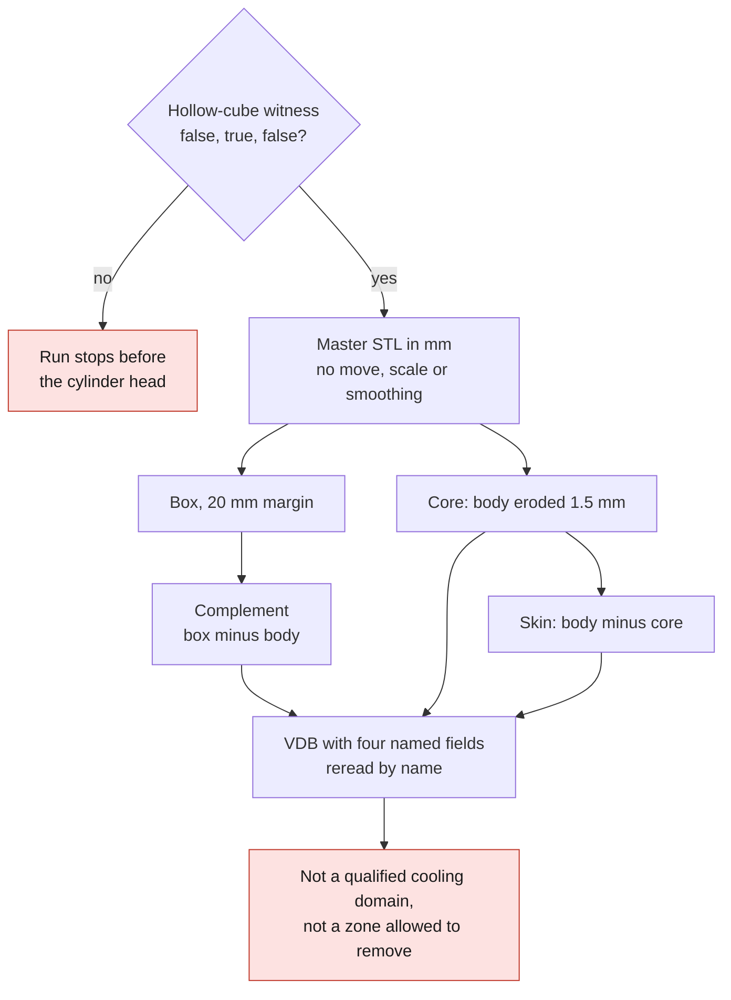

# PicoGK geometric domains from the cylinder head

This module uses the existing PicoGK runtime to prepare **working volumetric
fields**, without modifying the master or its outer shape. It is neither a
thermal solver nor a new printable part.

## Operations actually run

1. Reading of the STL in explicit millimeters, without displacement, scaling or
   smoothing. The assumption `1 scan unit = 1 mm` remains non-certified.
2. Construction of an analytical signed-distance box enclosing the mesh, with an
   exploratory margin of **20 mm on each side**.
3. Boolean difference box minus body:
   `unclassified-void-complement.stl`.
4. Signed erosion of the body by **1.5 mm**, intersected with the original body:
   `geometric-clearance-core-1p5mm.stl`.
5. Difference body minus eroded core:
   `geometric-protected-skin-1p5mm.stl`.
6. Storage in `head-and-cooling-geometry-fields.vdb` of four named OpenVDB
   fields: body, complement, core and skin. Rereading **by name**, verification
   of the resolution and of the four volumes (maximum relative deviation of
   `1e-6`). The order of the OpenVDB fields is not presumed stable.



A synthetic hollow-cube witness (20 mm outside, 12 mm inside, analytical volume
of 6,272 mm³) checks the oriented integration of the triangles.
`CalculateProperties` remeshes and then re-voxelizes: on the tested domains with
nested cavities, its volume strongly overestimates the void or the skin. The
report **keeps this value and flags the deviation**. The partition checks use an
independent oriented integration of the triangles by the divergence theorem,
with compensated summation. Their interpretation as closed volumes remains
conditional on the topological audit. The independent audit of the raw STLs at
0.6 mm found four triangles of exactly zero area in the complement and in the
skin. The core was closed and oriented without this defect. A `GEOMETRY_PASS`
code therefore does not mean that all exports are manifold: the raw files remain
kept, and any strictly limited cleanup must produce a distinct derivative with
hashes and checks.

A second check samples the native occupancy on a grid spaced 6 mm apart:
body/void and core/skin must be disjoint and re-form the box and the body
respectively. Points close to an interface under small perturbations are
excluded and counted. This test is not exhaustive and proves neither fluid
connectivity nor the equality of each voxel.

### Isolated ABI adapter and regression witness

The pinned Linux runtime returns a C++ `bool` on **one byte** for
`Voxels_bIsInside`. The upstream C# declaration uses the implicit four-byte
`BOOL` marshalling. In the real Linux amd64 test, this upstream call returned
true at all 22,140 points, for the body **and** its complement. This run was
kept with failure code `3`, without turning the faulty check into a success.

`NativeOccupancy` in `Program.cs` declares only this call with a `byte` return,
limited to 0 or 1, and accesses the two exact handles through the typed .NET 9
accessors. This modifies **neither** the published image, **nor** the native
kernel, **nor** the upstream PicoGK assembly. This adapter depends explicitly on
the pinned sources: it must be re-audited before any version change.

Each run starts with an independent witness in the hollow cube: `(0,0,0)` is in
the cavity, `(8,0,0)` in the material and `(20,0,0)` outside. The required
classifications are therefore `false, true, false`. The upstream results and
those of the one-byte return appear in the report. A failure stops the run
before the cylinder head is processed.

The file `patches/picogk-0e6cf6b-bIsInside-I1.patch` documents the equivalent
upstream fix (`[return: MarshalAs(UnmanagedType.I1)]`). It is **not** applied
automatically. Do not stack untracked upstream modifications with this module,
and do not announce that the published image contains this fix.

On September 7, 2026, processing of the real part at 0.6 mm passed this witness
and the 22,140 partition points without overlap or union defect. The oriented
volume deviations were about `1.01e-7` (body + complement) and `2.30e-7`
(core + skin). This remains a numerical geometry check, not a thermal,
mechanical or printing validation.

These two domain runs (0.6 and 0.3 mm) used the pre-qualified local image
`3dprinting993-picogk-m64:preflight`, ID
`sha256:a570938d6111a8a5595f0404c18d63bacfe617e91850772b14bbc010bea55f4a`.
This is not the published GHCR digest: the upstream sources are pinned, and the
hashes of this image, of the kernel and of the module are traced in
`provenance.json` and the execution receipt. Do not confuse these runs with the
`HeadVoxels` round trips run separately on the public image.

An additional repetition at 0.6 mm on Vast then used the qualified GHCR digest.
The three STLs are identical to those from Kali; the VDB is not byte-for-byte
identical. The module build, the checks and the instance shutdown are in the
[Vast receipt](../../evidence/picogk-vast-execution-20260907.json).

Synthetic native regression, independent of any private cylinder head:

```sh
sh /workspace/picogk-cooling/test-native.sh /workspace
```

This script builds the module, produces a witness sphere, then tests all the
operations and the two hollow-cube witnesses (oriented volume and occupancy).
It keeps its private temporary directory and its report. The four Python tests
`tests/test_picogk_cooling.py` are light checks of the source contracts: they do
not replace this run of the native runtime.

The report provides the hashes of the master, the outputs, the compiled program
and the native library, the volumes, the envelopes, the duration and the peak
memory. A partition check compares body + complement to the box, then core +
skin to the body. The exploratory 2% threshold is only a coarse numerical
filter: it does not replace a convergence study.

## Limits not to be confused

- The complement contains the outside air **and** all passages, pockets and
  cavities, whether accessible or closed. It is not yet a qualified cooling
  domain. A separation by occupancy/propagation from seed points, the interfaces
  and the boundary conditions remain to be defined. Two STL surface components
  do not mean two fluid volumes: an outer envelope and an inner wall can bound a
  single connected fluid volume.
- The eroded core is **not a zone allowed to be removed** nor a validated mask
  for channels. The 1.5 mm follows from no strength, heat-transfer, material-map
  or qualified printing-process calculation.
- The "protected skin" describes only a geometric operation. It does not
  establish a safe minimum thickness and is not a wall measurement.
- The fields are narrow-band OpenVDB `GRID_LEVEL_SET`s; they are not an exact
  distance at every point of the domain and do not constitute a machinable
  B-Rep.
- No channel, fillet, new outer shape or oval is added.

## Execution in the already-built image

Copy these two source files into a private working directory of the PicoGK
container, then use its existing SDK, without a new image:

```sh
dotnet build /workspace/picogk-cooling/CoolingDomains.csproj \
  -c Release -o /workspace/picogk-cooling-bin \
  -p:UpstreamRoot=/upstream -p:GeneratePackageOnBuild=false
timeout --signal=TERM --kill-after=15 1200 \
  dotnet /workspace/picogk-cooling-bin/CoolingDomains.dll \
  /workspace/private/master-body.stl /workspace/private/cooling-0p6 0.6
```

The output directory must be new. The input STL can be mounted read-only. The
exit codes are: `0` for geometry generated and volumetric checks passed, `3` for
a volumetric partition warning, `1` for an error and `2` for refused arguments.
A sampled occupancy anomaly also produces code `3`. None of these states means
a physical validation or a manufacturing authorization.

Sources: [pinned PicoGK](https://github.com/leap71/PicoGK/tree/0e6cf6b6f4993ec16dbcd72d8f27f26b999980f3),
[pinned PicoGKRuntime](https://github.com/leap71/PicoGKRuntime/tree/0f26321c18ed878a7820ef769c38fd5d49d39242).
