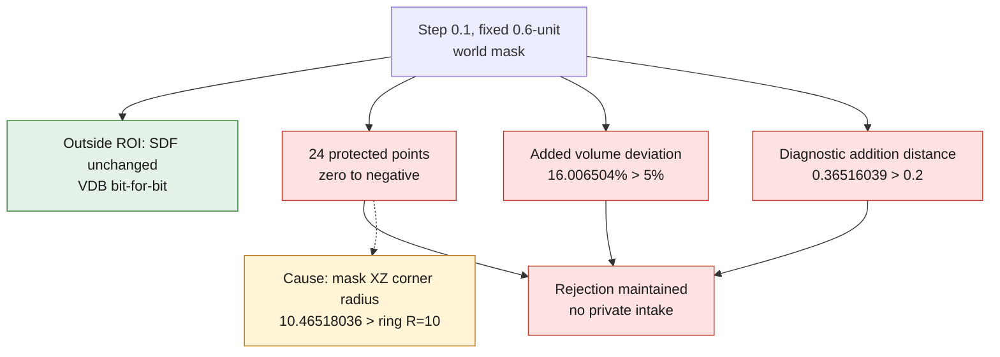

# Fine witness with a fixed world mask — comparison rejected

This separate version keeps the program, criteria and receipts of the previous
0.2 witness. The 0.1 witness uses the same cylinders, the same closing radius 1
and the same world regions: allowed region `[-8,-3,-8] → [8,3,8]`, mask
`[-7.4,-2.4,-7.4] → [7.4,2.4,7.4]`. The setback is fixed at **0.6 unit**, i.e.
3h at step 0.2 and 6h at step 0.1. The alternative of 3h at step 0.1 would have
changed the mask to 0.3 unit; it was not run. The comparison therefore targets
the same world geometry, but does not demonstrate asymptotic convergence from
two extractions.

The separate policy `criteria-0p1-fixed-margin.json` was recorded before
execution. It fixes the criteria of 5% on the volume actually added
`Vaprès−Vavant` (after − before; denominator: volume added at the fine step) and
0.2 unit on the sampled bidirectional distances. The diagnostic Boolean addition
is not confused with this difference of global volumes.

## Strengthened guard, without overwriting the previous receipt

`audit_buffered_surface.py` v2 explicitly requires zero SDF counters and deltas
outside the ROI and at the protections, **zero unavailable pairs**, the exact six
VDB field names with successful and non-empty bit-for-bit comparisons, the
occupancy guards of both zero conventions, the normalized topology and the
support of all modified triangles within the ROI. The v1 audit displayed the SDF
differences but did not include them in its decision.

The exact 0.2 receipt was reread with this v2 decision in a **new** report,
without native recalculation or modification of the old receipts: it passes.
The numerical tests cover each SDF/VDB/occupancy failure, empty surface sets,
the volume threshold and a triangle-plane distance witness. They complement the
policy contracts and the independent code review.

## Results of September 8, 2026

At step **0.1**, 8,615,125 nodes were compared. The values of the six reread VDB
fields are bit-for-bit identical within their native boxes; the outside of these
boxes is not included in this proof. No SDF sign or value changed outside the
allowed ROI. On the other hand, **24 protected points** went from zero to
strictly negative: a change for `<0`, not for `<=0`. The maximum protected SDF
difference is **0.0017724712379276752 world unit**. This difference is not a
bound on the displacement of the isosurface.

| Check | Step 0.2 | Step 0.1 |
|---|---:|---:|
| Volume actually added, unit³ | 9.4851540221 | 8.1763984723 |
| Volume of the diagnostic addition, unit³ | 5.8665534947 | 7.0556823288 |
| Residual between the two, unit³ | 3.6186005274 | 1.1207161435 |
| Protected points modified, `<0` convention | 0 | 24 |
| Exactly zero raw triangles, candidate | 16 | 0 |
| Exactly zero raw triangles, diagnostic addition | 8 | 40 |

At the fine step, the before and after surfaces pass the raw combinatorial
screen. The raw diagnostic addition stays rejected because of its 40 zero
triangles. After only the exact deletion of these triangles in an in-memory copy,
each of the three surfaces forms one combinatorially closed oriented component.
This checks neither geometric self-intersections nor the physics.

The 19,846 faces removed and 20,678 added at the fine step are all contained in
the allowed region. **This does not protect an interface located inside that
region**: the guard on the 24 points stays failing.

The relative deviation of the volumes actually added is **16.006504% > 5%**.
The maxima of the sampled bidirectional distances are:

- Before: **0.09240311** unit.
- After: **0.10105891** unit.
- Diagnostic addition: **0.36516039** unit, beyond **0.2**.

The distances are computed to all faces of the target surface, from at most
20,000 deterministic vertices/centroids per direction. They are not continuous
Hausdorff bounds. The volume residual remains unexplained and is not removed
from the report.

## Geometric cause of the guard: mask and protection overlap

`diagnose_protected_points.py` uses only the existing receipt, without any field
recalculation. The 24 points all lie in the inner mask and in the protected band
around the ring `R=10, Y=0`. The radius of the mask's XZ corner is
**10.46518036**, greater than 10: an axially set-back box is not enough to
exclude a radial crown.

The synthetic coordinates are the X/Z symmetries and permutations of the pairs
`(6.7000003; 7.3)`, `(6.8; 7.2000003)` and `(6.9; 7.1)`, at Y=0. Their distance
to the ring lies between **0.09141766 and 0.09949496 unit**. The diagnostic keeps
the exact 24 coordinates and values of the receipt. The overlap is demonstrated;
the exact algorithmic origin of the SDF variations is not identified by this
check alone.

The justifiable future correction is a mask explicitly disjoint from the radial
protections, to be tested separately. No new mask, no additional pass and no
tolerance epsilon were applied in this batch.

## Resources and stop

Everything used Kali, network disabled, 2 CPUs / 4 GiB, maximum 300 s per step.
For the 363,228 triangles of the fine candidate, the audit received a
**resources-only** opt-in of 500,000 faces / 1,500,000 vertices. The historical
helpers remain unchanged on disk, with their limits of 150,000 faces. The exact
predicates and geometric thresholds did not change.

- Native: 31.27 s; process peak 283,234,304 bytes.
- Audit: 60.52 s; GNU time maximum RSS 705,204 KiB.
- Comparison: 7.53 s; GNU time maximum RSS 296,092 KiB.

**Rejection maintained, no application to the private intake.** No Vast
purchase, no modification of the master, no CFD or printing qualification.

Digests of the private receipts:

- Fine native: `7a088f495b8b4b5007e78f2c2d181fdf4e0eeb5fdc66003fab9c917570617ac3`.
- Fine audit v2: `164093fc8077cd6cf61c977e7ec99bd273970d3e1cf995baf8af64b5862ed344`.
- Comparison: `5b2db9a7db2234832c4a0c9c58f3248148c15938453bea6ab7fbc6aa179106dc`.
- Protection diagnostic: `eaa8254fa1624e8fe0d807196671c2a8fb9df00611192c2037c0e45ac630d7e8`.
