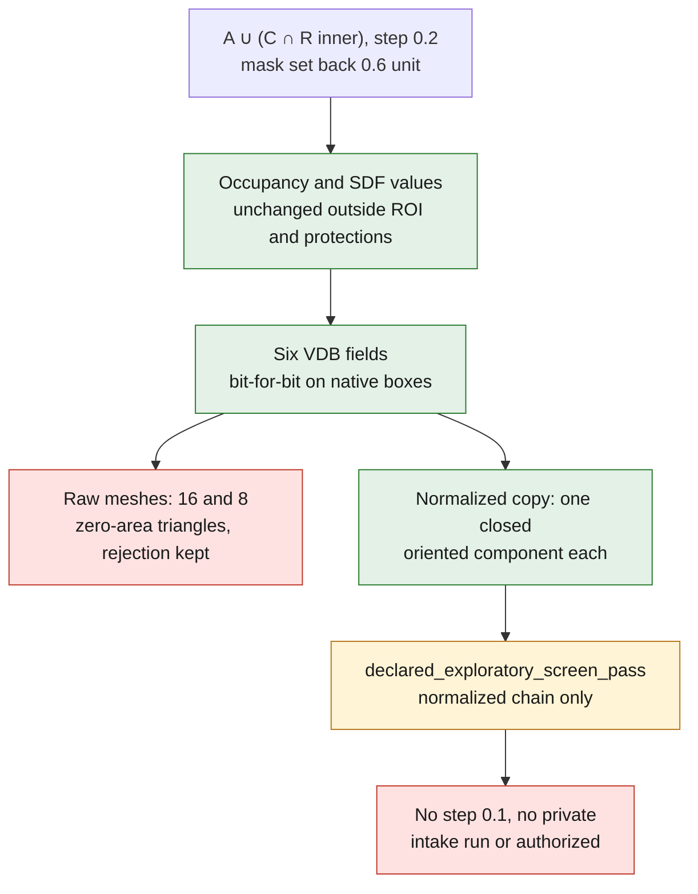

# Local junction — witness with an inner mask

The witness is still made of the same two stepped cylinders, with no private
cylinder head. Closing radius: 1 unit. Step: 0.2. The allowed region remains
`[-8,-3,-8] → [8,3,8]`. The construction mask is set back by `3h`, i.e.
0.6 unit, on its six sides. This setback is an assumption preregistered in
`criteria.json`, not a mathematical guarantee of the extraction.

The construction is `A ∪ (C ∩ Rintérieur)` (`Rintérieur` = inner region), with
`C = closing(A)`. The addition `(C \ A) ∩ Rintérieur` stays diagnostic, without
taking part in this construction. The checks always use the outer allowed
region. The pinned runtime calls `RebuildGrid`, but this method is a no-op: no
effective reconstruction is attributed to it.

## Result of September 8, 2026

The native run finished in **5.278 s**, process peak **185,507,840 bytes**, on
Kali with 2 CPUs / 4 GiB, network disabled, 300 s limit. The build succeeded with
NU1900: NuGet vulnerability lookup unavailable offline, required packages
already present.

Of **1,157,625** comparable nodes, both zero conventions (`<0`, `<=0`) give zero
change outside the ROI or at the protected interfaces, zero gas loss and zero
contact of the addition with the allowed boundary. Respectively 1,944 and 828
nodes change inside. The compared **SDF values** are also unchanged outside the
ROI and at the protections: maximum of the differences is zero. The lengths are
already world units, named MM by PicoGK for this synthetic witness; no
additional multiplication by the step is applied.

The six fields saved to VDB were reread and their float values compared
**bit for bit on each of their enclosing native boxes**: no difference. Values
beyond these boxes were not compared. This serialization proof is neither a
proof of the quality of the signed distance nor a physical validation.

| Surface | Raw faces | Exactly zero faces removed in the copy | Normalized result |
|---|---:|---:|---|
| Before | 89,708 | 0 | One combinatorially closed oriented component |
| After | 90,028 | 16 | One combinatorially closed oriented component |
| Diagnostic addition | 4,464 | 8 | One combinatorially closed oriented component |

**The raw rejection stays kept.** Normalization is a distinct step: in-memory
deletion of only the triangles of exactly zero area according to a dyadic
integer predicate, without displacement, deletion of a non-zero triangle,
filling, retriangulation, normal repair or discarded component. The
combinatorial audit includes the vertex links, the edge incidences, duplicate
faces and orientations.

The multiset of normalized oriented triangles finds 5,804 faces removed and
6,108 added: **none has its support outside the allowed ROI**. Since the ROI is
convex, checking its three vertices contains the whole triangle. This is a proof
on the two given triangulated surfaces, not on an underlying B-Rep or continuous
field. Geometric self-intersection and shell nesting are not qualified by this
combinatorial audit.

The residual `Vaprès − Vavant − Vajout` (after − before − addition) equals
**3.6186005274230206 unit³**. It remains unexplained and is not hidden by the
success of the declared guards. The three isosurfaces are extracted separately;
this residual is not a preregistered zero criterion of this experiment.

## Test strategy and scope

- Fast contracts: constant allowed region, 3h margin, fixed radius/step,
  mask/check distinction and stop before any private geometry.
- Native integration: double occupancy convention, comparison of the field
  values and bit-for-bit VDB round trip on the native boxes.
- Counter-calculation: reuse of `audit_surface_topology.py` and
  `audit_direct_union_surface.py`, with the helpers' digests in the receipt.
- Decision regressions: each occupancy, VDB-reread, normalized-topology or
  outside-ROI-support guard must prevent success.

The status obtained is **`declared_exploratory_screen_pass` for the normalized
chain only**. No comparison at step 0.1 and no application to the private intake
was run or automatically authorized. The witness proves no G1 junction, no CFD
benefit, no mechanical/thermal strength and no printability.

Digests of the kept private receipts:

- Native `run-report.json`: `d883eb4796a733d1e05235608f898adb3d67c488e46d38bc00a7979df4de7504`.
- Audit `buffered-surface-audit.json`: `24efb04cfc3049300f97a95bf52f99993a61211fcd397812cd9756e032cb74f1`.
- VDB: `d724db69d3f92f511f06f8842f4597559448ac6c4128c7a0e028247f04ec9c61`.

The originals and previous outputs remain intact. No Vast funding was used for
this witness.
